GLMM **Cx. pipiens** and **Cx. tarsalis** abundance: SLC 2025 field
season
================
Norah Saarman
2026-03-19

- [Salamander example](#salamander-example)
- [Culex tarsalis](#culex-tarsalis)
- [GLMM by season and urbanization, each mosquito species
  separately](#glmm-by-season-and-urbanization-each-mosquito-species-separately)
  - [Random effects (1 \|
    site_name/disease_week)](#random-effects-1--site_namedisease_week)
  - [Random effects (1 \|
    site_name/collection_date)](#random-effects-1--site_namecollection_date)
  - [Marginal effects across seasons](#marginal-effects-across-seasons)
  - [Marginal effects across
    urbanization](#marginal-effects-across-urbanization)
- [GLMM by season and urbanization, each mosquito species
  separately](#glmm-by-season-and-urbanization-each-mosquito-species-separately-1)
  - [Random effects (1 \|
    site_name/disease_week)](#random-effects-1--site_namedisease_week-1)
  - [Random effects (1 \|
    site_name/collection_date)](#random-effects-1--site_namecollection_date-1)
  - [Marginal effects](#marginal-effects)
  - [Marginal effects across
    urbanization](#marginal-effects-across-urbanization-1)

**Research Topic:** testing whether habitat and seasonal partitioning
between Culex pipiens s.l. and Culex tarsalis shapes West Nile Virus
(WNV) dynamics across urban–rural gradients.

**Core hypothesis:** early/mid-season amplification dominated by pipiens
in urban areas, later spillover involving tarsalis moving into
urban/peri-urban areas.

**Approach:** Preliminary results visualized via mapping, with species
identity and abundance as primary response variables. Model mosquito
abundance and proportions using GLMMs count ~ season*urbanization +
trap_type + (1\|site/date), family = poisson(link = “log”):  
- Response variable = mosquito abundance  
- Predictors = season*urbanization  
- The trap type could be important, so we will add that as a fixed
effect (covariate)… is this correct? We do think that the response
variable of count of mosquitoes depends on trap type, since tarsalis
seems to be more attracted to CO2 than pipiens, and we want to quantify
that effect. Note that poisson model does not give a fixed offset (due
to the log link)… The structure of this model means that it will
estimate an effect that scales with the total number of mosquitos
caught, which is exactly what we want.  
- The data are grouped into sites and are also linked through time, so
we’ll add those as random effects. I think the sites should be coded as
factors, **but I’m not sure what format to use for the date. I think it
should be disease week so that week 18 is treated closer to 19 than 20,
etc., but I’m not totally confident in this.**  
- The family = poisson (link = “log”)… why again?

Load libraries

``` r
library(tidyverse) # for data wrangling
```

    ## ── Attaching core tidyverse packages ──────────────────────── tidyverse 2.0.0 ──
    ## ✔ dplyr     1.1.4     ✔ readr     2.1.5
    ## ✔ forcats   1.0.0     ✔ stringr   1.5.1
    ## ✔ ggplot2   3.5.2     ✔ tibble    3.2.1
    ## ✔ lubridate 1.9.3     ✔ tidyr     1.3.1
    ## ✔ purrr     1.0.2     
    ## ── Conflicts ────────────────────────────────────────── tidyverse_conflicts() ──
    ## ✖ dplyr::filter() masks stats::filter()
    ## ✖ dplyr::lag()    masks stats::lag()
    ## ℹ Use the conflicted package (<http://conflicted.r-lib.org/>) to force all conflicts to become errors

``` r
library(glmmTMB)   # for model fitting
library(DHARMa)    # for residual plots
```

    ## This is DHARMa 0.4.7. For overview type '?DHARMa'. For recent changes, type news(package = 'DHARMa')

``` r
library(emmeans)   # for estimating marginal effects
```

    ## Welcome to emmeans.
    ## Caution: You lose important information if you filter this package's results.
    ## See '? untidy'

``` r
library(multcomp)  # for statistical comparisons on fitted models
```

    ## Loading required package: mvtnorm
    ## Loading required package: survival
    ## Loading required package: TH.data
    ## Loading required package: MASS
    ## 
    ## Attaching package: 'MASS'
    ## 
    ## The following object is masked from 'package:dplyr':
    ## 
    ##     select
    ## 
    ## 
    ## Attaching package: 'TH.data'
    ## 
    ## The following object is masked from 'package:MASS':
    ## 
    ##     geyser

``` r
library(dplyr)     # for mutating dataframe to change labels in dataset
```

# Salamander example

Just to understand a bit better what it looks like when residuals don’t
“look good”:

``` r
# use the salamanders dataset from glmmTMB:
data("Salamanders")
head(Salamanders)
```

    ##   site mined      cover sample        DOP       Wtemp       DOY spp count
    ## 1 VF-1   yes -1.4423172      1 -0.5956834 -1.22937861 -1.497003  GP     0
    ## 2 VF-2   yes  0.2984104      1 -0.5956834  0.08476529 -1.497003  GP     0
    ## 3 VF-3   yes  0.3978806      1 -1.1913668  1.01417627 -1.294467  GP     0
    ## 4  R-1    no -0.4476157      1  0.0000000 -3.02335795 -2.712216  GP     2
    ## 5  R-2    no  0.5968209      1  0.5956834 -0.14434533 -0.686860  GP     2
    ## 6  R-3    no  1.3428470      1  0.5956834 -0.01466007 -0.686860  GP     1

``` r
# we'll model salamander count as a function of species (spp) and mining presence (mined).
# Because the data are grouped into sites, we'll add that as a random effect.
# first, look at the response distribution

hist(Salamanders$count)
```

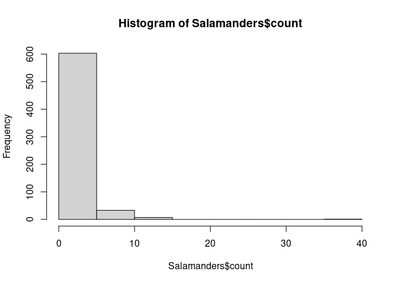<!-- -->

``` r
hist(log(Salamanders$count))
```

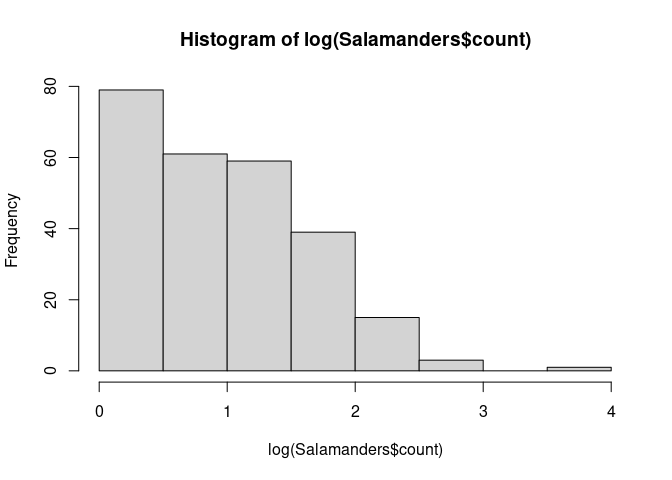<!-- -->

``` r
# count data, so start with poisson model:
fit_pois <- glmmTMB(count ~ spp*mined + (1 | site),
                    family = poisson(link = "log"),
                    data = Salamanders)

summary(fit_pois)
```

    ##  Family: poisson  ( log )
    ## Formula:          count ~ spp * mined + (1 | site)
    ## Data: Salamanders
    ## 
    ##       AIC       BIC    logLik -2*log(L)  df.resid 
    ##    1940.2    2007.3    -955.1    1910.2       629 
    ## 
    ## Random effects:
    ## 
    ## Conditional model:
    ##  Groups Name        Variance Std.Dev.
    ##  site   (Intercept) 0.3316   0.5759  
    ## Number of obs: 644, groups:  site, 23
    ## 
    ## Conditional model:
    ##                  Estimate Std. Error z value Pr(>|z|)    
    ## (Intercept)       -3.3771     0.7340  -4.601 4.20e-06 ***
    ## sppPR              0.9163     0.8367   1.095 0.273435    
    ## sppDM              2.2513     0.7434   3.028 0.002458 ** 
    ## sppEC-A            0.6931     0.8660   0.800 0.423494    
    ## sppEC-L            1.7047     0.7687   2.218 0.026576 *  
    ## sppDES-L           2.5257     0.7348   3.437 0.000588 ***
    ## sppDF              2.5257     0.7348   3.437 0.000588 ***
    ## minedno            4.1109     0.7587   5.418 6.02e-08 ***
    ## sppPR:minedno     -2.4887     0.8688  -2.864 0.004178 ** 
    ## sppDM:minedno     -2.1526     0.7554  -2.850 0.004377 ** 
    ## sppEC-A:minedno   -1.5279     0.8838  -1.729 0.083853 .  
    ## sppEC-L:minedno   -1.1212     0.7782  -1.441 0.149670    
    ## sppDES-L:minedno  -1.9527     0.7448  -2.622 0.008748 ** 
    ## sppDF:minedno     -2.6674     0.7485  -3.563 0.000366 ***
    ## ---
    ## Signif. codes:  0 '***' 0.001 '**' 0.01 '*' 0.05 '.' 0.1 ' ' 1

``` r
# look at the residuals:
simulateResiduals(fit_pois, plot = T)
```

    ## DHARMa:testOutliers with type = binomial may have inflated Type I error rates for integer-valued distributions. To get a more exact result, it is recommended to re-run testOutliers with type = 'bootstrap'. See ?testOutliers for details

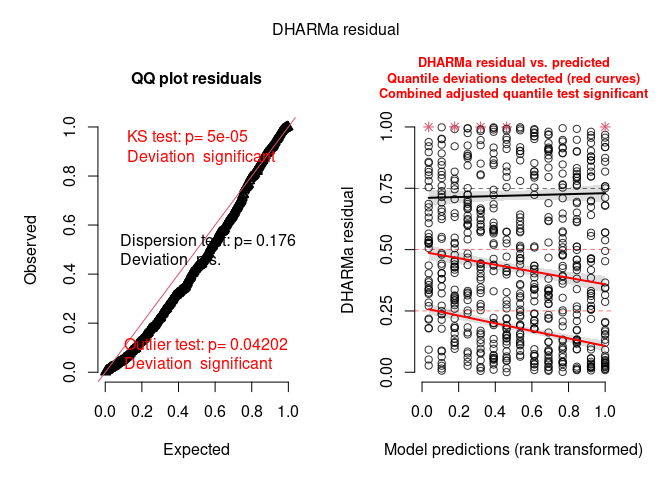<!-- -->

    ## Object of Class DHARMa with simulated residuals based on 250 simulations with refit = FALSE . See ?DHARMa::simulateResiduals for help. 
    ##  
    ## Scaled residual values: 0.8971645 0.5376291 0.6865468 0.4771795 0.5695308 0.3930258 0.3732537 0.5270645 0.7092329 0.3035174 0.938414 0.03329872 0.3608276 0.02056911 0.06117746 0.8165105 0.3426504 0.1332761 0.2699177 0.8026385 ...

``` r
# this doesn't look great. It seems like there is a trend in the residuals with
# greater error at higher values. Maybe the negative binomial distribution can help with this

#continue salamander dataset example
# this doesn't look great. It seems like there is a trend in the residuals with
# greater error at higher values. Maybe the negative binomial distribution can help with this

fit_nbinom <- glmmTMB(count ~ spp*mined + (1 | site),
                      family = nbinom1(link = "log"),
                      data = Salamanders)
simulateResiduals(fit_nbinom, plot = T)
```

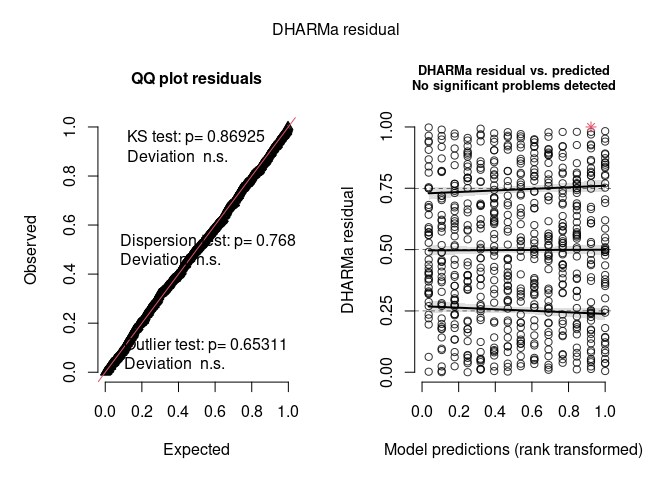<!-- -->

    ## Object of Class DHARMa with simulated residuals based on 250 simulations with refit = FALSE . See ?DHARMa::simulateResiduals for help. 
    ##  
    ## Scaled residual values: 0.4589582 0.7493933 0.6690189 0.5948831 0.51507 0.4854772 0.52614 0.6080341 0.8140457 0.3224168 0.3786706 0.05314925 0.4407776 0.0385783 0.07113632 0.942124 0.4041715 0.3563878 0.382026 0.234601 ...

``` r
# this looks much better. Now we can look at the marginal effects:

# First, just look at the effect of species, doing a 1-way pairwise comparison
em_spp = emmeans(fit_nbinom, pairwise ~ spp, type = "response")
```

    ## NOTE: Results may be misleading due to involvement in interactions

``` r
em_spp
```

    ## $emmeans
    ##  spp   response     SE  df asymp.LCL asymp.UCL
    ##  GP       0.289 0.1500 Inf     0.105     0.797
    ##  PR       0.225 0.0776 Inf     0.114     0.442
    ##  DM       0.965 0.2020 Inf     0.640     1.455
    ##  EC-A     0.314 0.1040 Inf     0.164     0.600
    ##  EC-L     1.017 0.2160 Inf     0.671     1.543
    ##  DES-L    1.311 0.2530 Inf     0.898     1.914
    ##  DF       1.015 0.1970 Inf     0.694     1.484
    ## 
    ## Results are averaged over the levels of: mined 
    ## Confidence level used: 0.95 
    ## Intervals are back-transformed from the log scale 
    ## 
    ## $contrasts
    ##  contrast         ratio     SE  df null z.ratio p.value
    ##  GP / PR          1.287 0.7720 Inf    1   0.421  0.9996
    ##  GP / DM          0.300 0.1600 Inf    1  -2.254  0.2667
    ##  GP / (EC-A)      0.921 0.5450 Inf    1  -0.139  1.0000
    ##  GP / (EC-L)      0.284 0.1520 Inf    1  -2.351  0.2200
    ##  GP / (DES-L)     0.221 0.1170 Inf    1  -2.859  0.0643
    ##  GP / DF          0.285 0.1500 Inf    1  -2.377  0.2082
    ##  PR / DM          0.233 0.0861 Inf    1  -3.941  0.0016
    ##  PR / (EC-A)      0.715 0.3200 Inf    1  -0.749  0.9895
    ##  PR / (EC-L)      0.221 0.0818 Inf    1  -4.079  0.0009
    ##  PR / (DES-L)     0.171 0.0619 Inf    1  -4.884  <.0001
    ##  PR / DF          0.221 0.0797 Inf    1  -4.190  0.0006
    ##  DM / (EC-A)      3.073 1.0900 Inf    1   3.154  0.0269
    ##  DM / (EC-L)      0.948 0.2390 Inf    1  -0.211  1.0000
    ##  DM / (DES-L)     0.736 0.1750 Inf    1  -1.290  0.8566
    ##  DM / DF          0.951 0.2250 Inf    1  -0.214  1.0000
    ##  (EC-A) / (EC-L)  0.309 0.1100 Inf    1  -3.296  0.0170
    ##  (EC-A) / (DES-L) 0.240 0.0831 Inf    1  -4.119  0.0008
    ##  (EC-A) / DF      0.309 0.1070 Inf    1  -3.391  0.0124
    ##  (EC-L) / (DES-L) 0.776 0.1850 Inf    1  -1.061  0.9394
    ##  (EC-L) / DF      1.003 0.2380 Inf    1   0.011  1.0000
    ##  (DES-L) / DF     1.291 0.2870 Inf    1   1.149  0.9127
    ## 
    ## Results are averaged over the levels of: mined 
    ## P value adjustment: tukey method for comparing a family of 7 estimates 
    ## Tests are performed on the log scale

``` r
cl = cld(em_spp, Letters = letters)

ggplot(data = cl, aes(x = spp, y = response)) +
  geom_point(size=2.5, color="black") +
  geom_errorbar(aes(x=spp, ymin = asymp.LCL,
                    ymax = asymp.UCL),
                width = 0.2, size=1, color="black") +
  geom_text(aes(label = gsub(" ", "", .group)),
            position = position_nudge(x = 0.3)) +
  ggeasy::easy_remove_axes("both", "title")
```

    ## Warning: Using `size` aesthetic for lines was deprecated in ggplot2 3.4.0.
    ## ℹ Please use `linewidth` instead.
    ## This warning is displayed once every 8 hours.
    ## Call `lifecycle::last_lifecycle_warnings()` to see where this warning was
    ## generated.

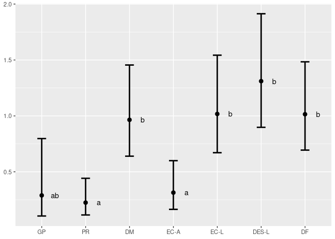<!-- -->

``` r
# Next, let's see how the effects vary with different mined levels in a 2-way emmeans comparison
em_spp2 = emmeans(fit_nbinom, pairwise ~ spp | mined, type = "response")
em_spp2
```

    ## $emmeans
    ## mined = yes:
    ##  spp   response     SE  df asymp.LCL asymp.UCL
    ##  GP      0.0369 0.0374 Inf   0.00506     0.269
    ##  PR      0.1099 0.0662 Inf   0.03379     0.358
    ##  DM      0.3843 0.1400 Inf   0.18835     0.784
    ##  EC-A    0.1100 0.0661 Inf   0.03391     0.357
    ##  EC-L    0.3241 0.1220 Inf   0.15474     0.679
    ##  DES-L   0.4918 0.1640 Inf   0.25553     0.947
    ##  DF      0.5565 0.1770 Inf   0.29881     1.036
    ## 
    ## mined = no:
    ##  spp   response     SE  df asymp.LCL asymp.UCL
    ##  GP      2.2677 0.4580 Inf   1.52691     3.368
    ##  PR      0.4587 0.1520 Inf   0.24003     0.877
    ##  DM      2.4227 0.4840 Inf   1.63813     3.583
    ##  EC-A    0.8958 0.2370 Inf   0.53302     1.506
    ##  EC-L    3.1942 0.6060 Inf   2.20256     4.632
    ##  DES-L   3.4930 0.6520 Inf   2.42296     5.036
    ##  DF      1.8510 0.3950 Inf   1.21830     2.812
    ## 
    ## Confidence level used: 0.95 
    ## Intervals are back-transformed from the log scale 
    ## 
    ## $contrasts
    ## mined = yes:
    ##  contrast          ratio     SE  df null z.ratio p.value
    ##  GP / PR          0.3353 0.3870 Inf    1  -0.948  0.9647
    ##  GP / DM          0.0959 0.1010 Inf    1  -2.232  0.2782
    ##  GP / (EC-A)      0.3350 0.3860 Inf    1  -0.949  0.9645
    ##  GP / (EC-L)      0.1138 0.1200 Inf    1  -2.065  0.3737
    ##  GP / (DES-L)     0.0750 0.0780 Inf    1  -2.491  0.1624
    ##  GP / DF          0.0663 0.0685 Inf    1  -2.624  0.1186
    ##  PR / DM          0.2861 0.1890 Inf    1  -1.889  0.4874
    ##  PR / (EC-A)      0.9992 0.8140 Inf    1  -0.001  1.0000
    ##  PR / (EC-L)      0.3392 0.2260 Inf    1  -1.624  0.6666
    ##  PR / (DES-L)     0.2235 0.1440 Inf    1  -2.320  0.2342
    ##  PR / DF          0.1976 0.1260 Inf    1  -2.550  0.1418
    ##  DM / (EC-A)      3.4922 2.3100 Inf    1   1.892  0.4857
    ##  DM / (EC-L)      1.1857 0.5530 Inf    1   0.365  0.9998
    ##  DM / (DES-L)     0.7813 0.3410 Inf    1  -0.566  0.9977
    ##  DM / DF          0.6906 0.2920 Inf    1  -0.876  0.9761
    ##  (EC-A) / (EC-L)  0.3395 0.2260 Inf    1  -1.625  0.6662
    ##  (EC-A) / (DES-L) 0.2237 0.1440 Inf    1  -2.323  0.2330
    ##  (EC-A) / DF      0.1977 0.1260 Inf    1  -2.551  0.1414
    ##  (EC-L) / (DES-L) 0.6590 0.2910 Inf    1  -0.943  0.9656
    ##  (EC-L) / DF      0.5824 0.2490 Inf    1  -1.262  0.8692
    ##  (DES-L) / DF     0.8838 0.3500 Inf    1  -0.312  0.9999
    ## 
    ## mined = no:
    ##  contrast          ratio     SE  df null z.ratio p.value
    ##  GP / PR          4.9434 1.6300 Inf    1   4.844  <.0001
    ##  GP / DM          0.9360 0.1880 Inf    1  -0.329  0.9999
    ##  GP / (EC-A)      2.5313 0.6720 Inf    1   3.500  0.0085
    ##  GP / (EC-L)      0.7099 0.1380 Inf    1  -1.757  0.5772
    ##  GP / (DES-L)     0.6492 0.1230 Inf    1  -2.278  0.2545
    ##  GP / DF          1.2251 0.2630 Inf    1   0.944  0.9653
    ##  PR / DM          0.1893 0.0623 Inf    1  -5.057  <.0001
    ##  PR / (EC-A)      0.5121 0.1900 Inf    1  -1.802  0.5470
    ##  PR / (EC-L)      0.1436 0.0468 Inf    1  -5.961  <.0001
    ##  PR / (DES-L)     0.1313 0.0424 Inf    1  -6.290  <.0001
    ##  PR / DF          0.2478 0.0836 Inf    1  -4.136  0.0007
    ##  DM / (EC-A)      2.7044 0.7140 Inf    1   3.766  0.0031
    ##  DM / (EC-L)      0.7585 0.1460 Inf    1  -1.433  0.7842
    ##  DM / (DES-L)     0.6936 0.1300 Inf    1  -1.948  0.4485
    ##  DM / DF          1.3089 0.2790 Inf    1   1.261  0.8696
    ##  (EC-A) / (EC-L)  0.2805 0.0727 Inf    1  -4.905  <.0001
    ##  (EC-A) / (DES-L) 0.2565 0.0656 Inf    1  -5.316  <.0001
    ##  (EC-A) / DF      0.4840 0.1330 Inf    1  -2.646  0.1125
    ##  (EC-L) / (DES-L) 0.9145 0.1650 Inf    1  -0.496  0.9989
    ##  (EC-L) / DF      1.7257 0.3550 Inf    1   2.651  0.1111
    ##  (DES-L) / DF     1.8871 0.3820 Inf    1   3.136  0.0285
    ## 
    ## P value adjustment: tukey method for comparing a family of 7 estimates 
    ## Tests are performed on the log scale

``` r
cl2 = cld(em_spp2, Letters = letters)

ggplot(data = cl2, aes(x = spp, y = response)) +
  geom_point(size=2.5, color="black") +
  geom_errorbar(aes(x=spp, ymin = asymp.LCL,
                    ymax = asymp.UCL),
                width = 0.2, size=1, color="black") +
  facet_wrap(~ mined, #nrow = 2,
             labeller = label_both) +
  geom_text(aes(label = gsub(" ", "", .group)),
            position = position_nudge(x = 0.4)) +
  ggeasy::easy_remove_axes("y", "title")
```

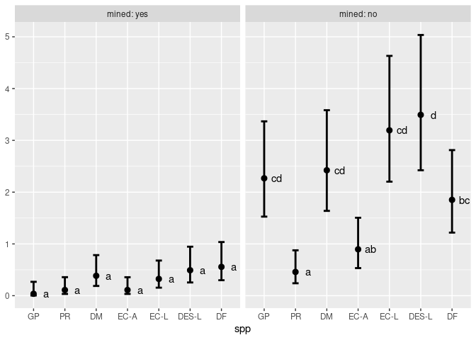<!-- -->

# Culex tarsalis

``` r
## tarsalis datasets from SLCMAD:
tarsalis <- read.csv("../data/tarsalis_2025.csv")

tarsalis <- tarsalis %>%
  mutate(
    urbanization = factor(
      urban_cat,
      levels = c("rural", "peri", "urban"),
      labels = c("rural", "peri", "urban")
    ),
    season = factor(
      season,
      levels = c("early", "mid", "late"),
      labels = c("early", "mid", "late")
    )
  )

head(tarsalis, 5)
```

    ##   site_code     site_name longitude latitude trap_type collection_date
    ## 1       224 1700 E Church  -111.842 40.72952      GRVD      2025-07-10
    ## 2       224 1700 E Church  -111.842 40.72952      GRVD      2025-07-17
    ## 3       224 1700 E Church  -111.842 40.72952      GRVD      2025-08-21
    ## 4       224 1700 E Church  -111.842 40.72952      GRVD      2025-08-21
    ## 5       224 1700 E Church  -111.842 40.72952      GRVD      2025-09-05
    ##   disease_week        species count season urban_cat urbanization
    ## 1           28 Culex tarsalis    NA    mid     urban        urban
    ## 2           29 Culex tarsalis     1    mid     urban        urban
    ## 3           34 Culex tarsalis    NA   late     urban        urban
    ## 4           34 Culex tarsalis    NA   late     urban        urban
    ## 5           36 Culex tarsalis    NA   late     urban        urban

# GLMM by season and urbanization, each mosquito species separately

Start by binning into discrete seasons: early, mid, late

``` r
table(tarsalis$season, tarsalis$disease_week)
```

    ##        
    ##          15  16  17  18  19  20  21  22  23  24  25  26  27  28  29  30  31  32
    ##   early  28  33  29  27  32  33  75  79   0   0   0   0   0   0   0   0   0   0
    ##   mid     0   0   0   0   0   0   0   0  80  82  48  88  82  88  88  76 119   0
    ##   late    0   0   0   0   0   0   0   0   0   0   0   0   0   0   0   0   0  89
    ##        
    ##          33  34  35  36  37  38  39  40
    ##   early   0   0   0   0   0   0   0   0
    ##   mid     0   0   0   0   0   0   0   0
    ##   late   89  94  48  73  83  90  82  39

First, look at the response distribution

``` r
# sub in tarsalis dataset here instead of salamander 
hist(tarsalis$count) 
```

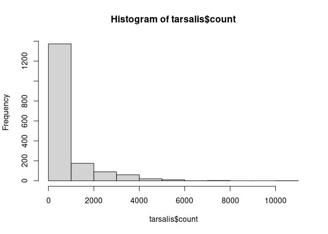<!-- -->

``` r
hist(log(tarsalis$count))
```

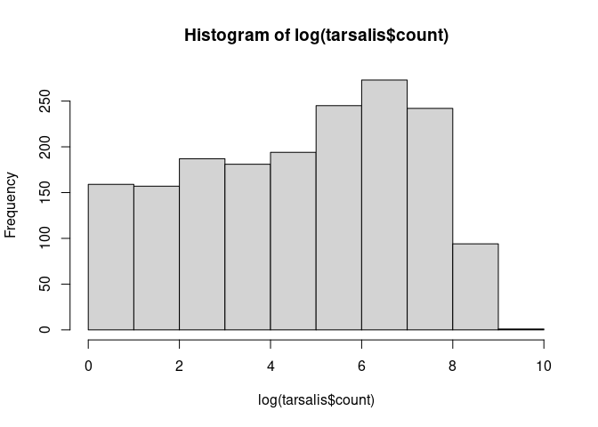<!-- -->

## Random effects (1 \| site_name/disease_week)

Fit the model with poisson(link=“log”), using random effects (1 \|
site_name/disease_week)

``` r
# tarsalis count data, starting with poisson model:
fit_pois <- glmmTMB(count ~ season*urbanization + trap_type + (1 | site_name/disease_week),
                    family = poisson(link = "log"),
                    data = tarsalis)
summary(fit_pois)
```

    ##  Family: poisson  ( log )
    ## Formula:          
    ## count ~ season * urbanization + trap_type + (1 | site_name/disease_week)
    ## Data: tarsalis
    ## 
    ##       AIC       BIC    logLik -2*log(L)  df.resid 
    ##  300226.7  300292.2 -150101.4  300202.7      1721 
    ## 
    ## Random effects:
    ## 
    ## Conditional model:
    ##  Groups                 Name        Variance Std.Dev.
    ##  disease_week:site_name (Intercept) 2.1536   1.4675  
    ##  site_name              (Intercept) 0.2329   0.4826  
    ## Number of obs: 1733, groups:  disease_week:site_name, 1088; site_name, 56
    ## 
    ## Conditional model:
    ##                              Estimate Std. Error z value Pr(>|z|)    
    ## (Intercept)                   2.54222    0.16765  15.164  < 2e-16 ***
    ## seasonmid                     3.91765    0.16861  23.235  < 2e-16 ***
    ## seasonlate                    3.50289    0.16999  20.606  < 2e-16 ***
    ## urbanizationperi              0.06767    0.27131   0.249   0.8030    
    ## urbanizationurban            -0.99887    0.33890  -2.947   0.0032 ** 
    ## trap_typeGRVD                -2.75027    0.14330 -19.192  < 2e-16 ***
    ## seasonmid:urbanizationperi   -0.75471    0.27301  -2.764   0.0057 ** 
    ## seasonlate:urbanizationperi  -0.62940    0.27460  -2.292   0.0219 *  
    ## seasonmid:urbanizationurban  -2.41867    0.34393  -7.033 2.03e-12 ***
    ## seasonlate:urbanizationurban -2.04276    0.34579  -5.908 3.47e-09 ***
    ## ---
    ## Signif. codes:  0 '***' 0.001 '**' 0.01 '*' 0.05 '.' 0.1 ' ' 1

Look at the residuals:

``` r
simulateResiduals(fit_pois, plot = T)
```

    ## DHARMa:testOutliers with type = binomial may have inflated Type I error rates for integer-valued distributions. To get a more exact result, it is recommended to re-run testOutliers with type = 'bootstrap'. See ?testOutliers for details

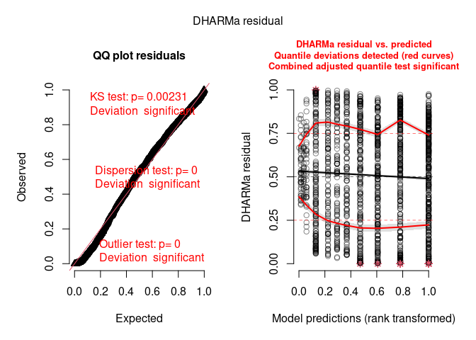<!-- -->

    ## Object of Class DHARMa with simulated residuals based on 250 simulations with refit = FALSE . See ?DHARMa::simulateResiduals for help. 
    ##  
    ## Scaled residual values: 0.3603315 0.6088512 0.8789793 0.3473587 0.5587588 0.6029112 0.3583864 0.7524882 0.4384193 0.1497614 0.04138747 0.2835615 0.704 0.05970947 0.662701 0.972 1 1 0.084 0.22 ...

## Random effects (1 \| site_name/collection_date)

Fit the model with poisson(link=“log”), using random effects (1 \|
site_name/collection_date)

``` r
# tarsalis count data, starting with poisson model:
fit_pois_date <- glmmTMB(count ~ season*urbanization + trap_type + (1 | site_name/collection_date),
                    family = poisson(link = "log"),
                    data = tarsalis)
summary(fit_pois_date)
```

    ##  Family: poisson  ( log )
    ## Formula:          
    ## count ~ season * urbanization + trap_type + (1 | site_name/collection_date)
    ## Data: tarsalis
    ## 
    ##       AIC       BIC    logLik -2*log(L)  df.resid 
    ##   22644.3   22709.8  -11310.2   22620.3      1721 
    ## 
    ## Random effects:
    ## 
    ## Conditional model:
    ##  Groups                    Name        Variance Std.Dev.
    ##  collection_date:site_name (Intercept) 2.8367   1.6842  
    ##  site_name                 (Intercept) 0.2325   0.4822  
    ## Number of obs: 1733, groups:  collection_date:site_name, 1668; site_name, 56
    ## 
    ## Conditional model:
    ##                              Estimate Std. Error z value Pr(>|z|)    
    ## (Intercept)                   2.76790    0.16654  16.620  < 2e-16 ***
    ## seasonmid                     3.33510    0.15790  21.122  < 2e-16 ***
    ## seasonlate                    3.22414    0.16032  20.110  < 2e-16 ***
    ## urbanizationperi              0.01161    0.27059   0.043 0.965775    
    ## urbanizationurban            -1.18620    0.34980  -3.391 0.000696 ***
    ## trap_typeGRVD                -2.75430    0.14530 -18.956  < 2e-16 ***
    ## seasonmid:urbanizationperi   -0.67229    0.25683  -2.618 0.008853 ** 
    ## seasonlate:urbanizationperi  -0.76451    0.26047  -2.935 0.003334 ** 
    ## seasonmid:urbanizationurban  -1.88802    0.34965  -5.400 6.68e-08 ***
    ## seasonlate:urbanizationurban -1.81413    0.35330  -5.135 2.83e-07 ***
    ## ---
    ## Signif. codes:  0 '***' 0.001 '**' 0.01 '*' 0.05 '.' 0.1 ' ' 1

``` r
# Look at the residuals
simulateResiduals(fit_pois_date, plot = T)
```

    ## qu = 0.25, log(sigma) = -2.118268 : outer Newton did not converge fully.

<!-- -->

    ## Object of Class DHARMa with simulated residuals based on 250 simulations with refit = FALSE . See ?DHARMa::simulateResiduals for help. 
    ##  
    ## Scaled residual values: 0.4093399 0.6479994 0.8259321 0.5479739 0.5808307 0.6330922 0.3437047 0.7582007 0.2929928 0.1082385 0.03846193 0.2581041 0.5930637 0.1071152 0.548 0.908 0.988 0.996 0.12 0.308 ...

I think it still doesn’t look great… KS test shows significant
deviation, dispersion test shows significant deviation, and there is a
funnel shape. Maybe the negative binomial distribution can help with
this as it helped with the salamanders? But this is all beyond me… give
it a shot!

``` r
fit_nbinom <- glmmTMB(count ~ season*urbanization + trap_type + (1 | site_name/collection_date),
                    family = nbinom1(link = "log"),
                    data = tarsalis)

simulateResiduals(fit_nbinom, plot = T)
```

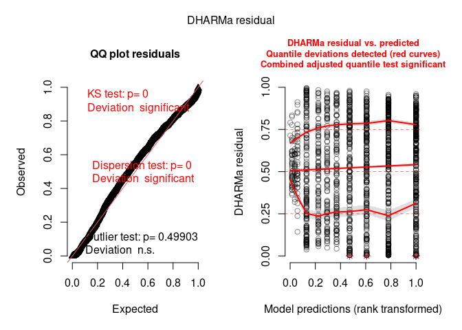<!-- -->

    ## Object of Class DHARMa with simulated residuals based on 250 simulations with refit = FALSE . See ?DHARMa::simulateResiduals for help. 
    ##  
    ## Scaled residual values: 0.4995076 0.5699429 0.8336987 0.4114965 0.5768046 0.5982225 0.4214291 0.6996921 0.3359942 0.145494 0.0840898 0.2919513 0.645457 0.094109 0.5596682 0.96 0.98 0.996 0.148 0.264 ...

I think it looks the same!!! So, stick with the poisson log-link? But I
do think that random effects (1 \| site_name/collection_date) looked
better than disease_week. Not sure if that is good justification to use
collection_date though.

## Marginal effects across seasons

Sticking with model with poisson(link=“log”), using random effects (1 \|
site_name/collection_date) `fit_pois_date`

glmmTMB(count ~ season\*urbanization + trap_type + (1 \|
site_name/collection_date), family = nbinom1(link = “log”), data =
tarsalis)

``` r
# First, just look at the effect of season, doing a 1-way pairwise comparison
em_season_tar = emmeans(fit_pois_date, pairwise ~ season, type = "response")
```

    ## NOTE: Results may be misleading due to involvement in interactions

``` r
em_season_tar
```

    ## $emmeans
    ##  season  rate    SE  df asymp.LCL asymp.UCL
    ##  early   2.72 0.411 Inf      2.02      3.65
    ##  mid    32.49 3.810 Inf     25.81     40.89
    ##  late   28.90 3.400 Inf     22.95     36.40
    ## 
    ## Results are averaged over the levels of: urbanization, trap_type 
    ## Confidence level used: 0.95 
    ## Intervals are back-transformed from the log scale 
    ## 
    ## $contrasts
    ##  contrast      ratio     SE  df null z.ratio p.value
    ##  early / mid  0.0836 0.0113 Inf    1 -18.418  <.0001
    ##  early / late 0.0940 0.0128 Inf    1 -17.356  <.0001
    ##  mid / late   1.1242 0.1130 Inf    1   1.163  0.4757
    ## 
    ## Results are averaged over the levels of: urbanization, trap_type 
    ## P value adjustment: tukey method for comparing a family of 3 estimates 
    ## Tests are performed on the log scale

``` r
cl = cld(em_season_tar, Letters = letters)

ggplot(data = cl, aes(x = season, y = rate)) +
    geom_point(size=2.5, color="black") +
    geom_errorbar(aes(x=season, ymin = asymp.LCL,
                      ymax = asymp.UCL),
                  width = 0.2, size=1, color="black") +
    geom_text(aes(label = gsub(" ", "", .group)),
              position = position_nudge(x = 0.3)) +
    ggeasy::easy_remove_axes("both", "title")
```

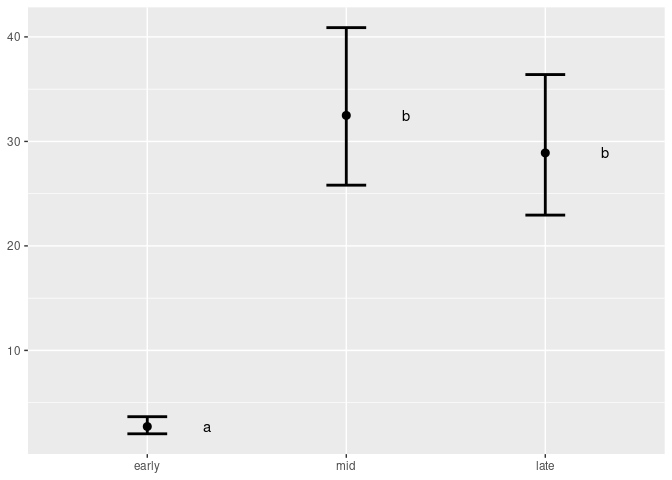<!-- -->

``` r
# Next, let's see how the effects vary with different mined levels in a 2-way emmeans comparison
em_spp2 = emmeans(fit_pois_date, pairwise ~ season | urbanization, type = "response")
em_spp2
```

    ## $emmeans
    ## urbanization = rural:
    ##  season   rate     SE  df asymp.LCL asymp.UCL
    ##  early    4.02  0.730 Inf     2.814      5.74
    ##  mid    112.83 17.700 Inf    82.939    153.48
    ##  late   100.98 16.100 Inf    73.875    138.02
    ## 
    ## urbanization = peri:
    ##  season   rate     SE  df asymp.LCL asymp.UCL
    ##  early    4.06  0.916 Inf     2.614      6.32
    ##  mid     58.27 11.200 Inf    40.024     84.85
    ##  late    47.56  9.250 Inf    32.490     69.62
    ## 
    ## urbanization = urban:
    ##  season   rate     SE  df asymp.LCL asymp.UCL
    ##  early    1.23  0.382 Inf     0.667      2.26
    ##  mid      5.22  1.030 Inf     3.537      7.69
    ##  late     5.03  1.000 Inf     3.398      7.43
    ## 
    ## Results are averaged over the levels of: trap_type 
    ## Confidence level used: 0.95 
    ## Intervals are back-transformed from the log scale 
    ## 
    ## $contrasts
    ## urbanization = rural:
    ##  contrast      ratio      SE  df null z.ratio p.value
    ##  early / mid  0.0356 0.00562 Inf    1 -21.122  <.0001
    ##  early / late 0.0398 0.00638 Inf    1 -20.110  <.0001
    ##  mid / late   1.1173 0.14700 Inf    1   0.842  0.6770
    ## 
    ## urbanization = peri:
    ##  contrast      ratio      SE  df null z.ratio p.value
    ##  early / mid  0.0698 0.01410 Inf    1 -13.144  <.0001
    ##  early / late 0.0855 0.01750 Inf    1 -11.980  <.0001
    ##  mid / late   1.2253 0.20600 Inf    1   1.210  0.4473
    ## 
    ## urbanization = urban:
    ##  contrast      ratio      SE  df null z.ratio p.value
    ##  early / mid  0.2353 0.07340 Inf    1  -4.638  <.0001
    ##  early / late 0.2441 0.07690 Inf    1  -4.478  <.0001
    ##  mid / late   1.0378 0.22200 Inf    1   0.173  0.9836
    ## 
    ## Results are averaged over the levels of: trap_type 
    ## P value adjustment: tukey method for comparing a family of 3 estimates 
    ## Tests are performed on the log scale

``` r
cl2 <- cld(em_spp2$emmeans, Letters = letters)

ggplot(data = cl2, aes(x = season, y = rate)) +
    geom_point(size = 2.5, color = "black") +
    geom_errorbar(aes(ymin = asymp.LCL, ymax = asymp.UCL),
                  width = 0.2, size = 1, color = "black") +
    facet_wrap(~ urbanization, labeller = label_both) +
    geom_text(aes(label = gsub(" ", "", .group)),
              position = position_nudge(x = 0.4)) +
    labs(
        title = "Seasonal abundance of Culex tarsalis across urbanization classes",
        x = "Season",
        y = "Predicted abundance"
    ) +
    ggeasy::easy_remove_axes("y", "title") +
    theme(plot.title = element_text(hjust = 0.5))
```

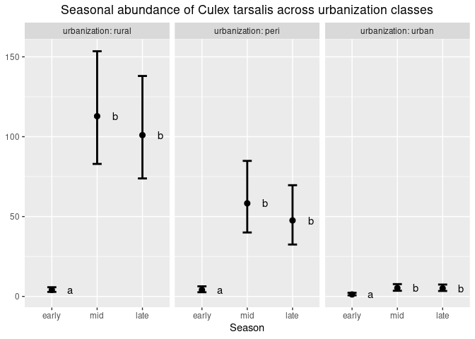<!-- -->

## Marginal effects across urbanization

``` r
# First, just look at the effect of season, doing a 1-way pairwise comparison
em_urban_tar = emmeans(fit_pois_date, pairwise ~ season, type = "response")
```

    ## NOTE: Results may be misleading due to involvement in interactions

``` r
em_urban_tar
```

    ## $emmeans
    ##  season  rate    SE  df asymp.LCL asymp.UCL
    ##  early   2.72 0.411 Inf      2.02      3.65
    ##  mid    32.49 3.810 Inf     25.81     40.89
    ##  late   28.90 3.400 Inf     22.95     36.40
    ## 
    ## Results are averaged over the levels of: urbanization, trap_type 
    ## Confidence level used: 0.95 
    ## Intervals are back-transformed from the log scale 
    ## 
    ## $contrasts
    ##  contrast      ratio     SE  df null z.ratio p.value
    ##  early / mid  0.0836 0.0113 Inf    1 -18.418  <.0001
    ##  early / late 0.0940 0.0128 Inf    1 -17.356  <.0001
    ##  mid / late   1.1242 0.1130 Inf    1   1.163  0.4757
    ## 
    ## Results are averaged over the levels of: urbanization, trap_type 
    ## P value adjustment: tukey method for comparing a family of 3 estimates 
    ## Tests are performed on the log scale

``` r
cl = cld(em_urban_tar, Letters = letters)

ggplot(data = cl, aes(x = season, y = rate)) +
    geom_point(size=2.5, color="black") +
    geom_errorbar(aes(x=season, ymin = asymp.LCL,
                      ymax = asymp.UCL),
                  width = 0.2, size=1, color="black") +
    geom_text(aes(label = gsub(" ", "", .group)),
              position = position_nudge(x = 0.3)) +
    ggeasy::easy_remove_axes("both", "title")
```

<!-- -->

``` r
# Next, let's see how the effects vary with different mined levels in a 2-way emmeans comparison
em_spp2 = emmeans(fit_pois_date, pairwise ~ urbanization | season, type = "response")
em_spp2
```

    ## $emmeans
    ## season = early:
    ##  urbanization   rate     SE  df asymp.LCL asymp.UCL
    ##  rural          4.02  0.730 Inf     2.814      5.74
    ##  peri           4.06  0.916 Inf     2.614      6.32
    ##  urban          1.23  0.382 Inf     0.667      2.26
    ## 
    ## season = mid:
    ##  urbanization   rate     SE  df asymp.LCL asymp.UCL
    ##  rural        112.83 17.700 Inf    82.939    153.48
    ##  peri          58.27 11.200 Inf    40.024     84.85
    ##  urban          5.22  1.030 Inf     3.537      7.69
    ## 
    ## season = late:
    ##  urbanization   rate     SE  df asymp.LCL asymp.UCL
    ##  rural        100.98 16.100 Inf    73.875    138.02
    ##  peri          47.56  9.250 Inf    32.490     69.62
    ##  urban          5.03  1.000 Inf     3.398      7.43
    ## 
    ## Results are averaged over the levels of: trap_type 
    ## Confidence level used: 0.95 
    ## Intervals are back-transformed from the log scale 
    ## 
    ## $contrasts
    ## season = early:
    ##  contrast       ratio    SE  df null z.ratio p.value
    ##  rural / peri   0.988 0.267 Inf    1  -0.043  0.9990
    ##  rural / urban  3.275 1.150 Inf    1   3.391  0.0020
    ##  peri / urban   3.313 1.240 Inf    1   3.201  0.0039
    ## 
    ## season = mid:
    ##  contrast       ratio    SE  df null z.ratio p.value
    ##  rural / peri   1.936 0.437 Inf    1   2.930  0.0095
    ##  rural / urban 21.633 5.190 Inf    1  12.814  <.0001
    ##  peri / urban  11.173 2.950 Inf    1   9.146  <.0001
    ## 
    ## season = late:
    ##  contrast       ratio    SE  df null z.ratio p.value
    ##  rural / peri   2.123 0.487 Inf    1   3.281  0.0030
    ##  rural / urban 20.092 4.920 Inf    1  12.264  <.0001
    ##  peri / urban   9.463 2.540 Inf    1   8.364  <.0001
    ## 
    ## Results are averaged over the levels of: trap_type 
    ## P value adjustment: tukey method for comparing a family of 3 estimates 
    ## Tests are performed on the log scale

``` r
cl2 <- cld(em_spp2$emmeans, Letters = letters)

ggplot(data = cl2, aes(x = urbanization, y = rate)) +
    geom_point(size = 2.5, color = "black") +
    geom_errorbar(aes(ymin = asymp.LCL, ymax = asymp.UCL),
                  width = 0.2, size = 1, color = "black") +
    facet_wrap(~ season, labeller = label_both) +
    geom_text(aes(label = gsub(" ", "", .group)),
              position = position_nudge(x = 0.4)) +
    labs(
        title = "Abundance of Culex tarsalis across season",
        x = "Urbanization",
        y = "Predicted abundance"
    ) +
    ggeasy::easy_remove_axes("y", "title") +
    theme(plot.title = element_text(hjust = 0.5))
```

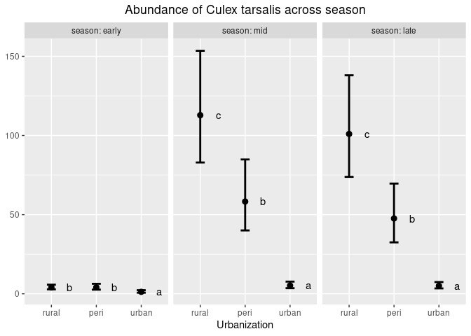<!-- -->
\# Culex pipiens

``` r
## pipiens datasets from SLCMAD:
pipiens <- read.csv("../data/pipiens_2025.csv")

head(pipiens, 5)
```

    ##   site_code     site_name longitude latitude trap_type collection_date
    ## 1       224 1700 E Church  -111.842 40.72952      GRVD      2025-05-30
    ## 2       224 1700 E Church  -111.842 40.72952      GRVD      2025-06-05
    ## 3       224 1700 E Church  -111.842 40.72952      GRVD      2025-06-12
    ## 4       224 1700 E Church  -111.842 40.72952      GRVD      2025-06-20
    ## 5       224 1700 E Church  -111.842 40.72952      GRVD      2025-06-26
    ##   disease_week       species count season urban_cat
    ## 1           22 Culex pipiens     3  early    urban 
    ## 2           23 Culex pipiens     9    mid    urban 
    ## 3           24 Culex pipiens    10    mid    urban 
    ## 4           25 Culex pipiens     5    mid    urban 
    ## 5           26 Culex pipiens    30    mid    urban

``` r
table(pipiens$season, pipiens$urban_cat)
```

    ##        
    ##         peri rural urban 
    ##   early   68    75     50
    ##   late   148   110    290
    ##   mid    185   172    296

``` r
library(dplyr)

pipiens <- pipiens %>%
  mutate(
    urban_cat = trimws(tolower(urban_cat)),
    urbanization = factor(
      urban_cat,
      levels = c("rural", "peri", "urban"),
      labels = c("rural", "peri", "urban")
    ),
    season = factor(
      season,
      levels = c("early", "mid", "late"),
      labels = c("early", "mid", "late")
    )
  )

head(pipiens, 5)
```

    ##   site_code     site_name longitude latitude trap_type collection_date
    ## 1       224 1700 E Church  -111.842 40.72952      GRVD      2025-05-30
    ## 2       224 1700 E Church  -111.842 40.72952      GRVD      2025-06-05
    ## 3       224 1700 E Church  -111.842 40.72952      GRVD      2025-06-12
    ## 4       224 1700 E Church  -111.842 40.72952      GRVD      2025-06-20
    ## 5       224 1700 E Church  -111.842 40.72952      GRVD      2025-06-26
    ##   disease_week       species count season urban_cat urbanization
    ## 1           22 Culex pipiens     3  early     urban        urban
    ## 2           23 Culex pipiens     9    mid     urban        urban
    ## 3           24 Culex pipiens    10    mid     urban        urban
    ## 4           25 Culex pipiens     5    mid     urban        urban
    ## 5           26 Culex pipiens    30    mid     urban        urban

# GLMM by season and urbanization, each mosquito species separately

Start by binning into discrete seasons: early, mid, late

``` r
table(pipiens$season, pipiens$disease_week)
```

    ##        
    ##         15 16 17 18 19 20 21 22 23 24 25 26 27 28 29 30 31 32 33 34 35 36 37 38
    ##   early 18 15 18 16 20  9 32 65  0  0  0  0  0  0  0  0  0  0  0  0  0  0  0  0
    ##   mid    0  0  0  0  0  0  0  0 56 76 53 86 71 79 77 69 86  0  0  0  0  0  0  0
    ##   late   0  0  0  0  0  0  0  0  0  0  0  0  0  0  0  0  0 58 71 86 46 56 66 69
    ##        
    ##         39 40
    ##   early  0  0
    ##   mid    0  0
    ##   late  64 32

``` r
table(pipiens$season, pipiens$urbanization)
```

    ##        
    ##         rural peri urban
    ##   early    75   68    50
    ##   mid     172  185   296
    ##   late    110  148   290

First, look at the response distribution

``` r
# sub in pipiens dataset here instead of salamander 
hist(pipiens$count) 
```

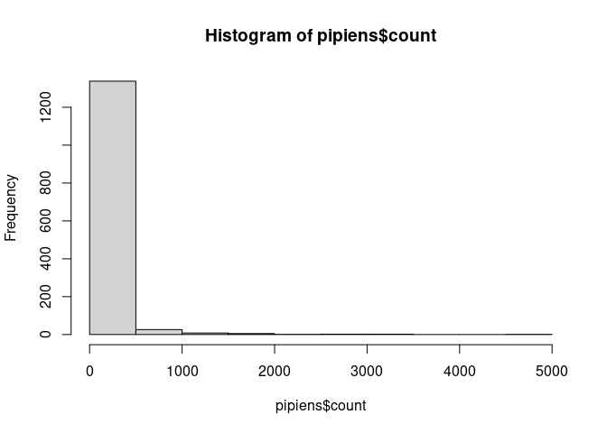<!-- -->

``` r
hist(log(pipiens$count))
```

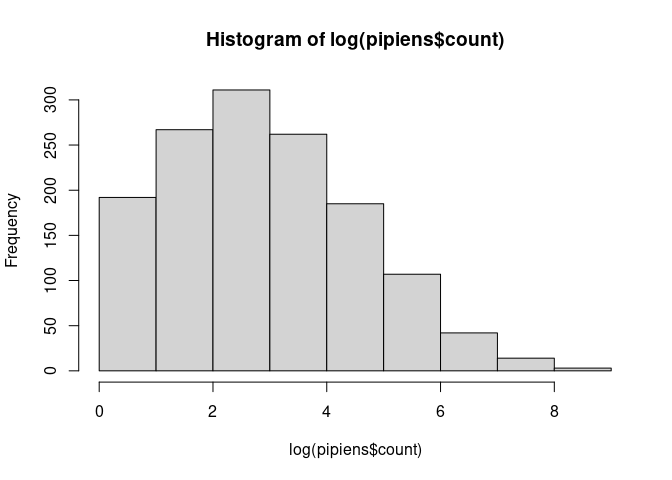<!-- -->

## Random effects (1 \| site_name/disease_week)

Fit the model with poisson(link=“log”), using random effects (1 \|
site_name/disease_week)

``` r
# pipiens count data, starting with poisson model:
fit_pois <- glmmTMB(count ~ season*urbanization + trap_type + (1 | site_name/disease_week),
                    family = poisson(link = "log"),
                    data = pipiens)
summary(fit_pois)
```

    ##  Family: poisson  ( log )
    ## Formula:          
    ## count ~ season * urbanization + trap_type + (1 | site_name/disease_week)
    ## Data: pipiens
    ## 
    ##       AIC       BIC    logLik -2*log(L)  df.resid 
    ##   42531.3   42594.1  -21253.7   42507.3      1371 
    ## 
    ## Random effects:
    ## 
    ## Conditional model:
    ##  Groups                 Name        Variance Std.Dev.
    ##  disease_week:site_name (Intercept) 1.3219   1.1498  
    ##  site_name              (Intercept) 0.3634   0.6028  
    ## Number of obs: 1383, groups:  disease_week:site_name, 1012; site_name, 59
    ## 
    ## Conditional model:
    ##                              Estimate Std. Error z value Pr(>|z|)    
    ## (Intercept)                   1.31517    0.20702    6.35 2.12e-10 ***
    ## seasonmid                     2.03037    0.18886   10.75  < 2e-16 ***
    ## seasonlate                    2.66443    0.20271   13.14  < 2e-16 ***
    ## urbanizationperi             -0.25120    0.31809   -0.79 0.429693    
    ## urbanizationurban            -0.04281    0.31993   -0.13 0.893556    
    ## trap_typeGRVD                -0.93579    0.02784  -33.62  < 2e-16 ***
    ## seasonmid:urbanizationperi    0.97603    0.27932    3.49 0.000475 ***
    ## seasonlate:urbanizationperi   0.06875    0.29001    0.24 0.812618    
    ## seasonmid:urbanizationurban   0.12010    0.29522    0.41 0.684138    
    ## seasonlate:urbanizationurban -1.01629    0.30437   -3.34 0.000841 ***
    ## ---
    ## Signif. codes:  0 '***' 0.001 '**' 0.01 '*' 0.05 '.' 0.1 ' ' 1

Look at the residuals:

``` r
simulateResiduals(fit_pois, plot = T)
```

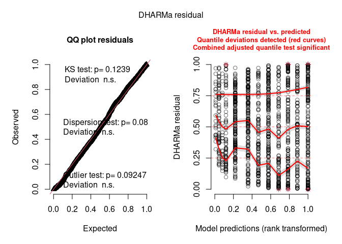<!-- -->

    ## Object of Class DHARMa with simulated residuals based on 250 simulations with refit = FALSE . See ?DHARMa::simulateResiduals for help. 
    ##  
    ## Scaled residual values: 0.6757619 0.4121808 0.3646673 0.2641053 0.7477844 0.916 0.6644511 0.8907488 0.88 0.8148967 0.7537521 0.7027494 0.8241093 0.8490002 0.4828236 0.837688 0.8487242 0.6957086 0.8333555 0.5124638 ...

## Random effects (1 \| site_name/collection_date)

Fit the model with poisson(link=“log”), using random effects (1 \|
site_name/collection_date)

``` r
# pipiens count data, starting with poisson model:
fit_pois_date <- glmmTMB(count ~ season*urbanization + trap_type + (1 | site_name/collection_date),
                    family = poisson(link = "log"),
                    data = pipiens)
summary(fit_pois_date)
```

    ##  Family: poisson  ( log )
    ## Formula:          
    ## count ~ season * urbanization + trap_type + (1 | site_name/collection_date)
    ## Data: pipiens
    ## 
    ##       AIC       BIC    logLik -2*log(L)  df.resid 
    ##   13899.0   13961.8   -6937.5   13875.0      1371 
    ## 
    ## Random effects:
    ## 
    ## Conditional model:
    ##  Groups                    Name        Variance Std.Dev.
    ##  collection_date:site_name (Intercept) 1.6098   1.2688  
    ##  site_name                 (Intercept) 0.3792   0.6158  
    ## Number of obs: 1383, groups:  collection_date:site_name, 1227; site_name, 59
    ## 
    ## Conditional model:
    ##                              Estimate Std. Error z value Pr(>|z|)    
    ## (Intercept)                   1.36506    0.21459    6.36    2e-10 ***
    ## seasonmid                     1.92951    0.19451    9.92  < 2e-16 ***
    ## seasonlate                    2.56389    0.20928   12.25  < 2e-16 ***
    ## urbanizationperi             -0.26938    0.32480   -0.83  0.40689    
    ## urbanizationurban            -0.10948    0.33440   -0.33  0.74338    
    ## trap_typeGRVD                -0.93656    0.02785  -33.63  < 2e-16 ***
    ## seasonmid:urbanizationperi    0.81593    0.27703    2.95  0.00323 ** 
    ## seasonlate:urbanizationperi   0.08115    0.29074    0.28  0.78015    
    ## seasonmid:urbanizationurban   0.21921    0.30893    0.71  0.47797    
    ## seasonlate:urbanizationurban -0.90745    0.31870   -2.85  0.00441 ** 
    ## ---
    ## Signif. codes:  0 '***' 0.001 '**' 0.01 '*' 0.05 '.' 0.1 ' ' 1

``` r
# Look at the residuals
simulateResiduals(fit_pois_date, plot = T)
```

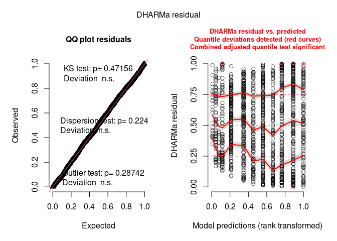<!-- -->

    ## Object of Class DHARMa with simulated residuals based on 250 simulations with refit = FALSE . See ?DHARMa::simulateResiduals for help. 
    ##  
    ## Scaled residual values: 0.7044489 0.4027836 0.4321746 0.2432131 0.74 0.912 0.681308 0.84 0.804 0.7668149 0.7360402 0.8388474 0.8279752 0.8286905 0.5875638 0.7939729 0.7991941 0.6996685 0.7749739 0.415216 ...

I think it still doesn’t look great… KS test shows significant
deviation, dispersion test shows significant deviation, and there is a
funnel shape. Maybe the negative binomial distribution can help with
this as it helped with the salamanders? But this is all beyond me… give
it a shot!

``` r
fit_nbinom <- glmmTMB(count ~ season*urbanization + trap_type + (1 | site_name/collection_date),
                    family = nbinom1(link = "log"),
                    data = pipiens)

simulateResiduals(fit_nbinom, plot = T)
```

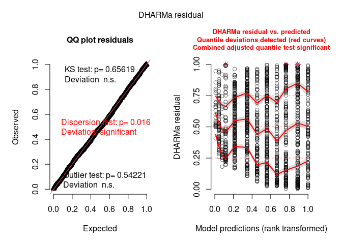<!-- -->

    ## Object of Class DHARMa with simulated residuals based on 250 simulations with refit = FALSE . See ?DHARMa::simulateResiduals for help. 
    ##  
    ## Scaled residual values: 0.6746027 0.4044072 0.4756347 0.298882 0.7515702 0.92 0.7259046 0.8683943 0.8560478 0.782299 0.7125544 0.831516 0.8404351 0.8285245 0.5222331 0.84 0.8590048 0.6805351 0.7645818 0.5083352 ...

I think it looks the same!!! So, stick with the poisson log-link? But I
do think that random effects (1 \| site_name/collection_date) looked
better than disease_week. Not sure if that is good justification to use
collection_date though.

## Marginal effects

Sticking with model with poisson(link=“log”), using random effects (1 \|
site_name/collection_date) `fit_pois_date`

glmmTMB(count ~ season\*urbanization + trap_type + (1 \|
site_name/collection_date), family = nbinom1(link = “log”), data =
pipiens)

``` r
# First, just look at the effect of season, doing a 1-way pairwise comparison
em_season_pip = emmeans(fit_pois_date, pairwise ~ season, type = "response")
```

    ## NOTE: Results may be misleading due to involvement in interactions

``` r
em_season_pip
```

    ## $emmeans
    ##  season  rate    SE  df asymp.LCL asymp.UCL
    ##  early   2.16 0.299 Inf      1.65      2.83
    ##  mid    21.01 2.120 Inf     17.25     25.60
    ##  late   21.31 2.230 Inf     17.35     26.16
    ## 
    ## Results are averaged over the levels of: urbanization, trap_type 
    ## Confidence level used: 0.95 
    ## Intervals are back-transformed from the log scale 
    ## 
    ## $contrasts
    ##  contrast     ratio     SE  df null z.ratio p.value
    ##  early / mid  0.103 0.0126 Inf    1 -18.608  <.0001
    ##  early / late 0.101 0.0128 Inf    1 -18.189  <.0001
    ##  mid / late   0.986 0.0823 Inf    1  -0.166  0.9848
    ## 
    ## Results are averaged over the levels of: urbanization, trap_type 
    ## P value adjustment: tukey method for comparing a family of 3 estimates 
    ## Tests are performed on the log scale

``` r
cl = cld(em_season_pip, Letters = letters)

ggplot(data = cl, aes(x = season, y = rate)) +
    geom_point(size=2.5, color="black") +
    geom_errorbar(aes(x=season, ymin = asymp.LCL,
                      ymax = asymp.UCL),
                  width = 0.2, size=1, color="black") +
    geom_text(aes(label = gsub(" ", "", .group)),
              position = position_nudge(x = 0.3)) +
    ggeasy::easy_remove_axes("both", "title")
```

<!-- -->

``` r
# Next, let's see how the effects vary in a 2-way emmeans comparison
em_spp2 = emmeans(fit_pois_date, pairwise ~ season | urbanization, type = "response")
em_spp2
```

    ## $emmeans
    ## urbanization = rural:
    ##  season  rate    SE  df asymp.LCL asymp.UCL
    ##  early   2.45 0.527 Inf      1.61      3.74
    ##  mid    16.88 2.870 Inf     12.11     23.54
    ##  late   31.84 5.870 Inf     22.18     45.71
    ## 
    ## urbanization = peri:
    ##  season  rate    SE  df asymp.LCL asymp.UCL
    ##  early   1.87 0.458 Inf      1.16      3.02
    ##  mid    29.16 5.780 Inf     19.78     42.99
    ##  late   26.38 5.350 Inf     17.73     39.25
    ## 
    ## urbanization = urban:
    ##  season  rate    SE  df asymp.LCL asymp.UCL
    ##  early   2.20 0.563 Inf      1.33      3.63
    ##  mid    18.84 2.860 Inf     14.00     25.36
    ##  late   11.52 1.750 Inf      8.54     15.52
    ## 
    ## Results are averaged over the levels of: trap_type 
    ## Confidence level used: 0.95 
    ## Intervals are back-transformed from the log scale 
    ## 
    ## $contrasts
    ## urbanization = rural:
    ##  contrast      ratio     SE  df null z.ratio p.value
    ##  early / mid  0.1452 0.0282 Inf    1  -9.920  <.0001
    ##  early / late 0.0770 0.0161 Inf    1 -12.251  <.0001
    ##  mid / late   0.5303 0.0859 Inf    1  -3.914  0.0003
    ## 
    ## urbanization = peri:
    ##  contrast      ratio     SE  df null z.ratio p.value
    ##  early / mid  0.0642 0.0127 Inf    1 -13.912  <.0001
    ##  early / late 0.0710 0.0143 Inf    1 -13.100  <.0001
    ##  mid / late   1.1056 0.1600 Inf    1   0.696  0.7661
    ## 
    ## urbanization = urban:
    ##  contrast      ratio     SE  df null z.ratio p.value
    ##  early / mid  0.1166 0.0280 Inf    1  -8.950  <.0001
    ##  early / late 0.1908 0.0459 Inf    1  -6.889  <.0001
    ##  mid / late   1.6360 0.2050 Inf    1   3.936  0.0002
    ## 
    ## Results are averaged over the levels of: trap_type 
    ## P value adjustment: tukey method for comparing a family of 3 estimates 
    ## Tests are performed on the log scale

``` r
cl2 <- cld(em_spp2$emmeans, Letters = letters)

ggplot(data = cl2, aes(x = season, y = rate)) +
    geom_point(size = 2.5, color = "black") +
    geom_errorbar(aes(ymin = asymp.LCL, ymax = asymp.UCL),
                  width = 0.2, size = 1, color = "black") +
    facet_wrap(~ urbanization, labeller = label_both) +
    geom_text(aes(label = gsub(" ", "", .group)),
              position = position_nudge(x = 0.4)) +
    labs(
        title = "Seasonal abundance of Culex pipiens across urbanization classes",
        x = "Season",
        y = "Predicted abundance"
    ) +
    ggeasy::easy_remove_axes("y", "title") +
    theme(plot.title = element_text(hjust = 0.5))
```

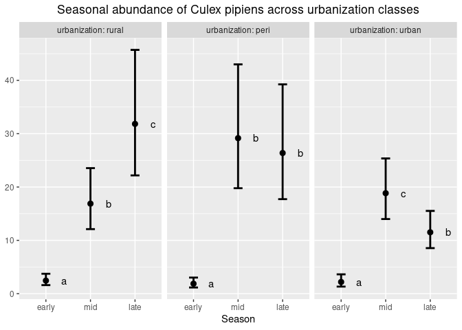<!-- -->

## Marginal effects across urbanization

``` r
# First, just look at the effect of season, doing a 1-way pairwise comparison
em_urban_pip = emmeans(fit_pois_date, pairwise ~ season, type = "response")
```

    ## NOTE: Results may be misleading due to involvement in interactions

``` r
em_urban_pip
```

    ## $emmeans
    ##  season  rate    SE  df asymp.LCL asymp.UCL
    ##  early   2.16 0.299 Inf      1.65      2.83
    ##  mid    21.01 2.120 Inf     17.25     25.60
    ##  late   21.31 2.230 Inf     17.35     26.16
    ## 
    ## Results are averaged over the levels of: urbanization, trap_type 
    ## Confidence level used: 0.95 
    ## Intervals are back-transformed from the log scale 
    ## 
    ## $contrasts
    ##  contrast     ratio     SE  df null z.ratio p.value
    ##  early / mid  0.103 0.0126 Inf    1 -18.608  <.0001
    ##  early / late 0.101 0.0128 Inf    1 -18.189  <.0001
    ##  mid / late   0.986 0.0823 Inf    1  -0.166  0.9848
    ## 
    ## Results are averaged over the levels of: urbanization, trap_type 
    ## P value adjustment: tukey method for comparing a family of 3 estimates 
    ## Tests are performed on the log scale

``` r
cl = cld(em_urban_pip, Letters = letters)

ggplot(data = cl, aes(x = season, y = rate)) +
    geom_point(size=2.5, color="black") +
    geom_errorbar(aes(x=season, ymin = asymp.LCL,
                      ymax = asymp.UCL),
                  width = 0.2, size=1, color="black") +
    geom_text(aes(label = gsub(" ", "", .group)),
              position = position_nudge(x = 0.3)) +
    ggeasy::easy_remove_axes("both", "title")
```

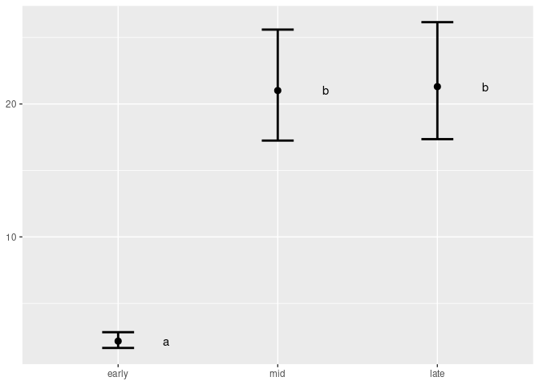<!-- -->

``` r
# Next, let's see how the effects vary with different mined levels in a 2-way emmeans comparison
em_spp2 = emmeans(fit_pois_date, pairwise ~ urbanization | season, type = "response")
em_spp2
```

    ## $emmeans
    ## season = early:
    ##  urbanization  rate    SE  df asymp.LCL asymp.UCL
    ##  rural         2.45 0.527 Inf      1.61      3.74
    ##  peri          1.87 0.458 Inf      1.16      3.02
    ##  urban         2.20 0.563 Inf      1.33      3.63
    ## 
    ## season = mid:
    ##  urbanization  rate    SE  df asymp.LCL asymp.UCL
    ##  rural        16.88 2.870 Inf     12.11     23.54
    ##  peri         29.16 5.780 Inf     19.78     42.99
    ##  urban        18.84 2.860 Inf     14.00     25.36
    ## 
    ## season = late:
    ##  urbanization  rate    SE  df asymp.LCL asymp.UCL
    ##  rural        31.84 5.870 Inf     22.18     45.71
    ##  peri         26.38 5.350 Inf     17.73     39.25
    ##  urban        11.52 1.750 Inf      8.54     15.52
    ## 
    ## Results are averaged over the levels of: trap_type 
    ## Confidence level used: 0.95 
    ## Intervals are back-transformed from the log scale 
    ## 
    ## $contrasts
    ## season = early:
    ##  contrast      ratio    SE  df null z.ratio p.value
    ##  rural / peri  1.309 0.425 Inf    1   0.829  0.6848
    ##  rural / urban 1.116 0.373 Inf    1   0.327  0.9426
    ##  peri / urban  0.852 0.302 Inf    1  -0.452  0.8937
    ## 
    ## season = mid:
    ##  contrast      ratio    SE  df null z.ratio p.value
    ##  rural / peri  0.579 0.151 Inf    1  -2.102  0.0894
    ##  rural / urban 0.896 0.204 Inf    1  -0.482  0.8800
    ##  peri / urban  1.548 0.386 Inf    1   1.750  0.1869
    ## 
    ## season = late:
    ##  contrast      ratio    SE  df null z.ratio p.value
    ##  rural / peri  1.207 0.330 Inf    1   0.688  0.7702
    ##  rural / urban 2.765 0.662 Inf    1   4.248  0.0001
    ##  peri / urban  2.290 0.581 Inf    1   3.265  0.0031
    ## 
    ## Results are averaged over the levels of: trap_type 
    ## P value adjustment: tukey method for comparing a family of 3 estimates 
    ## Tests are performed on the log scale

``` r
cl2 <- cld(em_spp2$emmeans, Letters = letters)

ggplot(data = cl2, aes(x = urbanization, y = rate)) +
    geom_point(size = 2.5, color = "black") +
    geom_errorbar(aes(ymin = asymp.LCL, ymax = asymp.UCL),
                  width = 0.2, size = 1, color = "black") +
    facet_wrap(~ season, labeller = label_both) +
    geom_text(aes(label = gsub(" ", "", .group)),
              position = position_nudge(x = 0.4)) +
    labs(
        title = "Abundance of Culex pipiens across season",
        x = "Urbanization",
        y = "Predicted abundance"
    ) +
    ggeasy::easy_remove_axes("y", "title") +
    theme(plot.title = element_text(hjust = 0.5))
```

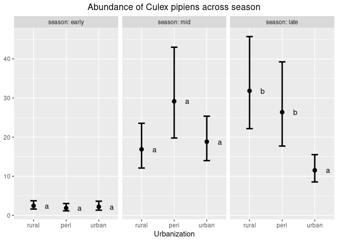<!-- -->
