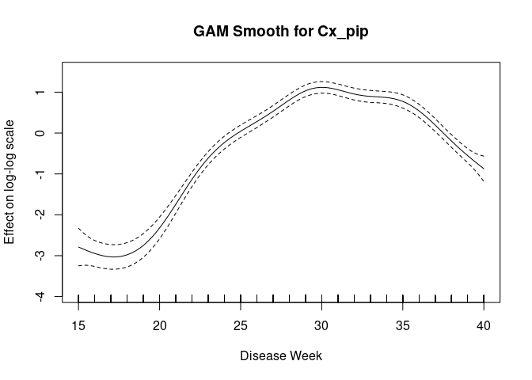
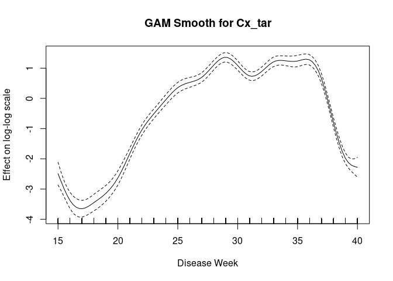
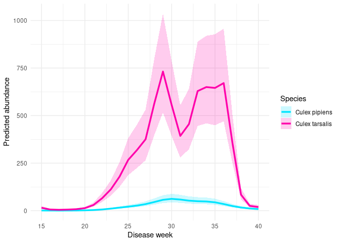
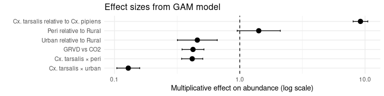
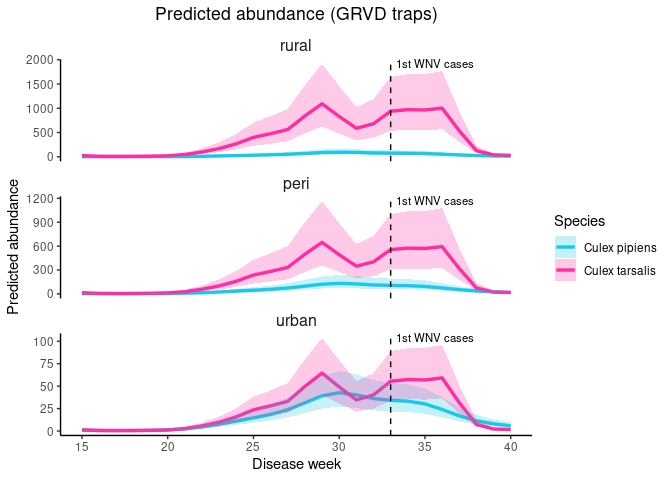
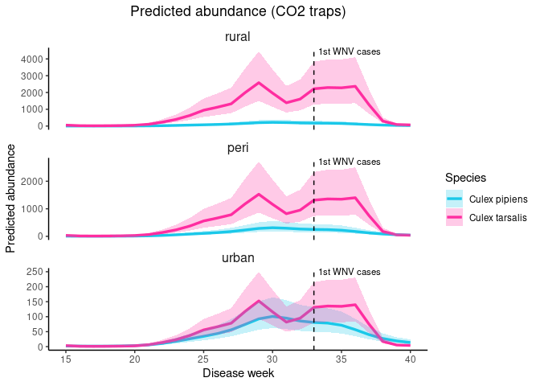
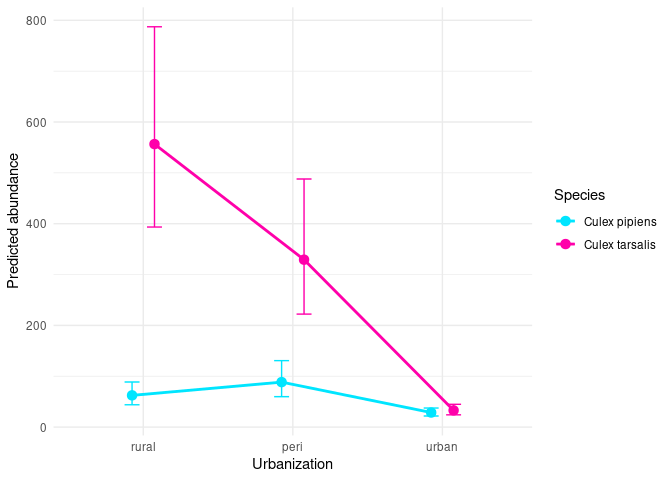
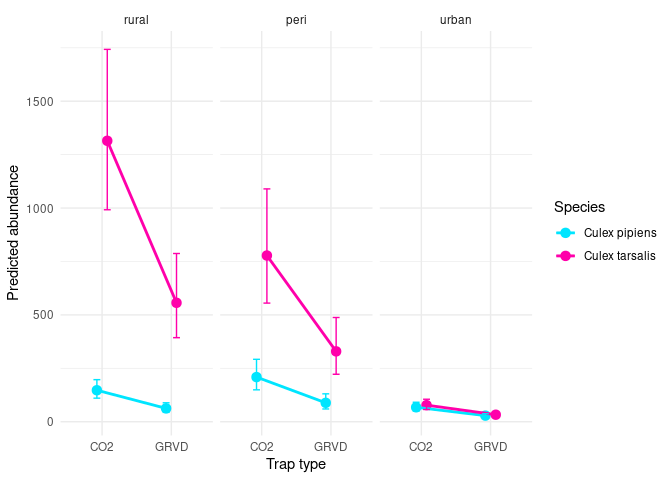
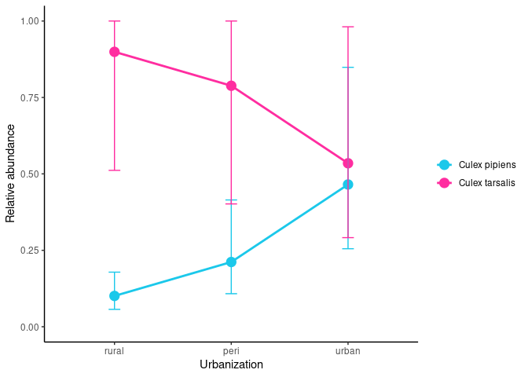
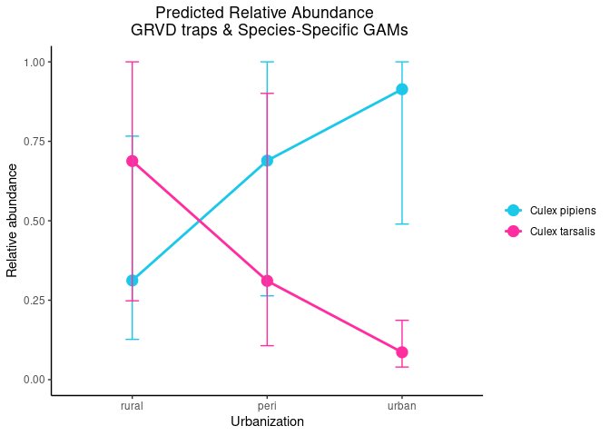

GAM **Cx. pipiens** and **Cx. tarsalis** abundance: SLC 2025 field
season
================
Norah Saarman
2026-05-14

- [Setup](#setup)
- [Prepare Data](#prepare-data)
  - [Combined data](#combined-data)
- [GAM with combined by species (random effect = site
  name)](#gam-with-combined-by-species-random-effect--site-name)
  - [Fit model](#fit-model)
  - [Check Fit and Smooths](#check-fit-and-smooths)
  - [GAM visualization](#gam-visualization)
    - [Effect size (forest) plot](#effect-size-forest-plot)
    - [Seasonal Smooth](#seasonal-smooth)
    - [Relative abundance](#relative-abundance)
  - [Interpretation](#interpretation)
- [GAM with each species separately, count by urbanization + trap_type
  (random effect = site
  name)](#gam-with-each-species-separately-count-by-urbanization--trap_type-random-effect--site-name)
  - [Fit model](#fit-model-1)
  - [Check fit and smooths](#check-fit-and-smooths-1)
    - [Check: tarsalis](#check-tarsalis)
    - [Check: pipiens](#check-pipiens)
  - [Residuals: tarsalis](#residuals-tarsalis)
    - [Map: tarsalis](#map-tarsalis)
    - [Weekly: tarsalis](#weekly-tarsalis)
    - [DHARMa: tar](#dharma-tar)
  - [Residuals: pipiens](#residuals-pipiens)
    - [Map: pipiens](#map-pipiens)
    - [Weekly: pipiens](#weekly-pipiens)
    - [DHARMa: pip](#dharma-pip)
  - [GAM visualizations using separate species
    models](#gam-visualizations-using-separate-species-models)
    - [Effect size (forest) plot from separate
      models](#effect-size-forest-plot-from-separate-models)
    - [Seasonal Smooth](#seasonal-smooth-1)
    - [Relative abundance figure](#relative-abundance-figure)

# Setup

**Research Topic:** testing whether habitat and seasonal partitioning
between Culex pipiens s.l. and Culex tarsalis shapes West Nile Virus
(WNV) dynamics across urban–rural gradients.

**Core hypothesis:** early/mid-season amplification dominated by pipiens
in urban areas, later spillover involving tarsalis moving into
urban/peri-urban areas.

**Approach:** Preliminary results visualized via mapping, with species
identity and abundance as primary response variables. Model mosquito
abundance and proportions using GLMM with GAM smoothing:

count ~ season\*urbanization + trap_type + (1\|site/date), family =
poisson(link = “log”):

- Response variable = mosquito abundance  
- Predictors = season\*urbanization  
- The trap type could be important, so we will add that as a fixed
  effect (covariate)… is this correct? We do think that the response
  variable of count of mosquitoes depends on trap type, since tarsalis
  seems to be more attracted to CO2 than pipiens, and we want to
  quantify that effect. Note that poisson model does not give a fixed
  offset (due to the log link)… The structure of this model means that
  it will estimate an effect that scales with the total number of
  mosquitos caught, which is exactly what we want.  
- The data are grouped into sites and are also linked through time, so
  we’ll add those as random effects. I think the sites should be coded
  as factors, **but I’m not sure what format to use for the date. I
  think it should be disease week so that week 18 is treated closer to
  19 than 20, etc., but I’m not totally confident in this.**
- The family = poisson (link = “log”)… why again?

**For simple model:** count ~ disease_week\*urbanization +
(1\|site/date), family = poisson(link = “log”)

Load libraries

``` r
library(tidyverse) # for data wrangling
```

    ## ── Attaching core tidyverse packages ──────────────────────── tidyverse 2.0.0 ──
    ## ✔ dplyr     1.1.4     ✔ readr     2.1.5
    ## ✔ forcats   1.0.0     ✔ stringr   1.5.1
    ## ✔ ggplot2   3.5.2     ✔ tibble    3.2.1
    ## ✔ lubridate 1.9.3     ✔ tidyr     1.3.1
    ## ✔ purrr     1.0.2     
    ## ── Conflicts ────────────────────────────────────────── tidyverse_conflicts() ──
    ## ✖ dplyr::filter() masks stats::filter()
    ## ✖ dplyr::lag()    masks stats::lag()
    ## ℹ Use the conflicted package (<http://conflicted.r-lib.org/>) to force all conflicts to become errors

``` r
library(glmmTMB)   # for model fitting
library(DHARMa)    # for residual plots
```

    ## This is DHARMa 0.4.7. For overview type '?DHARMa'. For recent changes, type news(package = 'DHARMa')

``` r
library(mgcViz)    # for residual plots
```

    ## Loading required package: mgcv
    ## Loading required package: nlme
    ## 
    ## Attaching package: 'nlme'
    ## 
    ## The following object is masked from 'package:dplyr':
    ## 
    ##     collapse
    ## 
    ## This is mgcv 1.9-4. For overview type '?mgcv'.
    ## Loading required package: qgam
    ## Registered S3 method overwritten by 'mgcViz':
    ##   method from   
    ##   +.gg   ggplot2
    ## 
    ## Attaching package: 'mgcViz'
    ## 
    ## The following objects are masked from 'package:stats':
    ## 
    ##     qqline, qqnorm, qqplot

``` r
library(emmeans)   # for estimating marginal effects
```

    ## Welcome to emmeans.
    ## Caution: You lose important information if you filter this package's results.
    ## See '? untidy'

``` r
library(multcomp)  # for statistical comparisons on fitted models
```

    ## Loading required package: mvtnorm
    ## Loading required package: survival
    ## Loading required package: TH.data
    ## Loading required package: MASS
    ## 
    ## Attaching package: 'MASS'
    ## 
    ## The following object is masked from 'package:dplyr':
    ## 
    ##     select
    ## 
    ## 
    ## Attaching package: 'TH.data'
    ## 
    ## The following object is masked from 'package:MASS':
    ## 
    ##     geyser

``` r
library(dplyr)     # for mutating dataframe to change labels in dataset
library(mgcv)      # fits GAM
library(broom)
library(ggplot2)
```

# Prepare Data

## Combined data

``` r
## tarsalis datasets from SLCMAD:
tarsalis <- read.csv("../data/tarsalis_2025.csv")
## pipiens datasets from SLCMAD:
pipiens <- read.csv("../data/pipiens_2025.csv")
## combine

combined <- bind_rows(tarsalis, pipiens)

## Set factor levels
combined <- combined %>%
  mutate(
    species = factor(
      species,
      levels = c("Culex pipiens", "Culex tarsalis")
    ),
    urban_cat = trimws(tolower(urban_cat)),
    urbanization = factor(
      urban_cat,
      levels = c("rural", "peri", "urban")
    ),
    season = factor(
      season,
      levels = c("early", "mid", "late")
    )
  )

#check
table(combined$species)
```

    ## 
    ##  Culex pipiens Culex tarsalis 
    ##           1394           1774

``` r
table(combined$season, combined$species)
```

    ##        
    ##         Culex pipiens Culex tarsalis
    ##   early           193            336
    ##   mid             653            751
    ##   late            548            687

``` r
combined <- combined %>%
  mutate(
    species = factor(species),
    urbanization = factor(urbanization),
    trap_type = factor(trap_type),
    site_name = factor(site_name),
    disease_week = as.numeric(disease_week)
  )
```

In the GLMM, (1 \| site_name/collection_date), which handles clustering
of repeated observations taken at the same site on the same date with: -
a random intercept for site_name  
- and a random intercept for each site_name:collection_date combination

GAM equivalent, in mgcv, the closest analogue is to create an
interaction ID and include it as another random-effect smooth.

First create the grouping variable:

``` r
combined <- combined %>%
  mutate(
    site_date = interaction(site_name, collection_date, drop = TRUE)
  )
```

Check if the grouping variable occurs often:

``` r
length(unique(combined$site_date))
```

    ## [1] 1906

``` r
nrow(combined)
```

    ## [1] 3168

``` r
table(table(combined$site_date))
```

    ## 
    ##   1   2   3   4   5 
    ## 851 909  88  55   3

Yes, more than half of the observations are impacted… but many of them
are different trap-types. This is a decision to make, to include or not
to include? Site_date adds shared noise from shared environment within a
sampling event. Since we really care more about ecological patterns over
time, and are already including trap-type, is it really needed? Does it
change the result?

Let’s start with a simple comparison of including ONLY site_name.

**NOTE:** I’m also worried that we might need to use the \* trap_type to
fully capture species-specific trap effects.

# GAM with combined by species (random effect = site name)

## Fit model

``` r
# Fit GAM model with site_name only
msq_spp_gam_k10 <- gam(
  count ~ species * urbanization + trap_type +
    s(disease_week, by = species, bs = "fs", k=10, m=2) +
    s(site_name, bs = "re"),
  family = nb(),
  data = combined,
  method = "REML"
)

# Fit GAM model with site_name only
msq_spp_gam_k15 <- gam(
  count ~ species * urbanization + trap_type +
    s(disease_week, by = species, bs = "fs", k=15, m=2) +

    s(site_name, bs = "re"),
  family = nb(),
  data = combined,
  method = "REML"
)
```

## Check Fit and Smooths

``` r
#AIC for k10 and K15
cat("GAM model k10 AIC: ", AIC(msq_spp_gam_k10), "\n")
```

    ## GAM model k10 AIC:  34570.08

``` r
cat("GAM model k15 AIC: ", AIC(msq_spp_gam_k15), "\n")
```

    ## GAM model k15 AIC:  34527.95

``` r
#Summary of GAM fit
summary(msq_spp_gam_k15)
```

    ## 
    ## Family: Negative Binomial(0.893) 
    ## Link function: log 
    ## 
    ## Formula:
    ## count ~ species * urbanization + trap_type + s(disease_week, 
    ##     by = species, bs = "fs", k = 15, m = 2) + s(site_name, bs = "re")
    ## 
    ## Parametric coefficients:
    ##                                         Estimate Std. Error z value Pr(>|z|)
    ## (Intercept)                              3.87456    0.12878  30.088  < 2e-16
    ## speciesCulex tarsalis                    2.21867    0.06873  32.283  < 2e-16
    ## urbanizationperi                         0.34898    0.20213   1.727   0.0843
    ## urbanizationurban                       -0.78011    0.18676  -4.177 2.95e-05
    ## trap_typeGRVD                           -0.85968    0.10257  -8.382  < 2e-16
    ## speciesCulex tarsalis:urbanizationperi  -0.87393    0.09901  -8.826  < 2e-16
    ## speciesCulex tarsalis:urbanizationurban -2.04937    0.10744 -19.074  < 2e-16
    ##                                            
    ## (Intercept)                             ***
    ## speciesCulex tarsalis                   ***
    ## urbanizationperi                        .  
    ## urbanizationurban                       ***
    ## trap_typeGRVD                           ***
    ## speciesCulex tarsalis:urbanizationperi  ***
    ## speciesCulex tarsalis:urbanizationurban ***
    ## ---
    ## Signif. codes:  0 '***' 0.001 '**' 0.01 '*' 0.05 '.' 0.1 ' ' 1
    ## 
    ## Approximate significance of smooth terms:
    ##                                          edf Ref.df Chi.sq p-value    
    ## s(disease_week):speciesCulex pipiens   9.035  10.79 1161.1  <2e-16 ***
    ## s(disease_week):speciesCulex tarsalis 13.057  13.83 3098.9  <2e-16 ***
    ## s(site_name)                          50.802  56.00  752.7  <2e-16 ***
    ## ---
    ## Signif. codes:  0 '***' 0.001 '**' 0.01 '*' 0.05 '.' 0.1 ' ' 1
    ## 
    ## R-sq.(adj) =  0.558   Deviance explained = 70.2%
    ## -REML =  17345  Scale est. = 1         n = 3116

``` r
#AIC for k10 and K15
cat("GAM model k10 AIC: ", AIC(msq_spp_gam_k10), "\n")
```

    ## GAM model k10 AIC:  34570.08

``` r
cat("GAM model k15 AIC: ", AIC(msq_spp_gam_k15), "\n")
```

    ## GAM model k15 AIC:  34527.95

``` r
#Check if smooths are hitting their basis limits
gam.check(msq_spp_gam_k15)
```

<!-- -->

    ## 
    ## Method: REML   Optimizer: outer newton
    ## full convergence after 6 iterations.
    ## Gradient range [-1.710598e-07,0.0001501772]
    ## (score 17345.26 & scale 1).
    ## Hessian positive definite, eigenvalue range [2.834221,1806.927].
    ## Model rank =  94 / 94 
    ## 
    ## Basis dimension (k) checking results. Low p-value (k-index<1) may
    ## indicate that k is too low, especially if edf is close to k'.
    ## 
    ##                                          k'   edf k-index p-value    
    ## s(disease_week):speciesCulex pipiens  14.00  9.04    0.82  <2e-16 ***
    ## s(disease_week):speciesCulex tarsalis 14.00 13.06    0.82  <2e-16 ***
    ## s(site_name)                          59.00 50.80      NA      NA    
    ## ---
    ## Signif. codes:  0 '***' 0.001 '**' 0.01 '*' 0.05 '.' 0.1 ' ' 1

K 15 is slightly better

## GAM visualization

``` r
# plot the smooths for pip
plot(msq_spp_gam_k15, select = 1, shade = TRUE,
xlab = "Disease Week", ylab = "Effect on log-log scale",
main = "GAM Smooth for Cx_pip")
```

<!-- -->

``` r
# plot the smooths for tar
plot(msq_spp_gam_k15, select = 2, shade = TRUE,
xlab = "Disease Week", ylab = "Effect on log-log scale",
main = "GAM Smooth for Cx_tar")
```

<!-- -->

``` r
# seasonal effects across all habitats:
newdata_season <- expand.grid(
  disease_week = seq(min(combined$disease_week), max(combined$disease_week), by = 1),
  species = c("Culex pipiens", "Culex tarsalis"),
  urbanization = "rural",
  trap_type = "GRVD",
  site_name = levels(combined$site_name)[1]
)

pred_season <- predict(
  msq_spp_gam_k15,
  newdata = newdata_season,
  type = "link",
  se.fit = TRUE,
  exclude = "s(site_name)"
)

newdata_season <- newdata_season %>%
  mutate(
    fit   = exp(pred_season$fit),
    lower = exp(pred_season$fit - 1.96 * pred_season$se.fit),
    upper = exp(pred_season$fit + 1.96 * pred_season$se.fit)
  )

ggplot(newdata_season, aes(x = disease_week, y = fit, color = species, fill = species)) +
  geom_ribbon(aes(ymin = lower, ymax = upper), alpha = 0.2, color = NA) +
  geom_line(linewidth = 1.2) +
  scale_color_manual(values = c(
    "Culex pipiens" = "#00E5FF",
    "Culex tarsalis" = "#FF00AA"
  )) +
  scale_fill_manual(values = c(
    "Culex pipiens" = "#00E5FF",
    "Culex tarsalis" = "#FF00AA"
  )) +
  labs(
    x = "Disease week",
    y = "Predicted abundance",
    color = "Species",
    fill = "Species"
  ) +
  theme_minimal()
```

<!-- -->

### Effect size (forest) plot

``` r
# extract coefficients
coef_df <- tidy(msq_spp_gam_k15, parametric = TRUE) %>%
  filter(term != "(Intercept)")

# convert to interpretable scale
coef_df <- coef_df %>%
  mutate(
    effect = exp(estimate),
    lower = exp(estimate - 1.96 * std.error),
    upper = exp(estimate + 1.96 * std.error)
  )

# clean labels
coef_df <- coef_df %>%
  mutate(
    term_clean = recode(term,
      "speciesCulex tarsalis" = "Cx. tarsalis relative to Cx. pipiens",
      "urbanizationperi" = "Peri relative to Rural",
      "urbanizationurban" = "Urban relative to Rural",
      "trap_typeGRVD" = "GRVD vs CO2",
      "speciesCulex tarsalis:urbanizationperi" = "Cx. tarsalis × peri",
      "speciesCulex tarsalis:urbanizationurban" = "Cx. tarsalis × urban"
    )
  )

# plot as a figure
ggplot(coef_df, aes(x = effect, y = reorder(term_clean, effect))) +
  geom_point(size = 3) +
  geom_errorbarh(aes(xmin = lower, xmax = upper), height = 0.2) +
  geom_vline(xintercept = 1, linetype = "dashed") +
  scale_x_log10() +
  labs(
    x = "Multiplicative effect on abundance (log scale)",
    y = "",
    title = "Effect sizes from GAM model"
  ) +
  theme_minimal()
```

<!-- -->

### Seasonal Smooth

``` r
# Create prediction data. 
# Pick one trap type so the comparison is clean
# GRVD because available across urbanization
newdat_site_GRVD <- expand.grid(
  disease_week = seq(min(combined$disease_week), max(combined$disease_week), by = 1),
  species = levels(combined$species),
  urbanization = levels(combined$urbanization),
  trap_type = "GRVD", 
  site_name = levels(combined$site_name)[1]
)

# CO2 trap for comparison
newdat_site_CO2 <- expand.grid(
  disease_week = seq(min(combined$disease_week), max(combined$disease_week), by = 1),
  species = levels(combined$species),
  urbanization = levels(combined$urbanization),
  trap_type = "CO2", 
  site_name = levels(combined$site_name)[1]
)

# Predict for GRVD on the link scale, then back-transform:
pred_site_GRVD <- predict(msq_spp_gam_k15, newdata = newdat_site_GRVD, type = "link", se.fit = TRUE)
newdat_site_GRVD <- newdat_site_GRVD %>%
  mutate(
    fit_link = pred_site_GRVD$fit,
    se_link  = pred_site_GRVD$se.fit,
    fit      = exp(fit_link),
    lower    = exp(fit_link - 1.96 * se_link),
    upper    = exp(fit_link + 1.96 * se_link)
  )

# Predict for CO2 on the link scale, then back-transform:
pred_site_CO2 <- predict(msq_spp_gam_k15, newdata = newdat_site_CO2, type = "link", se.fit = TRUE)
newdat_site_CO2 <- newdat_site_CO2 %>%
  mutate(
    fit_link = pred_site_CO2$fit,
    se_link  = pred_site_CO2$se.fit,
    fit      = exp(fit_link),
    lower    = exp(fit_link - 1.96 * se_link),
    upper    = exp(fit_link + 1.96 * se_link)
  )


# Plot for GRVD
ggplot(newdat_site_GRVD, aes(x = disease_week, y = fit, color = species, group = species)) +
  geom_line(linewidth = 1.2) +
  geom_ribbon(aes(ymin = lower, ymax = upper, fill = species), alpha = 0.25, color = NA) +
  
  geom_vline(xintercept = 33, linetype = "dashed", color = "black", linewidth = 0.5) +
 
  annotate("text",
           x = 33,
           y = Inf,
           label = "1st WNV cases",
           angle = 0,
           vjust = 1,
           hjust = -.07,
           size = 3) +
  
  facet_wrap(~ urbanization, scales = "free_y", ncol = 1) +
  
  scale_color_manual(values = c(
    "Culex pipiens" = "#1bc8ea",
    "Culex tarsalis" = "#FF2DA0"
  )) +
  scale_fill_manual(values = c(
    "Culex pipiens" = "#1bc8ea",
    "Culex tarsalis" = "#FF2DA0"
  )) +
  
  labs(
    title = "Predicted abundance (GRVD traps)",
    x = "Disease week",
    y = "Predicted abundance",
    color = "Species",
    fill = "Species"
  ) +
  
  theme_classic() +
  theme(
    plot.title = element_text(hjust = 0.5),
    strip.background = element_blank(),
    strip.text = element_text(size = 12)
  )
```

<!-- -->

``` r
# Plot for CO2
ggplot(newdat_site_CO2, aes(x = disease_week, y = fit, color = species, group = species)) +
  geom_line(linewidth = 1.2) +
  geom_ribbon(aes(ymin = lower, ymax = upper, fill = species), alpha = 0.25, color = NA) +
  
  geom_vline(xintercept = 33, linetype = "dashed", color = "black", linewidth = 0.5) +
 
  annotate("text",
           x = 33,
           y = Inf,
           label = "1st WNV cases",
           angle = 0,
           vjust = 1,
           hjust = -.07,
           size = 3) +
  
  facet_wrap(~ urbanization, scales = "free_y", ncol = 1) +
  
  scale_color_manual(values = c(
    "Culex pipiens" = "#1bc8ea",
    "Culex tarsalis" = "#FF2DA0"
  )) +
  scale_fill_manual(values = c(
    "Culex pipiens" = "#1bc8ea",
    "Culex tarsalis" = "#FF2DA0"
  )) +
  
  labs(
    title = "Predicted abundance (CO2 traps)",
    x = "Disease week",
    y = "Predicted abundance",
    color = "Species",
    fill = "Species"
  ) +
  
  theme_classic() +
  theme(
    plot.title = element_text(hjust = 0.5),
    strip.background = element_blank(),
    strip.text = element_text(size = 12)
  )
```

<!-- -->

``` r
# effect size figure
# prediction grid
newdata <- expand.grid(
  species = c("Culex pipiens", "Culex tarsalis"),
  urbanization = c("rural", "peri", "urban"),
  trap_type = "GRVD",
  disease_week = median(combined$disease_week, na.rm = TRUE),
  site_name = levels(combined$site_name)[1]   # any valid level is fine
)

pred <- predict(
  msq_spp_gam_k15,
  newdata = newdata,
  type = "link",
  se.fit = TRUE,
  exclude = "s(site_name)"
)

newdata <- newdata %>%
  mutate(
    fit   = exp(pred$fit),
    lower = exp(pred$fit - 1.96 * pred$se.fit),
    upper = exp(pred$fit + 1.96 * pred$se.fit),
    urbanization = factor(urbanization, levels = c("rural", "peri", "urban"))
  )

ggplot(newdata, aes(x = urbanization, y = fit, color = species, group = species)) +
  geom_point(position = position_dodge(width = 0.3), size = 3) +
  geom_line(position = position_dodge(width = 0.3), linewidth = 1) +
  geom_errorbar(
    aes(ymin = lower, ymax = upper),
    position = position_dodge(width = 0.3),
    width = 0.2
  ) +
  scale_color_manual(values = c(
    "Culex pipiens" = "#00E5FF",
    "Culex tarsalis" = "#FF00AA"
  )) +
  labs(
    x = "Urbanization",
    y = "Predicted abundance",
    color = "Species"
  ) +
  theme_minimal()
```

<!-- -->

``` r
# trap type effect:
newdata_trap <- expand.grid(
  species = c("Culex pipiens", "Culex tarsalis"),
  urbanization = c("rural", "peri", "urban"),
  trap_type = c("CO2", "GRVD"),
  disease_week = median(combined$disease_week, na.rm = TRUE),
  site_name = levels(combined$site_name)[1]
)

pred_trap <- predict(
  msq_spp_gam_k15,
  newdata = newdata_trap,
  type = "link",
  se.fit = TRUE,
  exclude = "s(site_name)"
)

newdata_trap <- newdata_trap %>%
  mutate(
    fit   = exp(pred_trap$fit),
    lower = exp(pred_trap$fit - 1.96 * pred_trap$se.fit),
    upper = exp(pred_trap$fit + 1.96 * pred_trap$se.fit),
    urbanization = factor(urbanization, levels = c("rural", "peri", "urban"))
  )

ggplot(newdata_trap, aes(x = trap_type, y = fit, color = species, group = species)) +
  geom_point(position = position_dodge(width = 0.3), size = 3) +
  geom_line(position = position_dodge(width = 0.3), linewidth = 1) +
  geom_errorbar(
    aes(ymin = lower, ymax = upper),
    position = position_dodge(width = 0.3),
    width = 0.2
  ) +
  facet_wrap(~ urbanization) +
  scale_color_manual(values = c(
    "Culex pipiens" = "#00E5FF",
    "Culex tarsalis" = "#FF00AA"
  )) +
  labs(
    x = "Trap type",
    y = "Predicted abundance",
    color = "Species"
  ) +
  theme_minimal()
```

<!-- -->

### Relative abundance

Does relative abundance differ across space?

Trying to create the same plot from our original GAM model, accounting
for all of the things. Plot with confidence intervals:

``` r
# Build prediction grid
newdat <- expand.grid(
  species = levels(combined$species),
  urbanization = levels(combined$urbanization),
  disease_week = median(combined$disease_week, na.rm = TRUE),
  trap_type = "CO2",
  site_name = levels(combined$site_name)[1]
)

# Ensure factor levels match
newdat$species <- factor(newdat$species, levels = levels(combined$species))
newdat$urbanization <- factor(newdat$urbanization, levels = levels(combined$urbanization))
newdat$trap_type <- factor(newdat$trap_type, levels = levels(combined$trap_type))
newdat$site_name <- factor(newdat$site_name, levels = levels(combined$site_name))

# Predict on link scale
pred <- predict(
  msq_spp_gam_k15,
  newdata = newdat,
  type = "link",
  se.fit = TRUE,
  exclude = "s(site_name)"
)

# Add predictions + SE
newdat$fit_link <- pred$fit
newdat$se_link  <- pred$se.fit

# Convert to response scale (NB with log link → exp)
newdat <- newdat %>%
  mutate(
    fit = exp(fit_link),
    lower = exp(fit_link - 1.96 * se_link),
    upper = exp(fit_link + 1.96 * se_link)
  )

# Convert to proportions within each urbanization level
newdat <- newdat %>%
  group_by(urbanization) %>%
  mutate(
    prop = fit / sum(fit),
    prop_lower = lower / sum(upper),  # conservative CI
    prop_upper = upper / sum(lower)
  ) %>%
  ungroup()

newdat <- newdat %>%
  mutate(
    prop_lower = pmax(0, prop_lower),
    prop_upper = pmin(1, prop_upper)
  )

# Colors
cols <- c(
  "Culex pipiens"  = "#1bc8ea",
  "Culex tarsalis" = "#FF2DA0"
)

# Plot with CI
ggplot(newdat, aes(x = urbanization, y = prop, color = species, group = species)) +
  geom_point(size = 4) +
  geom_line(linewidth = 1) +
  geom_errorbar(
    aes(ymin = prop_lower, ymax = prop_upper),
    width = 0.1
  ) +
  scale_color_manual(values = cols) +
  scale_y_continuous(limits = c(0, 1)) +
  labs(
    x = "Urbanization",
    y = "Relative abundance",
    color = NULL
  ) +
  theme_classic() +
  theme(legend.position = "right")
```

<!-- -->

## Interpretation

**A. Species effect**  
Culex tarsalis \>\> Culex pipiens  
Very strong positive effect (Estimate = 2.22, p \< 2e-16)

**B. Urbanization (urban vs rural)**  
Negative effect (Estimate = -0.78, p = 2.95e-05)  
→ Fewer mosquitoes in urban vs rural

**C. Trap type (GRVD)**  
Strong negative effect (Estimate = -0.85, p \< 2e-16) → Gravid trap \<
CO2 trap

**D. Species × urbanization interaction**  
Both peri and urban interactions highly significant… species respond
differently to urbanization EVEN AFTER ACCOUNTING FOR TRAP TYPE  
→ species:tarsalis × peri = -0.87 → moderate drop  
→ species:tarsalis × urban = -2.05 → huge drop

**E. Both species show strong seasonality**  
p ≈ 0 → extremely significant  
→ abundance clearly changes over time

**Key takeaways:**  
- The lower abundance of Culex tarsalis in urban environments remained
strong after accounting for trap type, seasonal variation, and
site-level differences.  
- In addition, both species show strong seasonal dynamics, with Cx.
tarsalis exhibiting a sharper and more pronounced seasonal pattern with
two peaks in abundance, whereas Cx. pipiens exhibited a broader and more
sustained seasonal pattern.

# GAM with each species separately, count by urbanization + trap_type (random effect = site name)

## Fit model

``` r
# pull out pipiens
pipiens <- combined[combined$species == "Culex pipiens",]
head(pipiens$site_name)
```

    ## [1] 1700 E Church 1700 E Church 1700 E Church 1700 E Church 1700 E Church
    ## [6] 1700 E Church
    ## 59 Levels: 1700 E Church 300 E Church 700 S 200 W ... Wingpointe

``` r
# Fit GAM model with site_name random effect
pip_gam <- gam(
  count ~ urbanization + trap_type + 
    s(disease_week, 
      by = urbanization, 
      bs = "fs",  # bs = "fs" for independent smooths
      k=10, 
      m=3) +  # m = 3 restricts wigglyness
    s(site_name, bs = "re"),
  family = nb(),
  data = pipiens,
  method = "REML"
)

# pull out tarsalis
tarsalis <- combined[combined$species == "Culex tarsalis",]
head(tarsalis$site_name)
```

    ## [1] 1700 E Church 1700 E Church 1700 E Church 1700 E Church 1700 E Church
    ## [6] 1700 E Church
    ## 59 Levels: 1700 E Church 300 E Church 700 S 200 W ... Wingpointe

``` r
# Fit GAM model with site_name only
tar_gam <- gam(
  count ~ urbanization + trap_type + 
    s(disease_week, 
      by = urbanization, 
      bs = "fs",  # bs = "fs" for independent smooths
      k=20, 
      m=3) +
    s(site_name, bs = "re"),
  family = nb(),
  data = tarsalis,
  method = "REML"
)
```

## Check fit and smooths

### Check: tarsalis

``` r
#Summary of GAM fit
summary(tar_gam)
```

    ## 
    ## Family: Negative Binomial(1.071) 
    ## Link function: log 
    ## 
    ## Formula:
    ## count ~ urbanization + trap_type + s(disease_week, by = urbanization, 
    ##     bs = "fs", k = 20, m = 3) + s(site_name, bs = "re")
    ## 
    ## Parametric coefficients:
    ##                   Estimate Std. Error z value Pr(>|z|)    
    ## (Intercept)         5.9067     0.1300  45.446   <2e-16 ***
    ## urbanizationperi   -0.4765     0.2102  -2.267   0.0234 *  
    ## urbanizationurban  -2.7377     0.2110 -12.976   <2e-16 ***
    ## trap_typeGRVD      -2.6947     0.2005 -13.440   <2e-16 ***
    ## ---
    ## Signif. codes:  0 '***' 0.001 '**' 0.01 '*' 0.05 '.' 0.1 ' ' 1
    ## 
    ## Approximate significance of smooth terms:
    ##                                      edf Ref.df Chi.sq p-value    
    ## s(disease_week):urbanizationrural 18.145  18.86 2885.3  <2e-16 ***
    ## s(disease_week):urbanizationperi  13.083  14.91 1163.0  <2e-16 ***
    ## s(disease_week):urbanizationurban  6.802   7.86  148.2  <2e-16 ***
    ## s(site_name)                      43.600  53.00  546.7  <2e-16 ***
    ## ---
    ## Signif. codes:  0 '***' 0.001 '**' 0.01 '*' 0.05 '.' 0.1 ' ' 1
    ## 
    ## R-sq.(adj) =  0.545   Deviance explained = 72.4%
    ## -REML =  10865  Scale est. = 1         n = 1733

``` r
#AIC for 
cat("GAM model tar AIC: ", AIC(tar_gam), "\n")
```

    ## GAM model tar AIC:  21521.3

``` r
#Check if smooths are hitting their basis limits
gam.check(tar_gam)
```

<!-- -->

    ## 
    ## Method: REML   Optimizer: outer newton
    ## full convergence after 6 iterations.
    ## Gradient range [-0.0009720401,0.002523532]
    ## (score 10864.65 & scale 1).
    ## Hessian positive definite, eigenvalue range [1.201395,957.9721].
    ## Model rank =  117 / 117 
    ## 
    ## Basis dimension (k) checking results. Low p-value (k-index<1) may
    ## indicate that k is too low, especially if edf is close to k'.
    ## 
    ##                                     k'  edf k-index p-value
    ## s(disease_week):urbanizationrural 19.0 18.1     0.9    0.27
    ## s(disease_week):urbanizationperi  19.0 13.1     0.9    0.20
    ## s(disease_week):urbanizationurban 19.0  6.8     0.9    0.21
    ## s(site_name)                      56.0 43.6      NA      NA

``` r
# plot the smooths for tar
plot(tar_gam, select = 1, shade = TRUE, main = "GAM Smooth for tar x rural")
```

<!-- -->

``` r
plot(tar_gam, select = 2, shade = TRUE, main = "GAM Smooth for tar x peri")
```

<!-- -->

``` r
plot(tar_gam, select = 3, shade = TRUE, main = "GAM Smooth for tar x urban")
```

<!-- -->

### Check: pipiens

``` r
#Summary of GAM fit
summary(pip_gam)
```

    ## 
    ## Family: Negative Binomial(1.071) 
    ## Link function: log 
    ## 
    ## Formula:
    ## count ~ urbanization + trap_type + s(disease_week, by = urbanization, 
    ##     bs = "fs", k = 10, m = 3) + s(site_name, bs = "re")
    ## 
    ## Parametric coefficients:
    ##                   Estimate Std. Error z value Pr(>|z|)    
    ## (Intercept)         3.8960     0.1487  26.198  < 2e-16 ***
    ## urbanizationperi    0.2516     0.2359   1.067 0.286109    
    ## urbanizationurban  -0.8232     0.2150  -3.829 0.000128 ***
    ## trap_typeGRVD      -0.6723     0.1125  -5.975 2.31e-09 ***
    ## ---
    ## Signif. codes:  0 '***' 0.001 '**' 0.01 '*' 0.05 '.' 0.1 ' ' 1
    ## 
    ## Approximate significance of smooth terms:
    ##                                      edf Ref.df Chi.sq p-value    
    ## s(disease_week):urbanizationrural  5.580  6.383  394.0  <2e-16 ***
    ## s(disease_week):urbanizationperi   7.396  8.180  687.4  <2e-16 ***
    ## s(disease_week):urbanizationurban  6.067  6.886  280.5  <2e-16 ***
    ## s(site_name)                      49.765 56.000  533.1  <2e-16 ***
    ## ---
    ## Signif. codes:  0 '***' 0.001 '**' 0.01 '*' 0.05 '.' 0.1 ' ' 1
    ## 
    ## R-sq.(adj) =  0.473   Deviance explained = 67.5%
    ## -REML = 6257.7  Scale est. = 1         n = 1383

``` r
#AIC for 
cat("GAM model pip AIC: ", AIC(pip_gam), "\n")
```

    ## GAM model pip AIC:  12408.89

``` r
#Check if smooths are hitting their basis limits
gam.check(pip_gam)
```

<!-- -->

    ## 
    ## Method: REML   Optimizer: outer newton
    ## full convergence after 7 iterations.
    ## Gradient range [1.141959e-08,4.463494e-06]
    ## (score 6257.707 & scale 1).
    ## Hessian positive definite, eigenvalue range [0.0816685,719.9479].
    ## Model rank =  90 / 90 
    ## 
    ## Basis dimension (k) checking results. Low p-value (k-index<1) may
    ## indicate that k is too low, especially if edf is close to k'.
    ## 
    ##                                      k'   edf k-index p-value
    ## s(disease_week):urbanizationrural  9.00  5.58    0.92    0.60
    ## s(disease_week):urbanizationperi   9.00  7.40    0.92    0.62
    ## s(disease_week):urbanizationurban  9.00  6.07    0.92    0.53
    ## s(site_name)                      59.00 49.76      NA      NA

``` r
# plot the smooths for pip
plot(pip_gam, select = 1, shade = TRUE, main = "GAM Smooth for pip x rural")
```

<!-- -->

``` r
plot(pip_gam, select = 2, shade = TRUE, main = "GAM Smooth for pip x peri")
```

<!-- -->

``` r
plot(pip_gam, select = 3, shade = TRUE, main = "GAM Smooth for pip x urban")
```

<!-- -->

## Residuals: tarsalis

### Map: tarsalis

``` r
# Make a list of coordinates
site_coords_tar <- tarsalis %>%
  dplyr::select(site_name, latitude, longitude) %>%
  distinct()

# Extract data actually used in the model
# Add coordinates and residuals
tarsalis_data_res <- model.frame(tar_gam) %>%
  mutate(resid = residuals(tar_gam, type = "pearson")) %>%
  left_join(site_coords_tar, by = "site_name")

# plot by lat/long
ggplot(tarsalis_data_res, aes(x = longitude, y = latitude, color = resid)) +
  geom_point(size = 3) +
  coord_fixed() +
  scale_color_viridis_c() +
  theme_minimal()
```

<!-- -->

### Weekly: tarsalis

``` r
# Plot residuals by disease week

ggplot(tarsalis_data_res,
       aes(x = disease_week, y = resid)) +
  geom_point(alpha = 0.5) +
  geom_smooth(se = FALSE, color = "blue") +
  theme_bw()
```

    ## `geom_smooth()` using method = 'gam' and formula = 'y ~ s(x, bs = "cs")'

<!-- -->

``` r
#residual distributions for each week separately
ggplot(tarsalis_data_res,
       aes(x = factor(disease_week), y = resid)) +
  geom_boxplot() +
  theme_bw() +
  labs(
    x = "Disease Week",
    y = "Pearson Residuals",
    title = "Residual Distribution by Week - tarsalis"
  )
```

<!-- -->

### DHARMa: tar

``` r
# tarsalis
sim_tar <- simulateResiduals(tar_gam, n = 1000)
plot(sim_tar)
```

<!-- -->

``` r
testDispersion(sim_tar)
```

<!-- -->

    ## 
    ##  DHARMa nonparametric dispersion test via sd of residuals fitted vs.
    ##  simulated
    ## 
    ## data:  simulationOutput
    ## dispersion = 0.49884, p-value < 2.2e-16
    ## alternative hypothesis: two.sided

``` r
# Aggregate DHARMa residuals by site for tarsalis
sim_tar_site <- recalculateResiduals(
  sim_tar,
  group = tarsalis$site_name
)

site_coords_tar <- tarsalis %>%
  dplyr::select(site_name, latitude, longitude) %>%
  distinct() %>%
  arrange(site_name)

testSpatialAutocorrelation(
  sim_tar_site,
  x = site_coords_tar$longitude,
  y = site_coords_tar$latitude
)
```

<!-- -->

    ## 
    ##  DHARMa Moran's I test for distance-based autocorrelation
    ## 
    ## data:  sim_tar_site
    ## observed = -0.016665, expected = -0.017544, sd = 0.021831, p-value =
    ## 0.9679
    ## alternative hypothesis: Distance-based autocorrelation

``` r
# check whether very large counts are dominating the fit:
ggplot(tarsalis, aes(x = count)) +
  geom_histogram(bins = 50) +
  scale_x_log10() +
  theme_bw()
```

    ## Warning: Removed 41 rows containing non-finite outside the scale range
    ## (`stat_bin()`).

<!-- -->

``` r
# Is underdispersion is trap-specific?
tarsalis_data_res <- model.frame(tar_gam) %>%
  mutate(
    resid = residuals(tar_gam, type = "pearson"),
    fitted = fitted(tar_gam)
  )

ggplot(tarsalis_data_res, aes(x = trap_type, y = resid)) +
  geom_boxplot() +
  theme_bw()
```

<!-- -->

``` r
ggplot(tarsalis_data_res, aes(x = urbanization, y = resid)) +
  geom_boxplot() +
  theme_bw()
```

<!-- -->

``` r
tarsalis_data_res <- model.frame(tar_gam) %>%
  mutate(
    fitted = fitted(tar_gam)
  )
```

Something strange is happening with tarsalis model, with failed
dispersion test when we use.DHARMa nonparametric dispersion test via sd
of residuals fitted vs. simulated:  
- smooth: m=3, k=25  
- data: simulationOutput  
- dispersion = 0.48346, p-value \< 2.2e-16  
- alternative hypothesis: two.sided

Is this DHARMa is reacting to strong structured signal repeated
measures, high explanatory power?

## Residuals: pipiens

### Map: pipiens

``` r
# Make a list of coordinates
site_coords_pip <- pipiens %>%
  dplyr::select(site_name, latitude, longitude) %>%
  distinct()

# Extract data actually used in the model
# Add coordinates and residuals
pipiens_data_res <- model.frame(pip_gam) %>%
  mutate(resid = residuals(pip_gam, type = "pearson")) %>%
  left_join(site_coords_pip, by = "site_name")

# plot by lat/long
ggplot(pipiens_data_res, aes(x = longitude, y = latitude, color = resid)) +
  geom_point(size = 3) +
  coord_fixed() +
  scale_color_viridis_c() +
  theme_minimal()
```

<!-- -->

### Weekly: pipiens

``` r
# Plot residuals by disease week

ggplot(pipiens_data_res,
       aes(x = disease_week, y = resid)) +
  geom_point(alpha = 0.5) +
  geom_smooth(se = FALSE, color = "blue") +
  theme_bw()
```

    ## `geom_smooth()` using method = 'gam' and formula = 'y ~ s(x, bs = "cs")'

<!-- -->

``` r
#residual distributions for each week separately
ggplot(pipiens_data_res,
       aes(x = factor(disease_week), y = resid)) +
  geom_boxplot() +
  theme_bw() +
  labs(
    x = "Disease Week",
    y = "Pearson Residuals",
    title = "Residual Distribution by Week - pipiens"
  )
```

<!-- -->

### DHARMa: pip

``` r
# pipiens
sim_pip <- simulateResiduals(pip_gam, n = 1000)
plot(sim_pip)
```

<!-- -->

``` r
testDispersion(sim_pip)
```

<!-- -->

    ## 
    ##  DHARMa nonparametric dispersion test via sd of residuals fitted vs.
    ##  simulated
    ## 
    ## data:  simulationOutput
    ## dispersion = 1.6968, p-value = 0.104
    ## alternative hypothesis: two.sided

``` r
# Aggregate DHARMa residuals by site for pipiens
sim_pip_site <- recalculateResiduals(
  sim_pip,
  group = pipiens$site_name
)

site_coords_pip <- pipiens %>%
  dplyr::select(site_name, latitude, longitude) %>%
  distinct() %>%
  arrange(site_name)

testSpatialAutocorrelation(
  sim_pip_site,
  x = site_coords_pip$longitude,
  y = site_coords_pip$latitude
)
```

<!-- -->

    ## 
    ##  DHARMa Moran's I test for distance-based autocorrelation
    ## 
    ## data:  sim_pip_site
    ## observed = -0.028411, expected = -0.017241, sd = 0.021932, p-value =
    ## 0.6105
    ## alternative hypothesis: Distance-based autocorrelation

## GAM visualizations using separate species models

### Effect size (forest) plot from separate models

``` r
coef_pip <- tidy(pip_gam, parametric = TRUE) %>%
  filter(term != "(Intercept)") %>%
  mutate(species = "Culex pipiens")

coef_tar <- tidy(tar_gam, parametric = TRUE) %>%
  filter(term != "(Intercept)") %>%
  mutate(species = "Culex tarsalis")

coef_df_sep <- bind_rows(coef_pip, coef_tar) %>%
  mutate(
    effect = exp(estimate),
    lower = exp(estimate - 1.96 * std.error),
    upper = exp(estimate + 1.96 * std.error),
    term_clean = recode(
      term,
      "urbanizationperi" = "Peri relative to rural",
      "urbanizationurban" = "Urban relative to rural",
      "trap_typeGRVD" = "GRVD relative to CO2"
    )
  )

ggplot(coef_df_sep, aes(x = effect, y = term_clean, color = species)) +
  geom_point(position = position_dodge(width = 0.6), size = 3) +
  geom_errorbarh(
    aes(xmin = lower, xmax = upper),
    position = position_dodge(width = 0.6),
    height = 0.2
  ) +
  geom_vline(xintercept = 1, linetype = "dashed") +
  scale_x_log10() +
  scale_color_manual(values = cols) +
  labs(
    x = "Multiplicative effect on abundance (log scale)",
    y = "",
    color = "Species",
    title = "Effect sizes from species-specific GAMs"
  ) +
  theme_minimal()
```

<!-- -->

### Seasonal Smooth

``` r
cols <- c(
  "Culex pipiens"  = "#1bc8ea",
  "Culex tarsalis" = "#FF2DA0"
)

predict_species_gam <- function(model, newdata, species_label) {
  
  newdata$urbanization <- factor(newdata$urbanization, levels = levels(combined$urbanization))
  newdata$trap_type <- factor(newdata$trap_type, levels = levels(combined$trap_type))
  newdata$site_name <- factor(newdata$site_name, levels = levels(combined$site_name))
  
  pred <- predict(
    model,
    newdata = newdata,
    type = "link",
    se.fit = TRUE,
    exclude = "s(site_name)"
  )
  
  newdata %>%
    mutate(
      species = species_label,
      fit_link = pred$fit,
      se_link = pred$se.fit,
      fit = exp(fit_link),
      lower = exp(fit_link - 1.96 * se_link),
      upper = exp(fit_link + 1.96 * se_link)
    )
}
# ----------------------
# 1. Seasonal effects across habitats
# ----------------------

newdata_season <- expand.grid(
  disease_week = seq(min(combined$disease_week), max(combined$disease_week), by = 1),
  urbanization = "rural",
  trap_type = "GRVD",
  site_name = levels(combined$site_name)[1]
)

pred_season <- bind_rows(
  predict_species_gam(pip_gam, newdata_season, "Culex pipiens"),
  predict_species_gam(tar_gam, newdata_season, "Culex tarsalis")
)

ggplot(pred_season, aes(x = disease_week, y = fit, color = species, fill = species)) +
  geom_ribbon(aes(ymin = lower, ymax = upper), alpha = 0.2, color = NA) +
  geom_line(linewidth = 1.2) +
  scale_color_manual(values = cols) +
  scale_fill_manual(values = cols) +
  labs(
    x = "Disease week",
    y = "Predicted abundance",
    color = "Species",
    fill = "Species",
    title = "Predicted seasonal abundance from species-specific GAMs"
  ) +
  theme_minimal()
```

<!-- -->

``` r
# ----------------------
# 2. Predicted abundance by urbanization: GRVD traps
# ----------------------

newdat_site_GRVD <- expand.grid(
  disease_week = seq(min(combined$disease_week), max(combined$disease_week), by = 1),
  urbanization = levels(combined$urbanization),
  trap_type = "GRVD",
  site_name = levels(combined$site_name)[1]
)

pred_site_GRVD <- bind_rows(
  predict_species_gam(pip_gam, newdat_site_GRVD, "Culex pipiens"),
  predict_species_gam(tar_gam, newdat_site_GRVD, "Culex tarsalis")
)

ggplot(pred_site_GRVD, aes(x = disease_week, y = fit, color = species, group = species)) +
  geom_line(linewidth = 1.2) +
  geom_ribbon(aes(ymin = lower, ymax = upper, fill = species), alpha = 0.25, color = NA) +
  geom_vline(xintercept = 33, linetype = "dashed", color = "black", linewidth = 0.5) +
  annotate("text", x = 33, y = Inf, label = "1st WNV cases",
           vjust = 1, hjust = -0.07, size = 3) +
  facet_wrap(~ urbanization, scales = "free_y", ncol = 1) +
  scale_color_manual(values = cols) +
  scale_fill_manual(values = cols) +
  labs(
    title = "Predicted abundance from species-specific GAMs (GRVD traps)",
    x = "Disease week",
    y = "Predicted abundance",
    color = "Species",
    fill = "Species"
  ) +
  theme_classic() +
  theme(
    plot.title = element_text(hjust = 0.5),
    strip.background = element_blank(),
    strip.text = element_text(size = 12)
  )
```

<!-- -->

``` r
# ----------------------
# 3. Predicted abundance by urbanization: CO2 traps
# ----------------------

newdat_site_CO2 <- expand.grid(
  disease_week = seq(min(combined$disease_week), max(combined$disease_week), by = 1),
  urbanization = levels(combined$urbanization),
  trap_type = "CO2",
  site_name = levels(combined$site_name)[1]
)

pred_site_CO2 <- bind_rows(
  predict_species_gam(pip_gam, newdat_site_CO2, "Culex pipiens"),
  predict_species_gam(tar_gam, newdat_site_CO2, "Culex tarsalis")
)

ggplot(pred_site_CO2, aes(x = disease_week, y = fit, color = species, group = species)) +
  geom_line(linewidth = 1.2) +
  geom_ribbon(aes(ymin = lower, ymax = upper, fill = species), alpha = 0.25, color = NA) +
  geom_vline(xintercept = 33, linetype = "dashed", color = "black", linewidth = 0.5) +
  annotate("text", x = 33, y = Inf, label = "1st WNV cases",
           vjust = 1, hjust = -0.07, size = 3) +
  facet_wrap(~ urbanization, scales = "free_y", ncol = 1) +
  scale_color_manual(values = cols) +
  scale_fill_manual(values = cols) +
  labs(
    title = "Predicted abundance from species-specific GAMs (CO2 traps)",
    x = "Disease week",
    y = "Predicted abundance",
    color = "Species",
    fill = "Species"
  ) +
  theme_classic() +
  theme(
    plot.title = element_text(hjust = 0.5),
    strip.background = element_blank(),
    strip.text = element_text(size = 12)
  )
```

<!-- -->

``` r
# ----------------------
# 4. Urbanization effect figure
# ----------------------

newdata_urban <- expand.grid(
  urbanization = levels(combined$urbanization),
  trap_type = "GRVD",
  disease_week = median(combined$disease_week, na.rm = TRUE),
  site_name = levels(combined$site_name)[1]
)

pred_urban <- bind_rows(
  predict_species_gam(pip_gam, newdata_urban, "Culex pipiens"),
  predict_species_gam(tar_gam, newdata_urban, "Culex tarsalis")
) %>%
  mutate(urbanization = factor(urbanization, levels = c("rural", "peri", "urban")))

ggplot(pred_urban, aes(x = urbanization, y = fit, color = species, group = species)) +
  geom_point(position = position_dodge(width = 0.3), size = 3) +
  geom_line(position = position_dodge(width = 0.3), linewidth = 1) +
  geom_errorbar(
    aes(ymin = lower, ymax = upper),
    position = position_dodge(width = 0.3),
    width = 0.2
  ) +
  scale_color_manual(values = cols) +
  labs(
    x = "Urbanization",
    y = "Predicted abundance",
    color = "Species",
    title = "Urbanization effects from species-specific GAMs"
  ) +
  theme_minimal()
```

<!-- -->

``` r
# ----------------------
# 5. Trap type effect figure
# ----------------------

newdata_trap <- expand.grid(
  urbanization = levels(combined$urbanization),
  trap_type = levels(combined$trap_type),
  disease_week = median(combined$disease_week, na.rm = TRUE),
  site_name = levels(combined$site_name)[1]
)

pred_trap <- bind_rows(
  predict_species_gam(pip_gam, newdata_trap, "Culex pipiens"),
  predict_species_gam(tar_gam, newdata_trap, "Culex tarsalis")
) %>%
  mutate(urbanization = factor(urbanization, levels = c("rural", "peri", "urban")))

ggplot(pred_trap, aes(x = trap_type, y = fit, color = species, group = species)) +
  geom_point(position = position_dodge(width = 0.3), size = 3) +
  geom_line(position = position_dodge(width = 0.3), linewidth = 1) +
  geom_errorbar(
    aes(ymin = lower, ymax = upper),
    position = position_dodge(width = 0.3),
    width = 0.2
  ) +
  facet_wrap(~ urbanization) +
  scale_color_manual(values = cols) +
  labs(
    x = "Trap type",
    y = "Predicted abundance",
    color = "Species",
    title = "Trap type effects from species-specific GAMs"
  ) +
  theme_minimal()
```

<!-- -->

### Relative abundance figure

``` r
newdata_rel <- expand.grid(
  urbanization = levels(combined$urbanization),
  disease_week = median(combined$disease_week, na.rm = TRUE),
  trap_type = "CO2",
  site_name = levels(combined$site_name)[1]
)

pred_rel <- bind_rows(
  predict_species_gam(pip_gam, newdata_rel, "Culex pipiens"),
  predict_species_gam(tar_gam, newdata_rel, "Culex tarsalis")
) %>%
  mutate(
    species = factor(species, levels = c("Culex pipiens", "Culex tarsalis")),
    urbanization = factor(urbanization, levels = c("rural", "peri", "urban"))
  ) %>%
  group_by(urbanization) %>%
  mutate(
    prop = fit / sum(fit),
    prop_lower = lower / sum(upper),
    prop_upper = upper / sum(lower),
    prop_lower = pmax(0, prop_lower),
    prop_upper = pmin(1, prop_upper)
  ) %>%
  ungroup()

ggplot(pred_rel, aes(x = urbanization, y = prop, color = species, group = species)) +
  geom_point(size = 4) +
  geom_line(linewidth = 1) +
  geom_errorbar(
    aes(ymin = prop_lower, ymax = prop_upper),
    width = 0.1
  ) +
  scale_color_manual(values = cols) +
  scale_y_continuous(limits = c(0, 1)) +
  labs(
    x = "Urbanization",
    y = "Relative abundance",
    color = NULL,
    title = "Predicted Relative Abundance \n CO2 traps & Species-Specific GAMs") +
  theme_classic() +
  theme(
    legend.position = "right",
    plot.title = element_text(hjust = 0.5)
  )
```

<!-- -->

``` r
newdata_rel <- expand.grid(
  urbanization = levels(combined$urbanization),
  disease_week = median(combined$disease_week, na.rm = TRUE),
  trap_type = "GRVD",
  site_name = levels(combined$site_name)[1]
)

pred_rel <- bind_rows(
  predict_species_gam(pip_gam, newdata_rel, "Culex pipiens"),
  predict_species_gam(tar_gam, newdata_rel, "Culex tarsalis")
) %>%
  mutate(
    species = factor(species, levels = c("Culex pipiens", "Culex tarsalis")),
    urbanization = factor(urbanization, levels = c("rural", "peri", "urban"))
  ) %>%
  group_by(urbanization) %>%
  mutate(
    prop = fit / sum(fit),
    prop_lower = lower / sum(upper),
    prop_upper = upper / sum(lower),
    prop_lower = pmax(0, prop_lower),
    prop_upper = pmin(1, prop_upper)
  ) %>%
  ungroup()

ggplot(pred_rel, aes(x = urbanization, y = prop, color = species, group = species)) +
  geom_point(size = 4) +
  geom_line(linewidth = 1) +
  geom_errorbar(
    aes(ymin = prop_lower, ymax = prop_upper),
    width = 0.1
  ) +
  scale_color_manual(values = cols) +
  scale_y_continuous(limits = c(0, 1)) +
  labs(
    x = "Urbanization",
    y = "Relative abundance",
    color = NULL,
    title = "Predicted Relative Abundance \n GRVD traps & Species-Specific GAMs") +
  theme_classic() +
  theme(
    legend.position = "right",
    plot.title = element_text(hjust = 0.5)
  )
```

<!-- -->
