GAM **Cx. pipiens** and **Cx. tarsalis**: SLC 2025 field season
================
Norah Saarman
2026-06-22

- [Setup](#setup)
- [Prepare Data](#prepare-data)
  - [Combined data](#combined-data)
- [Single model GAM with combined by species (random effect = site
  name)](#single-model-gam-with-combined-by-species-random-effect--site-name)
  - [Fit single GAM](#fit-single-gam)
  - [Check Fit and Plot Smooths](#check-fit-and-plot-smooths)
- [Trap_type: Urban only, with paired trap
  types:](#trap_type-urban-only-with-paired-trap-types)
  - [Cx. pipiens abundance by trap type
    Urban](#cx-pipiens-abundance-by-trap-type-urban)
  - [Cx. tarsalis abundance by trap type
    Urban](#cx-tarsalis-abundance-by-trap-type-urban)
  - [Smooths plots by trap type](#smooths-plots-by-trap-type)
  - [Interpretation](#interpretation)
- [Species-Specific GAM](#species-specific-gam)
  - [Cx. pipiens GAM](#cx-pipiens-gam)
    - [Check smooths: pipiens](#check-smooths-pipiens)
    - [Map residuals: pipiens](#map-residuals-pipiens)
    - [Weekly residuals: pipiens](#weekly-residuals-pipiens)
    - [DHARMa: pip](#dharma-pip)
  - [Cx. tarsalis GAM](#cx-tarsalis-gam)
    - [Check smooths: tarsalis](#check-smooths-tarsalis)
    - [Map residuals: tarsalis](#map-residuals-tarsalis)
    - [Weekly residuals: tarsalis](#weekly-residuals-tarsalis)
    - [DHARMa: tarsalis](#dharma-tarsalis)
- [Plot pip vs. tar from separate
  models](#plot-pip-vs-tar-from-separate-models)
  - [Effect size (forest) plot from separate
    models](#effect-size-forest-plot-from-separate-models)
  - [Seasonal Smooth from all models](#seasonal-smooth-from-all-models)
  - [Plot relative abundance figure](#plot-relative-abundance-figure)

# Setup

**Research Topic:** testing whether habitat and seasonal partitioning
between Culex pipiens s.l. and Culex tarsalis shapes West Nile Virus
(WNV) dynamics across urban–rural gradients.

**Core hypothesis:** early/mid-season amplification dominated by pipiens
in urban areas, later spillover involving tarsalis moving into
urban/peri-urban areas.

**Approach:** Preliminary results visualized via mapping, with species
identity and abundance as primary response variables. Model mosquito
abundance and proportions using GLMM with GAM smoothing:

count ~ season\*urbanization + trap_type + (1\|site/date), family =
poisson(link = “log”):

- Response variable = mosquito abundance  
- Predictors = season\*urbanization  
- The trap type could be important, so we will add that as a fixed
  effect (covariate)… is this correct? We do think that the response
  variable of count of mosquitoes depends on trap type, since tarsalis
  seems to be more attracted to CO2 than pipiens, and we want to
  quantify that effect. Note that poisson model does not give a fixed
  offset (due to the log link)… The structure of this model means that
  it will estimate an effect that scales with the total number of
  mosquitos caught, which is exactly what we want.  
- The data are grouped into sites and are also linked through time, so
  we’ll add those as random effects. I think the sites should be coded
  as factors, **but I’m not sure what format to use for the date. I
  think it should be disease week so that week 18 is treated closer to
  19 than 20, etc., but I’m not totally confident in this.**
- The family = poisson (link = “log”)… why again?

**For simple model:** count ~ disease_week\*urbanization +
(1\|site/date), family = poisson(link = “log”)

Load libraries

``` r
library(tidyverse) # for data wrangling
```

    ## ── Attaching core tidyverse packages ──────────────────────── tidyverse 2.0.0 ──
    ## ✔ dplyr     1.1.4     ✔ readr     2.1.5
    ## ✔ forcats   1.0.0     ✔ stringr   1.5.1
    ## ✔ ggplot2   3.5.2     ✔ tibble    3.2.1
    ## ✔ lubridate 1.9.3     ✔ tidyr     1.3.1
    ## ✔ purrr     1.0.2     
    ## ── Conflicts ────────────────────────────────────────── tidyverse_conflicts() ──
    ## ✖ dplyr::filter() masks stats::filter()
    ## ✖ dplyr::lag()    masks stats::lag()
    ## ℹ Use the conflicted package (<http://conflicted.r-lib.org/>) to force all conflicts to become errors

``` r
library(glmmTMB)   # for model fitting
library(DHARMa)    # for residual plots
```

    ## This is DHARMa 0.4.7. For overview type '?DHARMa'. For recent changes, type news(package = 'DHARMa')

``` r
library(mgcViz)    # for residual plots
```

    ## Loading required package: mgcv
    ## Loading required package: nlme
    ## 
    ## Attaching package: 'nlme'
    ## 
    ## The following object is masked from 'package:dplyr':
    ## 
    ##     collapse
    ## 
    ## This is mgcv 1.9-4. For overview type '?mgcv'.
    ## Loading required package: qgam
    ## Registered S3 method overwritten by 'mgcViz':
    ##   method from   
    ##   +.gg   ggplot2
    ## 
    ## Attaching package: 'mgcViz'
    ## 
    ## The following objects are masked from 'package:stats':
    ## 
    ##     qqline, qqnorm, qqplot

``` r
library(emmeans)   # for estimating marginal effects
```

    ## Welcome to emmeans.
    ## Caution: You lose important information if you filter this package's results.
    ## See '? untidy'

``` r
library(multcomp)  # for statistical comparisons on fitted models
```

    ## Loading required package: mvtnorm
    ## Loading required package: survival
    ## Loading required package: TH.data
    ## Loading required package: MASS
    ## 
    ## Attaching package: 'MASS'
    ## 
    ## The following object is masked from 'package:dplyr':
    ## 
    ##     select
    ## 
    ## 
    ## Attaching package: 'TH.data'
    ## 
    ## The following object is masked from 'package:MASS':
    ## 
    ##     geyser

``` r
library(dplyr)     # for mutating dataframe to change labels in dataset
library(mgcv)      # fits GAM
library(broom)
library(ggplot2)
```

# Prepare Data

## Combined data

``` r
## tarsalis datasets from SLCMAD:
tarsalis <- read.csv("../data/tarsalis_2025.csv")
## pipiens datasets from SLCMAD:
pipiens <- read.csv("../data/pipiens_2025.csv")
## combine

combined <- bind_rows(tarsalis, pipiens)

## Set factor levels
combined <- combined %>%
  mutate(
    species = factor(
      species,
      levels = c("Culex pipiens", "Culex tarsalis")
    ),
    urban_cat = trimws(tolower(urban_cat)),
    urbanization = factor(
      urban_cat,
      levels = c("rural", "peri", "urban")
    ),
    season = factor(
      season,
      levels = c("early", "mid", "late")
    )
  )

#check
table(combined$species)
```

    ## 
    ##  Culex pipiens Culex tarsalis 
    ##           1394           1774

``` r
table(combined$season, combined$species)
```

    ##        
    ##         Culex pipiens Culex tarsalis
    ##   early           193            336
    ##   mid             653            751
    ##   late            548            687

``` r
combined <- combined %>%
  mutate(
    species = factor(species),
    urbanization = factor(urbanization),
    trap_type = factor(trap_type),
    site_name = factor(site_name),
    disease_week = as.numeric(disease_week)
  )
```

In the GLMM, (1 \| site_name/collection_date), which handles clustering
of repeated observations taken at the same site on the same date with: -
a random intercept for site_name  
- and a random intercept for each site_name:collection_date combination

GAM equivalent, in mgcv, the closest analogue is to create an
interaction ID and include it as another random-effect smooth.

First create the grouping variable:

``` r
combined <- combined %>%
  mutate(
    site_date = interaction(site_name, collection_date, drop = TRUE)
  )
```

Check if the grouping variable occurs often:

``` r
length(unique(combined$site_date))
```

    ## [1] 1906

``` r
nrow(combined)
```

    ## [1] 3168

``` r
table(table(combined$site_date))
```

    ## 
    ##   1   2   3   4   5 
    ## 851 909  88  55   3

Yes, more than half of the observations are impacted… but many of them
are different trap-types. This is a decision to make, to include or not
to include? Site_date adds shared noise from shared environment within a
sampling event. Since we really care more about ecological patterns over
time, and are already including trap-type, is it really needed? Does it
change the result?

Let’s start with a simple comparison of including ONLY site_name.

**NOTE:** I’m also worried that we might need to use the \* trap_type to
fully capture species-specific trap effects.

# Single model GAM with combined by species (random effect = site name)

## Fit single GAM

``` r
# Model 1: Single spline
# Models a universal pattern in time and allows the magnitude to vary across traps.
gam_offset <- gam(
  count ~ species * trap_type +
    s(disease_week, k = 15) + 
    s(site_name, bs = "re"),
  data = combined,
  family = nb(link = "log"),
  method = "REML"
)

# Model 2: factor spline (bs = "fs")
# Fits variable patterns for each group pooled toward a universal pattern, and you don't include a "by =" argument
# The second models a universal pattern plus trap-specific deviations from that pattern.
gam_variable_shape <- gam(
  count ~ species * trap_type +
    s(disease_week, k = 15) + 
    s(disease_week, species, bs = "fs", k = 15) + 
    s(site_name, bs = "re"),
  data = combined,
  family = nb(link = "log"),
  method = "REML"
)
```

    ## Warning in gam.side(sm, X, tol = .Machine$double.eps^0.5): model has repeated
    ## 1-d smooths of same variable.

``` r
# Model 3: Independent splines that are not pooled then you use the by = argument to specify the grouping and don't need to include the "bs =" part.
gam_by <- gam(
  count ~ species * trap_type +
    s(disease_week, by = species, k = 15) + # splines not pooled
    s(site_name, bs = "re"),
  data = combined,
  family = nb(link = "log"),
  method = "REML"
)

AIC(
  gam_offset,
  gam_variable_shape,
  gam_by
)
```

    ##                          df      AIC
    ## gam_offset         74.29987 34737.07
    ## gam_variable_shape 87.39220 34630.01
    ## gam_by             85.08598 34616.49

``` r
# Model 3 with independent splines wins
```

``` r
# Now what k value?

# Fit GAM model with site_name only
gam_by_k10 <- gam(
  count ~ species *  trap_type +
    s(disease_week, by = species, k = 10, m = 2) +
    s(site_name, bs = "re"),
  data = combined,
  family = nb(link="log"),
  method = "REML"
)

# Fit GAM model with site_name only
gam_by_k15 <- gam(
  count ~ species * trap_type +
    s(disease_week, by = species, k = 15, m = 2) +
    s(site_name, bs = "re"),
  data = combined,
  family = nb(link="log"),
  method = "REML"
)

AIC(gam_by_k10, gam_by_k15)
```

    ##                  df      AIC
    ## gam_by_k10 78.69013 34662.16
    ## gam_by_k15 85.08598 34616.49

## Check Fit and Plot Smooths

``` r
#Summary of GAM fit
summary(gam_by_k15)
```

    ## 
    ## Family: Negative Binomial(0.876) 
    ## Link function: log 
    ## 
    ## Formula:
    ## count ~ species * trap_type + s(disease_week, by = species, k = 15, 
    ##     m = 2) + s(site_name, bs = "re")
    ## 
    ## Parametric coefficients:
    ##                                     Estimate Std. Error z value Pr(>|z|)    
    ## (Intercept)                          3.55522    0.13361  26.609  < 2e-16 ***
    ## speciesCulex tarsalis                1.59646    0.04444  35.927  < 2e-16 ***
    ## trap_typeGRVD                       -0.35373    0.10657  -3.319 0.000903 ***
    ## speciesCulex tarsalis:trap_typeGRVD -3.12260    0.17778 -17.564  < 2e-16 ***
    ## ---
    ## Signif. codes:  0 '***' 0.001 '**' 0.01 '*' 0.05 '.' 0.1 ' ' 1
    ## 
    ## Approximate significance of smooth terms:
    ##                                          edf Ref.df Chi.sq p-value    
    ## s(disease_week):speciesCulex pipiens   9.677  11.42   1242  <2e-16 ***
    ## s(disease_week):speciesCulex tarsalis 13.125  13.85   3143  <2e-16 ***
    ## s(site_name)                          56.162  58.00   1796  <2e-16 ***
    ## ---
    ## Signif. codes:  0 '***' 0.001 '**' 0.01 '*' 0.05 '.' 0.1 ' ' 1
    ## 
    ## R-sq.(adj) =  0.508   Deviance explained = 69.5%
    ## -REML =  17420  Scale est. = 1         n = 3116

``` r
#Check if smooths are hitting their basis limits
gam.check(gam_by_k15)
```

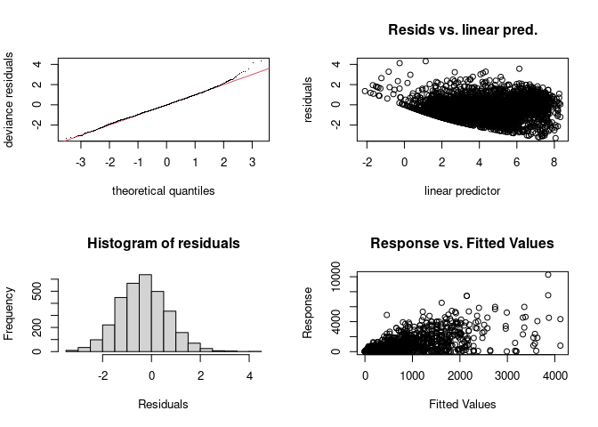<!-- -->

    ## 
    ## Method: REML   Optimizer: outer newton
    ## full convergence after 5 iterations.
    ## Gradient range [-2.14149e-06,0.0006387896]
    ## (score 17420.13 & scale 1).
    ## Hessian positive definite, eigenvalue range [3.451577,1808.794].
    ## Model rank =  91 / 91 
    ## 
    ## Basis dimension (k) checking results. Low p-value (k-index<1) may
    ## indicate that k is too low, especially if edf is close to k'.
    ## 
    ##                                          k'   edf k-index p-value    
    ## s(disease_week):speciesCulex pipiens  14.00  9.68     0.8  <2e-16 ***
    ## s(disease_week):speciesCulex tarsalis 14.00 13.13     0.8  <2e-16 ***
    ## s(site_name)                          59.00 56.16      NA      NA    
    ## ---
    ## Signif. codes:  0 '***' 0.001 '**' 0.01 '*' 0.05 '.' 0.1 ' ' 1

K 15 is slightly better

Considering that the best AIC is when we use “by” and have totally
independent fits, I think its best to move forward with species-specific
gams.

# Trap_type: Urban only, with paired trap types:

“Within Urban sites, does trap type affect abundance? fit the model on
Urban observations only”

Analyze only sites with both trap types present to avoid confounding
trap effects with site/urbanization effects.

``` r
# Identify sites with BOTH trap types

paired_sites <- combined %>%
  group_by(site_name) %>%
  summarize(
    n_traps = n_distinct(trap_type),
    .groups = "drop"
  ) %>%
  filter(n_traps == 2) %>%
  pull(site_name)

paired_sites
```

    ## [1] Downington Ave     Fire Station 13    Fire Station 2     Fire Station 4    
    ## [5] Fire Station 5     Fire Station 6     Fire Station 8     Hogle Zoo         
    ## [9] Nibley Golf Course
    ## 59 Levels: 1700 E Church 300 E Church 700 S 200 W ... Wingpointe

## Cx. pipiens abundance by trap type Urban

``` r
# pull out pipiens
pipiens <- combined[combined$species == "Culex pipiens",]
head(pipiens$site_name)
```

    ## [1] 1700 E Church 1700 E Church 1700 E Church 1700 E Church 1700 E Church
    ## [6] 1700 E Church
    ## 59 Levels: 1700 E Church 300 E Church 700 S 200 W ... Wingpointe

``` r
urban_pip <- pipiens %>%
  filter(
    urbanization == "urban",
    site_name %in% paired_sites
  )

table(urban_pip$trap_type)
```

    ## 
    ##  CO2 GRVD 
    ##  148  155

``` r
length(unique(urban_pip$site_name))
```

    ## [1] 9

``` r
# Model 1: Single spline
# Models a universal pattern in time and allows the magnitude to vary across traps.
urban_pip_gam_offset <- gam(
  count ~ trap_type + 
    s(disease_week, k = 15) + 
    s(site_name, bs = "re"),
  data = urban_pip,
  family = nb(link = "log"),
  method = "REML"
)

# Model 2: factor spline (bs = "fs")
# Fits variable patterns for each group pooled toward a universal pattern, and you don't include a "by =" argument
# The second models a universal pattern plus trap-specific deviations from that pattern.
urban_pip_gam_variable_shape <- gam(
  count ~ trap_type + 
    s(disease_week, k = 15) + 
    s(disease_week, trap_type, bs = "fs", k = 15) + 
    s(site_name, bs = "re"),
  data = urban_pip,
  family = nb(link = "log"),
  method = "REML"
)
```

    ## Warning in gam.side(sm, X, tol = .Machine$double.eps^0.5): model has repeated
    ## 1-d smooths of same variable.

``` r
# Model 3: Independent splines that are not pooled then you use the by = argument to specify the grouping and don't need to include the "bs =" part.
urban_pip_gam_by <- gam(
  count ~ trap_type +
    s(disease_week, by = trap_type, k = 15) + # splines not pooled
    s(site_name, bs = "re"),
  data = urban_pip,
  family = nb(link = "log"),
  method = "REML"
)

AIC(
  urban_pip_gam_offset,
  urban_pip_gam_variable_shape,
  urban_pip_gam_by
)
```

    ##                                    df      AIC
    ## urban_pip_gam_offset         16.08256 2283.583
    ## urban_pip_gam_variable_shape 16.09055 2283.597
    ## urban_pip_gam_by             19.47183 2290.855

``` r
summary(urban_pip_gam_variable_shape)
```

    ## 
    ## Family: Negative Binomial(1.369) 
    ## Link function: log 
    ## 
    ## Formula:
    ## count ~ trap_type + s(disease_week, k = 15) + s(disease_week, 
    ##     trap_type, bs = "fs", k = 15) + s(site_name, bs = "re")
    ## 
    ## Parametric coefficients:
    ##               Estimate Std. Error z value Pr(>|z|)    
    ## (Intercept)     3.1136     0.1699   18.33  < 2e-16 ***
    ## trap_typeGRVD  -0.7288     0.1055   -6.91 4.85e-12 ***
    ## ---
    ## Signif. codes:  0 '***' 0.001 '**' 0.01 '*' 0.05 '.' 0.1 ' ' 1
    ## 
    ## Approximate significance of smooth terms:
    ##                                edf Ref.df  Chi.sq p-value    
    ## s(disease_week)           5.186180  6.456 132.643  <2e-16 ***
    ## s(disease_week,trap_type) 0.001344 27.000   0.001   0.464    
    ## s(site_name)              7.158565  8.000  71.503  <2e-16 ***
    ## ---
    ## Signif. codes:  0 '***' 0.001 '**' 0.01 '*' 0.05 '.' 0.1 ' ' 1
    ## 
    ## R-sq.(adj) =  0.321   Deviance explained = 47.5%
    ## -REML = 1150.7  Scale est. = 1         n = 298

For Cx. pipiens, I think Model 1 with offset spline is best, but not too
different from Model 2, so since it overlaps with Cx. tar’s best, should
we go with that?

## Cx. tarsalis abundance by trap type Urban

``` r
# pull out tarsalis
tarsalis <- combined[combined$species == "Culex tarsalis",]
head(tarsalis$site_name)
```

    ## [1] 1700 E Church 1700 E Church 1700 E Church 1700 E Church 1700 E Church
    ## [6] 1700 E Church
    ## 59 Levels: 1700 E Church 300 E Church 700 S 200 W ... Wingpointe

``` r
urban_tar <- tarsalis %>%
  filter(
    urbanization == "urban",
    site_name %in% paired_sites
  )

table(urban_tar$trap_type)
```

    ## 
    ##  CO2 GRVD 
    ##  153   51

``` r
length(unique(urban_tar$site_name))
```

    ## [1] 9

``` r
# Model 1: Single spline
# Models a universal pattern in time and allows the magnitude to vary across traps.
urban_tar_gam_offset <- gam(
  count ~ trap_type + 
    s(disease_week, k = 15) + 
    s(site_name, bs = "re"),
  data = urban_tar,
  family = nb(link="log"),
  method = "REML"
)

# Model 2: factor spline (bs = "fs")
# Fits variable patterns for each group pooled toward a universal pattern, and you don't include a "by =" argument
# The second models a universal pattern plus trap-specific deviations from that pattern.
urban_tar_gam_variable_shape <- gam(
  count ~ trap_type + 
    s(disease_week, k = 15) + 
    s(disease_week, trap_type, bs = "fs", k = 15) + 
    s(site_name, bs = "re"),
  data = urban_tar,
  family = nb(link="log"),
  method = "REML"
)
```

    ## Warning in gam.side(sm, X, tol = .Machine$double.eps^0.5): model has repeated
    ## 1-d smooths of same variable.

``` r
# Model 3: Independent splines that are not pooled then you use the by = argument to specify the grouping and don't need to include the "bs =" part.
urban_tar_gam_by <- gam(
  count ~ trap_type +
    s(disease_week, by = trap_type, k = 15) + # splines not pooled
    s(site_name, bs = "re"),
  data = urban_tar,
  family = nb(link="log"),
  method = "REML"
)

AIC(
  urban_tar_gam_offset,
  urban_tar_gam_variable_shape,
  urban_tar_gam_by
)
```

    ##                                    df      AIC
    ## urban_tar_gam_offset         18.16545 1425.254
    ## urban_tar_gam_variable_shape 20.61239 1418.779
    ## urban_tar_gam_by             24.18511 1398.840

``` r
summary(urban_tar_gam_variable_shape)
```

    ## 
    ## Family: Negative Binomial(1.26) 
    ## Link function: log 
    ## 
    ## Formula:
    ## count ~ trap_type + s(disease_week, k = 15) + s(disease_week, 
    ##     trap_type, bs = "fs", k = 15) + s(site_name, bs = "re")
    ## 
    ## Parametric coefficients:
    ##               Estimate Std. Error z value Pr(>|z|)    
    ## (Intercept)     3.0517     0.2238   13.63   <2e-16 ***
    ## trap_typeGRVD  -2.6887     0.2366  -11.37   <2e-16 ***
    ## ---
    ## Signif. codes:  0 '***' 0.001 '**' 0.01 '*' 0.05 '.' 0.1 ' ' 1
    ## 
    ## Approximate significance of smooth terms:
    ##                             edf Ref.df Chi.sq  p-value    
    ## s(disease_week)           4.714  5.808  5.475 0.449352    
    ## s(disease_week,trap_type) 2.916 27.000 12.561 0.000763 ***
    ## s(site_name)              7.146  8.000 58.084  < 2e-16 ***
    ## ---
    ## Signif. codes:  0 '***' 0.001 '**' 0.01 '*' 0.05 '.' 0.1 ' ' 1
    ## 
    ## R-sq.(adj) =  0.329   Deviance explained = 62.5%
    ## -REML = 716.34  Scale est. = 1         n = 185

For Cx. tarsalis, Model 3 with independent splines is best, but not too
different from Model 2, so since it matches Cx. pip’s best, should we go
with that?

## Smooths plots by trap type

Plot with a secondary y-axis with a scaling factor between trap types.
This is easiest if you rescale only the GRVD predictions for plotting,
but label the right axis back in GRVD units.

``` r
# Colors by species, same as before
cols <- c(
  "Culex pipiens"  = "#1bc8ea",
  "Culex tarsalis" = "#FF2DA0"
)

# Helper function for urban trap-type GAMs
predict_urban_trap_gam <- function(model, data, species_label) {
  
  newdata <- expand.grid(
    disease_week = seq(
      min(data$disease_week, na.rm = TRUE),
      max(data$disease_week, na.rm = TRUE),
      by = 1
    ),
    trap_type = levels(data$trap_type),
    site_name = levels(data$site_name)[1]
  )
  
  newdata$trap_type <- factor(newdata$trap_type, levels = levels(data$trap_type))
  newdata$site_name <- factor(newdata$site_name, levels = levels(data$site_name))
  
  pred <- predict(
    model,
    newdata = newdata,
    type = "link",
    se.fit = TRUE,
    exclude = "s(site_name)"
  )
  
  newdata %>%
    mutate(
      species = species_label,
      fit_link = pred$fit,
      se_link = pred$se.fit,
      fit = exp(fit_link),
      lower = exp(fit_link - 1.96 * se_link),
      upper = exp(fit_link + 1.96 * se_link)
    )
}

# Predictions from both urban models
pred_urban_trap <- bind_rows(
  predict_urban_trap_gam(
    urban_pip_gam_variable_shape,
    urban_pip,
    "Culex pipiens"
  ),
  predict_urban_trap_gam(
    urban_tar_gam_variable_shape,
    urban_tar,
    "Culex tarsalis"
  )
)
```

    ## Warning in predict.gam(model, newdata = newdata, type = "link", se.fit = TRUE,
    ## : factor levels 1700 E Church not in original fit
    ## Warning in predict.gam(model, newdata = newdata, type = "link", se.fit = TRUE,
    ## : factor levels 1700 E Church not in original fit

``` r
# Split predictions by trap type to calculate scale factor
co2_range <- pred_urban_trap %>%
  filter(trap_type == "CO2") %>%
  summarize(max_fit = max(upper, na.rm = TRUE)) %>%
  pull(max_fit)

grvd_range <- pred_urban_trap %>%
  filter(trap_type == "GRVD") %>%
  summarize(max_fit = max(upper, na.rm = TRUE)) %>%
  pull(max_fit)

scale_factor <- co2_range / grvd_range

scale_by_species <- pred_urban_trap %>%
  group_by(species) %>%
  summarize(
    co2_max = max(upper[trap_type == "CO2"], na.rm = TRUE),
    grvd_max = max(upper[trap_type == "GRVD"], na.rm = TRUE),
    scale_factor = co2_max / grvd_max,
    .groups = "drop"
  )

pred_urban_trap_plot <- pred_urban_trap %>%
  left_join(scale_by_species, by = "species") %>%
  mutate(
    fit_plot   = ifelse(trap_type == "GRVD", fit * scale_factor, fit),
    lower_plot = ifelse(trap_type == "GRVD", lower * scale_factor, lower),
    upper_plot = ifelse(trap_type == "GRVD", upper * scale_factor, upper)
  )

library(dplyr)
library(ggplot2)
library(patchwork)
```

    ## 
    ## Attaching package: 'patchwork'

    ## The following object is masked from 'package:MASS':
    ## 
    ##     area

``` r
plot_species_panel <- function(pred_df, species_name, show_legend = TRUE) {
  
  dat <- pred_df %>%
    filter(species == species_name)
  
  scale_factor <- dat %>%
    summarize(
      co2_max = max(upper[trap_type == "CO2"], na.rm = TRUE),
      grvd_max = max(upper[trap_type == "GRVD"], na.rm = TRUE),
      scale_factor = co2_max / grvd_max
    ) %>%
    pull(scale_factor)
  
  dat <- dat %>%
    mutate(
      fit_plot   = ifelse(trap_type == "GRVD", fit * scale_factor, fit),
      lower_plot = ifelse(trap_type == "GRVD", lower * scale_factor, lower),
      upper_plot = ifelse(trap_type == "GRVD", upper * scale_factor, upper)
    )
  
  ggplot(
    dat,
    aes(
      x = disease_week,
      y = fit_plot,
      color = species,
      fill = species,
      linetype = trap_type
    )
  ) +
    geom_ribbon(
      aes(
        ymin = lower_plot,
        ymax = upper_plot,
        group = interaction(species, trap_type)
      ),
      alpha = 0.18,
      color = NA
    ) +
    geom_line(
  aes(
    group = interaction(species, trap_type),
    linewidth = trap_type
  )
) +
scale_linewidth_manual(
  values = c(
    "CO2" = 0.8,
    "GRVD" = 1.5
  ),
  guide = "none"
) +
    geom_vline(
      xintercept = 33,
      linetype = "dashed",
      color = "black",
      linewidth = 0.5
    ) +
    annotate(
      "text",
      x = 33,
      y = Inf,
      label = "1st WNV cases",
      vjust = 1,
      hjust = -0.07,
      size = 3
    ) +
    scale_color_manual(
      values = cols,
      limits = names(cols),
      drop = FALSE
    ) +
    scale_fill_manual(
      values = cols,
      limits = names(cols),
      drop = FALSE
    ) +
    scale_y_continuous(
      name = "Predicted: CO2",
      sec.axis = sec_axis(
        trans = ~ . / scale_factor,
        name = "Predicted: GRVD"
      )
    ) +
    guides(
      color = guide_legend(
        order = 1,
        override.aes = list(
          linetype = "solid",
          linewidth = 1.2,
          alpha = .75
        )
      ),
      fill = "none",
      linetype = guide_legend(order = 2)
    ) +
    labs(
      title = NULL,
      x = "Disease week",
      color = "Species",
      fill = "Species",
      linetype = "Trap type"
    ) +
    theme_classic() +
    theme(
      legend.position = ifelse(show_legend, "right", "none"),
      plot.title = element_blank(),
      strip.background = element_blank(),
      strip.text = element_text(size = 12)
    )
}

plot_pip <- plot_species_panel(
  pred_urban_trap,
  "Culex pipiens",
  show_legend = TRUE
)
```

    ## Warning: The `trans` argument of `sec_axis()` is deprecated as of ggplot2 3.5.0.
    ## ℹ Please use the `transform` argument instead.
    ## This warning is displayed once every 8 hours.
    ## Call `lifecycle::last_lifecycle_warnings()` to see where this warning was
    ## generated.

``` r
plot_tar <- plot_species_panel(
  pred_urban_trap,
  "Culex tarsalis",
  show_legend = FALSE
)

combined_plot <- wrap_plots(
  plot_pip,
  plot_tar,
  ncol = 1
) +
  plot_annotation(
    title = "Urban predicted count by trap type"
  ) &
  theme(
    plot.title = element_text(hjust = 0.5)
  )

combined_plot
```

<!-- -->

## Interpretation

**Cx. pipiens:**

- Estimated GRVD effect was -0.72 in the paired urban-only model

- GRVD traps caught approximately half of the abundance caught in CO2
  traps

  - exp(-0.72) = 0.49

- The shape of the seasonal smooth was very very similar among trap
  types, so I think using the same smooth for both trap types (trap type
  = fixed effect), works well for Cx. pipiens.

**Cx. tarsalis:**

- Estimated GRVD effect was -2.6898 in paired urban-only model.

- GRVD traps caught approximately 7% of the abundance caught in CO2
  traps.

  - exp(-2.6898) = 0.0678 (6.78%)

- It also looks like for tarsalis, the GRVD trap counts being low enough
  to potentially not reliable capture the full seasonal smooth, so we
  should try to visualize with CO2 traps wherever possible.

# Species-Specific GAM

separate models for each species, count by urbanization + trap_type
(random effect = site name)

## Cx. pipiens GAM

``` r
# pull out pipiens
pipiens <- combined %>%
  filter(species == "Culex pipiens") %>%
  droplevels()


# Model 2: factor spline (bs = "fs")
# Fits variable patterns for each group pooled toward a universal pattern, and you don't include a "by =" argument
# The second models a universal pattern plus trap-specific deviations from that pattern.
pip_gam <- gam(
  count ~ urbanization + trap_type + 
    # s(disease_week, k = 15) +   ## Remove in final?
    s(disease_week, urbanization, bs = "fs", k = 15, m = 3) + 
    s(site_name, bs = "re"),
  data = pipiens,
  family = nb(link = "log"),
  method = "REML"
)
```

### Check smooths: pipiens

``` r
#Summary of GAM fit
summary(pip_gam)
```

    ## 
    ## Family: Negative Binomial(1.077) 
    ## Link function: log 
    ## 
    ## Formula:
    ## count ~ urbanization + trap_type + s(disease_week, urbanization, 
    ##     bs = "fs", k = 15, m = 3) + s(site_name, bs = "re")
    ## 
    ## Parametric coefficients:
    ##                   Estimate Std. Error z value Pr(>|z|)    
    ## (Intercept)         5.2307     0.2567  20.375  < 2e-16 ***
    ## urbanizationperi    0.8945     0.3762   2.378  0.01742 *  
    ## urbanizationurban  -1.0560     0.3692  -2.860  0.00423 ** 
    ## trap_typeGRVD      -0.6729     0.1123  -5.990  2.1e-09 ***
    ## ---
    ## Signif. codes:  0 '***' 0.001 '**' 0.01 '*' 0.05 '.' 0.1 ' ' 1
    ## 
    ## Approximate significance of smooth terms:
    ##                                edf Ref.df Chi.sq p-value    
    ## s(disease_week,urbanization) 20.91     42 1770.0  <2e-16 ***
    ## s(site_name)                 49.79     56  537.1  <2e-16 ***
    ## ---
    ## Signif. codes:  0 '***' 0.001 '**' 0.01 '*' 0.05 '.' 0.1 ' ' 1
    ## 
    ## R-sq.(adj) =  0.472   Deviance explained = 67.7%
    ## -REML = 6261.5  Scale est. = 1         n = 1383

``` r
#AIC for 
cat("GAM model pip AIC: ", AIC(pip_gam), "\n")
```

    ## GAM model pip AIC:  12396.27

``` r
#Check if smooths are hitting their basis limits
gam.check(pip_gam)
```

<!-- -->

    ## 
    ## Method: REML   Optimizer: outer newton
    ## full convergence after 9 iterations.
    ## Gradient range [-0.02244841,0.0009738964]
    ## (score 6261.539 & scale 1).
    ## Hessian positive definite, eigenvalue range [0.01415095,716.0627].
    ## Model rank =  108 / 108 
    ## 
    ## Basis dimension (k) checking results. Low p-value (k-index<1) may
    ## indicate that k is too low, especially if edf is close to k'.
    ## 
    ##                                k'  edf k-index p-value
    ## s(disease_week,urbanization) 45.0 20.9    0.92    0.64
    ## s(site_name)                 59.0 49.8      NA      NA

``` r
# plot the smooths for pip
plot(pip_gam, select = 1, shade = TRUE, main = "GAM Smooth for pip x rural")
```

<!-- -->

``` r
plot(pip_gam, select = 2, shade = TRUE, main = "GAM Smooth for pip x peri")
```

<!-- -->

``` r
plot(pip_gam, select = 3, shade = TRUE, main = "GAM Smooth for pip x urban")
```

### Map residuals: pipiens

``` r
# Make a list of coordinates
site_coords_pip <- pipiens %>%
  dplyr::select(site_name, latitude, longitude) %>%
  distinct()

# Extract data actually used in the model
# Add coordinates and residuals
pipiens_data_res <- model.frame(pip_gam) %>%
  mutate(resid = residuals(pip_gam, type = "pearson")) %>%
  left_join(site_coords_pip, by = "site_name")

# Transform to make it easier to see spatial patterns
pipiens_data_res$resid_log <- log10(pipiens_data_res$resid + 2)

# plot by lat/long
ggplot(pipiens_data_res, aes(x = longitude, y = latitude, color = resid_log)) +
  geom_point(size = 3) +
  coord_fixed() +
  scale_color_viridis_c() +
  theme_minimal()
```

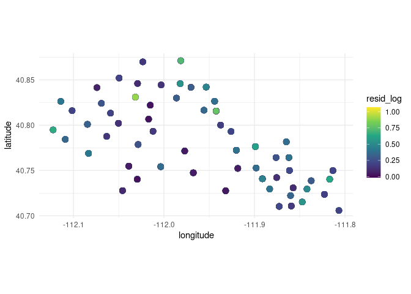<!-- -->

### Weekly residuals: pipiens

``` r
# Plot residuals by disease week

ggplot(pipiens_data_res,
       aes(x = disease_week, y = resid)) +
  geom_point(alpha = 0.5) +
  geom_smooth(se = FALSE, color = "blue") +
  theme_bw()
```

    ## `geom_smooth()` using method = 'gam' and formula = 'y ~ s(x, bs = "cs")'

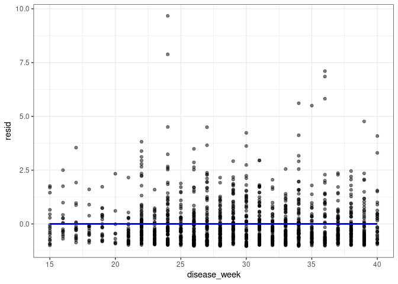<!-- -->

``` r
#residual distributions for each week separately
ggplot(pipiens_data_res,
       aes(x = factor(disease_week), y = resid)) +
  geom_boxplot() +
  theme_bw() +
  labs(
    x = "Disease Week",
    y = "Pearson Residuals",
    title = "Residual Distribution by Week - pipiens"
  )
```

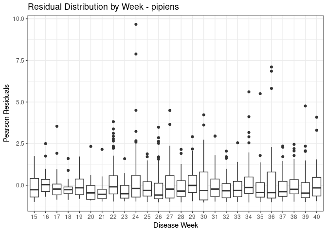<!-- -->

### DHARMa: pip

``` r
# pipiens
sim_pip <- simulateResiduals(pip_gam, n = 1000)
plot(sim_pip)
```

    ## Warning in newton(lsp = lsp, X = G$X, y = G$y, Eb = G$Eb, UrS = G$UrS, L = G$L,
    ## : Fitting terminated with step failure - check results carefully

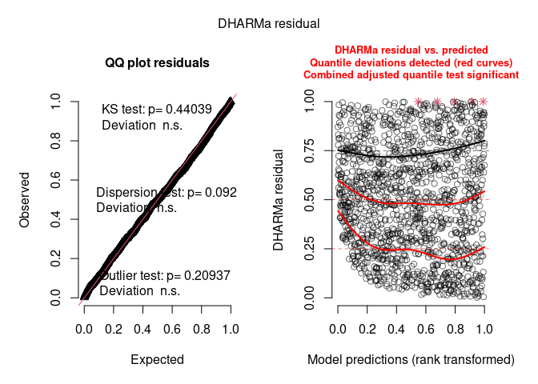<!-- -->

``` r
testDispersion(sim_pip)
```

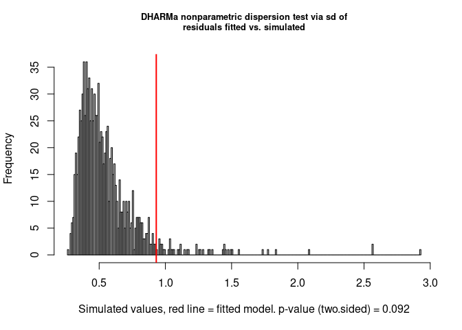<!-- -->

    ## 
    ##  DHARMa nonparametric dispersion test via sd of residuals fitted vs.
    ##  simulated
    ## 
    ## data:  simulationOutput
    ## dispersion = 1.6919, p-value = 0.092
    ## alternative hypothesis: two.sided

``` r
# Aggregate DHARMa residuals by site for pipiens
sim_pip_site <- recalculateResiduals(
  sim_pip,
  group = pipiens$site_name
)

site_coords_pip <- pipiens %>%
  dplyr::select(site_name, latitude, longitude) %>%
  distinct() %>%
  arrange(site_name)

testSpatialAutocorrelation(
  sim_pip_site,
  x = site_coords_pip$longitude,
  y = site_coords_pip$latitude
)
```

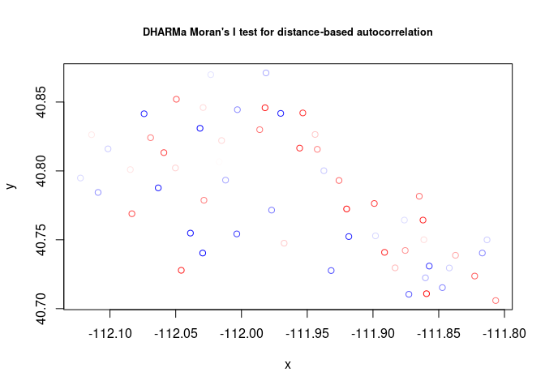<!-- -->

    ## 
    ##  DHARMa Moran's I test for distance-based autocorrelation
    ## 
    ## data:  sim_pip_site
    ## observed = -0.029981, expected = -0.017241, sd = 0.021936, p-value =
    ## 0.5614
    ## alternative hypothesis: Distance-based autocorrelation

## Cx. tarsalis GAM

``` r
# pull out tarsalis
tarsalis <- combined %>%
  filter(species == "Culex tarsalis") %>%
  droplevels() 

# Model 2: factor spline (bs = "fs")
# Fits variable patterns for each group pooled toward a universal pattern, and you don't include a "by =" argument
# The second models a universal pattern plus trap-specific deviations from that pattern.
tar_gam <- gam(
  count ~ urbanization + trap_type + 
    # s(disease_week, k = 15) +   ## Remove in final?
    s(disease_week, urbanization, bs = "fs", k = 15, m = 3) + 
    s(site_name, bs = "re"),
  data = tarsalis,
  family = nb(link = "log"),
  method = "REML"
)
```

### Check smooths: tarsalis

``` r
#Summary of GAM fit
summary(tar_gam)
```

    ## 
    ## Family: Negative Binomial(1.024) 
    ## Link function: log 
    ## 
    ## Formula:
    ## count ~ urbanization + trap_type + s(disease_week, urbanization, 
    ##     bs = "fs", k = 15, m = 3) + s(site_name, bs = "re")
    ## 
    ## Parametric coefficients:
    ##                   Estimate Std. Error z value Pr(>|z|)    
    ## (Intercept)         6.3630     0.1317  48.319   <2e-16 ***
    ## urbanizationperi   -0.6115     0.2124  -2.878    0.004 ** 
    ## urbanizationurban  -3.0975     0.2134 -14.512   <2e-16 ***
    ## trap_typeGRVD      -2.7216     0.2045 -13.309   <2e-16 ***
    ## ---
    ## Signif. codes:  0 '***' 0.001 '**' 0.01 '*' 0.05 '.' 0.1 ' ' 1
    ## 
    ## Approximate significance of smooth terms:
    ##                                edf Ref.df Chi.sq p-value    
    ## s(disease_week,urbanization) 32.37     42 4253.5  <2e-16 ***
    ## s(site_name)                 43.30     53  515.7  <2e-16 ***
    ## ---
    ## Signif. codes:  0 '***' 0.001 '**' 0.01 '*' 0.05 '.' 0.1 ' ' 1
    ## 
    ## R-sq.(adj) =  0.537   Deviance explained = 70.9%
    ## -REML =  10894  Scale est. = 1         n = 1733

``` r
#AIC for 
cat("GAM model tar AIC: ", AIC(tar_gam), "\n")
```

    ## GAM model tar AIC:  21605.93

``` r
#Check if smooths are hitting their basis limits
gam.check(tar_gam)
```

<!-- -->

    ## 
    ## Method: REML   Optimizer: outer newton
    ## full convergence after 6 iterations.
    ## Gradient range [-0.0001749103,0.0004626036]
    ## (score 10894.48 & scale 1).
    ## Hessian positive definite, eigenvalue range [0.0001748798,971.865].
    ## Model rank =  105 / 105 
    ## 
    ## Basis dimension (k) checking results. Low p-value (k-index<1) may
    ## indicate that k is too low, especially if edf is close to k'.
    ## 
    ##                                k'  edf k-index p-value    
    ## s(disease_week,urbanization) 45.0 32.4    0.85  <2e-16 ***
    ## s(site_name)                 56.0 43.3      NA      NA    
    ## ---
    ## Signif. codes:  0 '***' 0.001 '**' 0.01 '*' 0.05 '.' 0.1 ' ' 1

``` r
# plot the smooths for tar
plot(tar_gam, select = 1, shade = TRUE, main = "GAM Smooth for tar x rural")
```

<!-- -->

``` r
plot(tar_gam, select = 2, shade = TRUE, main = "GAM Smooth for tar x peri")
```

<!-- -->

``` r
plot(tar_gam, select = 3, shade = TRUE, main = "GAM Smooth for tar x urban")
```

### Map residuals: tarsalis

``` r
# Make a list of coordinates
site_coords_tar <- tarsalis %>%
  dplyr::select(site_name, latitude, longitude) %>%
  distinct()

# Extract data actually used in the model
# Add coordinates and residuals
tarsalis_data_res <- model.frame(tar_gam) %>%
  mutate(resid = residuals(tar_gam, type = "pearson")) %>%
  left_join(site_coords_tar, by = "site_name")

# Transform to make it easier to see spatial patterns
tarsalis_data_res$resid_log <- log10(tarsalis_data_res$resid + 2)

# plot by lat/long
ggplot(tarsalis_data_res, aes(x = longitude, y = latitude, color = resid_log)) +
  geom_point(size = 3) +
  coord_fixed() +
  scale_color_viridis_c() +
  theme_minimal()
```

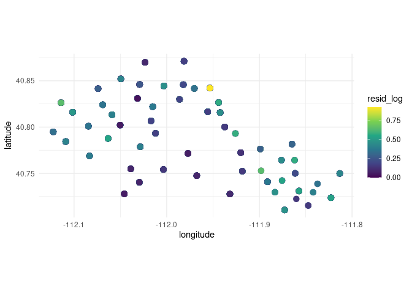<!-- -->

### Weekly residuals: tarsalis

``` r
# Plot residuals by disease week

ggplot(tarsalis_data_res,
       aes(x = disease_week, y = resid)) +
  geom_point(alpha = 0.5) +
  geom_smooth(se = FALSE, color = "blue") +
  theme_bw()
```

    ## `geom_smooth()` using method = 'gam' and formula = 'y ~ s(x, bs = "cs")'

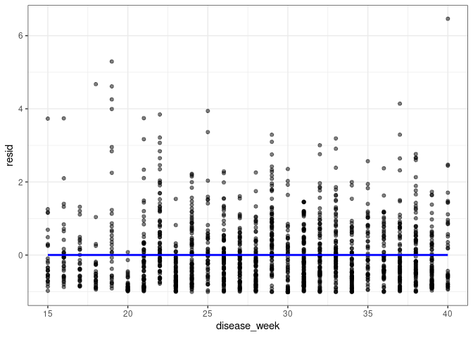<!-- -->

``` r
#residual distributions for each week separately
ggplot(tarsalis_data_res,
       aes(x = factor(disease_week), y = resid)) +
  geom_boxplot() +
  theme_bw() +
  labs(
    x = "Disease Week",
    y = "Pearson Residuals",
    title = "Residual Distribution by Week - tarsalis"
  )
```

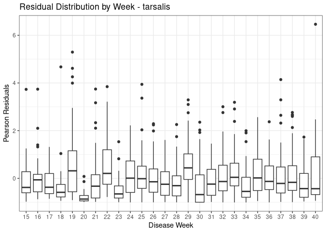<!-- -->

### DHARMa: tarsalis

``` r
# tarsalis
sim_tar <- simulateResiduals(tar_gam, n = 1000)
plot(sim_tar)
```

    ## Warning in newton(lsp = lsp, X = G$X, y = G$y, Eb = G$Eb, UrS = G$UrS, L = G$L,
    ## : Fitting terminated with step failure - check results carefully

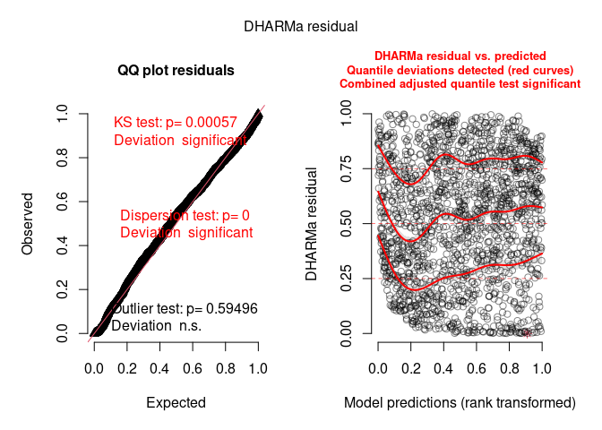<!-- -->

``` r
testDispersion(sim_tar)
```

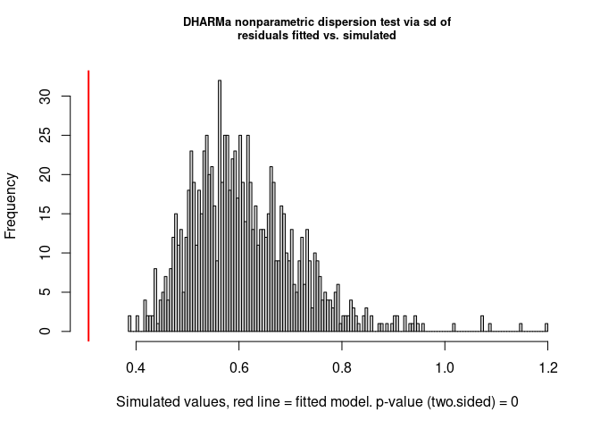<!-- -->

    ## 
    ##  DHARMa nonparametric dispersion test via sd of residuals fitted vs.
    ##  simulated
    ## 
    ## data:  simulationOutput
    ## dispersion = 0.50409, p-value < 2.2e-16
    ## alternative hypothesis: two.sided

``` r
# Aggregate DHARMa residuals by site for tarsalis
sim_tar_site <- recalculateResiduals(
  sim_tar,
  group = tarsalis$site_name
)

site_coords_tar <- tarsalis %>%
  dplyr::select(site_name, latitude, longitude) %>%
  distinct() %>%
  arrange(site_name)

testSpatialAutocorrelation(
  sim_tar_site,
  x = site_coords_tar$longitude,
  y = site_coords_tar$latitude
)
```

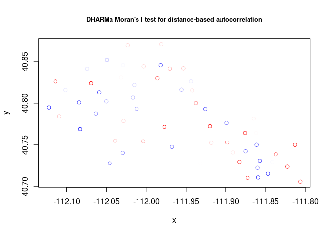<!-- -->

    ## 
    ##  DHARMa Moran's I test for distance-based autocorrelation
    ## 
    ## data:  sim_tar_site
    ## observed = -0.014743, expected = -0.017544, sd = 0.021839, p-value =
    ## 0.8979
    ## alternative hypothesis: Distance-based autocorrelation

``` r
# check whether very large counts are dominating the fit:
ggplot(tarsalis, aes(x = count)) +
  geom_histogram(bins = 50) +
  scale_x_log10() +
  theme_bw()
```

    ## Warning: Removed 41 rows containing non-finite outside the scale range
    ## (`stat_bin()`).

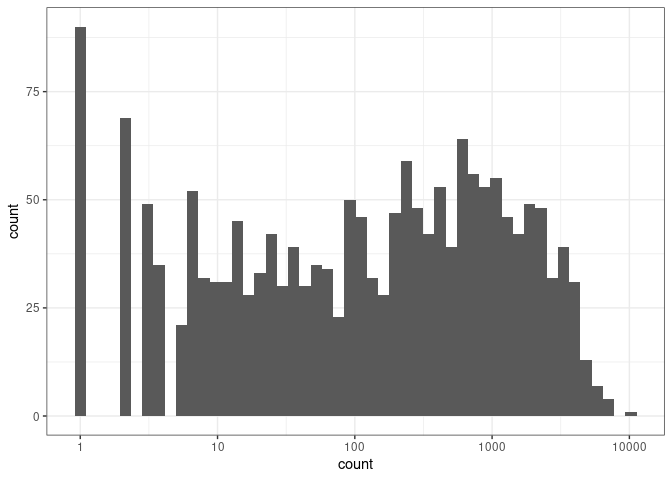<!-- -->

``` r
# Is underdispersion trap-specific?
tarsalis_data_res <- model.frame(tar_gam) %>%
  mutate(
    resid = residuals(tar_gam, type = "pearson"),
    fitted = fitted(tar_gam)
  )

ggplot(tarsalis_data_res, aes(x = trap_type, y = resid)) +
  geom_boxplot() +
  theme_bw()
```

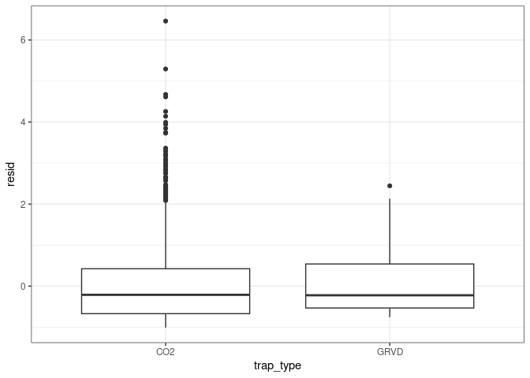<!-- -->

``` r
ggplot(tarsalis_data_res, aes(x = urbanization, y = resid)) +
  geom_boxplot() +
  theme_bw()
```

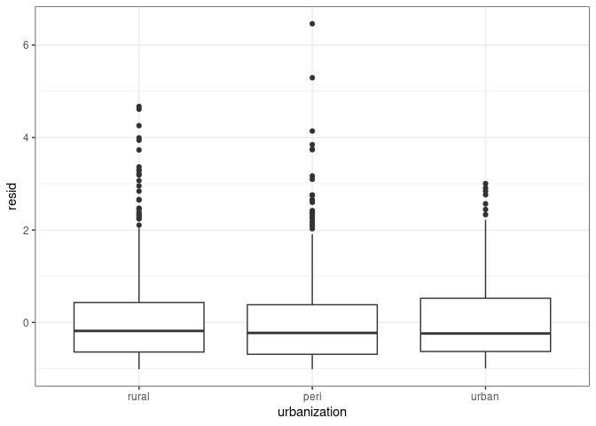<!-- -->

``` r
tarsalis_data_res <- model.frame(tar_gam) %>%
  mutate(
    fitted = fitted(tar_gam)
  )
```

Something strange is happening with tarsalis model, with failed
dispersion test when we use.DHARMa nonparametric dispersion test via sd
of residuals fitted vs. simulated:  
- smooth: m=3, k=25  
- data: simulationOutput  
- dispersion = 0.48346, p-value \< 2.2e-16  
- alternative hypothesis: two.sided

Is this DHARMa is reacting to strong structured signal repeated
measures, high explanatory power?

# Plot pip vs. tar from separate models

### Effect size (forest) plot from separate models

``` r
coef_pip <- tidy(pip_gam, parametric = TRUE) %>%
  filter(term != "(Intercept)") %>%
  mutate(species = "Culex pipiens")

coef_tar <- tidy(tar_gam, parametric = TRUE) %>%
  filter(term != "(Intercept)") %>%
  mutate(species = "Culex tarsalis")

coef_df_sep <- bind_rows(coef_pip, coef_tar) %>%
  mutate(
    effect = exp(estimate),
    lower = exp(estimate - 1.96 * std.error),
    upper = exp(estimate + 1.96 * std.error),
    term_clean = recode(
      term,
      "urbanizationperi" = "Peri relative to rural",
      "urbanizationurban" = "Urban relative to rural",
      "trap_typeGRVD" = "GRVD relative to CO2"
    )
  )

ggplot(coef_df_sep, aes(x = effect, y = term_clean, color = species)) +
  geom_point(position = position_dodge(width = 0.6), size = 3) +
  geom_errorbarh(
    aes(xmin = lower, xmax = upper),
    position = position_dodge(width = 0.6),
    height = 0.2
  ) +
  geom_vline(xintercept = 1, linetype = "dashed") +
  scale_x_log10() +
  scale_color_manual(values = cols) +
  labs(
    x = "Multiplicative effect on abundance (log scale)",
    y = "",
    color = "Species",
    title = "Effect sizes from species-specific GAMs"
  ) +
  theme_minimal()
```

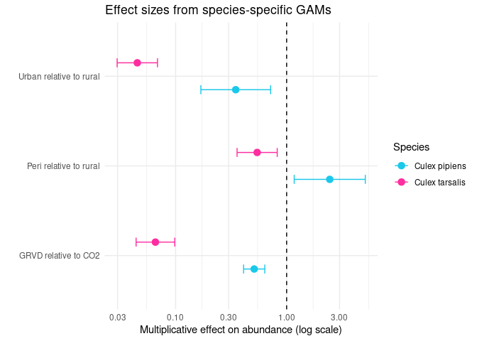<!-- -->

### Seasonal Smooth from all models

``` r
cols <- c(
  "Culex pipiens"  = "#1bc8ea",
  "Culex tarsalis" = "#FF2DA0"
)

predict_species_gam <- function(model, newdata, species_label) {
  
  newdata$urbanization <- factor(newdata$urbanization, levels = levels(combined$urbanization))
  newdata$trap_type <- factor(newdata$trap_type, levels = levels(combined$trap_type))
  newdata$site_name <- factor(newdata$site_name, levels = levels(combined$site_name))
  
  pred <- predict(
    model,
    newdata = newdata,
    type = "link",
    se.fit = TRUE,
    exclude = "s(site_name)"
  )
  
  newdata %>%
    mutate(
      species = species_label,
      fit_link = pred$fit,
      se_link = pred$se.fit,
      fit = exp(fit_link),
      lower = exp(fit_link - 1.96 * se_link),
      upper = exp(fit_link + 1.96 * se_link)
    )
}
# ----------------------
# 1. Seasonal effects across habitats
# ----------------------

newdata_season <- expand.grid(
  disease_week = seq(min(combined$disease_week), max(combined$disease_week), by = 1),
  urbanization = "rural",
  trap_type = "GRVD",
  site_name = levels(combined$site_name)[1]
)

pred_season <- bind_rows(
  predict_species_gam(pip_gam, newdata_season, "Culex pipiens"),
  predict_species_gam(tar_gam, newdata_season, "Culex tarsalis")
)

ggplot(pred_season, aes(x = disease_week, y = fit, color = species, fill = species)) +
  geom_ribbon(aes(ymin = lower, ymax = upper), alpha = 0.2, color = NA) +
  geom_line(linewidth = 1.2) +
  scale_color_manual(values = cols) +
  scale_fill_manual(values = cols) +
  labs(
    x = "Disease week",
    y = "Predicted abundance",
    color = "Species",
    fill = "Species",
    title = "Predicted seasonal abundance from species-specific GAMs"
  ) +
  theme_minimal()
```

<!-- -->

``` r
# ----------------------
# 2. Predicted abundance by urbanization: CO2 traps
# ----------------------

newdat_site_CO2 <- expand.grid(
  disease_week = seq(min(combined$disease_week), max(combined$disease_week), by = 1),
  urbanization = levels(combined$urbanization),
  trap_type = "CO2",
  site_name = levels(combined$site_name)[1]
)

pred_site_CO2 <- bind_rows(
  predict_species_gam(pip_gam, newdat_site_CO2, "Culex pipiens"),
  predict_species_gam(tar_gam, newdat_site_CO2, "Culex tarsalis")
)

ggplot(pred_site_CO2, aes(x = disease_week, y = fit, color = species, group = species)) +
  geom_line(linewidth = 1.2) +
  geom_ribbon(aes(ymin = lower, ymax = upper, fill = species), alpha = 0.25, color = NA) +
  geom_vline(xintercept = 33, linetype = "dashed", color = "black", linewidth = 0.5) +
  annotate("text", x = 33, y = Inf, label = "1st WNV cases",
           vjust = 1, hjust = -0.07, size = 3) +
  facet_wrap(~ urbanization, scales = "free_y", ncol = 1) +
  scale_color_manual(values = cols) +
  scale_fill_manual(values = cols) +
  labs(
    title = "Predicted abundance from species-specific GAMs (CO2 traps)",
    x = "Disease week",
    y = "Predicted abundance",
    color = "Species",
    fill = "Species"
  ) +
  theme_classic() +
  theme(
    plot.title = element_text(hjust = 0.5),
    strip.background = element_blank(),
    strip.text = element_text(size = 12)
  )
```

<!-- -->

``` r
# ----------------------
# 3. Plot predicted for pipiens/tarsalis on their own to allow pipiens to be visible
# ----------------------
# pipiens only:
ggplot(pred_site_CO2[pred_site_CO2$species=="Culex pipiens",], aes(x = disease_week, y = fit, color = species, group = species)) +
  geom_line(linewidth = 1.2) +
  geom_ribbon(aes(ymin = lower, ymax = upper, fill = species), alpha = 0.25, color = NA) +
  geom_vline(xintercept = 33, linetype = "dashed", color = "black", linewidth = 0.5) +
  annotate("text", x = 33, y = Inf, label = "1st WNV",
           vjust = 1, hjust = -0.07, size = 3) +
  facet_wrap(~ urbanization, scales = "free_y", ncol = 1) +
  scale_color_manual(values = cols) +
  scale_fill_manual(values = cols) +
  labs(
    title = "Predicted abundance from species-specific GAMs (CO2 traps)",
    x = "Disease week",
    y = "Predicted abundance",
    color = "Species",
    fill = "Species"
  ) +
  theme_classic() +
  theme(
    plot.title = element_text(hjust = 0.5),
    strip.background = element_blank(),
    strip.text = element_text(size = 12)
  )
```

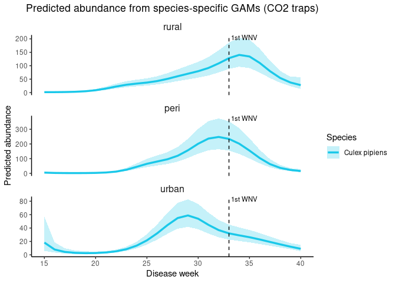<!-- -->

``` r
# tarsalis only
ggplot(pred_site_CO2[pred_site_CO2$species=="Culex tarsalis",], aes(x = disease_week, y = fit, color = species, group = species)) +
  geom_line(linewidth = 1.2) +
  geom_ribbon(aes(ymin = lower, ymax = upper, fill = species), alpha = 0.25, color = NA) +
  geom_vline(xintercept = 33, linetype = "dashed", color = "black", linewidth = 0.5) +
  annotate("text", x = 33, y = Inf, label = "1st WNV",
           vjust = 1, hjust = -0.07, size = 3) +
  facet_wrap(~ urbanization, scales = "free_y", ncol = 1) +
  scale_color_manual(values = cols) +
  scale_fill_manual(values = cols) +
  labs(
    title = "Predicted abundance from species-specific GAMs (CO2 traps)",
    x = "Disease week",
    y = "Predicted abundance",
    color = "Species",
    fill = "Species"
  ) +
  theme_classic() +
  theme(
    plot.title = element_text(hjust = 0.5),
    strip.background = element_blank(),
    strip.text = element_text(size = 12)
  )
```

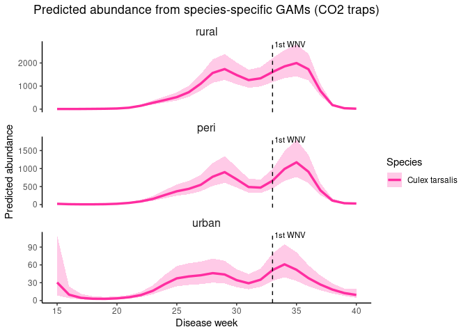<!-- -->

``` r
# ----------------------
# 4. Urbanization effect figure
# ----------------------
newdata_urban <- expand.grid(
  urbanization = levels(combined$urbanization),
  trap_type = "GRVD",
  disease_week = median(combined$disease_week, na.rm = TRUE),
  site_name = levels(combined$site_name)[1]
)

pred_urban <- bind_rows(
  predict_species_gam(pip_gam, newdata_urban, "Culex pipiens"),
  predict_species_gam(tar_gam, newdata_urban, "Culex tarsalis")
) %>%
  mutate(urbanization = factor(urbanization, levels = c("rural", "peri", "urban")))

ggplot(pred_urban, aes(x = urbanization, y = fit, color = species, group = species)) +
  geom_point(position = position_dodge(width = 0.3), size = 3) +
  geom_line(position = position_dodge(width = 0.3), linewidth = 1) +
  geom_errorbar(
    aes(ymin = lower, ymax = upper),
    position = position_dodge(width = 0.3),
    width = 0.2
  ) +
  scale_color_manual(values = cols) +
  labs(
    x = "Urbanization",
    y = "Predicted abundance",
    color = "Species",
    title = "Urbanization effects from species-specific GAMs"
  ) +
  theme_minimal()
```

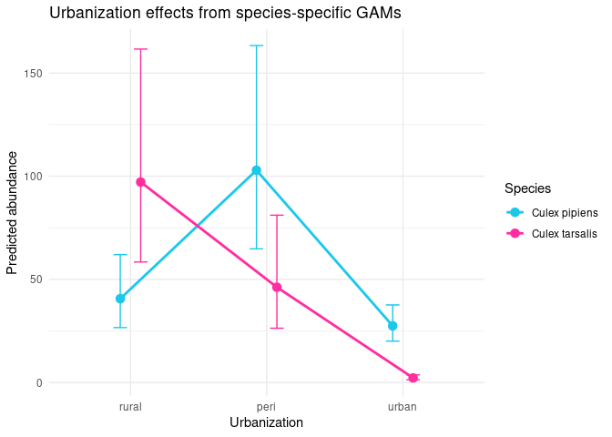<!-- -->

``` r
# ----------------------
# 5. Trap type effect figure
# ----------------------

newdata_trap <- expand.grid(
  urbanization = levels(combined$urbanization),
  trap_type = levels(combined$trap_type),
  disease_week = median(combined$disease_week, na.rm = TRUE),
  site_name = levels(combined$site_name)[1]
)

pred_trap <- bind_rows(
  predict_species_gam(pip_gam, newdata_trap, "Culex pipiens"),
  predict_species_gam(tar_gam, newdata_trap, "Culex tarsalis")
) %>%
  mutate(urbanization = factor(urbanization, levels = c("rural", "peri", "urban")))

ggplot(pred_trap, aes(x = trap_type, y = fit, color = species, group = species)) +
  geom_point(position = position_dodge(width = 0.3), size = 3) +
  geom_line(position = position_dodge(width = 0.3), linewidth = 1) +
  geom_errorbar(
    aes(ymin = lower, ymax = upper),
    position = position_dodge(width = 0.3),
    width = 0.2
  ) +
  facet_wrap(~ urbanization) +
  scale_color_manual(values = cols) +
  labs(
    x = "Trap type",
    y = "Predicted abundance",
    color = "Species",
    title = "Trap type effects from species-specific GAMs"
  ) +
  theme_minimal()
```

<!-- -->

### Plot relative abundance figure

``` r
newdata_rel <- expand.grid(
  urbanization = levels(combined$urbanization),
  disease_week = median(combined$disease_week, na.rm = TRUE),
  trap_type = "CO2",
  site_name = levels(combined$site_name)[1]
)

pred_rel <- bind_rows(
  predict_species_gam(pip_gam, newdata_rel, "Culex pipiens"),
  predict_species_gam(tar_gam, newdata_rel, "Culex tarsalis")
) %>%
  mutate(
    species = factor(species, levels = c("Culex pipiens", "Culex tarsalis")),
    urbanization = factor(urbanization, levels = c("rural", "peri", "urban"))
  ) %>%
  group_by(urbanization) %>%
  mutate(
    prop = fit / sum(fit),
    prop_lower = lower / sum(upper),
    prop_upper = upper / sum(lower),
    prop_lower = pmax(0, prop_lower),
    prop_upper = pmin(1, prop_upper)
  ) %>%
  ungroup()

ggplot(pred_rel, aes(x = urbanization, y = prop, color = species, group = species)) +
  geom_point(size = 4) +
  geom_line(linewidth = 1) +
  geom_errorbar(
    aes(ymin = prop_lower, ymax = prop_upper),
    width = 0.1
  ) +
  scale_color_manual(values = cols) +
  scale_y_continuous(limits = c(0, 1)) +
  labs(
    x = "Urbanization",
    y = "Relative abundance",
    color = NULL,
    title = "Predicted relative abundance (CO2 traps)") +
  theme_classic() +
  theme(
    legend.position = "right",
    plot.title = element_text(hjust = 0.5)
  )
```

<!-- -->
