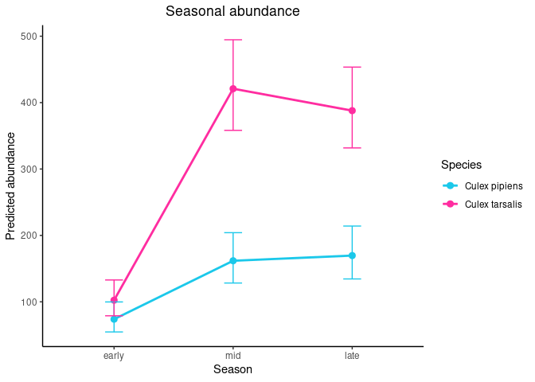
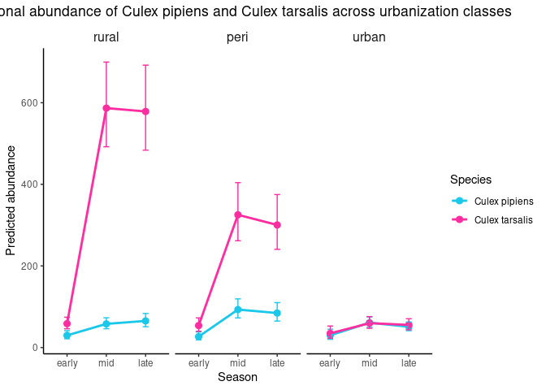
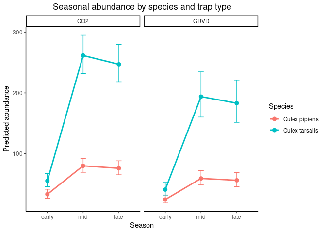
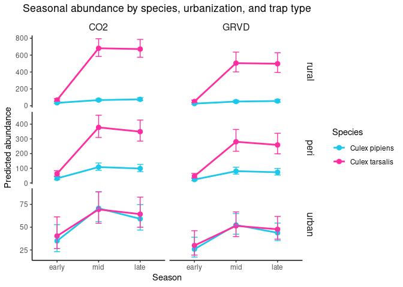
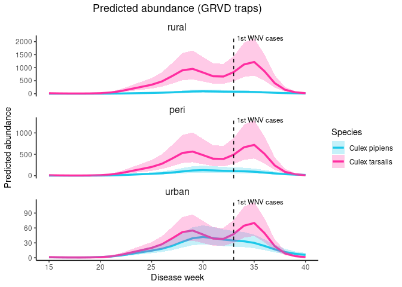
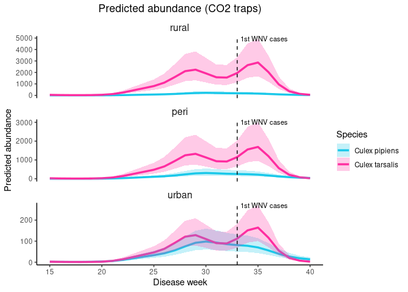

GAM **Cx. pipiens** and **Cx. tarsalis** abundance: SLC 2025 field
season
================
Norah Saarman
2026-03-19

- [Prepare Data](#prepare-data)
  - [Culex tarsalis data](#culex-tarsalis-data)
  - [Culex pipiens data](#culex-pipiens-data)
  - [Combined data](#combined-data)
- [GLMM by species \* season (and species \* season \* urbanization) for
  visualization](#glmm-by-species--season-and-species--season--urbanization-for-visualization)
  - [GLMM with species \* season, including trap
    type:](#glmm-with-species--season-including-trap-type)
    - [Plot marginal means by species and season within each
      urbanization
      class](#plot-marginal-means-by-species-and-season-within-each-urbanization-class)
    - [Plot marginal means by species and season within each trap
      type](#plot-marginal-means-by-species-and-season-within-each-trap-type)
- [GAM-style smooth over weeks](#gam-style-smooth-over-weeks)
  - [GAM with site_name ONLY:](#gam-with-site_name-only)
  - [GAM with site_date as a combined
    group:](#gam-with-site_date-as-a-combined-group)

**Research Topic:** testing whether habitat and seasonal partitioning
between Culex pipiens s.l. and Culex tarsalis shapes West Nile Virus
(WNV) dynamics across urban–rural gradients.

**Core hypothesis:** early/mid-season amplification dominated by pipiens
in urban areas, later spillover involving tarsalis moving into
urban/peri-urban areas.

**Approach:** Preliminary results visualized via mapping, with species
identity and abundance as primary response variables. Model mosquito
abundance and proportions using GLMMs count ~ season*urbanization +
trap_type + (1\|site/date), family = poisson(link = “log”):  
- Response variable = mosquito abundance  
- Predictors = season*urbanization  
- The trap type could be important, so we will add that as a fixed
effect (covariate)… is this correct? We do think that the response
variable of count of mosquitoes depends on trap type, since tarsalis
seems to be more attracted to CO2 than pipiens, and we want to quantify
that effect. Note that poisson model does not give a fixed offset (due
to the log link)… The structure of this model means that it will
estimate an effect that scales with the total number of mosquitos
caught, which is exactly what we want.  
- The data are grouped into sites and are also linked through time, so
we’ll add those as random effects. I think the sites should be coded as
factors, **but I’m not sure what format to use for the date. I think it
should be disease week so that week 18 is treated closer to 19 than 20,
etc., but I’m not totally confident in this.**  
- The family = poisson (link = “log”)… why again?

**For simple model:** count ~ season\*urbanization + (1\|site/date),
family = poisson(link = “log”)

Load libraries

``` r
library(tidyverse) # for data wrangling
```

    ## ── Attaching core tidyverse packages ──────────────────────── tidyverse 2.0.0 ──
    ## ✔ dplyr     1.1.4     ✔ readr     2.1.5
    ## ✔ forcats   1.0.0     ✔ stringr   1.5.1
    ## ✔ ggplot2   3.5.2     ✔ tibble    3.2.1
    ## ✔ lubridate 1.9.3     ✔ tidyr     1.3.1
    ## ✔ purrr     1.0.2     
    ## ── Conflicts ────────────────────────────────────────── tidyverse_conflicts() ──
    ## ✖ dplyr::filter() masks stats::filter()
    ## ✖ dplyr::lag()    masks stats::lag()
    ## ℹ Use the conflicted package (<http://conflicted.r-lib.org/>) to force all conflicts to become errors

``` r
library(glmmTMB)   # for model fitting
library(DHARMa)    # for residual plots
```

    ## This is DHARMa 0.4.7. For overview type '?DHARMa'. For recent changes, type news(package = 'DHARMa')

``` r
library(emmeans)   # for estimating marginal effects
```

    ## Welcome to emmeans.
    ## Caution: You lose important information if you filter this package's results.
    ## See '? untidy'

``` r
library(multcomp)  # for statistical comparisons on fitted models
```

    ## Loading required package: mvtnorm
    ## Loading required package: survival
    ## Loading required package: TH.data
    ## Loading required package: MASS
    ## 
    ## Attaching package: 'MASS'
    ## 
    ## The following object is masked from 'package:dplyr':
    ## 
    ##     select
    ## 
    ## 
    ## Attaching package: 'TH.data'
    ## 
    ## The following object is masked from 'package:MASS':
    ## 
    ##     geyser

``` r
library(dplyr)     # for mutating dataframe to change labels in dataset
```

# Prepare Data

## Culex tarsalis data

``` r
## tarsalis datasets from SLCMAD:
tarsalis <- read.csv("../data/tarsalis_2025.csv")

tarsalis <- tarsalis %>%
  mutate(
    urbanization = factor(
      urban_cat,
      levels = c("rural", "peri", "urban"),
      labels = c("rural", "peri", "urban")
    ),
    season = factor(
      season,
      levels = c("early", "mid", "late"),
      labels = c("early", "mid", "late")
    )
  )

head(tarsalis, 5)
```

    ##   site_code     site_name longitude latitude trap_type collection_date
    ## 1       224 1700 E Church  -111.842 40.72952      GRVD      2025-07-10
    ## 2       224 1700 E Church  -111.842 40.72952      GRVD      2025-07-17
    ## 3       224 1700 E Church  -111.842 40.72952      GRVD      2025-08-21
    ## 4       224 1700 E Church  -111.842 40.72952      GRVD      2025-08-21
    ## 5       224 1700 E Church  -111.842 40.72952      GRVD      2025-09-05
    ##   disease_week        species count season urban_cat urbanization
    ## 1           28 Culex tarsalis    NA    mid     urban        urban
    ## 2           29 Culex tarsalis     1    mid     urban        urban
    ## 3           34 Culex tarsalis    NA   late     urban        urban
    ## 4           34 Culex tarsalis    NA   late     urban        urban
    ## 5           36 Culex tarsalis    NA   late     urban        urban

## Culex pipiens data

``` r
## pipiens datasets from SLCMAD:
pipiens <- read.csv("../data/pipiens_2025.csv")

head(pipiens, 5)
```

    ##   site_code     site_name longitude latitude trap_type collection_date
    ## 1       224 1700 E Church  -111.842 40.72952      GRVD      2025-05-30
    ## 2       224 1700 E Church  -111.842 40.72952      GRVD      2025-06-05
    ## 3       224 1700 E Church  -111.842 40.72952      GRVD      2025-06-12
    ## 4       224 1700 E Church  -111.842 40.72952      GRVD      2025-06-20
    ## 5       224 1700 E Church  -111.842 40.72952      GRVD      2025-06-26
    ##   disease_week       species count season urban_cat
    ## 1           22 Culex pipiens     3  early    urban 
    ## 2           23 Culex pipiens     9    mid    urban 
    ## 3           24 Culex pipiens    10    mid    urban 
    ## 4           25 Culex pipiens     5    mid    urban 
    ## 5           26 Culex pipiens    30    mid    urban

``` r
table(pipiens$season, pipiens$urban_cat)
```

    ##        
    ##         peri rural urban 
    ##   early   68    75     50
    ##   late   148   110    290
    ##   mid    185   172    296

``` r
library(dplyr)

pipiens <- pipiens %>%
  mutate(
    urban_cat = trimws(tolower(urban_cat)),
    urbanization = factor(
      urban_cat,
      levels = c("rural", "peri", "urban"),
      labels = c("rural", "peri", "urban")
    ),
    season = factor(
      season,
      levels = c("early", "mid", "late"),
      labels = c("early", "mid", "late")
    )
  )

head(pipiens, 5)
```

    ##   site_code     site_name longitude latitude trap_type collection_date
    ## 1       224 1700 E Church  -111.842 40.72952      GRVD      2025-05-30
    ## 2       224 1700 E Church  -111.842 40.72952      GRVD      2025-06-05
    ## 3       224 1700 E Church  -111.842 40.72952      GRVD      2025-06-12
    ## 4       224 1700 E Church  -111.842 40.72952      GRVD      2025-06-20
    ## 5       224 1700 E Church  -111.842 40.72952      GRVD      2025-06-26
    ##   disease_week       species count season urban_cat urbanization
    ## 1           22 Culex pipiens     3  early     urban        urban
    ## 2           23 Culex pipiens     9    mid     urban        urban
    ## 3           24 Culex pipiens    10    mid     urban        urban
    ## 4           25 Culex pipiens     5    mid     urban        urban
    ## 5           26 Culex pipiens    30    mid     urban        urban

## Combined data

``` r
## tarsalis datasets from SLCMAD:
tarsalis <- read.csv("../data/tarsalis_2025.csv")
## pipiens datasets from SLCMAD:
pipiens <- read.csv("../data/pipiens_2025.csv")
## combine
library(dplyr)
combined <- bind_rows(tarsalis, pipiens)

## Set factor levels
combined <- combined %>%
  mutate(
    species = factor(
      species,
      levels = c("Culex pipiens", "Culex tarsalis")
    ),
    urban_cat = trimws(tolower(urban_cat)),
    urbanization = factor(
      urban_cat,
      levels = c("rural", "peri", "urban")
    ),
    season = factor(
      season,
      levels = c("early", "mid", "late")
    )
  )

#check
table(combined$species)
```

    ## 
    ##  Culex pipiens Culex tarsalis 
    ##           1394           1774

``` r
table(combined$season, combined$species)
```

    ##        
    ##         Culex pipiens Culex tarsalis
    ##   early           193            336
    ##   mid             653            751
    ##   late            548            687

# GLMM by species \* season (and species \* season \* urbanization) for visualization

## GLMM with species \* season, including trap type:

``` r
fit_combined <- glmmTMB(
  count ~ species * season + trap_type + (1 | site_name/collection_date),
  family = nbinom1(link = "log"),
  data = combined
)
```

Marginal Means:

``` r
library(emmeans)

em <- emmeans(fit_combined, ~ species * season, type = "response")
em_df <- as.data.frame(em)

library(ggplot2)

ggplot(em_df, aes(x = season, y = response, color = species, group = species)) +
  geom_point(size = 2.5) +
  geom_line(linewidth = 1) +
  geom_errorbar(aes(ymin = asymp.LCL, ymax = asymp.UCL), width = 0.15) +
  scale_color_manual(values = c(
    "Culex pipiens" = "#1bc8ea",
    "Culex tarsalis" = "#FF2DA0"
  )) +
  scale_fill_manual(values = c(
    "Culex pipiens" = "#1bc8ea",
    "Culex tarsalis" = "#FF2DA0"
  )) +
  labs(
    title = "Seasonal abundance",
    x = "Season",
    y = "Predicted abundance",
    color = "Species"
  ) +
    theme_classic() +
  theme(
    plot.title = element_text(hjust = 0.5),
    strip.background = element_blank(),
    strip.text = element_text(size = 12)
  )
```

    ## Warning: No shared levels found between `names(values)` of the manual scale and the
    ## data's fill values.

<!-- -->
\## GLMM with species \* season \* urbanization, including trap type:

``` r
library(glmmTMB)
library(dplyr)

fit_combined <- glmmTMB(
  count ~ species * season * urbanization + trap_type +
    (1 | site_name/collection_date),
  family = nbinom1(link = "log"),
  data = combined
)
```

### Plot marginal means by species and season within each urbanization class

``` r
library(emmeans)

em <- emmeans(
  fit_combined,
  ~ species * season | urbanization,
  type = "response"
)

em_df <- as.data.frame(em)

library(ggplot2)

ggplot(em_df, aes(x = season, y = response, color = species, group = species)) +
  geom_point(size = 2.5) +
  geom_line(linewidth = 1) +
  geom_errorbar(aes(ymin = asymp.LCL, ymax = asymp.UCL), width = 0.15) +
    scale_color_manual(values = c(
    "Culex pipiens" = "#1bc8ea",
    "Culex tarsalis" = "#FF2DA0"
  )) +
  scale_fill_manual(values = c(
    "Culex pipiens" = "#1bc8ea",
    "Culex tarsalis" = "#FF2DA0"
  )) +
  
  facet_wrap(~ urbanization) +
  labs(
    title = "Seasonal abundance of Culex pipiens and Culex tarsalis across urbanization classes",
    x = "Season",
    y = "Predicted abundance",
    color = "Species"
  ) +
  theme_classic() +
  theme(
    plot.title = element_text(hjust = 0.5),
    strip.background = element_blank(),
    strip.text = element_text(size = 12)
  )
```

<!-- -->

### Plot marginal means by species and season within each trap type

``` r
em <- emmeans(
  fit_combined,
  ~ species * season | trap_type,
  type = "response"
)

em_df <- as.data.frame(em)

# Handle column name
if ("response" %in% names(em_df)) {
  em_df <- em_df %>% rename(rate = response)
}

# Plot by trap type:
ggplot(em_df, aes(x = season, y = rate, color = species, group = species)) +
  geom_point(size = 2.5) +
  geom_line(linewidth = 1) +
  geom_errorbar(aes(ymin = asymp.LCL, ymax = asymp.UCL), width = 0.15) +
  facet_wrap(~ trap_type) +
  labs(
    title = "Seasonal abundance by species and trap type",
    x = "Season",
    y = "Predicted abundance",
    color = "Species"
  ) +
  theme_classic() +
  theme(plot.title = element_text(hjust = 0.5))
```

<!-- -->

``` r
#facet by both urbanization and trap type

em <- emmeans(
  fit_combined,
  ~ species * season | urbanization * trap_type,
  type = "response"
)

em_df <- as.data.frame(em)

if ("response" %in% names(em_df)) {
  em_df <- em_df %>% rename(rate = response)
}

#plot
ggplot(em_df, aes(x = season, y = rate, color = species, group = species)) +
  geom_point(size = 2.5) +
  geom_line(linewidth = 1) +
  geom_errorbar(aes(ymin = asymp.LCL, ymax = asymp.UCL), width = 0.15) +
  scale_color_manual(values = c(
    "Culex pipiens" = "#1bc8ea",
    "Culex tarsalis" = "#FF2DA0"
  )) +
  scale_fill_manual(values = c(
    "Culex pipiens" = "#1bc8ea",
    "Culex tarsalis" = "#FF2DA0"
  )) +
  facet_grid(urbanization ~ trap_type, scales = "free_y") +
  labs(
    title = "Seasonal abundance by species, urbanization, and trap type",
    x = "Season",
    y = "Predicted abundance",
    color = "Species"
  ) +
  theme_classic() +
  theme(
    plot.title = element_text(hjust = 0.5),
    strip.background = element_blank(),
    strip.text = element_text(size = 12)
  )
```

    ## Warning: No shared levels found between `names(values)` of the manual scale and the
    ## data's fill values.

<!-- -->

# GAM-style smooth over weeks

``` r
library(dplyr)
library(mgcv)
```

    ## Loading required package: nlme

    ## 
    ## Attaching package: 'nlme'

    ## The following object is masked from 'package:dplyr':
    ## 
    ##     collapse

    ## This is mgcv 1.9-1. For overview type 'help("mgcv-package")'.

``` r
combined <- combined %>%
  mutate(
    species = factor(species),
    urbanization = factor(urbanization),
    trap_type = factor(trap_type),
    site_name = factor(site_name),
    disease_week = as.numeric(disease_week)
  )
```

In the GLMM, (1 \| site_name/collection_date), which handles clustering
of repeated observations taken at the same site on the same date with: -
a random intercept for site_name  
- and a random intercept for each site_name:collection_date combination

GAM equivalent, in mgcv, the closest analogue is to create an
interaction ID and include it as another random-effect smooth.

First create the grouping variable:

``` r
combined <- combined %>%
  mutate(
    site_date = interaction(site_name, collection_date, drop = TRUE)
  )
```

Check if the grouping variable occurs often:

``` r
length(unique(combined$site_date))
```

    ## [1] 1906

``` r
nrow(combined)
```

    ## [1] 3168

``` r
table(table(combined$site_date))
```

    ## 
    ##   1   2   3   4   5 
    ## 851 909  88  55   3

Yes, more than half of the observations are impacted… but many of them
are different trap-types. This is a decision to make, to include or not
to include? Site_date adds shared noise from shared environment within a
sampling event. Since we really care more about ecological patterns over
time, and are already including trap-type, is it really needed? Does it
change the result?

Let’s start with a simple comparison of including ONLY site_name, or
including both site_name and site_date:

### GAM with site_name ONLY:

``` r
# Fit GAM model with site_name only
fit_gam_site <- bam(
  count ~ species * urbanization +
    s(disease_week, by = species) +
    trap_type +
    s(site_name, bs = "re"),
  family = nb(),
  data = combined,
  method = "fREML"
)
```

Plot results with site_name ONLY:

``` r
# Create prediction data. 
# Pick one trap type so the comparison is clean
# GRVD because available across urbanization
newdat_site_GRVD <- expand.grid(
  disease_week = seq(min(combined$disease_week), max(combined$disease_week), by = 1),
  species = levels(combined$species),
  urbanization = levels(combined$urbanization),
  trap_type = "GRVD", 
  site_name = levels(combined$site_name)[1]
)

# CO2 for comparison
newdat_site_CO2 <- expand.grid(
  disease_week = seq(min(combined$disease_week), max(combined$disease_week), by = 1),
  species = levels(combined$species),
  urbanization = levels(combined$urbanization),
  trap_type = "CO2", 
  site_name = levels(combined$site_name)[1]
)

# Predict for GRVD on the link scale, then back-transform:
pred_site_GRVD <- predict(fit_gam_site, newdata = newdat_site_GRVD, type = "link", se.fit = TRUE)
newdat_site_GRVD <- newdat_site_GRVD %>%
  mutate(
    fit_link = pred_site_GRVD$fit,
    se_link  = pred_site_GRVD$se.fit,
    fit      = exp(fit_link),
    lower    = exp(fit_link - 1.96 * se_link),
    upper    = exp(fit_link + 1.96 * se_link)
  )

# Predict for CO2 on the link scale, then back-transform:
pred_site_CO2 <- predict(fit_gam_site, newdata = newdat_site_CO2, type = "link", se.fit = TRUE)
newdat_site_CO2 <- newdat_site_CO2 %>%
  mutate(
    fit_link = pred_site_CO2$fit,
    se_link  = pred_site_CO2$se.fit,
    fit      = exp(fit_link),
    lower    = exp(fit_link - 1.96 * se_link),
    upper    = exp(fit_link + 1.96 * se_link)
  )


# Plot for GRVD
ggplot(newdat_site_GRVD, aes(x = disease_week, y = fit, color = species, group = species)) +
  geom_line(linewidth = 1.2) +
  geom_ribbon(aes(ymin = lower, ymax = upper, fill = species), alpha = 0.25, color = NA) +
  
  geom_vline(xintercept = 33, linetype = "dashed", color = "black", linewidth = 0.5) +
 
  annotate("text",
           x = 33,
           y = Inf,
           label = "1st WNV cases",
           angle = 0,
           vjust = 1,
           hjust = -.07,
           size = 3) +
  
  facet_wrap(~ urbanization, scales = "free_y", ncol = 1) +
  
  scale_color_manual(values = c(
    "Culex pipiens" = "#1bc8ea",
    "Culex tarsalis" = "#FF2DA0"
  )) +
  scale_fill_manual(values = c(
    "Culex pipiens" = "#1bc8ea",
    "Culex tarsalis" = "#FF2DA0"
  )) +
  
  labs(
    title = "Predicted abundance (GRVD traps)",
    x = "Disease week",
    y = "Predicted abundance",
    color = "Species",
    fill = "Species"
  ) +
  
  theme_classic() +
  theme(
    plot.title = element_text(hjust = 0.5),
    strip.background = element_blank(),
    strip.text = element_text(size = 12)
  )
```

<!-- -->

``` r
# Plot for CO2
ggplot(newdat_site_CO2, aes(x = disease_week, y = fit, color = species, group = species)) +
  geom_line(linewidth = 1.2) +
  geom_ribbon(aes(ymin = lower, ymax = upper, fill = species), alpha = 0.25, color = NA) +
  
  geom_vline(xintercept = 33, linetype = "dashed", color = "black", linewidth = 0.5) +
 
  annotate("text",
           x = 33,
           y = Inf,
           label = "1st WNV cases",
           angle = 0,
           vjust = 1,
           hjust = -.07,
           size = 3) +
  
  facet_wrap(~ urbanization, scales = "free_y", ncol = 1) +
  
  scale_color_manual(values = c(
    "Culex pipiens" = "#1bc8ea",
    "Culex tarsalis" = "#FF2DA0"
  )) +
  scale_fill_manual(values = c(
    "Culex pipiens" = "#1bc8ea",
    "Culex tarsalis" = "#FF2DA0"
  )) +
  
  labs(
    title = "Predicted abundance (CO2 traps)",
    x = "Disease week",
    y = "Predicted abundance",
    color = "Species",
    fill = "Species"
  ) +
  
  theme_classic() +
  theme(
    plot.title = element_text(hjust = 0.5),
    strip.background = element_blank(),
    strip.text = element_text(size = 12)
  )
```

<!-- -->

### GAM with site_date as a combined group:

``` r
# Fit GAM model with site_date
fit_gam_site_date <- bam(
  count ~ species * urbanization +
    s(disease_week, by = species) +
    trap_type +
    s(site_date, bs = "re"),
  family = nb(),
  data = combined,
  method = "fREML"
)
```

Plot results with site_date as a combined group:

``` r
# Create prediction data. 
# Pick one trap type so the comparison is clean
# GRVD because available across urbanization
newdat_site_date_GRVD <- expand.grid(
  disease_week = seq(min(combined$disease_week), max(combined$disease_week), by = 1),
  species = levels(combined$species),
  urbanization = levels(combined$urbanization),
  trap_type = "GRVD", 
  site_date = levels(combined$site_date)[1]
)

# CO2 for comparison
newdat_site_date_CO2 <- expand.grid(
  disease_week = seq(min(combined$disease_week), max(combined$disease_week), by = 1),
  species = levels(combined$species),
  urbanization = levels(combined$urbanization),
  trap_type = "CO2", 
  site_date = levels(combined$site_date)[1]
)

# Predict for GRVD on the link scale, then back-transform:
pred_site_date_GRVD <- predict(fit_gam_site_date, newdata = newdat_site_date_GRVD, type = "link", se.fit = TRUE)
newdat_site_date_GRVD <- newdat_site_date_GRVD %>%
  mutate(
    fit_link = pred_site_date_GRVD$fit,
    se_link  = pred_site_date_GRVD$se.fit,
    fit      = exp(fit_link),
    lower    = exp(fit_link - 1.96 * se_link),
    upper    = exp(fit_link + 1.96 * se_link)
  )

# Predict for CO2 on the link scale, then back-transform:
pred_site_date_CO2 <- predict(fit_gam_site_date, newdata = newdat_site_date_CO2, type = "link", se.fit = TRUE)
newdat_site_date_CO2 <- newdat_site_date_CO2 %>%
  mutate(
    fit_link = pred_site_date_CO2$fit,
    se_link  = pred_site_date_CO2$se.fit,
    fit      = exp(fit_link),
    lower    = exp(fit_link - 1.96 * se_link),
    upper    = exp(fit_link + 1.96 * se_link)
  )


# Plot for GRVD
ggplot(newdat_site_date_GRVD, aes(x = disease_week, y = fit, color = species, group = species)) +
  geom_line(linewidth = 1.2) +
  geom_ribbon(aes(ymin = lower, ymax = upper, fill = species), alpha = 0.25, color = NA) +
  
  geom_vline(xintercept = 33, linetype = "dashed", color = "black", linewidth = 0.5) +
 
  annotate("text",
           x = 33,
           y = Inf,
           label = "1st WNV cases",
           angle = 0,
           vjust = 1,
           hjust = -.07,
           size = 3) +
  
  facet_wrap(~ urbanization, scales = "free_y", ncol = 1) +
  
  scale_color_manual(values = c(
    "Culex pipiens" = "#1bc8ea",
    "Culex tarsalis" = "#FF2DA0"
  )) +
  scale_fill_manual(values = c(
    "Culex pipiens" = "#1bc8ea",
    "Culex tarsalis" = "#FF2DA0"
  )) +
  
  labs(
    title = "Predicted abundance (GRVD traps)",
    x = "Disease week",
    y = "Predicted abundance",
    color = "Species",
    fill = "Species"
  ) +
  
  theme_classic() +
  theme(
    plot.title = element_text(hjust = 0.5),
    strip.background = element_blank(),
    strip.text = element_text(size = 12)
  )


# Plot for CO2
ggplot(newdat_site_date_CO2, aes(x = disease_week, y = fit, color = species, group = species)) +
  geom_line(linewidth = 1.2) +
  geom_ribbon(aes(ymin = lower, ymax = upper, fill = species), alpha = 0.25, color = NA) +
  
  geom_vline(xintercept = 33, linetype = "dashed", color = "black", linewidth = 0.5) +
 
  annotate("text",
           x = 33,
           y = Inf,
           label = "1st WNV cases",
           angle = 0,
           vjust = 1,
           hjust = -.07,
           size = 3) +
  
  facet_wrap(~ urbanization, scales = "free_y", ncol = 1) +
  
  scale_color_manual(values = c(
    "Culex pipiens" = "#1bc8ea",
    "Culex tarsalis" = "#FF2DA0"
  )) +
  scale_fill_manual(values = c(
    "Culex pipiens" = "#1bc8ea",
    "Culex tarsalis" = "#FF2DA0"
  )) +
  
  labs(
    title = "Predicted abundance (CO2 traps)",
    x = "Disease week",
    y = "Predicted abundance",
    color = "Species",
    fill = "Species"
  ) +
  
  theme_classic() +
  theme(
    plot.title = element_text(hjust = 0.5),
    strip.background = element_blank(),
    strip.text = element_text(size = 12)
  )
```
