04_GAM_piptar_SLC2025
================
Katie Graybeal
2026-06-12

- [Setup](#setup)
- [Prepare Data](#prepare-data)
  - [Combined data](#combined-data)
  - [Check fit and smooths](#check-fit-and-smooths)
    - [Check: tarsalis](#check-tarsalis)
    - [Check: pipiens](#check-pipiens)
    - [Seasonal Smooth](#seasonal-smooth)
  - [Cx. tarsalis abundance by trap type
    Urban](#cx-tarsalis-abundance-by-trap-type-urban)
  - [Cx. pipiens abundance by trap type
    Urban](#cx-pipiens-abundance-by-trap-type-urban)
  - [Visualize the smooths](#visualize-the-smooths)

# Setup

\#Load libraries

``` r
library(tidyverse) # for data wrangling
```

    ## ── Attaching core tidyverse packages ──────────────────────── tidyverse 2.0.0 ──
    ## ✔ dplyr     1.1.4     ✔ readr     2.1.5
    ## ✔ forcats   1.0.0     ✔ stringr   1.5.1
    ## ✔ ggplot2   3.5.2     ✔ tibble    3.2.1
    ## ✔ lubridate 1.9.3     ✔ tidyr     1.3.1
    ## ✔ purrr     1.0.2     
    ## ── Conflicts ────────────────────────────────────────── tidyverse_conflicts() ──
    ## ✖ dplyr::filter() masks stats::filter()
    ## ✖ dplyr::lag()    masks stats::lag()
    ## ℹ Use the conflicted package (<http://conflicted.r-lib.org/>) to force all conflicts to become errors

``` r
library(glmmTMB)   # for model fitting
library(DHARMa)    # for residual plots
```

    ## This is DHARMa 0.4.7. For overview type '?DHARMa'. For recent changes, type news(package = 'DHARMa')

``` r
library(mgcViz)    # for residual plots
```

    ## Loading required package: mgcv
    ## Loading required package: nlme
    ## 
    ## Attaching package: 'nlme'
    ## 
    ## The following object is masked from 'package:dplyr':
    ## 
    ##     collapse
    ## 
    ## This is mgcv 1.9-4. For overview type '?mgcv'.
    ## Loading required package: qgam
    ## Registered S3 method overwritten by 'mgcViz':
    ##   method from   
    ##   +.gg   ggplot2
    ## 
    ## Attaching package: 'mgcViz'
    ## 
    ## The following objects are masked from 'package:stats':
    ## 
    ##     qqline, qqnorm, qqplot

``` r
library(emmeans)   # for estimating marginal effects
```

    ## Welcome to emmeans.
    ## Caution: You lose important information if you filter this package's results.
    ## See '? untidy'

``` r
library(multcomp)  # for statistical comparisons on fitted models
```

    ## Loading required package: mvtnorm
    ## Loading required package: survival
    ## Loading required package: TH.data
    ## Loading required package: MASS
    ## 
    ## Attaching package: 'MASS'
    ## 
    ## The following object is masked from 'package:dplyr':
    ## 
    ##     select
    ## 
    ## 
    ## Attaching package: 'TH.data'
    ## 
    ## The following object is masked from 'package:MASS':
    ## 
    ##     geyser

``` r
library(dplyr)     # for mutating dataframe to change labels in dataset
library(mgcv)      # fits GAM
library(broom)
library(ggplot2)
```

# Prepare Data

## Combined data

``` r
## tarsalis datasets from SLCMAD:
tarsalis <- read.csv("../data/tarsalis_2025.csv")
## pipiens datasets from SLCMAD:
pipiens <- read.csv("../data/pipiens_2025.csv")
## combine

combined <- bind_rows(tarsalis, pipiens)

## Set factor levels
combined <- combined %>%
  mutate(
    species = factor(
      species,
      levels = c("Culex pipiens", "Culex tarsalis")
    ),
    urban_cat = trimws(tolower(urban_cat)),
    urbanization = factor(
      urban_cat,
      levels = c("rural", "peri", "urban")
    ),
    season = factor(
      season,
      levels = c("early", "mid", "late")
    )
  )

#check
table(combined$species)
```

    ## 
    ##  Culex pipiens Culex tarsalis 
    ##           1394           1774

``` r
table(combined$season, combined$species)
```

    ##        
    ##         Culex pipiens Culex tarsalis
    ##   early           193            336
    ##   mid             653            751
    ##   late            548            687

``` r
combined <- combined %>%
  mutate(
    species = factor(species),
    urbanization = factor(urbanization),
    trap_type = factor(trap_type),
    site_name = factor(site_name),
    disease_week = as.numeric(disease_week)
  )
```

``` r
# pull out pipiens
pipiens <- combined[combined$species == "Culex pipiens",]
head(pipiens$site_name)
```

    ## [1] 1700 E Church 1700 E Church 1700 E Church 1700 E Church 1700 E Church
    ## [6] 1700 E Church
    ## 59 Levels: 1700 E Church 300 E Church 700 S 200 W ... Wingpointe

``` r
# Fit GAM model with site_name random effect
pip_gam <- gam(
  count ~ urbanization + trap_type + 
    s(disease_week, 
      by = urbanization, 
      bs = "fs",  # bs = "fs" for independent smooths
      k=10, 
      m=3) +  # m = 3 restricts wigglyness
    s(site_name, bs = "re"),
  family = nb(),
  data = pipiens,
  method = "REML"
)

# pull out tarsalis
tarsalis <- combined[combined$species == "Culex tarsalis",]
head(tarsalis$site_name)
```

    ## [1] 1700 E Church 1700 E Church 1700 E Church 1700 E Church 1700 E Church
    ## [6] 1700 E Church
    ## 59 Levels: 1700 E Church 300 E Church 700 S 200 W ... Wingpointe

``` r
# Fit GAM model with site_name only
tar_gam <- gam(
  count ~ urbanization + trap_type + 
    s(disease_week, 
      by = urbanization, 
      bs = "fs",  # bs = "fs" for independent smooths
      k=20, 
      m=3) +
    s(site_name, bs = "re"),
  family = nb(),
  data = tarsalis,
  method = "REML"
)
```

## Check fit and smooths

### Check: tarsalis

``` r
#Summary of GAM fit
summary(tar_gam)
```

    ## 
    ## Family: Negative Binomial(1.071) 
    ## Link function: log 
    ## 
    ## Formula:
    ## count ~ urbanization + trap_type + s(disease_week, by = urbanization, 
    ##     bs = "fs", k = 20, m = 3) + s(site_name, bs = "re")
    ## 
    ## Parametric coefficients:
    ##                   Estimate Std. Error z value Pr(>|z|)    
    ## (Intercept)         5.9067     0.1300  45.446   <2e-16 ***
    ## urbanizationperi   -0.4765     0.2102  -2.267   0.0234 *  
    ## urbanizationurban  -2.7377     0.2110 -12.976   <2e-16 ***
    ## trap_typeGRVD      -2.6947     0.2005 -13.440   <2e-16 ***
    ## ---
    ## Signif. codes:  0 '***' 0.001 '**' 0.01 '*' 0.05 '.' 0.1 ' ' 1
    ## 
    ## Approximate significance of smooth terms:
    ##                                      edf Ref.df Chi.sq p-value    
    ## s(disease_week):urbanizationrural 18.145  18.86 2885.3  <2e-16 ***
    ## s(disease_week):urbanizationperi  13.083  14.91 1163.0  <2e-16 ***
    ## s(disease_week):urbanizationurban  6.802   7.86  148.2  <2e-16 ***
    ## s(site_name)                      43.600  53.00  546.7  <2e-16 ***
    ## ---
    ## Signif. codes:  0 '***' 0.001 '**' 0.01 '*' 0.05 '.' 0.1 ' ' 1
    ## 
    ## R-sq.(adj) =  0.545   Deviance explained = 72.4%
    ## -REML =  10865  Scale est. = 1         n = 1733

``` r
#AIC for 
cat("GAM model tar AIC: ", AIC(tar_gam), "\n")
```

    ## GAM model tar AIC:  21521.3

``` r
#Check if smooths are hitting their basis limits
gam.check(tar_gam)
```

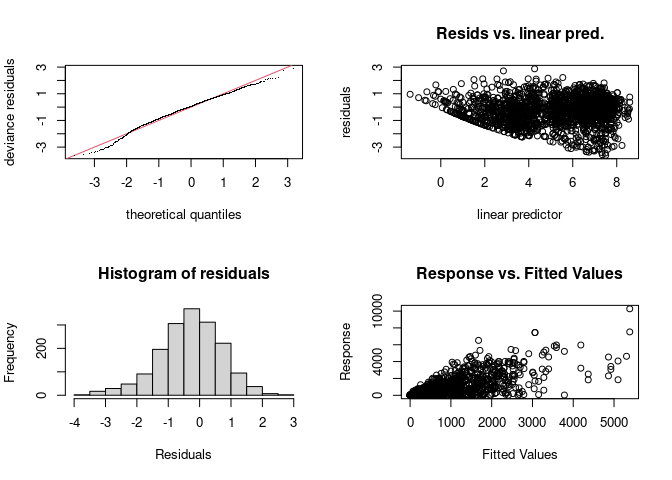<!-- -->

    ## 
    ## Method: REML   Optimizer: outer newton
    ## full convergence after 6 iterations.
    ## Gradient range [-0.0009720401,0.002523532]
    ## (score 10864.65 & scale 1).
    ## Hessian positive definite, eigenvalue range [1.201395,957.9721].
    ## Model rank =  117 / 117 
    ## 
    ## Basis dimension (k) checking results. Low p-value (k-index<1) may
    ## indicate that k is too low, especially if edf is close to k'.
    ## 
    ##                                     k'  edf k-index p-value
    ## s(disease_week):urbanizationrural 19.0 18.1     0.9    0.18
    ## s(disease_week):urbanizationperi  19.0 13.1     0.9    0.21
    ## s(disease_week):urbanizationurban 19.0  6.8     0.9    0.23
    ## s(site_name)                      56.0 43.6      NA      NA

``` r
# plot the smooths for tar
plot(tar_gam, select = 1, shade = TRUE, main = "GAM Smooth for tar x rural")
```

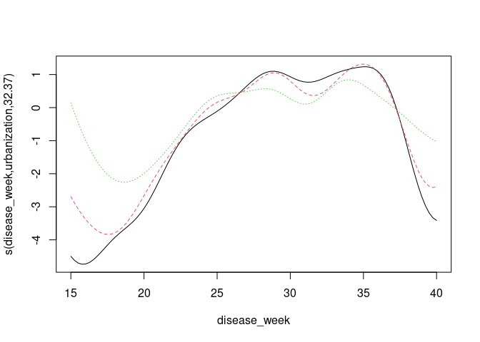<!-- -->

``` r
plot(tar_gam, select = 2, shade = TRUE, main = "GAM Smooth for tar x peri")
```

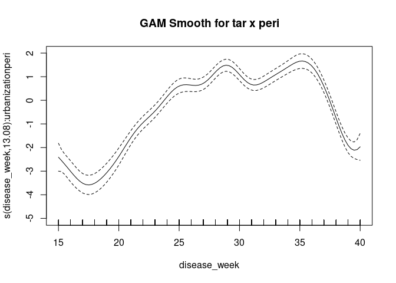<!-- -->

``` r
plot(tar_gam, select = 3, shade = TRUE, main = "GAM Smooth for tar x urban")
```

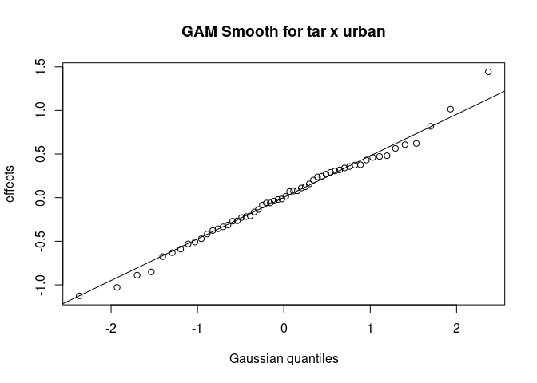<!-- -->

### Check: pipiens

``` r
#Summary of GAM fit
summary(pip_gam)
```

    ## 
    ## Family: Negative Binomial(1.071) 
    ## Link function: log 
    ## 
    ## Formula:
    ## count ~ urbanization + trap_type + s(disease_week, by = urbanization, 
    ##     bs = "fs", k = 10, m = 3) + s(site_name, bs = "re")
    ## 
    ## Parametric coefficients:
    ##                   Estimate Std. Error z value Pr(>|z|)    
    ## (Intercept)         3.8960     0.1487  26.198  < 2e-16 ***
    ## urbanizationperi    0.2516     0.2359   1.067 0.286109    
    ## urbanizationurban  -0.8232     0.2150  -3.829 0.000128 ***
    ## trap_typeGRVD      -0.6723     0.1125  -5.975 2.31e-09 ***
    ## ---
    ## Signif. codes:  0 '***' 0.001 '**' 0.01 '*' 0.05 '.' 0.1 ' ' 1
    ## 
    ## Approximate significance of smooth terms:
    ##                                      edf Ref.df Chi.sq p-value    
    ## s(disease_week):urbanizationrural  5.580  6.383  394.0  <2e-16 ***
    ## s(disease_week):urbanizationperi   7.396  8.180  687.4  <2e-16 ***
    ## s(disease_week):urbanizationurban  6.067  6.886  280.5  <2e-16 ***
    ## s(site_name)                      49.765 56.000  533.1  <2e-16 ***
    ## ---
    ## Signif. codes:  0 '***' 0.001 '**' 0.01 '*' 0.05 '.' 0.1 ' ' 1
    ## 
    ## R-sq.(adj) =  0.473   Deviance explained = 67.5%
    ## -REML = 6257.7  Scale est. = 1         n = 1383

``` r
#AIC for 
cat("GAM model pip AIC: ", AIC(pip_gam), "\n")
```

    ## GAM model pip AIC:  12408.89

``` r
#Check if smooths are hitting their basis limits
gam.check(pip_gam)
```

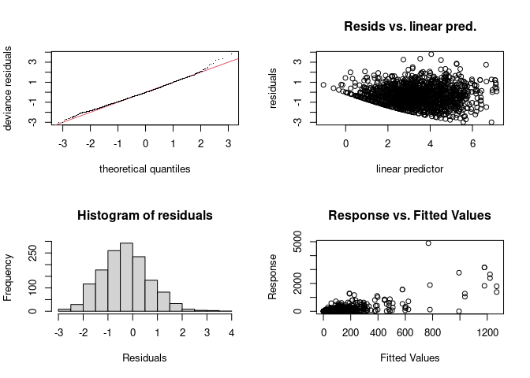<!-- -->

    ## 
    ## Method: REML   Optimizer: outer newton
    ## full convergence after 7 iterations.
    ## Gradient range [1.141959e-08,4.463491e-06]
    ## (score 6257.707 & scale 1).
    ## Hessian positive definite, eigenvalue range [0.0816685,719.9479].
    ## Model rank =  90 / 90 
    ## 
    ## Basis dimension (k) checking results. Low p-value (k-index<1) may
    ## indicate that k is too low, especially if edf is close to k'.
    ## 
    ##                                      k'   edf k-index p-value
    ## s(disease_week):urbanizationrural  9.00  5.58    0.92    0.58
    ## s(disease_week):urbanizationperi   9.00  7.40    0.92    0.57
    ## s(disease_week):urbanizationurban  9.00  6.07    0.92    0.60
    ## s(site_name)                      59.00 49.76      NA      NA

``` r
# plot the smooths for pip
plot(pip_gam, select = 1, shade = TRUE, main = "GAM Smooth for pip x rural")
```

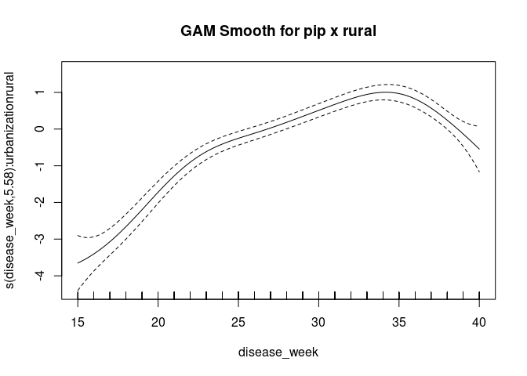<!-- -->

``` r
plot(pip_gam, select = 2, shade = TRUE, main = "GAM Smooth for pip x peri")
```

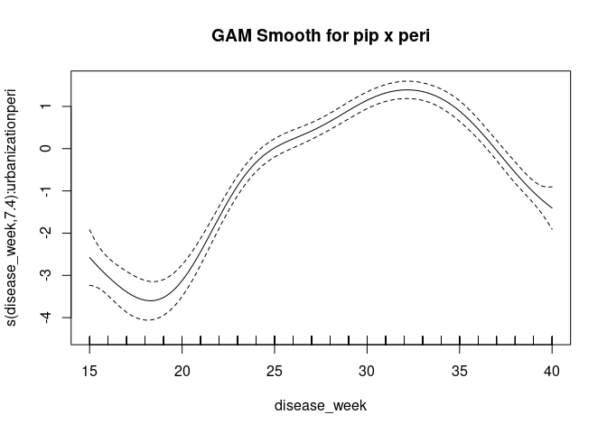<!-- -->

``` r
plot(pip_gam, select = 3, shade = TRUE, main = "GAM Smooth for pip x urban")
```

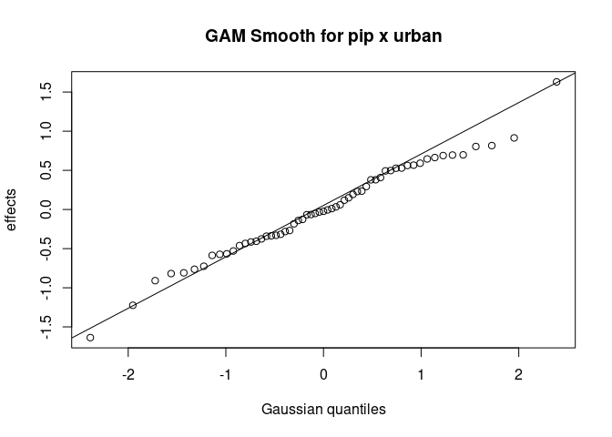<!-- -->

### Seasonal Smooth

``` r
# ----------------------
# 1. Seasonal effects across habitats
# ----------------------

cols <- c(
  "Culex pipiens"  = "#1bc8ea",
  "Culex tarsalis" = "#FF2DA0"
)

predict_species_gam <- function(model, newdata, species_label) {
  
  newdata$urbanization <- factor(newdata$urbanization, levels = levels(combined$urbanization))
  newdata$trap_type <- factor(newdata$trap_type, levels = levels(combined$trap_type))
  newdata$site_name <- factor(newdata$site_name, levels = levels(combined$site_name))
  
  pred <- predict(
    model,
    newdata = newdata,
    type = "link",
    se.fit = TRUE,
    exclude = "s(site_name)"
  )
  
  newdata %>%
    mutate(
      species = species_label,
      fit_link = pred$fit,
      se_link = pred$se.fit,
      fit = exp(fit_link),
      lower = exp(fit_link - 1.96 * se_link),
      upper = exp(fit_link + 1.96 * se_link)
    )
}

newdata_season <- expand.grid(
  disease_week = seq(min(combined$disease_week), max(combined$disease_week), by = 1),
  urbanization = "rural",
  trap_type = "CO2",
  site_name = levels(combined$site_name)[1]
)

pred_season <- bind_rows(
  predict_species_gam(pip_gam, newdata_season, "Culex pipiens"),
  predict_species_gam(tar_gam, newdata_season, "Culex tarsalis")
)

ggplot(pred_season, aes(x = disease_week, y = fit, color = species, fill = species)) +
  geom_ribbon(aes(ymin = lower, ymax = upper), alpha = 0.2, color = NA) +
  geom_line(linewidth = 1.2) +
  scale_color_manual(values = cols) +
  scale_fill_manual(values = cols) +
  #scale_y_log10() +
  labs(
    x = "Disease week",
    y = "Predicted count",
    color = "Species",
    fill = "Species",
    title = "Predicted seasonal abundance from species-specific GAMs"
  ) +
  theme_minimal()
```

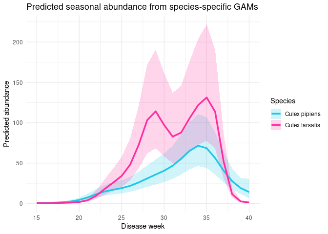<!-- -->

``` r
# ----------------------
# 3. Predicted abundance by urbanization: CO2 traps
# ----------------------

newdat_site_CO2 <- expand.grid(
  disease_week = seq(min(combined$disease_week), max(combined$disease_week), by = 1),
  urbanization = levels(combined$urbanization),
  trap_type = "CO2",
  site_name = levels(combined$site_name)[1]
)

pred_site_CO2 <- bind_rows(
  predict_species_gam(pip_gam, newdat_site_CO2, "Culex pipiens"),
  predict_species_gam(tar_gam, newdat_site_CO2, "Culex tarsalis")
)

ggplot(pred_site_CO2, aes(x = disease_week, y = fit, color = species, group = species)) +
  geom_line(linewidth = 1.2) +
  geom_ribbon(aes(ymin = lower, ymax = upper, fill = species), alpha = 0.25, color = NA) +
  geom_vline(xintercept = 33, linetype = "dashed", color = "black", linewidth = 0.5) +
  annotate("text", x = 33, y = Inf, label = "1st WNV cases",
           vjust = 1, hjust = -0.07, size = 3) +
  facet_wrap(~ urbanization, scales = "free_y", ncol = 1) +
  scale_color_manual(values = cols) +
  scale_fill_manual(values = cols) +
  #scale_y_log10() +
  labs(
    title = "Predicted abundance from species-specific GAMs (CO2 traps)",
    x = "Disease week",
    y = "Predicted count",
    color = "Species",
    fill = "Species"
  ) +
  theme_classic() +
  theme(
    plot.title = element_text(hjust = 0.5),
    strip.background = element_blank(),
    strip.text = element_text(size = 12)
  )
```

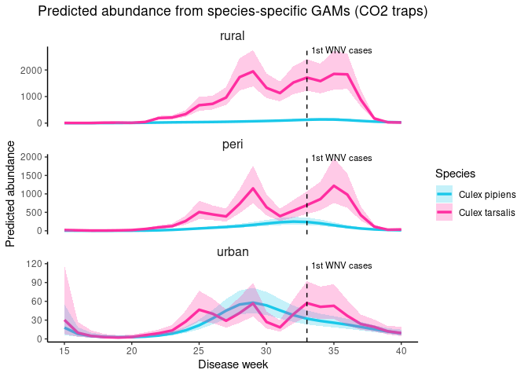<!-- --> \### Relative abundance figure

``` r
newdata_rel <- expand.grid(
  urbanization = levels(combined$urbanization),
  disease_week = median(combined$disease_week, na.rm = TRUE),
  trap_type = "CO2",
  site_name = levels(combined$site_name)[1]
)

pred_rel <- bind_rows(
  predict_species_gam(pip_gam, newdata_rel, "Culex pipiens"),
  predict_species_gam(tar_gam, newdata_rel, "Culex tarsalis")
) %>%
  mutate(
    species = factor(species, levels = c("Culex pipiens", "Culex tarsalis")),
    urbanization = factor(urbanization, levels = c("rural", "peri", "urban"))
  ) %>%
  group_by(urbanization) %>%
  mutate(
    prop = fit / sum(fit),
    prop_lower = lower / sum(upper),
    prop_upper = upper / sum(lower),
    prop_lower = pmax(0, prop_lower),
    prop_upper = pmin(1, prop_upper)
  ) %>%
  ungroup()

ggplot(pred_rel, aes(x = urbanization, y = prop, color = species, group = species)) +
  geom_point(size = 4) +
  geom_line(linewidth = 1) +
  geom_errorbar(
    aes(ymin = prop_lower, ymax = prop_upper),
    width = 0.1
  ) +
  scale_color_manual(values = cols) +
  scale_y_continuous(limits = c(0, 1)) +
  labs(
    x = "Urbanization",
    y = "Relative abundance",
    color = NULL,
    title = "Predicted relative abundance (CO2 traps)") +
  theme_classic() +
  theme(
    legend.position = "right",
    plot.title = element_text(hjust = 0.5)
  )
```

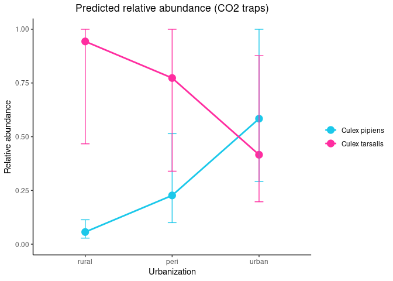<!-- --> \# Urban paired traps -
effect of trap_type?

Analyze urban sites only paired trap types:

“Within Urban sites, does trap type affect abundance? fit the model on
Urban observations only”

``` r
# --------------------------
# Identify sites with BOTH trap types
# --------------------------

paired_sites <- combined %>%
  group_by(site_name) %>%
  summarize(
    n_traps = n_distinct(trap_type),
    .groups = "drop"
  ) %>%
  filter(n_traps == 2) %>%
  pull(site_name)

paired_sites
```

    ## [1] Downington Ave     Fire Station 13    Fire Station 2     Fire Station 4    
    ## [5] Fire Station 5     Fire Station 6     Fire Station 8     Hogle Zoo         
    ## [9] Nibley Golf Course
    ## 59 Levels: 1700 E Church 300 E Church 700 S 200 W ... Wingpointe

## Cx. tarsalis abundance by trap type Urban

``` r
urban_tar <- tarsalis %>%
  filter(
    urbanization == "urban",
    site_name %in% paired_sites
  )

table(urban_tar$trap_type)
```

    ## 
    ##  CO2 GRVD 
    ##  153   51

``` r
length(unique(urban_tar$site_name))
```

    ## [1] 9

``` r
urban_tar_gam <- mgcv::gam(
  count ~ trap_type +
    s(disease_week, by = trap_type, k = 5) +
    s(site_name, bs = "re"),
  family = mgcv::nb(),
  data = urban_tar,
  method = "REML"
)

summary(urban_tar_gam)
```

    ## 
    ## Family: Negative Binomial(1.233) 
    ## Link function: log 
    ## 
    ## Formula:
    ## count ~ trap_type + s(disease_week, by = trap_type, k = 5) + 
    ##     s(site_name, bs = "re")
    ## 
    ## Parametric coefficients:
    ##               Estimate Std. Error z value Pr(>|z|)    
    ## (Intercept)     3.0645     0.2247   13.64   <2e-16 ***
    ## trap_typeGRVD  -2.6898     0.2395  -11.23   <2e-16 ***
    ## ---
    ## Signif. codes:  0 '***' 0.001 '**' 0.01 '*' 0.05 '.' 0.1 ' ' 1
    ## 
    ## Approximate significance of smooth terms:
    ##                                 edf Ref.df Chi.sq p-value    
    ## s(disease_week):trap_typeCO2  3.790  3.973 86.051  <2e-16 ***
    ## s(disease_week):trap_typeGRVD 1.001  1.002  0.029   0.867    
    ## s(site_name)                  7.144  8.000 58.201  <2e-16 ***
    ## ---
    ## Signif. codes:  0 '***' 0.001 '**' 0.01 '*' 0.05 '.' 0.1 ' ' 1
    ## 
    ## R-sq.(adj) =  0.316   Deviance explained = 61.1%
    ## -REML = 715.32  Scale est. = 1         n = 185

## Cx. pipiens abundance by trap type Urban

``` r
urban_pip <- pipiens %>%
  filter(
    urbanization == "urban",
    site_name %in% paired_sites
  )

table(urban_pip$trap_type)
```

    ## 
    ##  CO2 GRVD 
    ##  148  155

``` r
length(unique(urban_pip$site_name))
```

    ## [1] 9

``` r
urban_pip_gam <- mgcv::gam(
  count ~ trap_type +
    s(disease_week, by = trap_type, k = 5) +
    s(site_name, bs = "re"),
  family = mgcv::nb(),
  data = urban_pip,
  method = "REML"
)

summary(urban_pip_gam)
```

    ## 
    ## Family: Negative Binomial(1.351) 
    ## Link function: log 
    ## 
    ## Formula:
    ## count ~ trap_type + s(disease_week, by = trap_type, k = 5) + 
    ##     s(site_name, bs = "re")
    ## 
    ## Parametric coefficients:
    ##               Estimate Std. Error z value Pr(>|z|)    
    ## (Intercept)     3.1189     0.1697  18.377  < 2e-16 ***
    ## trap_typeGRVD  -0.7178     0.1062  -6.757 1.41e-11 ***
    ## ---
    ## Signif. codes:  0 '***' 0.001 '**' 0.01 '*' 0.05 '.' 0.1 ' ' 1
    ## 
    ## Approximate significance of smooth terms:
    ##                                 edf Ref.df Chi.sq p-value    
    ## s(disease_week):trap_typeCO2  3.509  3.862  86.53  <2e-16 ***
    ## s(disease_week):trap_typeGRVD 3.300  3.734  47.22  <2e-16 ***
    ## s(site_name)                  7.145  8.000  70.16  <2e-16 ***
    ## ---
    ## Signif. codes:  0 '***' 0.001 '**' 0.01 '*' 0.05 '.' 0.1 ' ' 1
    ## 
    ## R-sq.(adj) =  0.303   Deviance explained = 47.1%
    ## -REML = 1154.9  Scale est. = 1         n = 298

## Visualize the smooths

``` r
# Colors by species, same as before
cols <- c(
  "Culex pipiens"  = "#1bc8ea",
  "Culex tarsalis" = "#FF2DA0"
)

# Helper function for urban trap-type GAMs
predict_urban_trap_gam <- function(model, data, species_label) {
  
  newdata <- expand.grid(
    disease_week = seq(
      min(data$disease_week, na.rm = TRUE),
      max(data$disease_week, na.rm = TRUE),
      by = 1
    ),
    trap_type = levels(data$trap_type),
    site_name = levels(data$site_name)[1]
  )
  
  newdata$trap_type <- factor(newdata$trap_type, levels = levels(data$trap_type))
  newdata$site_name <- factor(newdata$site_name, levels = levels(data$site_name))
  
  pred <- predict(
    model,
    newdata = newdata,
    type = "link",
    se.fit = TRUE,
    exclude = "s(site_name)"
  )
  
  newdata %>%
    mutate(
      species = species_label,
      fit_link = pred$fit,
      se_link = pred$se.fit,
      fit = exp(fit_link),
      lower = exp(fit_link - 1.96 * se_link),
      upper = exp(fit_link + 1.96 * se_link)
    )
}

# Predictions from both urban models
pred_urban_trap <- bind_rows(
  predict_urban_trap_gam(
    urban_pip_gam,
    urban_pip,
    "Culex pipiens"
  ),
  predict_urban_trap_gam(
    urban_tar_gam,
    urban_tar,
    "Culex tarsalis"
  )
)
```

    ## Warning in predict.gam(model, newdata = newdata, type = "link", se.fit = TRUE,
    ## : factor levels 1700 E Church not in original fit
    ## Warning in predict.gam(model, newdata = newdata, type = "link", se.fit = TRUE,
    ## : factor levels 1700 E Church not in original fit

``` r
# Plot: one panel per species, one line per trap type
#pdf("trap_type_comp_smooths.pdf", width=4.5, height=3)

#put plotting code here in between

ggplot(
  pred_urban_trap,
  aes(
    x = disease_week,
    y = fit,
    color = species,
    fill = species,
    linetype = trap_type
  )
) +
  geom_ribbon(
    aes(ymin = lower, ymax = upper, group = interaction(species, trap_type)),
    alpha = 0.18,
    color = NA
  ) +
  geom_line(
    aes(group = interaction(species, trap_type)),
    linewidth = 1.2
  ) +
  geom_vline(
    xintercept = 33,
    linetype = "dashed",
    color = "black",
    linewidth = 0.5
  ) +
  annotate(
    "text",
    x = 33,
    y = Inf,
    label = "1st WNV cases",
    vjust = 1,
    hjust = -0.07,
    size = 3
  ) +
  facet_wrap(~ species, scales = "free_y", ncol = 1) +
  scale_color_manual(values = cols) +
  scale_fill_manual(values = cols) +
  scale_y_log10() +
  labs(
    title = "Predicted abundance for urban-only paired traps",
    x = "Disease week",
    y = "Predicted count (log10 scale)",
    color = "Species",
    fill = "Species",
    linetype = "Trap type"
  ) +
  theme_classic() +
  theme(
    plot.title = element_text(hjust = 0.5),
    strip.background = element_blank(),
    strip.text = element_text(size = 12)
  )
```

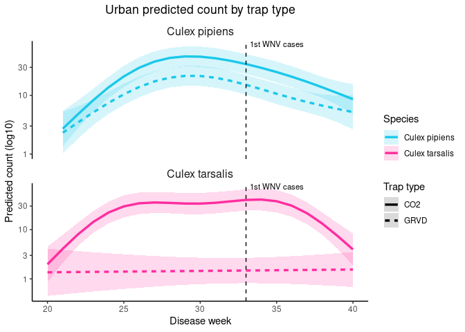<!-- -->

``` r
#dev.off()
```

**Interpretation**:

Paired-site analysis produced trap-type coefficients nearly identical to
those estimated from the full dataset. We interpret this results to
demonstrate that trap type primarily affected the magnitude of observed
abundance rather than the ecological conclusions regarding seasonal
dynamics and habitat differences.

We also think these results mean we should apply the smooth with
trap_type as a fixed effect without allowing the smooth to vary among
traps, so that the smooth uses all the data available to it and does not
over-emphasize the low numbers of tarsalis captured in the GRVD traps.

**Cx. tarsalis:**

- Estimated GRVD effect was -2.69 compared to CO2 in both analyses
  (-2.6947 in full model; -2.6898 in paired urban-only model).

- GRVD traps caught approximately 7% of the abundance caught in CO2
  traps.

  - exp(-2.6947) = 0.0675 (6.75%)

  - exp(-2.6898) = 0.0678 (6.78%)

- It also looks like for tarsalis, the GRVD trap counts being low enough
  to potentially not reliable capture the full seasonal smooth, so we
  should try to visualize with CO2 traps wherever possible.

**Cx. pipiens:**

- Estimated GRVD effect was ~-0.7 (-0.67 in the full model and -0.72 in
  the paired urban-only model).

- GRVD traps caught approximately half of the abundance caught in CO2
  traps

  - exp(-0.6723) = 0.51

  - exp(-0.7178) = 0.49

- The shape of the seasonal smooth was very very similar among trap
  types, so I think using the same smooth for both trap types (trap type
  = fixed effect), works well for Cx. pipiens.
