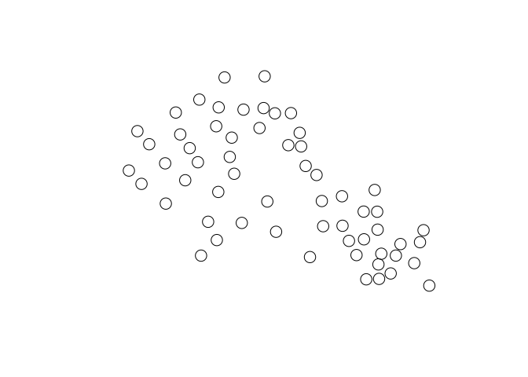
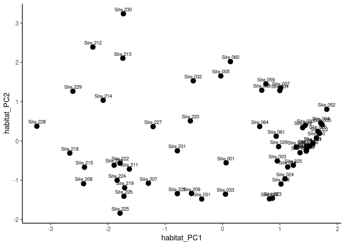
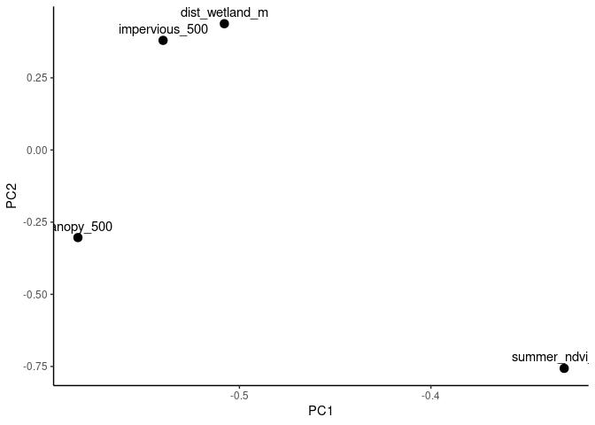
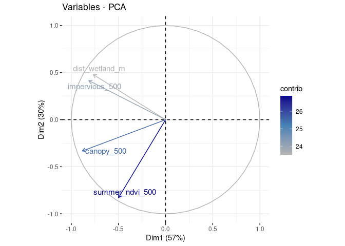
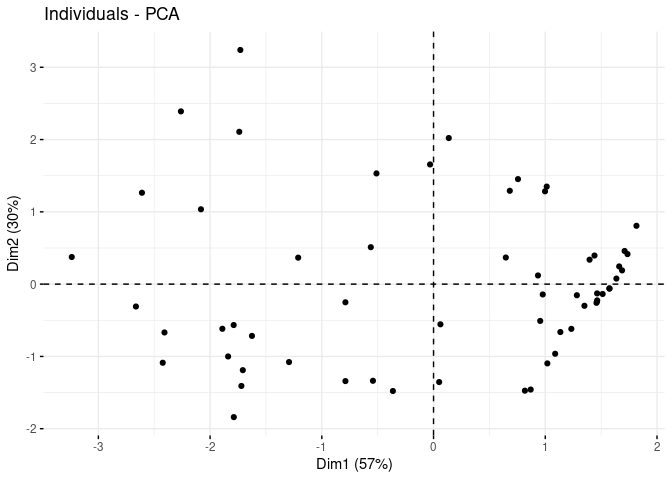
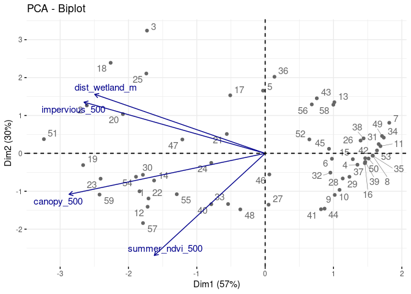
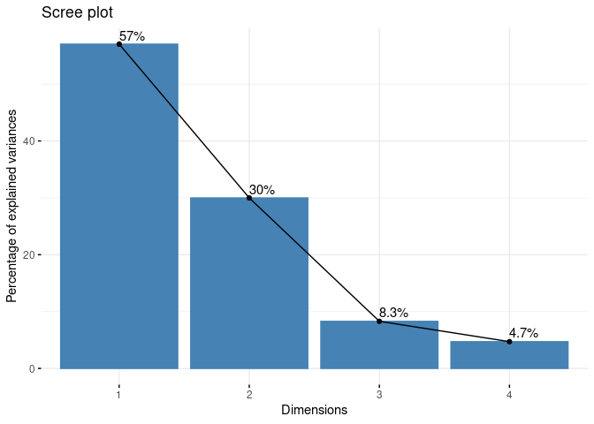
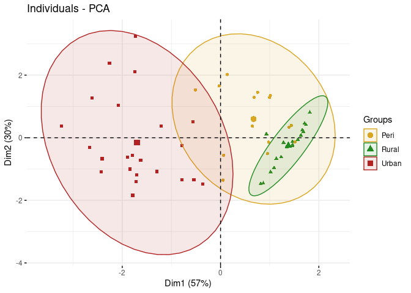

Urbanization index with PCA
================
Norah Saarman
2026-05-29

- [Setup](#setup)
- [Data input to find unique GPS
  localities](#data-input-to-find-unique-gps-localities)
  - [Read site coordinates](#read-site-coordinates)
- [Habitat covariates](#habitat-covariates)
  - [Extract NLCD raster covariates](#extract-nlcd-raster-covariates)
  - [NWI: National wetlands inventory for
    Utah:](#nwi-national-wetlands-inventory-for-utah)
  - [OpenStreetMaps roads and buildings, couldn’t get this
    working…](#openstreetmaps-roads-and-buildings-couldnt-get-this-working)
  - [NDVI from Google Earth Engine](#ndvi-from-google-earth-engine)
    - [Earth Engine in browser:](#earth-engine-in-browser)
    - [Download the file and load into R, add to sites
      table](#download-the-file-and-load-into-r-add-to-sites-table)
- [PCA](#pca)

# Setup

# Data input to find unique GPS localities

``` r
library(dplyr)

## tarsalis datasets from SLCMAD: 
tarsalis <- read.csv("../data/tarsalis_2025.csv") 

## pipiens datasets from SLCMAD: 
pipiens <- read.csv("../data/pipiens_2025.csv") 

## combine 
combined <- bind_rows(tarsalis, pipiens)

# Extract unique site locations
sites <- combined %>%
  distinct(site_code, latitude, longitude) %>%
  mutate(site_code = sprintf("Site %03d", site_code))

write.csv(
  sites,
  "../data/site_coordinates.csv",
  row.names = FALSE
)
```

## Read site coordinates

``` r
library(sf)
```

    ## Linking to GEOS 3.10.2, GDAL 3.4.1, PROJ 8.2.1; sf_use_s2() is TRUE

``` r
# 1. Load sites
sites <- read.csv("../data/site_coordinates.csv")

# 2. Convert to sf points
sites_sf <- st_as_sf(
  sites,
  coords = c("longitude", "latitude"),
  crs = 4326
)

# 3. Project to UTM Zone 12N (meters)
sites_utm <- st_transform(
  sites_sf,
  crs = 32612
)

# 4. Create 500 m buffers
buffers_500 <- st_buffer(
  sites_utm,
  dist = 500
)

# Quick visualization
plot(st_geometry(buffers_500))
```

<!-- -->

# Habitat covariates

## Extract NLCD raster covariates

Download: NLCD 2021 Fractional Impervious Surface (CONUS)
<https://www.mrlc.gov/downloads/sciweb1/shared/mrlc/data-bundles/Annual_NLCD_FctImp_2021_CU_C1V1.zip>

NLCD 2021 Tree Canopy Cover
<https://data.fs.usda.gov/geodata/rastergateway/treecanopycover/docs/v2023-5/nlcd_tcc_CONUS_2021_v2023-5_wgs84.zip>

``` r
# NLCD raster covariates
library(terra)

impervious <- rast("/uufs/chpc.utah.edu/common/home/saarman-group1/urbanindex/Annual_NLCD_FctImp_2021_CU_C1V1.tif")
canopy <- rast("/uufs/chpc.utah.edu/common/home/saarman-group1/urbanindex/nlcd_tcc_conus_wgs84_v2023-5_20210101_20211231.tif")

# Project buffers to raster CRS
buffers_imp <- st_transform(buffers_500, crs(impervious))
buffers_can <- st_transform(buffers_500, crs(canopy))

imp <- terra::extract(
  impervious,
  vect(buffers_imp),
  fun = mean,
  na.rm = TRUE
)

can <- terra::extract(
  canopy,
  vect(buffers_can),
  fun = mean,
  na.rm = TRUE
)

# Attach to site table
sites$impervious_500 <- imp[,2]
sites$canopy_500 <- can[,2]

# Check extracted value ranges
summary(sites$impervious_500)
summary(sites$canopy_500)

# Quick diagnostic plot
plot(
  sites$impervious_500,
  sites$canopy_500,
  xlab = "Impervious surface within 500 m",
  ylab = "Tree canopy within 500 m"
)

# Save working covariate table
write.csv(
  sites,
  "../data/site_habitat_covariates_partial.csv",
  row.names = FALSE
)
```

## NWI: National wetlands inventory for Utah:

<https://documentst.ecosphere.fws.gov/wetlands/data/State-Downloads/UT_geodatabase_wetlands.zip>

``` r
library(sf)
library(dplyr)

st_layers(
  "/uufs/chpc.utah.edu/common/home/saarman-group1/urbanindex/UT_geodatabase_wetlands.gdb"
)

wetlands <- st_read(
  "/uufs/chpc.utah.edu/common/home/saarman-group1/urbanindex/UT_geodatabase_wetlands.gdb",
  layer = "UT_Wetlands"
)

# What CRS are the wetlands?
st_crs(wetlands)

# Transform sites/buffers to wetland CRS
sites_albers <- st_transform(
  sites_utm,
  st_crs(wetlands)
)

buffers_albers <- st_transform(
  buffers_500,
  st_crs(wetlands)
)

# crop to study area + buffer to make distance faster
study_area <- st_union(buffers_albers)

wetlands_crop <- st_crop(
  wetlands,
  st_bbox(st_buffer(study_area, 5000))
)

# Distance from each site to nearest wetland
dist_wetland <- st_distance(
  sites_albers,
  wetlands_crop
)

sites$dist_wetland_m <- apply(
  dist_wetland,
  1,
  min,
  na.rm = TRUE
) %>%
  as.numeric()

summary(sites$dist_wetland_m)

# Save working covariate table
write.csv(
  sites,
  "../data/site_habitat_covariates_partial.csv",
  row.names = FALSE
)
```

## OpenStreetMaps roads and buildings, couldn’t get this working…

``` r
library(osmdata)
library(sf)
library(dplyr)

# Make bounding box around sites/buffers in lon/lat
sites_bbox <- st_bbox(st_transform(buffers_500, 4326))

# Convert bbox to numeric vector for osmdata
bbox_vec <- c(
  sites_bbox["xmin"],
  sites_bbox["ymin"],
  sites_bbox["xmax"],
  sites_bbox["ymax"]
)

can <- NULL

# Download OSM roads
osm_roads <- opq(
  bbox = bbox_vec,
  timeout = 300
) %>%
  add_osm_feature(key = "highway") %>%
  osmdata_sf(quiet = TRUE)

roads <- osm_roads$osm_lines

# Download OSM buildings
osm_buildings <- opq(
  bbox = bbox_vec,
  timeout = 300
) %>%
  add_osm_feature(key = "building") %>%
  osmdata_sf(quiet = TRUE)

buildings <- osm_buildings$osm_polygons

# Project to UTM
roads_utm <- st_transform(roads, 32612)
buildings_utm <- st_transform(buildings, 32612)

# Keep only site_code + geometry from buffers
buffers_sites <- buffers_500 %>%
  dplyr::select(site_code)

# Intersect roads/buildings with buffers
road_intersections <- st_intersection(
  roads_utm,
  buffers_sites
)

building_intersections <- st_intersection(
  buildings_utm,
  buffers_sites
)

# Buffer area in km2
buffer_area_km2 <- as.numeric(st_area(buffers_500[1, ])) / 1e6

# Road density: meters road per km2
road_density <- road_intersections %>%
  mutate(length_m = as.numeric(st_length(geometry))) %>%
  st_drop_geometry() %>%
  group_by(site_code) %>%
  summarise(
    road_length_m = sum(length_m, na.rm = TRUE),
    .groups = "drop"
  ) %>%
  mutate(
    road_density_500 = road_length_m / buffer_area_km2
  ) %>%
  dplyr::select(site_code, road_density_500)

# Building density: building footprint area per km2
building_density <- building_intersections %>%
  mutate(area_m2 = as.numeric(st_area(geometry))) %>%
  st_drop_geometry() %>%
  group_by(site_code) %>%
  summarise(
    building_area_m2 = sum(area_m2, na.rm = TRUE),
    .groups = "drop"
  ) %>%
  mutate(
    building_density_500 = building_area_m2 / buffer_area_km2
  ) %>%
  dplyr::select(site_code, building_density_500)

# Join back to sites
sites <- sites %>%
  left_join(road_density, by = "site_code") %>%
  left_join(building_density, by = "site_code") %>%
  mutate(
    road_density_500 = ifelse(is.na(road_density_500), 0, road_density_500),
    building_density_500 = ifelse(is.na(building_density_500), 0, building_density_500)
  )

summary(sites$road_density_500)
summary(sites$building_density_500)

# Save working covariate table
write.csv(
  sites,
  "../data/site_habitat_covariates_partial.csv",
  row.names = FALSE
)
```

## NDVI from Google Earth Engine

### Earth Engine in browser:

<https://code.earthengine.google.com>

``` java

var sites = ee.FeatureCollection(
    "projects/ee-nosaarman/assets/site_coordinates"
);

// Buffer sites 500 m

var buffers = sites.map(function(f) {
  return f.buffer(500);
});

// Sentinel-2 summer imagery

var s2 = ee.ImageCollection(
    'COPERNICUS/S2_SR_HARMONIZED'
  )
  .filterDate('2018-06-01', '2023-08-31')
  .filter(ee.Filter.calendarRange(6, 8, 'month'))
  .filterBounds(buffers)
  .filter(ee.Filter.lt(
      'CLOUDY_PIXEL_PERCENTAGE', 40
  ));

// NDVI

var ndvi = s2.map(function(img) {
  return img.addBands(
    img.normalizedDifference(
      ['B8','B4']
    ).rename('NDVI')
  );
});

// Mean NDVI across all summers

var ndvi_mean =
  ndvi.select('NDVI').mean();

// Extract mean NDVI for each site

var ndvi_sites =
  ndvi_mean.reduceRegions({
    collection: buffers,
    reducer: ee.Reducer.mean(),
    scale: 10
  });

print(ndvi_sites);

Export.table.toDrive({
  collection: ndvi_sites,
  description: 'summer_ndvi_500',
  fileFormat: 'CSV'
});
```

### Download the file and load into R, add to sites table

``` r
library(dplyr)
```

    ## 
    ## Attaching package: 'dplyr'

    ## The following objects are masked from 'package:stats':
    ## 
    ##     filter, lag

    ## The following objects are masked from 'package:base':
    ## 
    ##     intersect, setdiff, setequal, union

``` r
sites <- read.csv("../data/site_habitat_covariates_partial.csv")
ndvi <- read.csv("../data/summer_ndvi_500.csv")

ndvi_clean <- ndvi %>%
  dplyr::select(site_code, mean) %>%
  rename(summer_ndvi_500 = mean)

sites <- sites %>%
  left_join(ndvi_clean, by = "site_code")

write.csv(
  sites,
  "../data/site_habitat_covariates.csv",
  row.names = FALSE
)
```

# PCA

``` r
# Read in working covariate table
sites <- read.csv("../data/site_habitat_covariates.csv") 
# Remove blank site rows
sites <- sites %>%
  filter(
    !is.na(site_code),
    site_code != ""
  )

cor(
  sites %>%
    dplyr::select(
      impervious_500,
      canopy_500,
      dist_wetland_m,
      summer_ndvi_500
    ),
  use = "complete.obs"
)
```

    ##                 impervious_500 canopy_500 dist_wetland_m summer_ndvi_500
    ## impervious_500      1.00000000  0.5586428     0.67550401      0.06657914
    ## canopy_500          0.55864276  1.0000000     0.46902361      0.63168644
    ## dist_wetland_m      0.67550401  0.4690236     1.00000000      0.03568969
    ## summer_ndvi_500     0.06657914  0.6316864     0.03568969      1.00000000

``` r
# Select habitat variables for PCA
habitat_vars <- sites %>%
  dplyr::select(
    impervious_500,
    canopy_500,
    dist_wetland_m,
    summer_ndvi_500
  )

# PCA with centering and scaling
pca <- prcomp(
  habitat_vars,
  center = TRUE,
  scale. = TRUE
)

# Variance explained
summary(pca)
```

    ## Importance of components:
    ##                           PC1    PC2     PC3     PC4
    ## Standard deviation     1.5103 1.0951 0.57568 0.43402
    ## Proportion of Variance 0.5702 0.2998 0.08285 0.04709
    ## Cumulative Proportion  0.5702 0.8701 0.95291 1.00000

``` r
# Loadings
pca$rotation
```

    ##                        PC1        PC2        PC3         PC4
    ## impervious_500  -0.5398590  0.3797602 -0.6255278  0.41599209
    ## canopy_500      -0.5843465 -0.3034377 -0.1678228 -0.73368948
    ## dist_wetland_m  -0.5078749  0.4375559  0.7400433  0.05425706
    ## summer_ndvi_500 -0.3303854 -0.7564738  0.1813461  0.53451520

``` r
# Add PC scores back to sites
sites$habitat_PC1 <- pca$x[,1]
sites$habitat_PC2 <- pca$x[,2]

# Save
write.csv(
  sites,
  "../data/site_habitat_pca.csv",
  row.names = FALSE
)

library(ggplot2)


urban_class <- tribble(
  ~site_code, ~urbanization,
  "Site 001","Peri",
  "Site 003","Peri",
  "Site 004","Rural",
  "Site 005","Peri",
  "Site 009","Rural",
  "Site 022","Rural",
  "Site 023","Rural",
  "Site 024","Rural",
  "Site 025","Rural",
  "Site 026","Rural",
  "Site 027","Rural",
  "Site 028","Rural",
  "Site 029","Peri",
  "Site 030","Peri",
  "Site 031","Urban",
  "Site 032","Peri",
  "Site 033","Peri",
  "Site 034","Peri",
  "Site 035","Rural",
  "Site 037","Peri",
  "Site 049","Peri",
  "Site 050","Rural",
  "Site 051","Rural",
  "Site 052","Rural",
  "Site 053","Rural",
  "Site 054","Rural",
  "Site 056","Rural",
  "Site 057","Rural",
  "Site 058","Peri",
  "Site 059","Peri",
  "Site 060","Peri",
  "Site 061","Rural",
  "Site 062","Rural",
  "Site 063","Rural",
  "Site 064","Peri",
  "Site 065","Rural",
  "Site 066","Peri",
  "Site 207","Urban",
  "Site 208","Urban",
  "Site 209","Urban",
  "Site 211","Urban",
  "Site 212","Urban",
  "Site 213","Urban",
  "Site 214","Urban",
  "Site 215","Urban",
  "Site 216","Urban",
  "Site 218","Urban",
  "Site 219","Urban",
  "Site 220","Urban",
  "Site 221","Urban",
  "Site 222","Urban",
  "Site 223","Urban",
  "Site 224","Urban",
  "Site 225","Urban",
  "Site 226","Urban",
  "Site 227","Urban",
  "Site 228","Urban",
  "Site 229","Urban",
  "Site 230","Urban",
  "Site 231","Urban",
  "Site 232","Urban"
)

sites <- sites %>%
  left_join(urban_class, by = "site_code")

table(sites$urbanization)
```

    ## 
    ##  Peri Rural Urban 
    ##    15    21    23

``` r
ggplot(sites, aes(x = habitat_PC1, y = habitat_PC2)) +
  geom_point(size = 3) +
  geom_text(aes(label = site_code), vjust = -0.7, size = 2.5) +
  theme_classic()
```

<!-- -->

``` r
loadings <- as.data.frame(pca$rotation) %>%
  tibble::rownames_to_column("variable")

ggplot(loadings, aes(x = PC1, y = PC2, label = variable)) +
  geom_point(size = 3) +
  geom_text(vjust = -0.7) +
  theme_classic()
```

<!-- -->

``` r
library(factoextra)
```

    ## Welcome! Want to learn more? See two factoextra-related books at https://goo.gl/ve3WBa

``` r
fviz_pca_var(
  pca,
  col.var = "contrib",
  gradient.cols = c("gray70", "steelblue", "darkblue"),
  repel = TRUE
)
```

<!-- -->

``` r
fviz_pca_ind(
  pca,
  geom.ind = "point",
  repel = TRUE
)
```

<!-- -->

``` r
fviz_pca_biplot(
  pca,
  repel = TRUE,
  col.var = "darkblue",
  col.ind = "gray40"
)
```

<!-- -->

``` r
round(pca$rotation, 3)
```

    ##                    PC1    PC2    PC3    PC4
    ## impervious_500  -0.540  0.380 -0.626  0.416
    ## canopy_500      -0.584 -0.303 -0.168 -0.734
    ## dist_wetland_m  -0.508  0.438  0.740  0.054
    ## summer_ndvi_500 -0.330 -0.756  0.181  0.535

``` r
fviz_eig(
  pca,
  addlabels = TRUE
)
```

<!-- -->

``` r
fviz_pca_ind(
  pca,
  geom.ind = "point",
  habillage = sites$urbanization,
  addEllipses = TRUE,
  repel = TRUE,
  palette = c(
    Rural = "forestgreen",
    Peri = "goldenrod",
    Urban = "firebrick"
  )
)
```

<!-- -->
