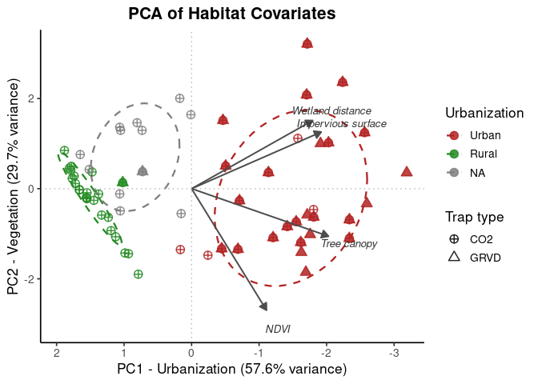

Bloodmeal + WNV positive GAM: SLC
================
Norah Saarman
2026-06-17

- [Setup](#setup)
- [Data](#data)
- [PCA of habitat/urbanization
  gradient](#pca-of-habitaturbanization-gradient)
  - [Plot PCA by urbanization and
    trap_type](#plot-pca-by-urbanization-and-trap_type)
- [RQ1: Bloodmeal](#rq1-bloodmeal)
- [RQ3: Bloodmeal and WNV
  probability](#rq3-bloodmeal-and-wnv-probability)

# Setup

``` r
library(dplyr)
```

    ## 
    ## Attaching package: 'dplyr'

    ## The following objects are masked from 'package:stats':
    ## 
    ##     filter, lag

    ## The following objects are masked from 'package:base':
    ## 
    ##     intersect, setdiff, setequal, union

``` r
library(brms)
```

    ## Loading required package: Rcpp

    ## Loading 'brms' package (version 2.23.0). Useful instructions
    ## can be found by typing help('brms'). A more detailed introduction
    ## to the package is available through vignette('brms_overview').

    ## 
    ## Attaching package: 'brms'

    ## The following object is masked from 'package:stats':
    ## 
    ##     ar

``` r
library(mgcv)
```

    ## Loading required package: nlme

    ## 
    ## Attaching package: 'nlme'

    ## The following object is masked from 'package:dplyr':
    ## 
    ##     collapse

    ## This is mgcv 1.9-4. For overview type '?mgcv'.

    ## 
    ## Attaching package: 'mgcv'

    ## The following objects are masked from 'package:brms':
    ## 
    ##     s, t2

``` r
library(bayesplot)
```

    ## This is bayesplot version 1.15.0

    ## - Online documentation and vignettes at mc-stan.org/bayesplot

    ## - bayesplot theme set to bayesplot::theme_default()

    ##    * Does _not_ affect other ggplot2 plots

    ##    * See ?bayesplot_theme_set for details on theme setting

    ## 
    ## Attaching package: 'bayesplot'

    ## The following object is masked from 'package:brms':
    ## 
    ##     rhat

``` r
library(ggplot2)
library(sf)
```

    ## Linking to GEOS 3.10.2, GDAL 3.4.1, PROJ 8.2.1; sf_use_s2() is TRUE

``` r
library(spdep)
```

    ## Loading required package: spData

    ## To access larger datasets in this package, install the spDataLarge
    ## package with: `install.packages('spDataLarge',
    ## repos='https://nowosad.github.io/drat/', type='source')`

``` r
library(tidyr)
library(maptiles)
library(ggspatial)
library(prettymapr)
```

# Data

``` r
wnv <- read.csv("/uufs/chpc.utah.edu/common/home/saarman-group1/urbanindex/wnv_master_FINAL.csv")
habitat <- read.csv("/uufs/chpc.utah.edu/common/home/saarman-group1/urbanindex/pip_tars_urbanindex.csv")
bloodmeal <- read.csv("/uufs/chpc.utah.edu/common/home/saarman-group1/urbanindex/bloodmeal_master_FINAL.csv")
```

# PCA of habitat/urbanization gradient

``` r
library(dplyr)

# Prepare habitat covariates
habitat_sites <- habitat %>%
  mutate(site_code = as.character(site_code)) %>%
  distinct(site_code, .keep_all = TRUE) %>%
  dplyr::select(
    site_code,
    impervious_500,
    canopy_500,
    dist_wetland_m,
    summer_ndvi_500
  )

# Join habitat covariates to WNV
wnv <- wnv %>%
  mutate(site_code = as.character(site_code)) %>%
  left_join(habitat_sites, by = "site_code")

# Use only sites represented in the WNV dataset to define the PCA
wnv_habitat_sites <- wnv %>%
  filter(site_code != "0") %>%
  distinct(
    site_code,
    impervious_500,
    canopy_500,
    dist_wetland_m,
    summer_ndvi_500
  ) %>%
  filter(complete.cases(
    impervious_500,
    canopy_500,
    dist_wetland_m,
    summer_ndvi_500
  ))

# Run PCA
wnv_pca_vars <- wnv_habitat_sites %>%
  dplyr::select(
    impervious_500,
    canopy_500,
    dist_wetland_m,
    summer_ndvi_500
  )

wnv_pca <- prcomp(
  wnv_pca_vars,
  center = TRUE,
  scale. = TRUE
)

summary(wnv_pca)
```

    ## Importance of components:
    ##                           PC1    PC2     PC3     PC4
    ## Standard deviation     1.5181 1.0878 0.56109 0.44393
    ## Proportion of Variance 0.5762 0.2958 0.07871 0.04927
    ## Cumulative Proportion  0.5762 0.8720 0.95073 1.00000

``` r
round(wnv_pca$rotation, 3)
```

    ##                    PC1    PC2    PC3    PC4
    ## impervious_500  -0.549  0.359  0.589 -0.471
    ## canopy_500      -0.579 -0.301  0.223  0.724
    ## dist_wetland_m  -0.513  0.432 -0.742 -0.001
    ## summer_ndvi_500 -0.317 -0.770 -0.229 -0.504

``` r
# Add PCA scores to site-level table
wnv_habitat_sites <- wnv_habitat_sites %>%
  mutate(
    habitat_PC1 = wnv_pca$x[,1],
    habitat_PC2 = wnv_pca$x[,2]
  )

# Join PCA scores back to full WNV table
wnv <- wnv %>%
  dplyr::select(-any_of(c("habitat_PC1", "habitat_PC2"))) %>%
  left_join(
    wnv_habitat_sites %>%
      dplyr::select(site_code, habitat_PC1, habitat_PC2),
    by = "site_code"
  )
```

### Plot PCA by urbanization and trap_type

``` r
library(dplyr)
library(ggplot2)
library(tibble)

urb_colors <- c(
  "Urban" = "#B22222",
  "Peri"  = "#DAA520",
  "Rural" = "#228B22"
)

# Site/trap-level PCA scores from WNV object
pca_scores_df <- wnv %>%
  distinct(
    site_code,
    trap_type,
    urbanization,
    habitat_PC1,
    habitat_PC2
  ) %>%
  filter(
    !is.na(habitat_PC1),
    !is.na(habitat_PC2),
    !is.na(trap_type)
  ) %>%
  mutate(
    Urbanization = factor(
      urbanization,
      levels = c("Urban", "Peri", "Rural")
    ),
    PC1 = habitat_PC1,
    PC2 = habitat_PC2
  )

# PCA variable loadings
loadings_df <- as.data.frame(wnv_pca$rotation) %>%
  rownames_to_column("variable") %>%
  mutate(
    variable = recode(
      variable,
      "impervious_500"  = "Impervious surface",
      "canopy_500"      = "Tree canopy",
      "dist_wetland_m"  = "Wetland distance",
      "summer_ndvi_500" = "NDVI"
    )
  )

arrow_scale <- 3.5

p1_biplot <- ggplot() +
  stat_ellipse(
    data = pca_scores_df,
    aes(x = PC1, y = PC2, color = Urbanization),
    level = 0.75,
    linewidth = 0.8,
    linetype = "dashed"
  ) +
  geom_point(
    data = pca_scores_df,
    aes(
      x = PC1,
      y = PC2,
      color = Urbanization,
      fill = Urbanization,
      shape = trap_type
    ),
    size = 3,
    alpha = 0.85,
    stroke = 0.8
  ) +
  geom_segment(
    data = loadings_df,
    aes(
      x = 0,
      y = 0,
      xend = PC1 * arrow_scale,
      yend = PC2 * arrow_scale
    ),
    arrow = arrow(length = unit(0.25, "cm"), type = "closed"),
    color = "gray30",
    linewidth = 0.7
  ) +
  geom_text(
    data = loadings_df,
    aes(
      x = PC1 * arrow_scale * 1.15,
      y = PC2 * arrow_scale * 1.15,
      label = variable
    ),
    size = 3.5,
    color = "gray20",
    fontface = "italic"
  ) +
  geom_hline(yintercept = 0, linetype = "dotted", color = "gray70") +
  geom_vline(xintercept = 0, linetype = "dotted", color = "gray70") +
  scale_color_manual(values = urb_colors, name = "Urbanization") +
  scale_fill_manual(values = urb_colors, name = "Urbanization") +
  scale_shape_manual(
    values = c(
      "CO2" = 10,
      "GRVD" = 24
    ),
    name = "Trap type"
  ) +
  labs(
    title = "PCA of Habitat Covariates",
       x = "PC1 - Urbanization (57.6% variance)",
    y = "PC2 - Vegetation (29.7% variance)"
  ) +
  scale_x_reverse() +
  theme_classic(base_size = 13) +
  theme(
    plot.title = element_text(face = "bold", hjust = 0.5),
    plot.subtitle = element_text(hjust = 0.5, color = "gray40"),
    legend.position = "right"
  )

print(p1_biplot)
```

    ## Warning: Removed 14 rows containing missing values or values outside the scale range
    ## (`geom_point()`).

<!-- -->

# RQ1: Bloodmeal

``` r
# Join PC1 and PC2 to bloodmeal dataframe
bloodmeal$site_code <- as.character(bloodmeal$site_code)
  
bloodmeal <- bloodmeal %>%
  dplyr::select(-any_of(c("habitat_PC1", "habitat_PC2"))) %>%
  left_join(
    wnv_habitat_sites %>%
      dplyr::select(site_code, habitat_PC1, habitat_PC2),
    by = "site_code"
  )

# Check mosq_species breakdown
table(bloodmeal$mosq_species)
```

    ## 
    ## Cx_pipiens_sl   Cx_tarsalis 
    ##           293           108

``` r
table(bloodmeal$mosq_species,bloodmeal$urbanization,bloodmeal$trap_type)
```

    ## , ,  = BOX
    ## 
    ##                
    ##                 Peri Rural Urban
    ##   Cx_pipiens_sl    0     0     0
    ##   Cx_tarsalis      2    22     0
    ## 
    ## , ,  = CO2
    ## 
    ##                
    ##                 Peri Rural Urban
    ##   Cx_pipiens_sl   14     2     2
    ##   Cx_tarsalis      1    17     2
    ## 
    ## , ,  = GRVD
    ## 
    ##                
    ##                 Peri Rural Urban
    ##   Cx_pipiens_sl    4     0   228
    ##   Cx_tarsalis      1     0    15
    ## 
    ## , ,  = Trash Can
    ## 
    ##                
    ##                 Peri Rural Urban
    ##   Cx_pipiens_sl   20     1    22
    ##   Cx_tarsalis     23    19     1
    ## 
    ## , ,  = Walk-in
    ## 
    ##                
    ##                 Peri Rural Urban
    ##   Cx_pipiens_sl    0     0     0
    ##   Cx_tarsalis      0     5     0

``` r
# MODEL 1: Bloodmeal host ~ mosquito species + urbanization
# Make sure it's a factor
bloodmeal <- bloodmeal %>%
mutate(host_3_categories = factor(host_3_categories))
# Check levels — brm will use the fir
levels(bloodmeal$host_3_categories)
```

    ## [1] "Mammal"                        "Other bird"                   
    ## [3] "Passerformes (top bird order)"

``` r
# make "Other bird" reference category
bloodmeal <- bloodmeal %>%
mutate(host_3_categories = relevel(host_3_categories,
ref = "Other bird"))
levels(bloodmeal$host_3_categories)
```

    ## [1] "Other bird"                    "Mammal"                       
    ## [3] "Passerformes (top bird order)"

``` r
# fit model
model_1 <- brm(
host_3_categories ~ mosq_species + habitat_PC1 + (1|site_code) + (1|year),
family = categorical(),
data = bloodmeal,
cores = 4,
chains = 4,
iter = 4000,
warmup = 2000,
control = list(adapt_delta = 0.99),
file = "../results/bloodmeal_host3_habitatPC1",
seed = 908275
)

summary(model_1)
```

    ## Warning: There were 4 divergent transitions after warmup. Increasing
    ## adapt_delta above 0.99 may help. See
    ## http://mc-stan.org/misc/warnings.html#divergent-transitions-after-warmup

    ##  Family: categorical 
    ##   Links: muMammal = logit; muPasserformestopbirdorder = logit 
    ## Formula: host_3_categories ~ mosq_species + habitat_PC1 + (1 | site_code) + (1 | year) 
    ##    Data: bloodmeal (Number of observations: 401) 
    ##   Draws: 4 chains, each with iter = 4000; warmup = 2000; thin = 1;
    ##          total post-warmup draws = 8000
    ## 
    ## Multilevel Hyperparameters:
    ## ~site_code (Number of levels: 44) 
    ##                                          Estimate Est.Error l-95% CI u-95% CI
    ## sd(muMammal_Intercept)                       1.07      0.44     0.35     2.06
    ## sd(muPasserformestopbirdorder_Intercept)     0.87      0.28     0.41     1.50
    ##                                          Rhat Bulk_ESS Tail_ESS
    ## sd(muMammal_Intercept)                   1.00     1744     1417
    ## sd(muPasserformestopbirdorder_Intercept) 1.00     2346     3450
    ## 
    ## ~year (Number of levels: 3) 
    ##                                          Estimate Est.Error l-95% CI u-95% CI
    ## sd(muMammal_Intercept)                       0.70      0.76     0.02     2.81
    ## sd(muPasserformestopbirdorder_Intercept)     0.51      0.61     0.01     2.26
    ##                                          Rhat Bulk_ESS Tail_ESS
    ## sd(muMammal_Intercept)                   1.00     2927     4098
    ## sd(muPasserformestopbirdorder_Intercept) 1.00     2521     3876
    ## 
    ## Regression Coefficients:
    ##                                                    Estimate Est.Error l-95% CI
    ## muMammal_Intercept                                    -1.45      0.76    -2.89
    ## muPasserformestopbirdorder_Intercept                   1.12      0.49     0.07
    ## muMammal_mosq_speciesCx_tarsalis                       0.42      0.78    -1.11
    ## muMammal_habitat_PC1                                   0.46      0.30    -0.11
    ## muPasserformestopbirdorder_mosq_speciesCx_tarsalis    -1.12      0.43    -2.00
    ## muPasserformestopbirdorder_habitat_PC1                -0.22      0.19    -0.61
    ##                                                    u-95% CI Rhat Bulk_ESS
    ## muMammal_Intercept                                     0.10 1.00     3198
    ## muPasserformestopbirdorder_Intercept                   2.02 1.00     3117
    ## muMammal_mosq_speciesCx_tarsalis                       1.91 1.00     4376
    ## muMammal_habitat_PC1                                   1.07 1.00     4011
    ## muPasserformestopbirdorder_mosq_speciesCx_tarsalis    -0.29 1.00     5628
    ## muPasserformestopbirdorder_habitat_PC1                 0.14 1.00     3403
    ##                                                    Tail_ESS
    ## muMammal_Intercept                                     3181
    ## muPasserformestopbirdorder_Intercept                   2386
    ## muMammal_mosq_speciesCx_tarsalis                       5176
    ## muMammal_habitat_PC1                                   4837
    ## muPasserformestopbirdorder_mosq_speciesCx_tarsalis     5845
    ## muPasserformestopbirdorder_habitat_PC1                 3698
    ## 
    ## Draws were sampled using sampling(NUTS). For each parameter, Bulk_ESS
    ## and Tail_ESS are effective sample size measures, and Rhat is the potential
    ## scale reduction factor on split chains (at convergence, Rhat = 1).

``` r
pp_check(model_1, ndraws = 100) 
```

<!-- -->

``` r
mcmc_trace(model_1, pars = vars(contains("habitat_PC1")))
```

<!-- -->

``` r
mcmc_trace(model_1, pars = vars(contains("mosq_species")))
```

<!-- --> \# RQ2: WNV probability

# RQ3: Bloodmeal and WNV probability
