Bloodmeal + WNV positive GAM: SLC
================
Norah Saarman
2026-06-18

- [Setup](#setup)
- [Data](#data)
- [PCA of habitat/urbanization
  gradient](#pca-of-habitaturbanization-gradient)
  - [PCA - bloodmeal GPS points](#pca---bloodmeal-gps-points)
  - [PCA - WNV dataset](#pca---wnv-dataset)
- [RQ1: Bloodmeal](#rq1-bloodmeal)
  - [Pipiens](#pipiens)
    - [Pip model 2v1](#pip-model-2v1)
    - [Pip model 2v2](#pip-model-2v2)
    - [Pip Moran’s I for Cx. pipiens
      residuals](#pip-morans-i-for-cx-pipiens-residuals)
  - [Tarsalis](#tarsalis)
    - [Tar model 2v1](#tar-model-2v1)
    - [Tar model 2v2](#tar-model-2v2)
    - [Tar Moran’s I for Cx. tarsalis
      residuals](#tar-morans-i-for-cx-tarsalis-residuals)
  - [Plot raw by urbanization:](#plot-raw-by-urbanization)
  - [Plot predicted](#plot-predicted)

# Setup

``` r
library(dplyr)
```

    ## 
    ## Attaching package: 'dplyr'

    ## The following objects are masked from 'package:stats':
    ## 
    ##     filter, lag

    ## The following objects are masked from 'package:base':
    ## 
    ##     intersect, setdiff, setequal, union

``` r
library(brms)
```

    ## Loading required package: Rcpp

    ## Loading 'brms' package (version 2.23.0). Useful instructions
    ## can be found by typing help('brms'). A more detailed introduction
    ## to the package is available through vignette('brms_overview').

    ## 
    ## Attaching package: 'brms'

    ## The following object is masked from 'package:stats':
    ## 
    ##     ar

``` r
library(mgcv)
```

    ## Loading required package: nlme

    ## 
    ## Attaching package: 'nlme'

    ## The following object is masked from 'package:dplyr':
    ## 
    ##     collapse

    ## This is mgcv 1.9-4. For overview type '?mgcv'.

    ## 
    ## Attaching package: 'mgcv'

    ## The following objects are masked from 'package:brms':
    ## 
    ##     s, t2

``` r
library(bayesplot)
```

    ## This is bayesplot version 1.15.0

    ## - Online documentation and vignettes at mc-stan.org/bayesplot

    ## - bayesplot theme set to bayesplot::theme_default()

    ##    * Does _not_ affect other ggplot2 plots

    ##    * See ?bayesplot_theme_set for details on theme setting

    ## 
    ## Attaching package: 'bayesplot'

    ## The following object is masked from 'package:brms':
    ## 
    ##     rhat

``` r
library(ggplot2)
library(sf)
```

    ## Linking to GEOS 3.10.2, GDAL 3.4.1, PROJ 8.2.1; sf_use_s2() is TRUE

``` r
library(spdep)
```

    ## Loading required package: spData

    ## To access larger datasets in this package, install the spDataLarge
    ## package with: `install.packages('spDataLarge',
    ## repos='https://nowosad.github.io/drat/', type='source')`

``` r
library(tidyr)
library(maptiles)
library(ggspatial)
library(prettymapr)
library(tibble)
```

# Data

Started with a folder in Emily’s home directory called “saarman-group”.
I cleaned them up and added habitat data:  
- “bloodmeal_master_FINAL.csv” –\> “bloodmeal_Jun2026_NPS.csv” -
“wnv_master_FINAL.csv” –\> “wnv_Jun2026_NPS.csv”

``` r
bloodmeal <- read.csv("/uufs/chpc.utah.edu/common/home/saarman-group1/urbanindex/bloodmeal_Jun2026_NPS.csv")

wnv <- read.csv("/uufs/chpc.utah.edu/common/home/saarman-group1/urbanindex/wnv_Jun2026_NPS.csv")
```

# PCA of habitat/urbanization gradient

### PCA - bloodmeal GPS points

``` r
# Check mosq_species breakdown
table(bloodmeal$mosq_species,bloodmeal$urbanization)
```

    ##                
    ##                 Peri Rural Urban
    ##   Cx_pipiens_sl   38     3   252
    ##   Cx_tarsalis     27    63    18

``` r
# Pool trap types and check breakdown by trap
bloodmeal$trap_type2 <- bloodmeal$trap_type

# Mutate trap_type to pool walk-in and trash can
bloodmeal <- bloodmeal %>%
  mutate(trap_type2 = case_when(
    trap_type2 == "Walk-in" ~ "GRVD+",
    TRUE                     ~ trap_type2
  ))

bloodmeal <- bloodmeal %>%
  mutate(trap_type2 = case_when(
    trap_type2 == "Trash Can" ~ "GRVD+",
    TRUE                     ~ trap_type2
  ))

bloodmeal <- bloodmeal %>%
  mutate(trap_type2 = case_when(
    trap_type2 == "GRVD" ~ "GRVD+",
    TRUE                     ~ trap_type2
  ))

bloodmeal <- bloodmeal %>%
  mutate(trap_type2 = case_when(
    trap_type2 == "BOX" ~ "GRVD+",
    TRUE                     ~ trap_type2
  ))

table(bloodmeal$mosq_species,bloodmeal$urbanization,bloodmeal$trap_type2)
```

    ## , ,  = CO2
    ## 
    ##                
    ##                 Peri Rural Urban
    ##   Cx_pipiens_sl   14     2     2
    ##   Cx_tarsalis      1    17     2
    ## 
    ## , ,  = GRVD+
    ## 
    ##                
    ##                 Peri Rural Urban
    ##   Cx_pipiens_sl   24     1   250
    ##   Cx_tarsalis     26    46    16

``` r
# Use only sites represented in the bloodmeal dataset to define the PCA
bloodmeal_habitat_sites <- bloodmeal %>%
  filter(site_code != "0") %>%
  distinct(
    site_code,
    impervious_500,
    canopy_500,
    dist_wetland_m,
    summer_ndvi_500
  ) %>%
  filter(complete.cases(
    impervious_500,
    canopy_500,
    dist_wetland_m,
    summer_ndvi_500
  ))

# Run PCA
bloodmeal_pca_vars <- bloodmeal_habitat_sites %>%
  dplyr::select(
    impervious_500,
    canopy_500,
    dist_wetland_m,
    summer_ndvi_500
  )

bloodmeal_pca <- prcomp(
  bloodmeal_pca_vars,
  center = TRUE,
  scale. = TRUE
)

summary(bloodmeal_pca)
```

    ## Importance of components:
    ##                           PC1    PC2     PC3    PC4
    ## Standard deviation     1.4715 1.1322 0.57474 0.4716
    ## Proportion of Variance 0.5414 0.3205 0.08258 0.0556
    ## Cumulative Proportion  0.5414 0.8618 0.94440 1.0000

``` r
round(bloodmeal_pca$rotation, 3)
```

    ##                   PC1    PC2    PC3    PC4
    ## impervious_500  0.572  0.318  0.557  0.511
    ## canopy_500      0.575 -0.350  0.249 -0.697
    ## dist_wetland_m  0.528  0.408 -0.744 -0.035
    ## summer_ndvi_500 0.252 -0.781 -0.273  0.502

``` r
# Add PCA scores to site-level table
bloodmeal_habitat_sites <- bloodmeal_habitat_sites %>%
  mutate(
    habitat_PC1 = bloodmeal_pca$x[,1],
    habitat_PC2 = bloodmeal_pca$x[,2]
  )

# Join PCA scores back to full WNV table
bloodmeal <- bloodmeal %>%
  dplyr::select(-any_of(c("habitat_PC1", "habitat_PC2"))) %>%
  left_join(
    bloodmeal_habitat_sites %>%
      dplyr::select(site_code, habitat_PC1, habitat_PC2),
    by = "site_code"
  )

urb_colors <- c(
  "Urban" = "#B22222",
  "Peri"  = "#DAA520",
  "Rural" = "#228B22"
)

# Site/trap-level PCA scores from bloodmeal object
pca_scores_df <- bloodmeal %>%
  distinct(
    site_code,
    trap_type2,
    urbanization,
    habitat_PC1,
    habitat_PC2
  ) %>%
  filter(
    !is.na(habitat_PC1),
    !is.na(habitat_PC2),
    !is.na(trap_type2)
  ) %>%
  mutate(
    urbanization = factor(
      urbanization,
      levels = c("Urban", "Peri", "Rural")
    ),
    PC1 = habitat_PC1,
    PC2 = habitat_PC2
  )

# PCA variable loadings
loadings_df <- as.data.frame(bloodmeal_pca$rotation) %>%
  rownames_to_column("variable") %>%
  mutate(
    variable = recode(
      variable,
      "impervious_500"  = "Impervious surface",
      "canopy_500"      = "Tree canopy",
      "dist_wetland_m"  = "Wetland distance",
      "summer_ndvi_500" = "NDVI"
    )
  )

arrow_scale <- 3.5

p1_biplot <- ggplot() +
  stat_ellipse(
    data = pca_scores_df,
    aes(x = PC1, y = PC2, color = urbanization),
    level = 0.75,
    linewidth = 0.8,
    linetype = "dashed"
  ) +
  geom_point(
    data = pca_scores_df,
    aes(
      x = PC1,
      y = PC2,
      color = urbanization,
      fill = urbanization,
      shape = trap_type2
    ),
    size = 3,
    alpha = 0.5,
    stroke = 0.8
  ) +
  geom_segment(
    data = loadings_df,
    aes(
      x = 0,
      y = 0,
      xend = PC1 * arrow_scale,
      yend = PC2 * arrow_scale
    ),
    arrow = arrow(length = unit(0.25, "cm"), type = "closed"),
    color = "gray30",
    linewidth = 0.7
  ) +
  geom_text(
    data = loadings_df,
    aes(
      x = PC1 * arrow_scale * 1.15,
      y = PC2 * arrow_scale * 1.15,
      label = variable
    ),
    size = 3.5,
    color = "gray20",
    fontface = "italic"
  ) +
  geom_hline(yintercept = 0, linetype = "dotted", color = "gray70") +
  geom_vline(xintercept = 0, linetype = "dotted", color = "gray70") +
  scale_color_manual(values = urb_colors, name = "Urbanization") +
  scale_fill_manual(values = urb_colors, name = "Urbanization") +
  scale_shape_manual(
    values = c(
      "CO2" = 20,
      "GRVD+" = 24
    ),
    name = "Trap type"
  ) +
  labs(
    title = "Habitat PCA (Bloodmeal Sites)",
       x = "PC1 - Urbanization (57.6% variance)",
    y = "PC2 - Vegetation (29.7% variance)"
  ) +
  theme_classic(base_size = 13) +
  theme(
    plot.title = element_text(face = "bold", hjust = 0.5),
    plot.subtitle = element_text(hjust = 0.5, color = "gray40"),
    legend.position = "right"
  )

print(p1_biplot)
```

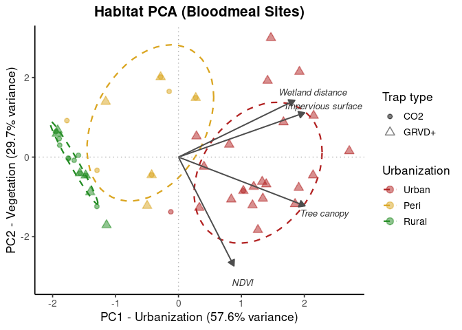<!-- -->

### PCA - WNV dataset

``` r
# Check mosq_species breakdown
table(wnv$mosq_species,wnv$urbanization, wnv$trap_type)
```

    ## , ,  = BGSENT
    ## 
    ##                
    ##                 Peri Rural Urban
    ##   Cx_pipiens_sl    0     0     2
    ##   Cx_tarsalis      2     0     5
    ## 
    ## , ,  = CO2
    ## 
    ##                
    ##                 Peri Rural Urban
    ##   Cx_pipiens_sl  910   309   165
    ##   Cx_tarsalis   1345  1949   207
    ## 
    ## , ,  = GRVD
    ## 
    ##                
    ##                 Peri Rural Urban
    ##   Cx_pipiens_sl    3     0  1443
    ##   Cx_tarsalis      0     1    59
    ## 
    ## , ,  = OTHER
    ## 
    ##                
    ##                 Peri Rural Urban
    ##   Cx_pipiens_sl    0     0     0
    ##   Cx_tarsalis      0     2     0
    ## 
    ## , ,  = REST
    ## 
    ##                
    ##                 Peri Rural Urban
    ##   Cx_pipiens_sl    0     0     0
    ##   Cx_tarsalis      7     7     0

``` r
# Pool trap types and check breakdown by trap
wnv$trap_type2 <- wnv$trap_type

# Mutate trap_type to pool walk-in and trash can
wnv <- wnv %>%
  mutate(trap_type2 = case_when(
    trap_type2 == "BGSENT" ~ "CO2+",
    TRUE                     ~ trap_type2
  ))

wnv <- wnv %>%
  mutate(trap_type2 = case_when(
    trap_type2 == "CO2" ~ "CO2+",
    TRUE                     ~ trap_type2
  ))

wnv <- wnv %>%
  mutate(trap_type2 = case_when(
    trap_type2 == "GRVD" ~ "GRVD+",
    TRUE                     ~ trap_type2
  ))

wnv <- wnv %>%
  mutate(trap_type2 = case_when(
    trap_type2 == "OTHER" ~ "GRVD+",
    TRUE                     ~ trap_type2
  ))

wnv <- wnv %>%
  mutate(trap_type2 = case_when(
    trap_type2 == "REST" ~ "GRVD+",
    TRUE                     ~ trap_type2
  ))

table(wnv$mosq_species,wnv$urbanization,wnv$trap_type2)
```

    ## , ,  = CO2+
    ## 
    ##                
    ##                 Peri Rural Urban
    ##   Cx_pipiens_sl  910   309   167
    ##   Cx_tarsalis   1347  1949   212
    ## 
    ## , ,  = GRVD+
    ## 
    ##                
    ##                 Peri Rural Urban
    ##   Cx_pipiens_sl    3     0  1443
    ##   Cx_tarsalis      7    10    59

``` r
# Use only sites represented in the WNV dataset to define the PCA
wnv_habitat_sites <- wnv %>%
  filter(site_code != "0") %>%
  distinct(
    site_code,
    impervious_500,
    canopy_500,
    dist_wetland_m,
    summer_ndvi_500
  ) %>%
  filter(complete.cases(
    impervious_500,
    canopy_500,
    dist_wetland_m,
    summer_ndvi_500
  ))

# Run PCA
wnv_pca_vars <- wnv_habitat_sites %>%
  dplyr::select(
    impervious_500,
    canopy_500,
    dist_wetland_m,
    summer_ndvi_500
  )

wnv_pca <- prcomp(
  wnv_pca_vars,
  center = TRUE,
  scale. = TRUE
)

summary(wnv_pca)
```

    ## Importance of components:
    ##                           PC1    PC2     PC3     PC4
    ## Standard deviation     1.5181 1.0878 0.56109 0.44393
    ## Proportion of Variance 0.5762 0.2958 0.07871 0.04927
    ## Cumulative Proportion  0.5762 0.8720 0.95073 1.00000

``` r
round(wnv_pca$rotation, 3)
```

    ##                    PC1    PC2    PC3    PC4
    ## impervious_500  -0.549  0.359  0.589 -0.471
    ## canopy_500      -0.579 -0.301  0.223  0.724
    ## dist_wetland_m  -0.513  0.432 -0.742 -0.001
    ## summer_ndvi_500 -0.317 -0.770 -0.229 -0.504

``` r
# Add PCA scores to site-level table
wnv_habitat_sites <- wnv_habitat_sites %>%
  mutate(
    habitat_PC1 = wnv_pca$x[,1],
    habitat_PC2 = wnv_pca$x[,2]
  )

# Join PCA scores back to full WNV table
wnv <- wnv %>%
  dplyr::select(-any_of(c("habitat_PC1", "habitat_PC2"))) %>%
  left_join(
    wnv_habitat_sites %>%
      dplyr::select(site_code, habitat_PC1, habitat_PC2),
    by = "site_code"
  )

urb_colors <- c(
  "Urban" = "#B22222",
  "Peri"  = "#DAA520",
  "Rural" = "#228B22"
)

# Site/trap-level PCA scores from WNV object
pca_scores_df <- wnv %>%
  distinct(
    site_code,
    trap_type2,
    urbanization,
    habitat_PC1,
    habitat_PC2
  ) %>%
  filter(
    !is.na(habitat_PC1),
    !is.na(habitat_PC2),
    !is.na(trap_type2)
  ) %>%
  mutate(
    urbanization = factor(
      urbanization,
      levels = c("Urban", "Peri", "Rural")
    ),
    PC1 = habitat_PC1,
    PC2 = habitat_PC2
  )

# PCA variable loadings
loadings_df <- as.data.frame(wnv_pca$rotation) %>%
  rownames_to_column("variable") %>%
  mutate(
    variable = recode(
      variable,
      "impervious_500"  = "Impervious surface",
      "canopy_500"      = "Tree canopy",
      "dist_wetland_m"  = "Wetland distance",
      "summer_ndvi_500" = "NDVI"
    )
  )

arrow_scale <- 3.5

p2_biplot <- ggplot() +
  stat_ellipse(
    data = pca_scores_df,
    aes(x = PC1, y = PC2, color = urbanization),
    level = 0.75,
    linewidth = 0.8,
    linetype = "dashed"
  ) +
  geom_point(
    data = pca_scores_df,
    aes(
      x = PC1,
      y = PC2,
      color = urbanization,
      fill = urbanization,
      shape = trap_type2
    ),
    size = 3,
    alpha = 0.5,
    stroke = 0.8
  ) +
  geom_segment(
    data = loadings_df,
    aes(
      x = 0,
      y = 0,
      xend = PC1 * arrow_scale,
      yend = PC2 * arrow_scale
    ),
    arrow = arrow(length = unit(0.25, "cm"), type = "closed"),
    color = "gray30",
    linewidth = 0.7
  ) +
  geom_text(
    data = loadings_df,
    aes(
      x = PC1 * arrow_scale * 1.15,
      y = PC2 * arrow_scale * 1.15,
      label = variable
    ),
    size = 3.5,
    color = "gray20",
    fontface = "italic"
  ) +
  geom_hline(yintercept = 0, linetype = "dotted", color = "gray70") +
  geom_vline(xintercept = 0, linetype = "dotted", color = "gray70") +
  scale_color_manual(values = urb_colors, name = "Urbanization") +
  scale_fill_manual(values = urb_colors, name = "Urbanization") +
  scale_shape_manual(
    values = c(
      "CO2+" = 20,
      "GRVD+" = 24
    ),
    name = "Trap type"
  ) +
  labs(
    title = "Habitat PCA (WNV Sites)",
       x = "PC1 - Urbanization (57.6% variance)",
    y = "PC2 - Vegetation (29.7% variance)"
  ) +
  scale_x_reverse() +
  theme_classic(base_size = 13) +
  theme(
    plot.title = element_text(face = "bold", hjust = 0.5),
    plot.subtitle = element_text(hjust = 0.5, color = "gray40"),
    legend.position = "right"
  )

print(p2_biplot)
```

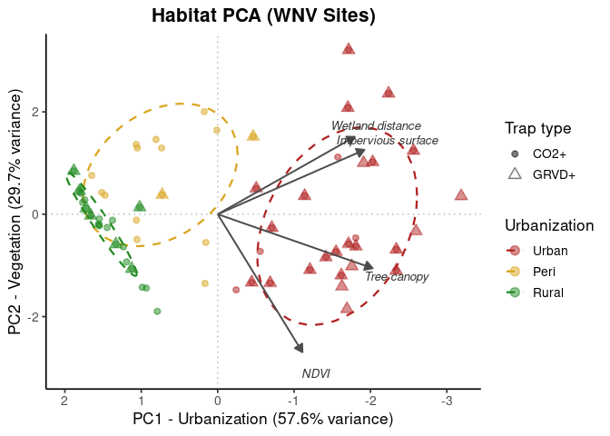<!-- -->

# RQ1: Bloodmeal

``` r
# MODEL 1: Bloodmeal host ~ mosquito species + urbanization
# Make sure it's a factor
bloodmeal <- bloodmeal %>%
mutate(host_3_categories = factor(host_3_categories))
# Check levels — brm will use the fir
levels(bloodmeal$host_3_categories)
```

    ## [1] "Mammal"                        "Other bird"                   
    ## [3] "Passerformes (top bird order)"

``` r
# make "Other bird" reference category
bloodmeal <- bloodmeal %>%
mutate(host_3_categories = relevel(host_3_categories,
ref = "Other bird"))
levels(bloodmeal$host_3_categories)
```

    ## [1] "Other bird"                    "Mammal"                       
    ## [3] "Passerformes (top bird order)"

``` r
# fit model
model_1 <- brm(
host_3_categories ~ mosq_species + habitat_PC1 + (1|site_code) + (1|year),
family = categorical(),
data = bloodmeal,
cores = 4,
chains = 4,
iter = 4000,
warmup = 2000,
control = list(adapt_delta = 0.99),
file = "../results/bloodmeal_host3_habitatPC1",
seed = 908275
)

summary(model_1)
```

    ## Warning: There were 4 divergent transitions after warmup. Increasing
    ## adapt_delta above 0.99 may help. See
    ## http://mc-stan.org/misc/warnings.html#divergent-transitions-after-warmup

    ##  Family: categorical 
    ##   Links: muMammal = logit; muPasserformestopbirdorder = logit 
    ## Formula: host_3_categories ~ mosq_species + habitat_PC1 + (1 | site_code) + (1 | year) 
    ##    Data: bloodmeal (Number of observations: 401) 
    ##   Draws: 4 chains, each with iter = 4000; warmup = 2000; thin = 1;
    ##          total post-warmup draws = 8000
    ## 
    ## Multilevel Hyperparameters:
    ## ~site_code (Number of levels: 44) 
    ##                                          Estimate Est.Error l-95% CI u-95% CI
    ## sd(muMammal_Intercept)                       1.07      0.44     0.35     2.06
    ## sd(muPasserformestopbirdorder_Intercept)     0.87      0.28     0.41     1.50
    ##                                          Rhat Bulk_ESS Tail_ESS
    ## sd(muMammal_Intercept)                   1.00     1744     1417
    ## sd(muPasserformestopbirdorder_Intercept) 1.00     2346     3450
    ## 
    ## ~year (Number of levels: 3) 
    ##                                          Estimate Est.Error l-95% CI u-95% CI
    ## sd(muMammal_Intercept)                       0.70      0.76     0.02     2.81
    ## sd(muPasserformestopbirdorder_Intercept)     0.51      0.61     0.01     2.26
    ##                                          Rhat Bulk_ESS Tail_ESS
    ## sd(muMammal_Intercept)                   1.00     2927     4098
    ## sd(muPasserformestopbirdorder_Intercept) 1.00     2521     3876
    ## 
    ## Regression Coefficients:
    ##                                                    Estimate Est.Error l-95% CI
    ## muMammal_Intercept                                    -1.45      0.76    -2.89
    ## muPasserformestopbirdorder_Intercept                   1.12      0.49     0.07
    ## muMammal_mosq_speciesCx_tarsalis                       0.42      0.78    -1.11
    ## muMammal_habitat_PC1                                   0.46      0.30    -0.11
    ## muPasserformestopbirdorder_mosq_speciesCx_tarsalis    -1.12      0.43    -2.00
    ## muPasserformestopbirdorder_habitat_PC1                -0.22      0.19    -0.61
    ##                                                    u-95% CI Rhat Bulk_ESS
    ## muMammal_Intercept                                     0.10 1.00     3198
    ## muPasserformestopbirdorder_Intercept                   2.02 1.00     3117
    ## muMammal_mosq_speciesCx_tarsalis                       1.91 1.00     4376
    ## muMammal_habitat_PC1                                   1.07 1.00     4011
    ## muPasserformestopbirdorder_mosq_speciesCx_tarsalis    -0.29 1.00     5628
    ## muPasserformestopbirdorder_habitat_PC1                 0.14 1.00     3403
    ##                                                    Tail_ESS
    ## muMammal_Intercept                                     3181
    ## muPasserformestopbirdorder_Intercept                   2386
    ## muMammal_mosq_speciesCx_tarsalis                       5176
    ## muMammal_habitat_PC1                                   4837
    ## muPasserformestopbirdorder_mosq_speciesCx_tarsalis     5845
    ## muPasserformestopbirdorder_habitat_PC1                 3698
    ## 
    ## Draws were sampled using sampling(NUTS). For each parameter, Bulk_ESS
    ## and Tail_ESS are effective sample size measures, and Rhat is the potential
    ## scale reduction factor on split chains (at convergence, Rhat = 1).

``` r
pp_check(model_1, ndraws = 100) 
```

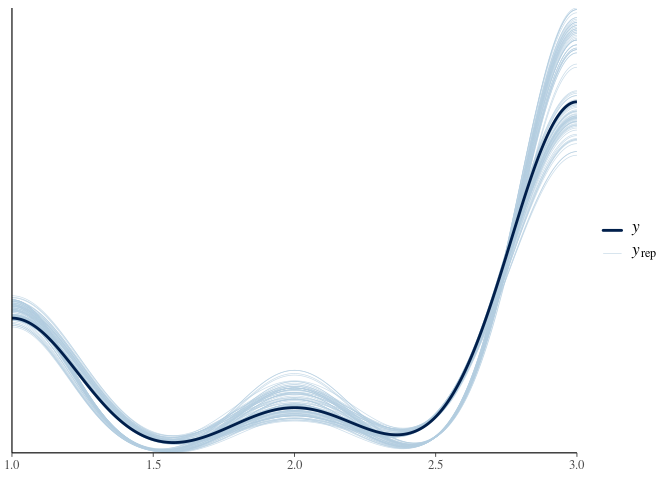<!-- -->

``` r
mcmc_trace(model_1, pars = vars(contains("habitat_PC1")))
```

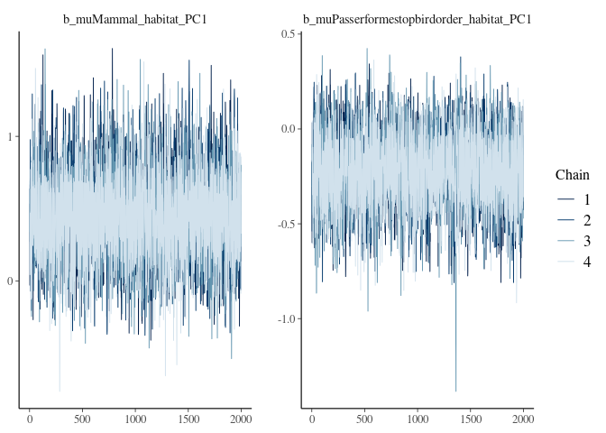<!-- -->

``` r
mcmc_trace(model_1, pars = vars(contains("mosq_species")))
```

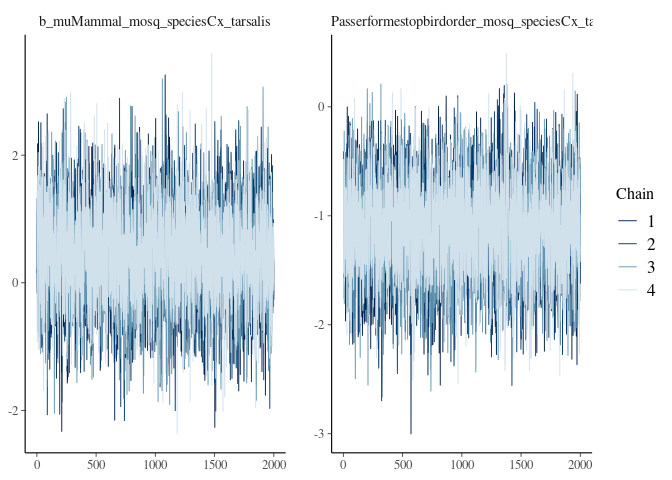<!-- --> \# RQ2: WNV probability

## Pipiens

### Pip model 2v1

``` r
# Pip MODEL 2v1: WNV infection ~ urbanization + GAM smooths

# Make sure all random effect variables are factors
wnv <- wnv %>%
mutate(
site_code = factor(site_code),
trap_type2 = factor(trap_type2),
year_f = factor(year)
)

pipiens_data <- wnv %>% filter(mosq_species == "Cx_pipiens_sl")

gam_pipiens <- gam(
infected ~ habitat_PC1 +
  s(disease_week, bs = "tp", k = 8) +
s(disease_week, by = year_f, bs = "fs", k = 15) +
s(year_f, bs = "re") +
s(site_code, bs = "re") +
s(trap_type2, bs = "re") + #trap_type2 is random effect
offset(log(num_count)),
family = binomial(link = "cloglog"),
data = pipiens_data,
method = "REML"
)
summary(gam_pipiens)
```

    ## 
    ## Family: binomial 
    ## Link function: cloglog 
    ## 
    ## Formula:
    ## infected ~ habitat_PC1 + s(disease_week, bs = "tp", k = 8) + 
    ##     s(disease_week, by = year_f, bs = "fs", k = 15) + s(year_f, 
    ##     bs = "re") + s(site_code, bs = "re") + s(trap_type2, bs = "re") + 
    ##     offset(log(num_count))
    ## 
    ## Parametric coefficients:
    ##             Estimate Std. Error z value Pr(>|z|)    
    ## (Intercept) -7.60007    0.92133  -8.249  < 2e-16 ***
    ## habitat_PC1 -0.26895    0.08602  -3.127  0.00177 ** 
    ## ---
    ## Signif. codes:  0 '***' 0.001 '**' 0.01 '*' 0.05 '.' 0.1 ' ' 1
    ## 
    ## Approximate significance of smooth terms:
    ##                                edf Ref.df Chi.sq  p-value    
    ## s(disease_week)            4.36446  5.106 54.269  < 2e-16 ***
    ## s(disease_week):year_f2018 5.12549  6.294  7.975    0.226    
    ## s(disease_week):year_f2019 2.18803  2.741  4.395    0.301    
    ## s(disease_week):year_f2020 2.06694  2.817  4.570    0.222    
    ## s(disease_week):year_f2021 1.00074  1.001  0.367    0.545    
    ## s(disease_week):year_f2022 1.00018  1.000  0.572    0.450    
    ## s(disease_week):year_f2023 1.03686  1.072  0.472    0.493    
    ## s(year_f)                  4.19828  5.000 83.083  < 2e-16 ***
    ## s(site_code)               0.01599 62.000  0.016    0.482    
    ## s(trap_type2)              0.95536  1.000 19.893 2.73e-06 ***
    ## ---
    ## Signif. codes:  0 '***' 0.001 '**' 0.01 '*' 0.05 '.' 0.1 ' ' 1
    ## 
    ## Rank: 164/165
    ## R-sq.(adj) =  0.353   Deviance explained = 38.2%
    ## -REML = 624.01  Scale est. = 1         n = 2832

``` r
#allow smooth to vary across urbanization gradient (non-linear)
gam_pipiens2 <- gam(
  infected ~
    s(habitat_PC1, k = 4) +
    s(disease_week, bs = "tp", k = 8) +
    s(disease_week, by = year_f, bs = "fs", k = 15) +
    s(year_f, bs = "re") +
    s(site_code, bs = "re") +
    s(trap_type2, bs = "re") +   #trap_type2 is random effect
    offset(log(num_count)),
  family = binomial(link = "cloglog"),
  data = pipiens_data,
  method = "REML"
)
summary(gam_pipiens2)
```

    ## 
    ## Family: binomial 
    ## Link function: cloglog 
    ## 
    ## Formula:
    ## infected ~ s(habitat_PC1, k = 4) + s(disease_week, bs = "tp", 
    ##     k = 8) + s(disease_week, by = year_f, bs = "fs", k = 15) + 
    ##     s(year_f, bs = "re") + s(site_code, bs = "re") + s(trap_type2, 
    ##     bs = "re") + offset(log(num_count))
    ## 
    ## Parametric coefficients:
    ##             Estimate Std. Error z value Pr(>|z|)    
    ## (Intercept)  -7.4550     0.9054  -8.234   <2e-16 ***
    ## ---
    ## Signif. codes:  0 '***' 0.001 '**' 0.01 '*' 0.05 '.' 0.1 ' ' 1
    ## 
    ## Approximate significance of smooth terms:
    ##                                  edf Ref.df  Chi.sq  p-value    
    ## s(habitat_PC1)             1.8748501  2.259  11.168  0.00643 ** 
    ## s(disease_week)            4.3730549  5.113  54.954  < 2e-16 ***
    ## s(disease_week):year_f2018 5.2054296  6.385   8.309  0.20781    
    ## s(disease_week):year_f2019 2.1609717  2.707   4.203  0.31717    
    ## s(disease_week):year_f2020 2.0798618  2.833   4.675  0.21297    
    ## s(disease_week):year_f2021 1.0003381  1.001   0.371  0.54299    
    ## s(disease_week):year_f2022 1.0000869  1.000   0.575  0.44842    
    ## s(disease_week):year_f2023 1.0619784  1.120   0.445  0.51029    
    ## s(year_f)                  4.1956961  5.000 111.719  < 2e-16 ***
    ## s(site_code)               0.0006859 62.000   0.001  0.54437    
    ## s(trap_type2)              0.9473901  1.000  10.076 8.75e-06 ***
    ## ---
    ## Signif. codes:  0 '***' 0.001 '**' 0.01 '*' 0.05 '.' 0.1 ' ' 1
    ## 
    ## Rank: 166/167
    ## R-sq.(adj) =  0.355   Deviance explained = 38.4%
    ## -REML = 623.21  Scale est. = 1         n = 2832

``` r
AIC(gam_pipiens, gam_pipiens2)
```

    ##                    df      AIC
    ## gam_pipiens  27.64861 1231.843
    ## gam_pipiens2 28.99880 1231.156

``` r
plot(
  gam_pipiens2,
  select = 1,
  shade = TRUE,
  residuals = TRUE,
  rug = TRUE
)
```

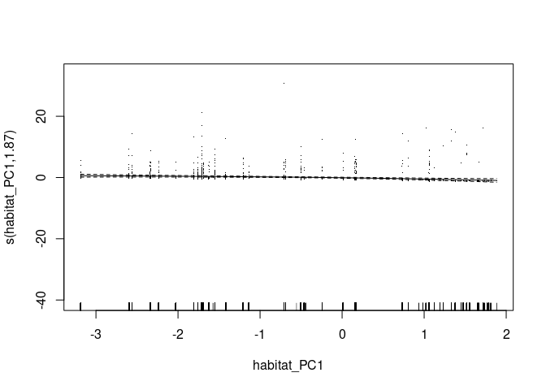<!-- -->

``` r
# Pipiens diagnostics
par(mfrow = c(2, 2))
gam.check(gam_pipiens)
```

<!-- -->

    ## 
    ## Method: REML   Optimizer: outer newton
    ## full convergence after 17 iterations.
    ## Gradient range [-0.0002183795,4.48167e-05]
    ## (score 624.0069 & scale 1).
    ## Hessian positive definite, eigenvalue range [4.074836e-05,1.364654].
    ## Model rank =  164 / 165 
    ## 
    ## Basis dimension (k) checking results. Low p-value (k-index<1) may
    ## indicate that k is too low, especially if edf is close to k'.
    ## 
    ##                                k'    edf k-index p-value    
    ## s(disease_week)             7.000  4.364    0.86  <2e-16 ***
    ## s(disease_week):year_f2018 14.000  5.125    0.86  <2e-16 ***
    ## s(disease_week):year_f2019 14.000  2.188    0.86  <2e-16 ***
    ## s(disease_week):year_f2020 14.000  2.067    0.86  <2e-16 ***
    ## s(disease_week):year_f2021 14.000  1.001    0.86  <2e-16 ***
    ## s(disease_week):year_f2022 14.000  1.000    0.86  <2e-16 ***
    ## s(disease_week):year_f2023 14.000  1.037    0.86  <2e-16 ***
    ## s(year_f)                   6.000  4.198      NA      NA    
    ## s(site_code)               64.000  0.016      NA      NA    
    ## s(trap_type2)               2.000  0.955      NA      NA    
    ## ---
    ## Signif. codes:  0 '***' 0.001 '**' 0.01 '*' 0.05 '.' 0.1 ' ' 1

``` r
par(mfrow = c(1, 1))
plot(gam_pipiens, pages = 1, residuals = TRUE, shade = TRUE, seWithMean = TRUE)
```

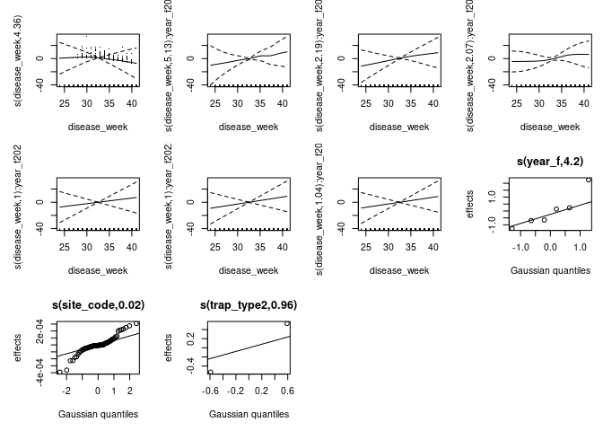<!-- -->

``` r
# Concurvity
concurvity(gam_pipiens, full = FALSE)
```

    ## $worst
    ##                                    para s(disease_week)
    ## para                       1.000000e+00    1.941442e-23
    ## s(disease_week)            1.940983e-23    1.000000e+00
    ## s(disease_week):year_f2018 5.071383e-03    4.681923e-01
    ## s(disease_week):year_f2019 5.433696e-02    2.215608e-01
    ## s(disease_week):year_f2020 1.061408e-01    4.546177e-01
    ## s(disease_week):year_f2021 7.879919e-02    3.348028e-01
    ## s(disease_week):year_f2022 1.180812e-01    1.568721e-01
    ## s(disease_week):year_f2023 1.797436e-01    2.303840e-01
    ## s(year_f)                  1.000000e+00    4.112721e-02
    ## s(site_code)               1.000000e+00    9.544583e-02
    ## s(trap_type2)              1.000000e+00    2.788658e-02
    ##                            s(disease_week):year_f2018
    ## para                                     5.071383e-03
    ## s(disease_week)                          4.681923e-01
    ## s(disease_week):year_f2018               1.000000e+00
    ## s(disease_week):year_f2019               5.050968e-28
    ## s(disease_week):year_f2020               7.567960e-02
    ## s(disease_week):year_f2021               2.784376e-27
    ## s(disease_week):year_f2022               2.846839e-27
    ## s(disease_week):year_f2023               3.519355e-27
    ## s(year_f)                                2.233617e-02
    ## s(site_code)                             3.665372e-01
    ## s(trap_type2)                            6.399520e-03
    ##                            s(disease_week):year_f2019
    ## para                                     5.433696e-02
    ## s(disease_week)                          2.215608e-01
    ## s(disease_week):year_f2018               8.646972e-28
    ## s(disease_week):year_f2019               1.000000e+00
    ## s(disease_week):year_f2020               4.484206e-02
    ## s(disease_week):year_f2021               3.137011e-27
    ## s(disease_week):year_f2022               3.585877e-27
    ## s(disease_week):year_f2023               2.766401e-27
    ## s(year_f)                                3.029178e-01
    ## s(site_code)                             6.769118e-02
    ## s(trap_type2)                            5.478231e-02
    ##                            s(disease_week):year_f2020
    ## para                                       0.11083656
    ## s(disease_week)                            0.43000310
    ## s(disease_week):year_f2018                 0.05858684
    ## s(disease_week):year_f2019                 0.07942127
    ## s(disease_week):year_f2020                 1.00000000
    ## s(disease_week):year_f2021                 0.11305143
    ## s(disease_week):year_f2022                 0.08957624
    ## s(disease_week):year_f2023                 0.10603216
    ## s(year_f)                                  1.00005416
    ## s(site_code)                               0.20795946
    ## s(trap_type2)                              0.10849624
    ##                            s(disease_week):year_f2021
    ## para                                     7.879919e-02
    ## s(disease_week)                          3.348028e-01
    ## s(disease_week):year_f2018               3.254442e-27
    ## s(disease_week):year_f2019               3.973570e-27
    ## s(disease_week):year_f2020               7.357952e-02
    ## s(disease_week):year_f2021               1.000000e+00
    ## s(disease_week):year_f2022               4.396972e-27
    ## s(disease_week):year_f2023               6.250204e-27
    ## s(year_f)                                4.155667e-01
    ## s(site_code)                             8.673882e-02
    ## s(trap_type2)                            7.982927e-02
    ##                            s(disease_week):year_f2022
    ## para                                     1.180812e-01
    ## s(disease_week)                          1.568721e-01
    ## s(disease_week):year_f2018               5.617883e-27
    ## s(disease_week):year_f2019               3.057779e-27
    ## s(disease_week):year_f2020               5.689069e-02
    ## s(disease_week):year_f2021               6.230572e-27
    ## s(disease_week):year_f2022               1.000000e+00
    ## s(disease_week):year_f2023               7.435515e-27
    ## s(year_f)                                9.982268e-01
    ## s(site_code)                             1.495823e-01
    ## s(trap_type2)                            1.341744e-01
    ##                            s(disease_week):year_f2023  s(year_f) s(site_code)
    ## para                                     1.797436e-01 1.00000000   1.00000000
    ## s(disease_week)                          2.303840e-01 0.04112721   0.09544583
    ## s(disease_week):year_f2018               2.244281e-27 0.02233617   0.36653721
    ## s(disease_week):year_f2019               3.614184e-27 0.30291783   0.06769118
    ## s(disease_week):year_f2020               3.223185e-02 1.00000000   0.13752848
    ## s(disease_week):year_f2021               3.697352e-27 0.41556667   0.08673882
    ## s(disease_week):year_f2022               1.268117e-26 0.99822678   0.14958233
    ## s(disease_week):year_f2023               1.000000e+00 0.99615267   0.22154850
    ## s(year_f)                                9.961527e-01 1.00000000   1.00000000
    ## s(site_code)                             2.215485e-01 1.00000000   1.00000000
    ## s(trap_type2)                            1.875997e-01 1.00000000   1.00000000
    ##                            s(trap_type2)
    ## para                          1.00000000
    ## s(disease_week)               0.02788658
    ## s(disease_week):year_f2018    0.00639952
    ## s(disease_week):year_f2019    0.05478231
    ## s(disease_week):year_f2020    0.10885476
    ## s(disease_week):year_f2021    0.07982927
    ## s(disease_week):year_f2022    0.13417444
    ## s(disease_week):year_f2023    0.18759971
    ## s(year_f)                     1.00000000
    ## s(site_code)                  1.00000000
    ## s(trap_type2)                 1.00000000
    ## 
    ## $observed
    ##                                    para s(disease_week)
    ## para                       1.000000e+00    1.059331e-28
    ## s(disease_week)            1.940983e-23    1.000000e+00
    ## s(disease_week):year_f2018 5.071383e-03    2.334313e-01
    ## s(disease_week):year_f2019 5.433696e-02    1.747308e-01
    ## s(disease_week):year_f2020 1.061408e-01    2.710051e-01
    ## s(disease_week):year_f2021 7.879919e-02    1.893407e-01
    ## s(disease_week):year_f2022 1.180812e-01    1.205941e-01
    ## s(disease_week):year_f2023 1.797436e-01    1.355414e-01
    ## s(year_f)                  1.000000e+00    1.453969e-02
    ## s(site_code)               1.000000e+00    3.409202e-02
    ## s(trap_type2)              1.000000e+00    8.804224e-03
    ##                            s(disease_week):year_f2018
    ## para                                     7.644684e-04
    ## s(disease_week)                          2.634436e-01
    ## s(disease_week):year_f2018               1.000000e+00
    ## s(disease_week):year_f2019               1.074622e-28
    ## s(disease_week):year_f2020               1.258660e-02
    ## s(disease_week):year_f2021               1.023457e-27
    ## s(disease_week):year_f2022               9.522988e-28
    ## s(disease_week):year_f2023               1.522771e-27
    ## s(year_f)                                3.366990e-03
    ## s(site_code)                             5.758839e-02
    ## s(trap_type2)                            9.820718e-04
    ##                            s(disease_week):year_f2019
    ## para                                     2.050739e-03
    ## s(disease_week)                          1.798297e-01
    ## s(disease_week):year_f2018               4.288753e-29
    ## s(disease_week):year_f2019               1.000000e+00
    ## s(disease_week):year_f2020               5.361904e-03
    ## s(disease_week):year_f2021               1.161951e-27
    ## s(disease_week):year_f2022               9.306786e-28
    ## s(disease_week):year_f2023               6.094502e-28
    ## s(year_f)                                1.143247e-02
    ## s(site_code)                             1.897623e-02
    ## s(trap_type2)                            2.710158e-03
    ##                            s(disease_week):year_f2020
    ## para                                     7.986741e-03
    ## s(disease_week)                          1.571275e-01
    ## s(disease_week):year_f2018               2.432137e-29
    ## s(disease_week):year_f2019               1.871254e-29
    ## s(disease_week):year_f2020               1.000000e+00
    ## s(disease_week):year_f2021               1.145870e-27
    ## s(disease_week):year_f2022               8.620914e-28
    ## s(disease_week):year_f2023               1.771522e-28
    ## s(year_f)                                7.590084e-02
    ## s(site_code)                             2.703400e-02
    ## s(trap_type2)                            8.329014e-03
    ##                            s(disease_week):year_f2021
    ## para                                     1.431630e-03
    ## s(disease_week)                          2.224367e-01
    ## s(disease_week):year_f2018               3.519121e-29
    ## s(disease_week):year_f2019               1.295488e-28
    ## s(disease_week):year_f2020               3.859448e-02
    ## s(disease_week):year_f2021               1.000000e+00
    ## s(disease_week):year_f2022               1.173726e-28
    ## s(disease_week):year_f2023               1.585896e-27
    ## s(year_f)                                7.550048e-03
    ## s(site_code)                             1.385173e-02
    ## s(trap_type2)                            2.348505e-03
    ##                            s(disease_week):year_f2022
    ## para                                     3.185660e-07
    ## s(disease_week)                          1.376531e-01
    ## s(disease_week):year_f2018               2.949421e-29
    ## s(disease_week):year_f2019               1.479767e-28
    ## s(disease_week):year_f2020               2.520543e-02
    ## s(disease_week):year_f2021               5.049935e-28
    ## s(disease_week):year_f2022               1.000000e+00
    ## s(disease_week):year_f2023               3.691907e-27
    ## s(year_f)                                2.693072e-06
    ## s(site_code)                             1.142256e-02
    ## s(trap_type2)                            3.810619e-03
    ##                            s(disease_week):year_f2023   s(year_f) s(site_code)
    ## para                                     4.520567e-03 0.004305631 0.0071285375
    ## s(disease_week)                          1.766008e-01 0.012525289 0.0009114112
    ## s(disease_week):year_f2018               2.851826e-29 0.001842006 0.0022395584
    ## s(disease_week):year_f2019               4.233669e-28 0.017661122 0.0028695109
    ## s(disease_week):year_f2020               2.139931e-02 0.126731007 0.0025753854
    ## s(disease_week):year_f2021               3.414730e-28 0.300781210 0.0016331126
    ## s(disease_week):year_f2022               1.521796e-27 0.001659827 0.0041805396
    ## s(disease_week):year_f2023               1.000000e+00 0.007037456 0.0027263474
    ## s(year_f)                                2.505332e-02 1.000000000 0.0074491562
    ## s(site_code)                             4.165931e-02 0.027588118 1.0000000000
    ## s(trap_type2)                            4.686073e-03 0.006552881 0.0094156300
    ##                            s(trap_type2)
    ## para                        0.0004488653
    ## s(disease_week)             0.0278740675
    ## s(disease_week):year_f2018  0.0043918711
    ## s(disease_week):year_f2019  0.0063093760
    ## s(disease_week):year_f2020  0.0222764377
    ## s(disease_week):year_f2021  0.0111210014
    ## s(disease_week):year_f2022  0.0357674237
    ## s(disease_week):year_f2023  0.0117645171
    ## s(year_f)                   0.0269841346
    ## s(site_code)                0.8793244330
    ## s(trap_type2)               1.0000000000
    ## 
    ## $estimate
    ##                                    para s(disease_week)
    ## para                       1.000000e+00    1.222128e-25
    ## s(disease_week)            1.940983e-23    1.000000e+00
    ## s(disease_week):year_f2018 5.071383e-03    2.531781e-01
    ## s(disease_week):year_f2019 5.433696e-02    1.612299e-01
    ## s(disease_week):year_f2020 1.061408e-01    1.773309e-01
    ## s(disease_week):year_f2021 7.879919e-02    2.102456e-01
    ## s(disease_week):year_f2022 1.180812e-01    1.253974e-01
    ## s(disease_week):year_f2023 1.797436e-01    1.540088e-01
    ## s(year_f)                  1.000000e+00    1.957651e-02
    ## s(site_code)               1.000000e+00    3.243903e-02
    ## s(trap_type2)              1.000000e+00    3.506564e-03
    ##                            s(disease_week):year_f2018
    ## para                                     9.893237e-04
    ## s(disease_week)                          2.707873e-01
    ## s(disease_week):year_f2018               1.000000e+00
    ## s(disease_week):year_f2019               1.134861e-28
    ## s(disease_week):year_f2020               1.450892e-02
    ## s(disease_week):year_f2021               9.664091e-28
    ## s(disease_week):year_f2022               7.362351e-28
    ## s(disease_week):year_f2023               1.347195e-27
    ## s(year_f)                                4.357333e-03
    ## s(site_code)                             5.780702e-02
    ## s(trap_type2)                            1.408233e-03
    ##                            s(disease_week):year_f2019
    ## para                                     2.023344e-03
    ## s(disease_week)                          1.719342e-01
    ## s(disease_week):year_f2018               3.689118e-29
    ## s(disease_week):year_f2019               1.000000e+00
    ## s(disease_week):year_f2020               8.358359e-03
    ## s(disease_week):year_f2021               1.092366e-27
    ## s(disease_week):year_f2022               7.764891e-28
    ## s(disease_week):year_f2023               5.383117e-28
    ## s(year_f)                                1.127975e-02
    ## s(site_code)                             1.835425e-02
    ## s(trap_type2)                            2.681105e-03
    ##                            s(disease_week):year_f2020
    ## para                                     1.395392e-02
    ## s(disease_week)                          2.022136e-01
    ## s(disease_week):year_f2018               1.579745e-29
    ## s(disease_week):year_f2019               2.781195e-29
    ## s(disease_week):year_f2020               1.000000e+00
    ## s(disease_week):year_f2021               1.007171e-27
    ## s(disease_week):year_f2022               7.187735e-28
    ## s(disease_week):year_f2023               2.426434e-28
    ## s(year_f)                                1.326091e-01
    ## s(site_code)                             2.936554e-02
    ## s(trap_type2)                            1.530231e-02
    ##                            s(disease_week):year_f2021
    ## para                                     1.550270e-03
    ## s(disease_week)                          2.309533e-01
    ## s(disease_week):year_f2018               2.767260e-29
    ## s(disease_week):year_f2019               1.445643e-28
    ## s(disease_week):year_f2020               3.098115e-02
    ## s(disease_week):year_f2021               1.000000e+00
    ## s(disease_week):year_f2022               2.003906e-28
    ## s(disease_week):year_f2023               1.512340e-27
    ## s(year_f)                                8.175724e-03
    ## s(site_code)                             1.333753e-02
    ## s(trap_type2)                            2.676868e-03
    ##                            s(disease_week):year_f2022
    ## para                                     7.847869e-05
    ## s(disease_week)                          1.340986e-01
    ## s(disease_week):year_f2018               2.417891e-29
    ## s(disease_week):year_f2019               1.410376e-28
    ## s(disease_week):year_f2020               2.282157e-02
    ## s(disease_week):year_f2021               4.995219e-28
    ## s(disease_week):year_f2022               1.000000e+00
    ## s(disease_week):year_f2023               3.676528e-27
    ## s(year_f)                                6.634378e-04
    ## s(site_code)                             1.111708e-02
    ## s(trap_type2)                            3.804237e-03
    ##                            s(disease_week):year_f2023   s(year_f) s(site_code)
    ## para                                     3.730075e-03 0.177305771  0.023785371
    ## s(disease_week)                          1.750796e-01 0.010246549  0.002054811
    ## s(disease_week):year_f2018               2.283991e-29 0.005071383  0.002727109
    ## s(disease_week):year_f2019               4.267336e-28 0.054336955  0.003630511
    ## s(disease_week):year_f2020               1.709365e-02 0.105945448  0.005813635
    ## s(disease_week):year_f2021               4.118264e-28 0.078799188  0.003754146
    ## s(disease_week):year_f2022               1.223852e-27 0.118081205  0.006076829
    ## s(disease_week):year_f2023               1.000000e+00 0.179743649  0.006914720
    ## s(year_f)                                2.067235e-02 1.000000000  0.026031722
    ## s(site_code)                             3.691392e-02 0.206328264  1.000000000
    ## s(trap_type2)                            3.981089e-03 0.181119853  0.043830949
    ##                            s(trap_type2)
    ## para                         0.500224433
    ## s(disease_week)              0.013937034
    ## s(disease_week):year_f2018   0.004731627
    ## s(disease_week):year_f2019   0.030323166
    ## s(disease_week):year_f2020   0.064208610
    ## s(disease_week):year_f2021   0.044960095
    ## s(disease_week):year_f2022   0.076924314
    ## s(disease_week):year_f2023   0.095754083
    ## s(year_f)                    0.513492067
    ## s(site_code)                 0.939662217
    ## s(trap_type2)                1.000000000

``` r
# Pipiens diagnostics
par(mfrow = c(2, 2))
gam.check(gam_pipiens2)
```

<!-- -->

    ## 
    ## Method: REML   Optimizer: outer newton
    ## full convergence after 18 iterations.
    ## Gradient range [-0.0001016829,2.16982e-05]
    ## (score 623.208 & scale 1).
    ## Hessian positive definite, eigenvalue range [1.869888e-05,1.356398].
    ## Model rank =  166 / 167 
    ## 
    ## Basis dimension (k) checking results. Low p-value (k-index<1) may
    ## indicate that k is too low, especially if edf is close to k'.
    ## 
    ##                                  k'      edf k-index p-value    
    ## s(habitat_PC1)             3.00e+00 1.87e+00    0.31  <2e-16 ***
    ## s(disease_week)            7.00e+00 4.37e+00    0.86  <2e-16 ***
    ## s(disease_week):year_f2018 1.40e+01 5.21e+00    0.86  <2e-16 ***
    ## s(disease_week):year_f2019 1.40e+01 2.16e+00    0.86  <2e-16 ***
    ## s(disease_week):year_f2020 1.40e+01 2.08e+00    0.86  <2e-16 ***
    ## s(disease_week):year_f2021 1.40e+01 1.00e+00    0.86  <2e-16 ***
    ## s(disease_week):year_f2022 1.40e+01 1.00e+00    0.86  <2e-16 ***
    ## s(disease_week):year_f2023 1.40e+01 1.06e+00    0.86  <2e-16 ***
    ## s(year_f)                  6.00e+00 4.20e+00      NA      NA    
    ## s(site_code)               6.40e+01 6.86e-04      NA      NA    
    ## s(trap_type2)              2.00e+00 9.47e-01      NA      NA    
    ## ---
    ## Signif. codes:  0 '***' 0.001 '**' 0.01 '*' 0.05 '.' 0.1 ' ' 1

``` r
par(mfrow = c(1, 1))
plot(gam_pipiens2, pages = 1, residuals = TRUE, shade = TRUE, seWithMean = TRUE)
```

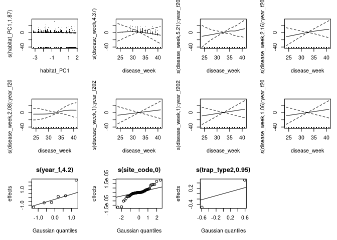<!-- -->

``` r
# Concurvity
concurvity(gam_pipiens2, full = FALSE)
```

    ## $worst
    ##                                    para s(habitat_PC1) s(disease_week)
    ## para                       1.000000e+00   2.824771e-29    1.941442e-23
    ## s(habitat_PC1)             4.437343e-29   1.000000e+00    2.270948e-02
    ## s(disease_week)            1.940847e-23   2.270948e-02    1.000000e+00
    ## s(disease_week):year_f2018 5.071383e-03   1.158146e-02    4.681923e-01
    ## s(disease_week):year_f2019 5.433696e-02   7.140769e-03    2.215608e-01
    ## s(disease_week):year_f2020 1.470478e-01   4.833923e-02    4.308383e-01
    ## s(disease_week):year_f2021 7.879919e-02   9.838742e-03    3.348028e-01
    ## s(disease_week):year_f2022 1.180812e-01   2.317992e-02    1.568721e-01
    ## s(disease_week):year_f2023 1.797436e-01   7.879069e-03    2.303840e-01
    ## s(year_f)                  1.000000e+00   2.401894e-02    4.112721e-02
    ## s(site_code)               1.000000e+00   1.000000e+00    9.544583e-02
    ## s(trap_type2)              1.000000e+00   7.613656e-01    2.788658e-02
    ##                            s(disease_week):year_f2018
    ## para                                     5.071383e-03
    ## s(habitat_PC1)                           1.158146e-02
    ## s(disease_week)                          4.681923e-01
    ## s(disease_week):year_f2018               1.000000e+00
    ## s(disease_week):year_f2019               5.132659e-28
    ## s(disease_week):year_f2020               4.507067e-02
    ## s(disease_week):year_f2021               2.699201e-27
    ## s(disease_week):year_f2022               3.491825e-27
    ## s(disease_week):year_f2023               2.012307e-27
    ## s(year_f)                                2.233617e-02
    ## s(site_code)                             3.665372e-01
    ## s(trap_type2)                            6.399520e-03
    ##                            s(disease_week):year_f2019
    ## para                                     5.433696e-02
    ## s(habitat_PC1)                           7.140769e-03
    ## s(disease_week)                          2.215608e-01
    ## s(disease_week):year_f2018               1.589031e-27
    ## s(disease_week):year_f2019               1.000000e+00
    ## s(disease_week):year_f2020               2.068070e-02
    ## s(disease_week):year_f2021               2.657063e-27
    ## s(disease_week):year_f2022               2.838001e-27
    ## s(disease_week):year_f2023               2.022623e-27
    ## s(year_f)                                3.029178e-01
    ## s(site_code)                             6.769118e-02
    ## s(trap_type2)                            5.478231e-02
    ##                            s(disease_week):year_f2020
    ## para                                       0.11165434
    ## s(habitat_PC1)                             0.05044653
    ## s(disease_week)                            0.59196724
    ## s(disease_week):year_f2018                 0.08399128
    ## s(disease_week):year_f2019                 0.04377086
    ## s(disease_week):year_f2020                 1.00000000
    ## s(disease_week):year_f2021                 0.07483489
    ## s(disease_week):year_f2022                 0.04838689
    ## s(disease_week):year_f2023                 0.14487097
    ## s(year_f)                                  1.01839530
    ## s(site_code)                               0.15269953
    ## s(trap_type2)                              0.15438674
    ##                            s(disease_week):year_f2021
    ## para                                     7.879919e-02
    ## s(habitat_PC1)                           9.838742e-03
    ## s(disease_week)                          3.348028e-01
    ## s(disease_week):year_f2018               2.363927e-27
    ## s(disease_week):year_f2019               4.799722e-27
    ## s(disease_week):year_f2020               4.740465e-02
    ## s(disease_week):year_f2021               1.000000e+00
    ## s(disease_week):year_f2022               4.782465e-27
    ## s(disease_week):year_f2023               5.043887e-27
    ## s(year_f)                                4.155667e-01
    ## s(site_code)                             8.673882e-02
    ## s(trap_type2)                            7.982927e-02
    ##                            s(disease_week):year_f2022
    ## para                                     1.180812e-01
    ## s(habitat_PC1)                           2.317992e-02
    ## s(disease_week)                          1.568721e-01
    ## s(disease_week):year_f2018               3.769378e-27
    ## s(disease_week):year_f2019               4.272980e-27
    ## s(disease_week):year_f2020               4.025120e-02
    ## s(disease_week):year_f2021               2.549686e-27
    ## s(disease_week):year_f2022               1.000000e+00
    ## s(disease_week):year_f2023               7.186560e-27
    ## s(year_f)                                9.982268e-01
    ## s(site_code)                             1.495823e-01
    ## s(trap_type2)                            1.341744e-01
    ##                            s(disease_week):year_f2023  s(year_f) s(site_code)
    ## para                                     1.797436e-01 1.00000000   1.00000000
    ## s(habitat_PC1)                           7.879069e-03 0.02401894   1.00000000
    ## s(disease_week)                          2.303840e-01 0.04112721   0.09544583
    ## s(disease_week):year_f2018               2.901244e-27 0.02233617   0.36653721
    ## s(disease_week):year_f2019               3.310952e-27 0.30291783   0.06769118
    ## s(disease_week):year_f2020               6.220879e-02 1.00000000   0.18572425
    ## s(disease_week):year_f2021               3.443695e-27 0.41556667   0.08673882
    ## s(disease_week):year_f2022               5.258618e-27 0.99822678   0.14958233
    ## s(disease_week):year_f2023               1.000000e+00 0.99615267   0.22154850
    ## s(year_f)                                9.961527e-01 1.00000000   1.00000000
    ## s(site_code)                             2.215485e-01 1.00000000   1.00000000
    ## s(trap_type2)                            1.875997e-01 1.00000000   1.00000000
    ##                            s(trap_type2)
    ## para                          1.00000000
    ## s(habitat_PC1)                0.76136560
    ## s(disease_week)               0.02788658
    ## s(disease_week):year_f2018    0.00639952
    ## s(disease_week):year_f2019    0.05478231
    ## s(disease_week):year_f2020    0.14837327
    ## s(disease_week):year_f2021    0.07982927
    ## s(disease_week):year_f2022    0.13417444
    ## s(disease_week):year_f2023    0.18759971
    ## s(year_f)                     1.00000000
    ## s(site_code)                  1.00000000
    ## s(trap_type2)                 1.00000000
    ## 
    ## $observed
    ##                                    para s(habitat_PC1) s(disease_week)
    ## para                       1.000000e+00   8.879261e-32    9.286181e-29
    ## s(habitat_PC1)             4.437343e-29   1.000000e+00    7.109105e-03
    ## s(disease_week)            1.940847e-23   2.193668e-02    1.000000e+00
    ## s(disease_week):year_f2018 5.071383e-03   8.433588e-03    2.335485e-01
    ## s(disease_week):year_f2019 5.433696e-02   6.691630e-03    1.747161e-01
    ## s(disease_week):year_f2020 1.470478e-01   3.038849e-02    1.513283e-01
    ## s(disease_week):year_f2021 7.879919e-02   9.827865e-03    1.894308e-01
    ## s(disease_week):year_f2022 1.180812e-01   2.175543e-02    1.206928e-01
    ## s(disease_week):year_f2023 1.797436e-01   7.877302e-03    1.357318e-01
    ## s(year_f)                  1.000000e+00   2.379576e-02    1.463670e-02
    ## s(site_code)               1.000000e+00   1.000000e+00    3.400872e-02
    ## s(trap_type2)              1.000000e+00   6.685649e-01    8.651894e-03
    ##                            s(disease_week):year_f2018
    ## para                                     7.708773e-04
    ## s(habitat_PC1)                           2.878392e-03
    ## s(disease_week)                          2.634793e-01
    ## s(disease_week):year_f2018               1.000000e+00
    ## s(disease_week):year_f2019               1.706230e-28
    ## s(disease_week):year_f2020               9.947337e-03
    ## s(disease_week):year_f2021               1.673167e-28
    ## s(disease_week):year_f2022               1.430691e-27
    ## s(disease_week):year_f2023               1.267377e-27
    ## s(year_f)                                3.395217e-03
    ## s(site_code)                             5.761568e-02
    ## s(trap_type2)                            9.913714e-04
    ##                            s(disease_week):year_f2019
    ## para                                     2.043048e-03
    ## s(habitat_PC1)                           2.691705e-03
    ## s(disease_week)                          1.799773e-01
    ## s(disease_week):year_f2018               1.157033e-29
    ## s(disease_week):year_f2019               1.000000e+00
    ## s(disease_week):year_f2020               1.691938e-03
    ## s(disease_week):year_f2021               2.115521e-28
    ## s(disease_week):year_f2022               1.794391e-27
    ## s(disease_week):year_f2023               4.691116e-28
    ## s(year_f)                                1.138959e-02
    ## s(site_code)                             1.897306e-02
    ## s(trap_type2)                            2.693330e-03
    ##                            s(disease_week):year_f2020
    ## para                                     7.948249e-03
    ## s(habitat_PC1)                           3.131385e-04
    ## s(disease_week)                          1.573449e-01
    ## s(disease_week):year_f2018               6.903083e-30
    ## s(disease_week):year_f2019               3.112746e-28
    ## s(disease_week):year_f2020               1.000000e+00
    ## s(disease_week):year_f2021               2.793992e-28
    ## s(disease_week):year_f2022               2.045930e-27
    ## s(disease_week):year_f2023               1.276434e-27
    ## s(year_f)                                7.553504e-02
    ## s(site_code)                             2.700500e-02
    ## s(trap_type2)                            8.285134e-03
    ##                            s(disease_week):year_f2021
    ## para                                     1.431583e-03
    ## s(habitat_PC1)                           2.034423e-04
    ## s(disease_week)                          2.224353e-01
    ## s(disease_week):year_f2018               8.000486e-30
    ## s(disease_week):year_f2019               3.764324e-28
    ## s(disease_week):year_f2020               1.934915e-03
    ## s(disease_week):year_f2021               1.000000e+00
    ## s(disease_week):year_f2022               1.818517e-27
    ## s(disease_week):year_f2023               7.502042e-28
    ## s(year_f)                                7.549800e-03
    ## s(site_code)                             1.385181e-02
    ## s(trap_type2)                            2.348550e-03
    ##                            s(disease_week):year_f2022
    ## para                                     3.185506e-07
    ## s(habitat_PC1)                           1.814448e-03
    ## s(disease_week)                          1.376531e-01
    ## s(disease_week):year_f2018               1.528283e-30
    ## s(disease_week):year_f2019               3.126834e-28
    ## s(disease_week):year_f2020               3.207642e-04
    ## s(disease_week):year_f2021               2.012443e-27
    ## s(disease_week):year_f2022               1.000000e+00
    ## s(disease_week):year_f2023               1.042961e-28
    ## s(year_f)                                2.692941e-06
    ## s(site_code)                             1.142256e-02
    ## s(trap_type2)                            3.810625e-03
    ##                            s(disease_week):year_f2023   s(year_f) s(site_code)
    ## para                                     4.541790e-03 0.004350098 0.0037208947
    ## s(habitat_PC1)                           8.045511e-04 0.003163290 0.0315741976
    ## s(disease_week)                          1.764373e-01 0.012568094 0.0006697396
    ## s(disease_week):year_f2018               3.157763e-30 0.001844821 0.0017866624
    ## s(disease_week):year_f2019               3.588433e-28 0.017128918 0.0025025230
    ## s(disease_week):year_f2020               1.702439e-03 0.129095128 0.0031182406
    ## s(disease_week):year_f2021               2.126193e-27 0.301255890 0.0014690608
    ## s(disease_week):year_f2022               4.198884e-28 0.001626534 0.0033753779
    ## s(disease_week):year_f2023               1.000000e+00 0.006699035 0.0019137669
    ## s(year_f)                                2.517094e-02 1.000000000 0.0041327307
    ## s(site_code)                             4.172016e-02 0.027639663 1.0000000000
    ## s(trap_type2)                            4.709269e-03 0.006629424 0.0048238469
    ##                            s(trap_type2)
    ## para                        0.0004488653
    ## s(habitat_PC1)              0.7610238504
    ## s(disease_week)             0.0278740675
    ## s(disease_week):year_f2018  0.0043918711
    ## s(disease_week):year_f2019  0.0063093760
    ## s(disease_week):year_f2020  0.0401522284
    ## s(disease_week):year_f2021  0.0111210014
    ## s(disease_week):year_f2022  0.0357674237
    ## s(disease_week):year_f2023  0.0117645171
    ## s(year_f)                   0.0269841346
    ## s(site_code)                0.8793244330
    ## s(trap_type2)               1.0000000000
    ## 
    ## $estimate
    ##                                    para s(habitat_PC1) s(disease_week)
    ## para                       1.000000e+00   4.424711e-31    1.222128e-25
    ## s(habitat_PC1)             4.437343e-29   1.000000e+00    3.036894e-03
    ## s(disease_week)            1.940847e-23   1.913499e-02    1.000000e+00
    ## s(disease_week):year_f2018 5.071383e-03   6.420292e-03    2.531781e-01
    ## s(disease_week):year_f2019 5.433696e-02   6.022155e-03    1.612299e-01
    ## s(disease_week):year_f2020 1.470478e-01   3.706571e-02    1.030064e-01
    ## s(disease_week):year_f2021 7.879919e-02   9.170885e-03    2.102456e-01
    ## s(disease_week):year_f2022 1.180812e-01   2.147606e-02    1.253974e-01
    ## s(disease_week):year_f2023 1.797436e-01   7.550275e-03    1.540088e-01
    ## s(year_f)                  1.000000e+00   2.165619e-02    1.957651e-02
    ## s(site_code)               1.000000e+00   1.000000e+00    3.243903e-02
    ## s(trap_type2)              1.000000e+00   7.005931e-01    3.506564e-03
    ##                            s(disease_week):year_f2018
    ## para                                     9.893237e-04
    ## s(habitat_PC1)                           3.227713e-03
    ## s(disease_week)                          2.707873e-01
    ## s(disease_week):year_f2018               1.000000e+00
    ## s(disease_week):year_f2019               1.363037e-28
    ## s(disease_week):year_f2020               1.107099e-02
    ## s(disease_week):year_f2021               1.721929e-28
    ## s(disease_week):year_f2022               1.376864e-27
    ## s(disease_week):year_f2023               9.802321e-28
    ## s(year_f)                                4.357333e-03
    ## s(site_code)                             5.780702e-02
    ## s(trap_type2)                            1.408233e-03
    ##                            s(disease_week):year_f2019
    ## para                                     2.023344e-03
    ## s(habitat_PC1)                           2.401457e-03
    ## s(disease_week)                          1.719342e-01
    ## s(disease_week):year_f2018               1.058166e-29
    ## s(disease_week):year_f2019               1.000000e+00
    ## s(disease_week):year_f2020               1.331371e-03
    ## s(disease_week):year_f2021               3.143829e-28
    ## s(disease_week):year_f2022               1.437379e-27
    ## s(disease_week):year_f2023               3.975970e-28
    ## s(year_f)                                1.127975e-02
    ## s(site_code)                             1.835425e-02
    ## s(trap_type2)                            2.681105e-03
    ##                            s(disease_week):year_f2020
    ## para                                     1.395392e-02
    ## s(habitat_PC1)                           1.067457e-03
    ## s(disease_week)                          2.022136e-01
    ## s(disease_week):year_f2018               6.766548e-30
    ## s(disease_week):year_f2019               1.853920e-28
    ## s(disease_week):year_f2020               1.000000e+00
    ## s(disease_week):year_f2021               9.114291e-28
    ## s(disease_week):year_f2022               1.884875e-27
    ## s(disease_week):year_f2023               1.121067e-27
    ## s(year_f)                                1.326091e-01
    ## s(site_code)                             2.936554e-02
    ## s(trap_type2)                            1.530231e-02
    ##                            s(disease_week):year_f2021
    ## para                                     1.550270e-03
    ## s(habitat_PC1)                           8.363334e-04
    ## s(disease_week)                          2.309533e-01
    ## s(disease_week):year_f2018               1.190324e-29
    ## s(disease_week):year_f2019               2.809319e-28
    ## s(disease_week):year_f2020               3.801798e-03
    ## s(disease_week):year_f2021               1.000000e+00
    ## s(disease_week):year_f2022               1.418551e-27
    ## s(disease_week):year_f2023               5.757037e-28
    ## s(year_f)                                8.175724e-03
    ## s(site_code)                             1.333753e-02
    ## s(trap_type2)                            2.676868e-03
    ##                            s(disease_week):year_f2022
    ## para                                     7.847869e-05
    ## s(habitat_PC1)                           1.946919e-03
    ## s(disease_week)                          1.340986e-01
    ## s(disease_week):year_f2018               2.157497e-30
    ## s(disease_week):year_f2019               2.534461e-28
    ## s(disease_week):year_f2020               1.230732e-03
    ## s(disease_week):year_f2021               1.747759e-27
    ## s(disease_week):year_f2022               1.000000e+00
    ## s(disease_week):year_f2023               1.141740e-28
    ## s(year_f)                                6.634378e-04
    ## s(site_code)                             1.111708e-02
    ## s(trap_type2)                            3.804237e-03
    ##                            s(disease_week):year_f2023   s(year_f) s(site_code)
    ## para                                     3.730075e-03 0.177305771  0.023785371
    ## s(habitat_PC1)                           6.934703e-04 0.004121450  0.064580381
    ## s(disease_week)                          1.750796e-01 0.010246549  0.002054811
    ## s(disease_week):year_f2018               3.712563e-30 0.005071383  0.002727109
    ## s(disease_week):year_f2019               2.728887e-28 0.054336955  0.003630511
    ## s(disease_week):year_f2020               4.276834e-03 0.113941848  0.007888888
    ## s(disease_week):year_f2021               1.756110e-27 0.078799188  0.003754146
    ## s(disease_week):year_f2022               3.664191e-28 0.118081205  0.006076829
    ## s(disease_week):year_f2023               1.000000e+00 0.179743649  0.006914720
    ## s(year_f)                                2.067235e-02 1.000000000  0.026031722
    ## s(site_code)                             3.691392e-02 0.206328264  1.000000000
    ## s(trap_type2)                            3.981089e-03 0.181119853  0.043830949
    ##                            s(trap_type2)
    ## para                         0.500224433
    ## s(habitat_PC1)               0.380511925
    ## s(disease_week)              0.013937034
    ## s(disease_week):year_f2018   0.004731627
    ## s(disease_week):year_f2019   0.030323166
    ## s(disease_week):year_f2020   0.093600038
    ## s(disease_week):year_f2021   0.044960095
    ## s(disease_week):year_f2022   0.076924314
    ## s(disease_week):year_f2023   0.095754083
    ## s(year_f)                    0.513492067
    ## s(site_code)                 0.939662217
    ## s(trap_type2)                1.000000000

Interpretation:

Formula: infected ~ habitat_PC1 + s(disease_week, bs = “tp”, k = 8) +
s(disease_week, by = year_f, bs = “fs”, k = 15) + s(year_f, bs = “re”) +
s(site_code, bs = “re”) + s(trap_type2, bs = “re”) +
offset(log(num_count))  
Estimate Std. Error z value Pr(\>\|z\|)  
habitat_PC1 -0.26895 0.08602 -3.127 0.00177 \*\*  
s(disease_week) 4.36446 5.106 54.269 \< 2e-16 \*\*\*  
- Smooth term for disease week is significant.  
- habitat_PC1 is statistically significant.

Formula: infected ~ s(habitat_PC1, k = 4) + s(disease_week, bs = “tp”, k
= 8) + s(disease_week, by = year_f, bs = “fs”, k = 15) + s(year_f, bs =
“re”) + s(site_code, bs = “re”) + s(trap_type2, bs = “re”) +
offset(log(num_count))  
edf Ref.df Chi.sq p-value  
s(disease_week) 4.3730549 5.113 54.954 \< 2e-16 \*\*\*  
s(habitat_PC1) 1.8748501 2.259 11.168 0.00643 \*\*  
- Smooth term for disease week is significant.  
- The smooth term for habitat_PC1 is statistically significant.  
- EDF ≈ 1 would be essentially linear.  
- EDF ≈ 1.8 suggests modest nonlinearity.  
- The AIC improvement with including a smooth term for habitat_PC1 is
tiny (less than 1).

I think this means there is evidence that habitat_PC1 matters for
pipiens, and there may be some curvature, but the curvature is fairly
weak. In other words, probability of infection in pipiens varies
significantly across the urbanization gradient, even when we force a
linear effect. So, for now I’ll let habitat_PC1 have a linear
relationship.

### Pip model 2v2

``` r
# Pip MODEL 2v2: WNV infection ~ urbanization + trap_type2 + GAM smooths

gam_pipiens_trapfixed <- gam(
infected ~ habitat_PC1 + trap_type2 +
  s(disease_week, bs = "tp", k = 8) +
s(disease_week, by = year_f, bs = "fs", k = 15) +
s(year_f, bs = "re") +
s(site_code, bs = "re") +
offset(log(num_count)),
family = binomial(link = "cloglog"),
data = pipiens_data,
method = "REML"
)
summary(gam_pipiens_trapfixed)
```

    ## 
    ## Family: binomial 
    ## Link function: cloglog 
    ## 
    ## Formula:
    ## infected ~ habitat_PC1 + trap_type2 + s(disease_week, bs = "tp", 
    ##     k = 8) + s(disease_week, by = year_f, bs = "fs", k = 15) + 
    ##     s(year_f, bs = "re") + s(site_code, bs = "re") + offset(log(num_count))
    ## 
    ## Parametric coefficients:
    ##                 Estimate Std. Error z value Pr(>|z|)    
    ## (Intercept)     -8.15243    0.74342 -10.966  < 2e-16 ***
    ## habitat_PC1     -0.25376    0.08757  -2.898  0.00376 ** 
    ## trap_type2GRVD+  1.11828    0.23886   4.682 2.85e-06 ***
    ## ---
    ## Signif. codes:  0 '***' 0.001 '**' 0.01 '*' 0.05 '.' 0.1 ' ' 1
    ## 
    ## Approximate significance of smooth terms:
    ##                                 edf Ref.df  Chi.sq p-value    
    ## s(disease_week)            4.365484  5.107  54.819  <2e-16 ***
    ## s(disease_week):year_f2018 5.149635  6.322   7.407   0.269    
    ## s(disease_week):year_f2019 1.184023  1.736   1.888   0.377    
    ## s(disease_week):year_f2020 3.065899  3.815   5.090   0.274    
    ## s(disease_week):year_f2021 1.000589  1.001   0.452   0.502    
    ## s(disease_week):year_f2022 1.000259  1.001   0.026   0.874    
    ## s(disease_week):year_f2023 1.038525  1.075   0.092   0.857    
    ## s(year_f)                  4.196887  5.000 125.793  <2e-16 ***
    ## s(site_code)               0.006992 62.000   0.007   0.481    
    ## ---
    ## Signif. codes:  0 '***' 0.001 '**' 0.01 '*' 0.05 '.' 0.1 ' ' 1
    ## 
    ## Rank: 163/164
    ## R-sq.(adj) =  0.353   Deviance explained = 38.2%
    ## -REML = 622.47  Scale est. = 1         n = 2832

``` r
#allow smooth to vary across urbanization gradient (non-linear)
gam_pipiens2_trapfixed <- gam(
  infected ~ trap_type2 +
    s(habitat_PC1, k = 4) +
    s(disease_week, bs = "tp", k = 8) +
    s(disease_week, by = year_f, bs = "fs", k = 15) +
    s(year_f, bs = "re") +
    s(site_code, bs = "re") +
    offset(log(num_count)),
  family = binomial(link = "cloglog"),
  data = pipiens_data,
  method = "REML"
)
summary(gam_pipiens2_trapfixed)
```

    ## 
    ## Family: binomial 
    ## Link function: cloglog 
    ## 
    ## Formula:
    ## infected ~ trap_type2 + s(habitat_PC1, k = 4) + s(disease_week, 
    ##     bs = "tp", k = 8) + s(disease_week, by = year_f, bs = "fs", 
    ##     k = 15) + s(year_f, bs = "re") + s(site_code, bs = "re") + 
    ##     offset(log(num_count))
    ## 
    ## Parametric coefficients:
    ##                 Estimate Std. Error z value Pr(>|z|)    
    ## (Intercept)      -7.9914     0.7498 -10.658  < 2e-16 ***
    ## trap_type2GRVD+   1.0689     0.2488   4.297 1.73e-05 ***
    ## ---
    ## Signif. codes:  0 '***' 0.001 '**' 0.01 '*' 0.05 '.' 0.1 ' ' 1
    ## 
    ## Approximate significance of smooth terms:
    ##                                  edf Ref.df Chi.sq p-value    
    ## s(habitat_PC1)             1.8668036  2.252  9.572  0.0135 *  
    ## s(disease_week)            4.3739313  5.114 55.484  <2e-16 ***
    ## s(disease_week):year_f2018 5.2298216  6.412  7.757  0.2465    
    ## s(disease_week):year_f2019 1.1585418  1.704  1.757  0.3980    
    ## s(disease_week):year_f2020 3.0785483  3.831  5.164  0.2689    
    ## s(disease_week):year_f2021 1.0005061  1.001  0.482  0.4877    
    ## s(disease_week):year_f2022 1.0001858  1.000  0.030  0.8636    
    ## s(disease_week):year_f2023 1.0625017  1.121  0.117  0.8654    
    ## s(year_f)                  4.1941911  5.000 93.714  <2e-16 ***
    ## s(site_code)               0.0003933 62.000  0.000  0.5412    
    ## ---
    ## Signif. codes:  0 '***' 0.001 '**' 0.01 '*' 0.05 '.' 0.1 ' ' 1
    ## 
    ## Rank: 165/166
    ## R-sq.(adj) =  0.355   Deviance explained = 38.4%
    ## -REML = 621.71  Scale est. = 1         n = 2832

``` r
AIC(gam_pipiens, gam_pipiens2, gam_pipiens_trapfixed, gam_pipiens2_trapfixed)
```

    ##                              df      AIC
    ## gam_pipiens            27.64861 1231.843
    ## gam_pipiens2           28.99880 1231.156
    ## gam_pipiens_trapfixed  27.65630 1231.729
    ## gam_pipiens2_trapfixed 29.02111 1231.057

``` r
plot(
  gam_pipiens2_trapfixed,
  select = 1,
  shade = TRUE,
  residuals = TRUE,
  rug = TRUE
)
```

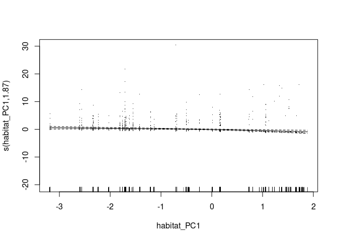<!-- -->

``` r
# Pipiens diagnostics
par(mfrow = c(2, 2))
gam.check(gam_pipiens_trapfixed)
```

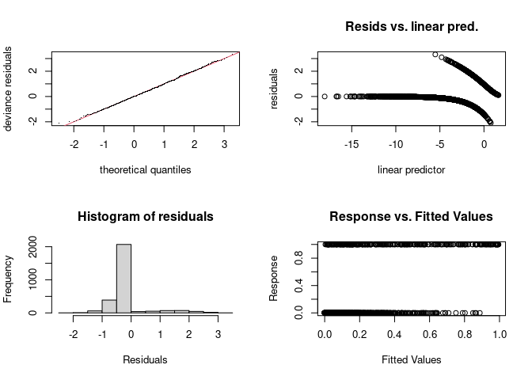<!-- -->

    ## 
    ## Method: REML   Optimizer: outer newton
    ## full convergence after 16 iterations.
    ## Gradient range [-0.0001737319,3.688102e-05]
    ## (score 622.4686 & scale 1).
    ## Hessian positive definite, eigenvalue range [1.607794e-05,1.364595].
    ## Model rank =  163 / 164 
    ## 
    ## Basis dimension (k) checking results. Low p-value (k-index<1) may
    ## indicate that k is too low, especially if edf is close to k'.
    ## 
    ##                                  k'      edf k-index p-value    
    ## s(disease_week)             7.00000  4.36548    0.86  <2e-16 ***
    ## s(disease_week):year_f2018 14.00000  5.14963    0.86  <2e-16 ***
    ## s(disease_week):year_f2019 14.00000  1.18402    0.86  <2e-16 ***
    ## s(disease_week):year_f2020 14.00000  3.06590    0.86  <2e-16 ***
    ## s(disease_week):year_f2021 14.00000  1.00059    0.86  <2e-16 ***
    ## s(disease_week):year_f2022 14.00000  1.00026    0.86  <2e-16 ***
    ## s(disease_week):year_f2023 14.00000  1.03852    0.86  <2e-16 ***
    ## s(year_f)                   6.00000  4.19689      NA      NA    
    ## s(site_code)               64.00000  0.00699      NA      NA    
    ## ---
    ## Signif. codes:  0 '***' 0.001 '**' 0.01 '*' 0.05 '.' 0.1 ' ' 1

``` r
par(mfrow = c(1, 1))
plot(gam_pipiens_trapfixed, pages = 1, residuals = TRUE, shade = TRUE, seWithMean = TRUE)
```

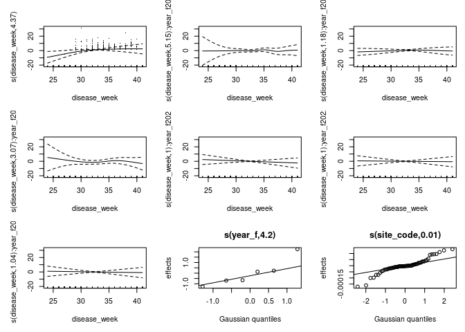<!-- -->

``` r
# Concurvity
concurvity(gam_pipiens, full = FALSE)
```

    ## $worst
    ##                                    para s(disease_week)
    ## para                       1.000000e+00    1.941442e-23
    ## s(disease_week)            1.940983e-23    1.000000e+00
    ## s(disease_week):year_f2018 5.071383e-03    4.681923e-01
    ## s(disease_week):year_f2019 5.433696e-02    2.215608e-01
    ## s(disease_week):year_f2020 1.061408e-01    4.546177e-01
    ## s(disease_week):year_f2021 7.879919e-02    3.348028e-01
    ## s(disease_week):year_f2022 1.180812e-01    1.568721e-01
    ## s(disease_week):year_f2023 1.797436e-01    2.303840e-01
    ## s(year_f)                  1.000000e+00    4.112721e-02
    ## s(site_code)               1.000000e+00    9.544583e-02
    ## s(trap_type2)              1.000000e+00    2.788658e-02
    ##                            s(disease_week):year_f2018
    ## para                                     5.071383e-03
    ## s(disease_week)                          4.681923e-01
    ## s(disease_week):year_f2018               1.000000e+00
    ## s(disease_week):year_f2019               5.050968e-28
    ## s(disease_week):year_f2020               7.567960e-02
    ## s(disease_week):year_f2021               2.784376e-27
    ## s(disease_week):year_f2022               2.846839e-27
    ## s(disease_week):year_f2023               3.519355e-27
    ## s(year_f)                                2.233617e-02
    ## s(site_code)                             3.665372e-01
    ## s(trap_type2)                            6.399520e-03
    ##                            s(disease_week):year_f2019
    ## para                                     5.433696e-02
    ## s(disease_week)                          2.215608e-01
    ## s(disease_week):year_f2018               8.646972e-28
    ## s(disease_week):year_f2019               1.000000e+00
    ## s(disease_week):year_f2020               4.484206e-02
    ## s(disease_week):year_f2021               3.137011e-27
    ## s(disease_week):year_f2022               3.585877e-27
    ## s(disease_week):year_f2023               2.766401e-27
    ## s(year_f)                                3.029178e-01
    ## s(site_code)                             6.769118e-02
    ## s(trap_type2)                            5.478231e-02
    ##                            s(disease_week):year_f2020
    ## para                                       0.11083656
    ## s(disease_week)                            0.43000310
    ## s(disease_week):year_f2018                 0.05858684
    ## s(disease_week):year_f2019                 0.07942127
    ## s(disease_week):year_f2020                 1.00000000
    ## s(disease_week):year_f2021                 0.11305143
    ## s(disease_week):year_f2022                 0.08957624
    ## s(disease_week):year_f2023                 0.10603216
    ## s(year_f)                                  1.00005416
    ## s(site_code)                               0.20795946
    ## s(trap_type2)                              0.10849624
    ##                            s(disease_week):year_f2021
    ## para                                     7.879919e-02
    ## s(disease_week)                          3.348028e-01
    ## s(disease_week):year_f2018               3.254442e-27
    ## s(disease_week):year_f2019               3.973570e-27
    ## s(disease_week):year_f2020               7.357952e-02
    ## s(disease_week):year_f2021               1.000000e+00
    ## s(disease_week):year_f2022               4.396972e-27
    ## s(disease_week):year_f2023               6.250204e-27
    ## s(year_f)                                4.155667e-01
    ## s(site_code)                             8.673882e-02
    ## s(trap_type2)                            7.982927e-02
    ##                            s(disease_week):year_f2022
    ## para                                     1.180812e-01
    ## s(disease_week)                          1.568721e-01
    ## s(disease_week):year_f2018               5.617883e-27
    ## s(disease_week):year_f2019               3.057779e-27
    ## s(disease_week):year_f2020               5.689069e-02
    ## s(disease_week):year_f2021               6.230572e-27
    ## s(disease_week):year_f2022               1.000000e+00
    ## s(disease_week):year_f2023               7.435515e-27
    ## s(year_f)                                9.982268e-01
    ## s(site_code)                             1.495823e-01
    ## s(trap_type2)                            1.341744e-01
    ##                            s(disease_week):year_f2023  s(year_f) s(site_code)
    ## para                                     1.797436e-01 1.00000000   1.00000000
    ## s(disease_week)                          2.303840e-01 0.04112721   0.09544583
    ## s(disease_week):year_f2018               2.244281e-27 0.02233617   0.36653721
    ## s(disease_week):year_f2019               3.614184e-27 0.30291783   0.06769118
    ## s(disease_week):year_f2020               3.223185e-02 1.00000000   0.13752848
    ## s(disease_week):year_f2021               3.697352e-27 0.41556667   0.08673882
    ## s(disease_week):year_f2022               1.268117e-26 0.99822678   0.14958233
    ## s(disease_week):year_f2023               1.000000e+00 0.99615267   0.22154850
    ## s(year_f)                                9.961527e-01 1.00000000   1.00000000
    ## s(site_code)                             2.215485e-01 1.00000000   1.00000000
    ## s(trap_type2)                            1.875997e-01 1.00000000   1.00000000
    ##                            s(trap_type2)
    ## para                          1.00000000
    ## s(disease_week)               0.02788658
    ## s(disease_week):year_f2018    0.00639952
    ## s(disease_week):year_f2019    0.05478231
    ## s(disease_week):year_f2020    0.10885476
    ## s(disease_week):year_f2021    0.07982927
    ## s(disease_week):year_f2022    0.13417444
    ## s(disease_week):year_f2023    0.18759971
    ## s(year_f)                     1.00000000
    ## s(site_code)                  1.00000000
    ## s(trap_type2)                 1.00000000
    ## 
    ## $observed
    ##                                    para s(disease_week)
    ## para                       1.000000e+00    1.059331e-28
    ## s(disease_week)            1.940983e-23    1.000000e+00
    ## s(disease_week):year_f2018 5.071383e-03    2.334313e-01
    ## s(disease_week):year_f2019 5.433696e-02    1.747308e-01
    ## s(disease_week):year_f2020 1.061408e-01    2.710051e-01
    ## s(disease_week):year_f2021 7.879919e-02    1.893407e-01
    ## s(disease_week):year_f2022 1.180812e-01    1.205941e-01
    ## s(disease_week):year_f2023 1.797436e-01    1.355414e-01
    ## s(year_f)                  1.000000e+00    1.453969e-02
    ## s(site_code)               1.000000e+00    3.409202e-02
    ## s(trap_type2)              1.000000e+00    8.804224e-03
    ##                            s(disease_week):year_f2018
    ## para                                     7.644684e-04
    ## s(disease_week)                          2.634436e-01
    ## s(disease_week):year_f2018               1.000000e+00
    ## s(disease_week):year_f2019               1.074622e-28
    ## s(disease_week):year_f2020               1.258660e-02
    ## s(disease_week):year_f2021               1.023457e-27
    ## s(disease_week):year_f2022               9.522988e-28
    ## s(disease_week):year_f2023               1.522771e-27
    ## s(year_f)                                3.366990e-03
    ## s(site_code)                             5.758839e-02
    ## s(trap_type2)                            9.820718e-04
    ##                            s(disease_week):year_f2019
    ## para                                     2.050739e-03
    ## s(disease_week)                          1.798297e-01
    ## s(disease_week):year_f2018               4.288753e-29
    ## s(disease_week):year_f2019               1.000000e+00
    ## s(disease_week):year_f2020               5.361904e-03
    ## s(disease_week):year_f2021               1.161951e-27
    ## s(disease_week):year_f2022               9.306786e-28
    ## s(disease_week):year_f2023               6.094502e-28
    ## s(year_f)                                1.143247e-02
    ## s(site_code)                             1.897623e-02
    ## s(trap_type2)                            2.710158e-03
    ##                            s(disease_week):year_f2020
    ## para                                     7.986741e-03
    ## s(disease_week)                          1.571275e-01
    ## s(disease_week):year_f2018               2.432137e-29
    ## s(disease_week):year_f2019               1.871254e-29
    ## s(disease_week):year_f2020               1.000000e+00
    ## s(disease_week):year_f2021               1.145870e-27
    ## s(disease_week):year_f2022               8.620914e-28
    ## s(disease_week):year_f2023               1.771522e-28
    ## s(year_f)                                7.590084e-02
    ## s(site_code)                             2.703400e-02
    ## s(trap_type2)                            8.329014e-03
    ##                            s(disease_week):year_f2021
    ## para                                     1.431630e-03
    ## s(disease_week)                          2.224367e-01
    ## s(disease_week):year_f2018               3.519121e-29
    ## s(disease_week):year_f2019               1.295488e-28
    ## s(disease_week):year_f2020               3.859448e-02
    ## s(disease_week):year_f2021               1.000000e+00
    ## s(disease_week):year_f2022               1.173726e-28
    ## s(disease_week):year_f2023               1.585896e-27
    ## s(year_f)                                7.550048e-03
    ## s(site_code)                             1.385173e-02
    ## s(trap_type2)                            2.348505e-03
    ##                            s(disease_week):year_f2022
    ## para                                     3.185660e-07
    ## s(disease_week)                          1.376531e-01
    ## s(disease_week):year_f2018               2.949421e-29
    ## s(disease_week):year_f2019               1.479767e-28
    ## s(disease_week):year_f2020               2.520543e-02
    ## s(disease_week):year_f2021               5.049935e-28
    ## s(disease_week):year_f2022               1.000000e+00
    ## s(disease_week):year_f2023               3.691907e-27
    ## s(year_f)                                2.693072e-06
    ## s(site_code)                             1.142256e-02
    ## s(trap_type2)                            3.810619e-03
    ##                            s(disease_week):year_f2023   s(year_f) s(site_code)
    ## para                                     4.520567e-03 0.004305631 0.0071285375
    ## s(disease_week)                          1.766008e-01 0.012525289 0.0009114112
    ## s(disease_week):year_f2018               2.851826e-29 0.001842006 0.0022395584
    ## s(disease_week):year_f2019               4.233669e-28 0.017661122 0.0028695109
    ## s(disease_week):year_f2020               2.139931e-02 0.126731007 0.0025753854
    ## s(disease_week):year_f2021               3.414730e-28 0.300781210 0.0016331126
    ## s(disease_week):year_f2022               1.521796e-27 0.001659827 0.0041805396
    ## s(disease_week):year_f2023               1.000000e+00 0.007037456 0.0027263474
    ## s(year_f)                                2.505332e-02 1.000000000 0.0074491562
    ## s(site_code)                             4.165931e-02 0.027588118 1.0000000000
    ## s(trap_type2)                            4.686073e-03 0.006552881 0.0094156300
    ##                            s(trap_type2)
    ## para                        0.0004488653
    ## s(disease_week)             0.0278740675
    ## s(disease_week):year_f2018  0.0043918711
    ## s(disease_week):year_f2019  0.0063093760
    ## s(disease_week):year_f2020  0.0222764377
    ## s(disease_week):year_f2021  0.0111210014
    ## s(disease_week):year_f2022  0.0357674237
    ## s(disease_week):year_f2023  0.0117645171
    ## s(year_f)                   0.0269841346
    ## s(site_code)                0.8793244330
    ## s(trap_type2)               1.0000000000
    ## 
    ## $estimate
    ##                                    para s(disease_week)
    ## para                       1.000000e+00    1.222128e-25
    ## s(disease_week)            1.940983e-23    1.000000e+00
    ## s(disease_week):year_f2018 5.071383e-03    2.531781e-01
    ## s(disease_week):year_f2019 5.433696e-02    1.612299e-01
    ## s(disease_week):year_f2020 1.061408e-01    1.773309e-01
    ## s(disease_week):year_f2021 7.879919e-02    2.102456e-01
    ## s(disease_week):year_f2022 1.180812e-01    1.253974e-01
    ## s(disease_week):year_f2023 1.797436e-01    1.540088e-01
    ## s(year_f)                  1.000000e+00    1.957651e-02
    ## s(site_code)               1.000000e+00    3.243903e-02
    ## s(trap_type2)              1.000000e+00    3.506564e-03
    ##                            s(disease_week):year_f2018
    ## para                                     9.893237e-04
    ## s(disease_week)                          2.707873e-01
    ## s(disease_week):year_f2018               1.000000e+00
    ## s(disease_week):year_f2019               1.134861e-28
    ## s(disease_week):year_f2020               1.450892e-02
    ## s(disease_week):year_f2021               9.664091e-28
    ## s(disease_week):year_f2022               7.362351e-28
    ## s(disease_week):year_f2023               1.347195e-27
    ## s(year_f)                                4.357333e-03
    ## s(site_code)                             5.780702e-02
    ## s(trap_type2)                            1.408233e-03
    ##                            s(disease_week):year_f2019
    ## para                                     2.023344e-03
    ## s(disease_week)                          1.719342e-01
    ## s(disease_week):year_f2018               3.689118e-29
    ## s(disease_week):year_f2019               1.000000e+00
    ## s(disease_week):year_f2020               8.358359e-03
    ## s(disease_week):year_f2021               1.092366e-27
    ## s(disease_week):year_f2022               7.764891e-28
    ## s(disease_week):year_f2023               5.383117e-28
    ## s(year_f)                                1.127975e-02
    ## s(site_code)                             1.835425e-02
    ## s(trap_type2)                            2.681105e-03
    ##                            s(disease_week):year_f2020
    ## para                                     1.395392e-02
    ## s(disease_week)                          2.022136e-01
    ## s(disease_week):year_f2018               1.579745e-29
    ## s(disease_week):year_f2019               2.781195e-29
    ## s(disease_week):year_f2020               1.000000e+00
    ## s(disease_week):year_f2021               1.007171e-27
    ## s(disease_week):year_f2022               7.187735e-28
    ## s(disease_week):year_f2023               2.426434e-28
    ## s(year_f)                                1.326091e-01
    ## s(site_code)                             2.936554e-02
    ## s(trap_type2)                            1.530231e-02
    ##                            s(disease_week):year_f2021
    ## para                                     1.550270e-03
    ## s(disease_week)                          2.309533e-01
    ## s(disease_week):year_f2018               2.767260e-29
    ## s(disease_week):year_f2019               1.445643e-28
    ## s(disease_week):year_f2020               3.098115e-02
    ## s(disease_week):year_f2021               1.000000e+00
    ## s(disease_week):year_f2022               2.003906e-28
    ## s(disease_week):year_f2023               1.512340e-27
    ## s(year_f)                                8.175724e-03
    ## s(site_code)                             1.333753e-02
    ## s(trap_type2)                            2.676868e-03
    ##                            s(disease_week):year_f2022
    ## para                                     7.847869e-05
    ## s(disease_week)                          1.340986e-01
    ## s(disease_week):year_f2018               2.417891e-29
    ## s(disease_week):year_f2019               1.410376e-28
    ## s(disease_week):year_f2020               2.282157e-02
    ## s(disease_week):year_f2021               4.995219e-28
    ## s(disease_week):year_f2022               1.000000e+00
    ## s(disease_week):year_f2023               3.676528e-27
    ## s(year_f)                                6.634378e-04
    ## s(site_code)                             1.111708e-02
    ## s(trap_type2)                            3.804237e-03
    ##                            s(disease_week):year_f2023   s(year_f) s(site_code)
    ## para                                     3.730075e-03 0.177305771  0.023785371
    ## s(disease_week)                          1.750796e-01 0.010246549  0.002054811
    ## s(disease_week):year_f2018               2.283991e-29 0.005071383  0.002727109
    ## s(disease_week):year_f2019               4.267336e-28 0.054336955  0.003630511
    ## s(disease_week):year_f2020               1.709365e-02 0.105945448  0.005813635
    ## s(disease_week):year_f2021               4.118264e-28 0.078799188  0.003754146
    ## s(disease_week):year_f2022               1.223852e-27 0.118081205  0.006076829
    ## s(disease_week):year_f2023               1.000000e+00 0.179743649  0.006914720
    ## s(year_f)                                2.067235e-02 1.000000000  0.026031722
    ## s(site_code)                             3.691392e-02 0.206328264  1.000000000
    ## s(trap_type2)                            3.981089e-03 0.181119853  0.043830949
    ##                            s(trap_type2)
    ## para                         0.500224433
    ## s(disease_week)              0.013937034
    ## s(disease_week):year_f2018   0.004731627
    ## s(disease_week):year_f2019   0.030323166
    ## s(disease_week):year_f2020   0.064208610
    ## s(disease_week):year_f2021   0.044960095
    ## s(disease_week):year_f2022   0.076924314
    ## s(disease_week):year_f2023   0.095754083
    ## s(year_f)                    0.513492067
    ## s(site_code)                 0.939662217
    ## s(trap_type2)                1.000000000

``` r
# Pipiens diagnostics
par(mfrow = c(2, 2))
gam.check(gam_pipiens2_trapfixed)
```

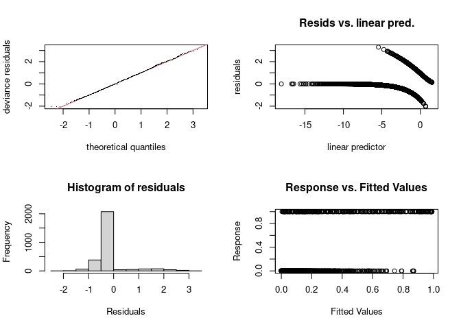<!-- -->

    ## 
    ## Method: REML   Optimizer: outer newton
    ## full convergence after 16 iterations.
    ## Gradient range [-0.0001521396,3.2438e-05]
    ## (score 621.7134 & scale 1).
    ## Hessian positive definite, eigenvalue range [1.038683e-05,1.356718].
    ## Model rank =  165 / 166 
    ## 
    ## Basis dimension (k) checking results. Low p-value (k-index<1) may
    ## indicate that k is too low, especially if edf is close to k'.
    ## 
    ##                                  k'      edf k-index p-value    
    ## s(habitat_PC1)             3.00e+00 1.87e+00    0.31  <2e-16 ***
    ## s(disease_week)            7.00e+00 4.37e+00    0.86  <2e-16 ***
    ## s(disease_week):year_f2018 1.40e+01 5.23e+00    0.86  <2e-16 ***
    ## s(disease_week):year_f2019 1.40e+01 1.16e+00    0.86  <2e-16 ***
    ## s(disease_week):year_f2020 1.40e+01 3.08e+00    0.86  <2e-16 ***
    ## s(disease_week):year_f2021 1.40e+01 1.00e+00    0.86  <2e-16 ***
    ## s(disease_week):year_f2022 1.40e+01 1.00e+00    0.86  <2e-16 ***
    ## s(disease_week):year_f2023 1.40e+01 1.06e+00    0.86  <2e-16 ***
    ## s(year_f)                  6.00e+00 4.19e+00      NA      NA    
    ## s(site_code)               6.40e+01 3.93e-04      NA      NA    
    ## ---
    ## Signif. codes:  0 '***' 0.001 '**' 0.01 '*' 0.05 '.' 0.1 ' ' 1

``` r
par(mfrow = c(1, 1))
plot(gam_pipiens2_trapfixed, pages = 1, residuals = TRUE, shade = TRUE, seWithMean = TRUE)
```

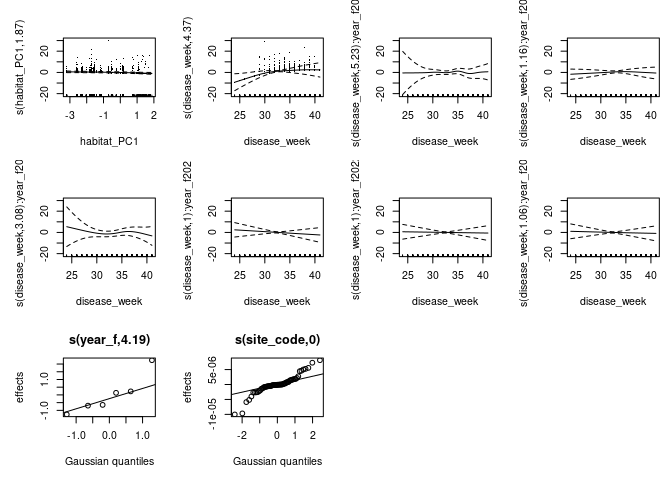<!-- -->

``` r
# Concurvity
concurvity(gam_pipiens2_trapfixed, full = FALSE)
```

    ## $worst
    ##                                    para s(habitat_PC1) s(disease_week)
    ## para                       1.000000e+00   2.824771e-29    1.941442e-23
    ## s(habitat_PC1)             3.620539e-29   1.000000e+00    2.270948e-02
    ## s(disease_week)            1.939634e-23   2.270948e-02    1.000000e+00
    ## s(disease_week):year_f2018 5.071383e-03   1.158146e-02    4.681923e-01
    ## s(disease_week):year_f2019 5.433696e-02   7.140769e-03    2.215608e-01
    ## s(disease_week):year_f2020 1.531251e-01   1.997466e-02    4.661022e-01
    ## s(disease_week):year_f2021 7.879919e-02   9.838742e-03    3.348028e-01
    ## s(disease_week):year_f2022 1.180812e-01   2.317992e-02    1.568721e-01
    ## s(disease_week):year_f2023 1.797436e-01   7.879069e-03    2.303840e-01
    ## s(year_f)                  1.000000e+00   2.401894e-02    4.112721e-02
    ## s(site_code)               1.000000e+00   1.000000e+00    9.544583e-02
    ##                            s(disease_week):year_f2018
    ## para                                     5.071383e-03
    ## s(habitat_PC1)                           1.158146e-02
    ## s(disease_week)                          4.681923e-01
    ## s(disease_week):year_f2018               1.000000e+00
    ## s(disease_week):year_f2019               4.054411e-28
    ## s(disease_week):year_f2020               1.254061e-01
    ## s(disease_week):year_f2021               9.134936e-28
    ## s(disease_week):year_f2022               1.837131e-27
    ## s(disease_week):year_f2023               9.284105e-28
    ## s(year_f)                                2.233617e-02
    ## s(site_code)                             3.665372e-01
    ##                            s(disease_week):year_f2019
    ## para                                     5.433696e-02
    ## s(habitat_PC1)                           7.140769e-03
    ## s(disease_week)                          2.215608e-01
    ## s(disease_week):year_f2018               7.850288e-28
    ## s(disease_week):year_f2019               1.000000e+00
    ## s(disease_week):year_f2020               5.564406e-02
    ## s(disease_week):year_f2021               4.356714e-27
    ## s(disease_week):year_f2022               1.997893e-27
    ## s(disease_week):year_f2023               1.680318e-27
    ## s(year_f)                                3.029178e-01
    ## s(site_code)                             6.769118e-02
    ##                            s(disease_week):year_f2020
    ## para                                       0.11568864
    ## s(habitat_PC1)                             0.05844092
    ## s(disease_week)                            0.43627620
    ## s(disease_week):year_f2018                 0.11601600
    ## s(disease_week):year_f2019                 0.06658661
    ## s(disease_week):year_f2020                 1.00000000
    ## s(disease_week):year_f2021                 0.04597465
    ## s(disease_week):year_f2022                 0.03843355
    ## s(disease_week):year_f2023                 0.06170780
    ## s(year_f)                                  1.00150347
    ## s(site_code)                               0.15971697
    ##                            s(disease_week):year_f2021
    ## para                                     7.879919e-02
    ## s(habitat_PC1)                           9.838742e-03
    ## s(disease_week)                          3.348028e-01
    ## s(disease_week):year_f2018               1.290708e-27
    ## s(disease_week):year_f2019               4.017337e-27
    ## s(disease_week):year_f2020               4.531219e-02
    ## s(disease_week):year_f2021               1.000000e+00
    ## s(disease_week):year_f2022               3.991185e-27
    ## s(disease_week):year_f2023               3.010218e-27
    ## s(year_f)                                4.155667e-01
    ## s(site_code)                             8.673882e-02
    ##                            s(disease_week):year_f2022
    ## para                                     1.180812e-01
    ## s(habitat_PC1)                           2.317992e-02
    ## s(disease_week)                          1.568721e-01
    ## s(disease_week):year_f2018               2.603224e-27
    ## s(disease_week):year_f2019               2.985104e-27
    ## s(disease_week):year_f2020               1.378699e-02
    ## s(disease_week):year_f2021               1.347044e-27
    ## s(disease_week):year_f2022               1.000000e+00
    ## s(disease_week):year_f2023               5.565488e-27
    ## s(year_f)                                9.982268e-01
    ## s(site_code)                             1.495823e-01
    ##                            s(disease_week):year_f2023  s(year_f) s(site_code)
    ## para                                     1.797436e-01 1.00000000   1.00000000
    ## s(habitat_PC1)                           7.879069e-03 0.02401894   1.00000000
    ## s(disease_week)                          2.303840e-01 0.04112721   0.09544583
    ## s(disease_week):year_f2018               1.448433e-27 0.02233617   0.36653721
    ## s(disease_week):year_f2019               1.735767e-27 0.30291783   0.06769118
    ## s(disease_week):year_f2020               1.933943e-02 1.00000000   0.19241712
    ## s(disease_week):year_f2021               1.925476e-27 0.41556667   0.08673882
    ## s(disease_week):year_f2022               2.851433e-27 0.99822678   0.14958233
    ## s(disease_week):year_f2023               1.000000e+00 0.99615267   0.22154850
    ## s(year_f)                                9.961527e-01 1.00000000   1.00000000
    ## s(site_code)                             2.215485e-01 1.00000000   1.00000000
    ## 
    ## $observed
    ##                                    para s(habitat_PC1) s(disease_week)
    ## para                       1.000000e+00   7.801128e-32    7.708000e-29
    ## s(habitat_PC1)             3.620539e-29   1.000000e+00    1.960377e-03
    ## s(disease_week)            1.939634e-23   2.195700e-02    1.000000e+00
    ## s(disease_week):year_f2018 5.071383e-03   8.488693e-03    2.751298e-01
    ## s(disease_week):year_f2019 5.433696e-02   6.706168e-03    1.470246e-01
    ## s(disease_week):year_f2020 1.531251e-01   1.354350e-02    5.798183e-02
    ## s(disease_week):year_f2021 7.879919e-02   9.826664e-03    2.311895e-01
    ## s(disease_week):year_f2022 1.180812e-01   2.168595e-02    1.233463e-01
    ## s(disease_week):year_f2023 1.797436e-01   7.876445e-03    1.697134e-01
    ## s(year_f)                  1.000000e+00   2.379326e-02    2.458035e-02
    ## s(site_code)               1.000000e+00   1.000000e+00    3.647074e-02
    ##                            s(disease_week):year_f2018
    ## para                                     1.253716e-03
    ## s(habitat_PC1)                           1.623737e-03
    ## s(disease_week)                          1.535578e-01
    ## s(disease_week):year_f2018               1.000000e+00
    ## s(disease_week):year_f2019               1.730637e-28
    ## s(disease_week):year_f2020               5.046505e-04
    ## s(disease_week):year_f2021               2.400338e-28
    ## s(disease_week):year_f2022               2.807474e-28
    ## s(disease_week):year_f2023               7.615664e-31
    ## s(year_f)                                5.521811e-03
    ## s(site_code)                             1.850811e-02
    ##                            s(disease_week):year_f2019
    ## para                                     2.589528e-03
    ## s(habitat_PC1)                           2.948876e-03
    ## s(disease_week)                          1.567754e-01
    ## s(disease_week):year_f2018               1.779856e-30
    ## s(disease_week):year_f2019               1.000000e+00
    ## s(disease_week):year_f2020               6.547667e-03
    ## s(disease_week):year_f2021               3.661511e-28
    ## s(disease_week):year_f2022               3.160020e-28
    ## s(disease_week):year_f2023               3.497433e-29
    ## s(year_f)                                1.443611e-02
    ## s(site_code)                             1.786047e-02
    ##                            s(disease_week):year_f2020
    ## para                                     2.262610e-02
    ## s(habitat_PC1)                           1.128351e-03
    ## s(disease_week)                          2.320347e-01
    ## s(disease_week):year_f2018               2.155031e-29
    ## s(disease_week):year_f2019               3.612619e-31
    ## s(disease_week):year_f2020               1.000000e+00
    ## s(disease_week):year_f2021               2.462451e-28
    ## s(disease_week):year_f2022               1.321214e-28
    ## s(disease_week):year_f2023               5.490327e-28
    ## s(year_f)                                2.150239e-01
    ## s(site_code)                             3.878691e-02
    ##                            s(disease_week):year_f2021
    ## para                                     1.431374e-03
    ## s(habitat_PC1)                           2.035990e-04
    ## s(disease_week)                          2.224294e-01
    ## s(disease_week):year_f2018               1.098051e-29
    ## s(disease_week):year_f2019               2.422444e-28
    ## s(disease_week):year_f2020               9.930858e-04
    ## s(disease_week):year_f2021               1.000000e+00
    ## s(disease_week):year_f2022               4.421720e-28
    ## s(disease_week):year_f2023               5.832305e-29
    ## s(year_f)                                7.548698e-03
    ## s(site_code)                             1.385217e-02
    ##                            s(disease_week):year_f2022
    ## para                                     3.181014e-07
    ## s(habitat_PC1)                           1.814523e-03
    ## s(disease_week)                          1.376528e-01
    ## s(disease_week):year_f2018               1.168794e-29
    ## s(disease_week):year_f2019               2.618934e-28
    ## s(disease_week):year_f2020               7.958001e-04
    ## s(disease_week):year_f2021               3.829394e-28
    ## s(disease_week):year_f2022               1.000000e+00
    ## s(disease_week):year_f2023               1.141220e-29
    ## s(year_f)                                2.689144e-06
    ## s(site_code)                             1.142266e-02
    ##                            s(disease_week):year_f2023   s(year_f) s(site_code)
    ## para                                     4.021604e-03 0.004344839 0.0040801072
    ## s(habitat_PC1)                           7.210706e-04 0.003151323 0.0343589891
    ## s(disease_week)                          1.804315e-01 0.012550634 0.0006209687
    ## s(disease_week):year_f2018               2.433650e-30 0.001855823 0.0017852359
    ## s(disease_week):year_f2019               2.909559e-28 0.017188871 0.0025695313
    ## s(disease_week):year_f2020               3.146910e-03 0.129381372 0.0026458178
    ## s(disease_week):year_f2021               1.017762e-27 0.300840307 0.0014611862
    ## s(disease_week):year_f2022               2.000748e-27 0.001599388 0.0034508813
    ## s(disease_week):year_f2023               1.000000e+00 0.007052742 0.0021256445
    ## s(year_f)                                2.228803e-02 1.000000000 0.0044983817
    ## s(site_code)                             4.019545e-02 0.027658457 1.0000000000
    ## 
    ## $estimate
    ##                                    para s(habitat_PC1) s(disease_week)
    ## para                       1.000000e+00   4.424711e-31    1.222128e-25
    ## s(habitat_PC1)             3.620539e-29   1.000000e+00    3.036894e-03
    ## s(disease_week)            1.939634e-23   1.913499e-02    1.000000e+00
    ## s(disease_week):year_f2018 5.071383e-03   6.420292e-03    2.531781e-01
    ## s(disease_week):year_f2019 5.433696e-02   6.022155e-03    1.612299e-01
    ## s(disease_week):year_f2020 1.531251e-01   1.296944e-02    9.976036e-02
    ## s(disease_week):year_f2021 7.879919e-02   9.170885e-03    2.102456e-01
    ## s(disease_week):year_f2022 1.180812e-01   2.147606e-02    1.253974e-01
    ## s(disease_week):year_f2023 1.797436e-01   7.550275e-03    1.540088e-01
    ## s(year_f)                  1.000000e+00   2.165619e-02    1.957651e-02
    ## s(site_code)               1.000000e+00   1.000000e+00    3.243903e-02
    ##                            s(disease_week):year_f2018
    ## para                                     9.893237e-04
    ## s(habitat_PC1)                           3.227713e-03
    ## s(disease_week)                          2.707873e-01
    ## s(disease_week):year_f2018               1.000000e+00
    ## s(disease_week):year_f2019               2.480166e-29
    ## s(disease_week):year_f2020               2.391233e-03
    ## s(disease_week):year_f2021               3.204190e-28
    ## s(disease_week):year_f2022               1.771115e-28
    ## s(disease_week):year_f2023               9.414085e-29
    ## s(year_f)                                4.357333e-03
    ## s(site_code)                             5.780702e-02
    ##                            s(disease_week):year_f2019
    ## para                                     2.023344e-03
    ## s(habitat_PC1)                           2.401457e-03
    ## s(disease_week)                          1.719342e-01
    ## s(disease_week):year_f2018               1.068359e-29
    ## s(disease_week):year_f2019               1.000000e+00
    ## s(disease_week):year_f2020               1.356765e-03
    ## s(disease_week):year_f2021               2.149999e-28
    ## s(disease_week):year_f2022               3.016760e-28
    ## s(disease_week):year_f2023               2.334991e-28
    ## s(year_f)                                1.127975e-02
    ## s(site_code)                             1.835425e-02
    ##                            s(disease_week):year_f2020
    ## para                                     1.395392e-02
    ## s(habitat_PC1)                           1.067457e-03
    ## s(disease_week)                          2.022136e-01
    ## s(disease_week):year_f2018               2.513771e-29
    ## s(disease_week):year_f2019               2.660009e-29
    ## s(disease_week):year_f2020               1.000000e+00
    ## s(disease_week):year_f2021               3.935673e-28
    ## s(disease_week):year_f2022               1.149987e-28
    ## s(disease_week):year_f2023               9.339477e-28
    ## s(year_f)                                1.326091e-01
    ## s(site_code)                             2.936554e-02
    ##                            s(disease_week):year_f2021
    ## para                                     1.550270e-03
    ## s(habitat_PC1)                           8.363334e-04
    ## s(disease_week)                          2.309533e-01
    ## s(disease_week):year_f2018               1.260972e-29
    ## s(disease_week):year_f2019               2.003790e-28
    ## s(disease_week):year_f2020               1.920225e-03
    ## s(disease_week):year_f2021               1.000000e+00
    ## s(disease_week):year_f2022               3.940534e-28
    ## s(disease_week):year_f2023               4.300983e-29
    ## s(year_f)                                8.175724e-03
    ## s(site_code)                             1.333753e-02
    ##                            s(disease_week):year_f2022
    ## para                                     7.847869e-05
    ## s(habitat_PC1)                           1.946919e-03
    ## s(disease_week)                          1.340986e-01
    ## s(disease_week):year_f2018               1.097087e-29
    ## s(disease_week):year_f2019               2.111192e-28
    ## s(disease_week):year_f2020               1.127666e-03
    ## s(disease_week):year_f2021               3.472941e-28
    ## s(disease_week):year_f2022               1.000000e+00
    ## s(disease_week):year_f2023               3.478732e-29
    ## s(year_f)                                6.634378e-04
    ## s(site_code)                             1.111708e-02
    ##                            s(disease_week):year_f2023   s(year_f) s(site_code)
    ## para                                     3.730075e-03 0.177305771  0.023785371
    ## s(habitat_PC1)                           6.934703e-04 0.004121450  0.064580381
    ## s(disease_week)                          1.750796e-01 0.010246549  0.002054811
    ## s(disease_week):year_f2018               2.992112e-30 0.005071383  0.002727109
    ## s(disease_week):year_f2019               2.308721e-28 0.054336955  0.003630511
    ## s(disease_week):year_f2020               2.940355e-03 0.115472246  0.007692368
    ## s(disease_week):year_f2021               8.502965e-28 0.078799188  0.003754146
    ## s(disease_week):year_f2022               1.581903e-27 0.118081205  0.006076829
    ## s(disease_week):year_f2023               1.000000e+00 0.179743649  0.006914720
    ## s(year_f)                                2.067235e-02 1.000000000  0.026031722
    ## s(site_code)                             3.691392e-02 0.206328264  1.000000000

Interpretation:

Formula: infected ~ habitat_PC1 + trap_type2 + s(disease_week, bs =
“tp”, k = 8) + s(disease_week, by = year_f, bs = “fs”, k = 15) +
s(year_f, bs = “re”) + s(site_code, bs = “re”) +
offset(log(num_count))  
Estimate Std. Error z value Pr(\>\|z\|)  
habitat_PC1 -0.25376 0.08757 -2.898 0.00376 \*\*  
trap_type2GRVD+ 1.11828 0.23886 4.682 2.85e-06 \*\*\*  
s(disease_week) 4.365484 5.107 54.819 \<2e-16 \*\*\*

Formula: infected ~ trap_type2 + s(habitat_PC1, k = 4) + s(disease_week,
bs = “tp”, k = 8) + s(disease_week, by = year_f, bs = “fs”, k = 15) +
s(year_f, bs = “re”) + s(site_code, bs = “re”) +
offset(log(num_count))  
Estimate Std. Error z value Pr(\>\|z\|)  
trap_type2GRVD+ 1.0689 0.2488 4.297 1.73e-05 \*\*\*  
edf Ref.df Chi.sq p-value  
s(habitat_PC1) 1.8668036 2.252 9.572 0.0135 \*  
s(disease_week) 4.3739313 5.114 55.484 \<2e-16 \*\*\*

                             df      AIC  

gam_pipiens 27.64861 1231.843  
gam_pipiens2 28.99880 1231.156  
gam_pipiens_trapfixed 27.65630 1231.729  
gam_pipiens2_trapfixed 29.02111 1231.057

Trap_type2 is significant as well. AIC is very similar with/without
smooth term, and with trap_type as a fixed_effect or a random effect. Do
we need to allow an interaction term, or let the smooth vary by trap
type?

### Pip Moran’s I for Cx. pipiens residuals

``` r
pipiens_resids <- pipiens_data %>%
  mutate(resid = residuals(gam_pipiens, type = "deviance")) %>%
  group_by(site_code) %>%
  summarise(
    mean_resid = mean(resid, na.rm = TRUE),
    latitude = first(latitude),
    longitude = first(longitude),
    .groups = "drop"
  ) %>%
  filter(!is.na(mean_resid), !is.na(latitude), !is.na(longitude))

coords_pipiens <- cbind(pipiens_resids$longitude, pipiens_resids$latitude)

lw5_pipiens <- coords_pipiens %>%
  knearneigh(k = 5) %>%
  knn2nb() %>%
  nb2listw(style = "W")

moran.test(pipiens_resids$mean_resid, lw5_pipiens)
```

    ## 
    ##  Moran I test under randomisation
    ## 
    ## data:  pipiens_resids$mean_resid  
    ## weights: lw5_pipiens    
    ## 
    ## Moran I statistic standard deviate = 0.19041, p-value = 0.4245
    ## alternative hypothesis: greater
    ## sample estimates:
    ## Moran I statistic       Expectation          Variance 
    ##      -0.002320218      -0.015873016       0.005066196

Moran’s I shows no spatial autocorrelation in residuals for pipiens.

## Tarsalis

### Tar model 2v1

``` r
tarsalis_data <- wnv %>% filter(mosq_species == "Cx_tarsalis")

gam_tarsalis <- gam(
infected ~ habitat_PC1 +
  s(disease_week, bs = "tp", k = 8) +
s(disease_week, by = year_f, bs = "fs", k = 15) +
s(year_f, bs = "re") +
s(site_code, bs = "re") +
s(trap_type2, bs = "re") +
offset(log(num_count)),
family = binomial(link = "cloglog"),
data = tarsalis_data,
method = "REML"
)
summary(gam_tarsalis)
```

    ## 
    ## Family: binomial 
    ## Link function: cloglog 
    ## 
    ## Formula:
    ## infected ~ habitat_PC1 + s(disease_week, bs = "tp", k = 8) + 
    ##     s(disease_week, by = year_f, bs = "fs", k = 15) + s(year_f, 
    ##     bs = "re") + s(site_code, bs = "re") + s(trap_type2, bs = "re") + 
    ##     offset(log(num_count))
    ## 
    ## Parametric coefficients:
    ##             Estimate Std. Error z value Pr(>|z|)    
    ## (Intercept)  -9.0764     0.3880 -23.392   <2e-16 ***
    ## habitat_PC1  -0.1224     0.1405  -0.871    0.384    
    ## ---
    ## Signif. codes:  0 '***' 0.001 '**' 0.01 '*' 0.05 '.' 0.1 ' ' 1
    ## 
    ## Approximate significance of smooth terms:
    ##                                  edf    Ref.df Chi.sq  p-value    
    ## s(disease_week)            2.484e+00 3.070e+00 24.425 2.66e-05 ***
    ## s(disease_week):year_f2018 1.000e+00 1.000e+00  1.732    0.188    
    ## s(disease_week):year_f2019 1.001e+00 1.001e+00  0.147    0.702    
    ## s(disease_week):year_f2020 1.000e+00 1.000e+00  2.369    0.124    
    ## s(disease_week):year_f2021 5.613e+00 6.710e+00 44.020  < 2e-16 ***
    ## s(disease_week):year_f2022 1.591e+00 1.915e+00  1.002    0.519    
    ## s(disease_week):year_f2023 7.137e-05 1.311e-04  0.000    0.500    
    ## s(year_f)                  1.098e+00 5.000e+00  1.477    0.192    
    ## s(site_code)               1.313e-03 5.800e+01  0.001    0.549    
    ## s(trap_type2)              7.799e-05 1.000e+00  0.000    0.453    
    ## ---
    ## Signif. codes:  0 '***' 0.001 '**' 0.01 '*' 0.05 '.' 0.1 ' ' 1
    ## 
    ## Rank: 160/161
    ## R-sq.(adj) =  0.0737   Deviance explained = 21.2%
    ## -REML = 388.48  Scale est. = 1         n = 3584

``` r
AIC(gam_tarsalis)
```

    ## [1] 781.5625

``` r
#allow smooth to vary across urbanization gradient (non-linear)
gam_tarsalis2 <- gam(
  infected ~
    s(habitat_PC1, k = 4) +
    s(disease_week, bs = "tp", k = 8) +
    s(disease_week, by = year_f, bs = "fs", k = 15) +
    s(year_f, bs = "re") +
    s(site_code, bs = "re") +
    s(trap_type2, bs = "re") +   #trap_type2 is random effect
    offset(log(num_count)),
  family = binomial(link = "cloglog"),
  data = tarsalis_data,
  method = "REML"
)
summary(gam_tarsalis2)
```

    ## 
    ## Family: binomial 
    ## Link function: cloglog 
    ## 
    ## Formula:
    ## infected ~ s(habitat_PC1, k = 4) + s(disease_week, bs = "tp", 
    ##     k = 8) + s(disease_week, by = year_f, bs = "fs", k = 15) + 
    ##     s(year_f, bs = "re") + s(site_code, bs = "re") + s(trap_type2, 
    ##     bs = "re") + offset(log(num_count))
    ## 
    ## Parametric coefficients:
    ##             Estimate Std. Error z value Pr(>|z|)    
    ## (Intercept)  -9.2034     0.3619  -25.43   <2e-16 ***
    ## ---
    ## Signif. codes:  0 '***' 0.001 '**' 0.01 '*' 0.05 '.' 0.1 ' ' 1
    ## 
    ## Approximate significance of smooth terms:
    ##                                  edf  Ref.df Chi.sq p-value    
    ## s(habitat_PC1)             1.289e+00  1.5054  0.557  0.5253    
    ## s(disease_week)            2.494e+00  3.0804  7.712  0.0638 .  
    ## s(disease_week):year_f2018 1.000e+00  1.0001  0.564  0.4526    
    ## s(disease_week):year_f2019 1.000e+00  1.0005  0.106  0.7447    
    ## s(disease_week):year_f2020 1.000e+00  1.0000  0.764  0.3821    
    ## s(disease_week):year_f2021 5.603e+00  6.6991 40.070  <2e-16 ***
    ## s(disease_week):year_f2022 5.696e-01  0.8865  0.052  0.8205    
    ## s(disease_week):year_f2023 1.000e+00  1.0000  0.028  0.8673    
    ## s(year_f)                  1.118e+00  5.0000  1.510  0.1902    
    ## s(site_code)               5.296e-04 58.0000  0.001  0.5326    
    ## s(trap_type2)              2.937e-05  1.0000  0.000  0.4733    
    ## ---
    ## Signif. codes:  0 '***' 0.001 '**' 0.01 '*' 0.05 '.' 0.1 ' ' 1
    ## 
    ## Rank: 162/163
    ## R-sq.(adj) =  0.0737   Deviance explained = 21.3%
    ## -REML = 388.68  Scale est. = 1         n = 3584

``` r
AIC(gam_tarsalis, gam_tarsalis2)
```

    ##                     df      AIC
    ## gam_tarsalis  18.53465 781.5625
    ## gam_tarsalis2 19.03913 782.0304

``` r
plot(
  gam_tarsalis2,
  select = 1,
  shade = TRUE,
  residuals = TRUE,
  rug = TRUE
)
```

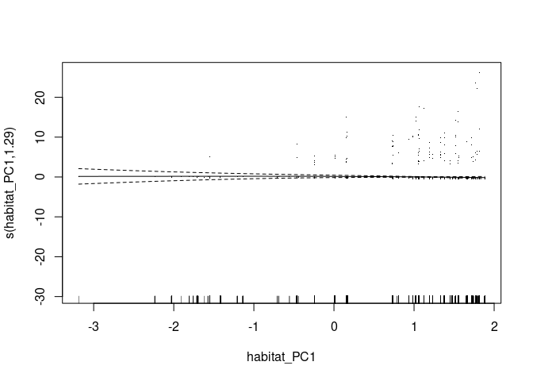<!-- -->

``` r
# Tarsalis diagnostics
par(mfrow = c(2, 2))
gam.check(gam_tarsalis)
```

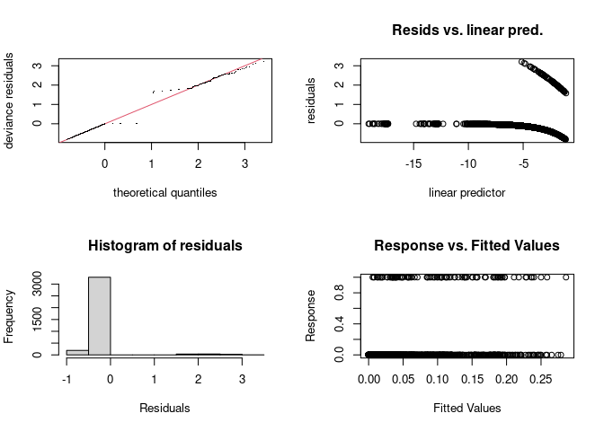<!-- -->

    ## 
    ## Method: REML   Optimizer: outer newton
    ## full convergence after 18 iterations.
    ## Gradient range [-0.0002368112,4.815953e-05]
    ## (score 388.4811 & scale 1).
    ## eigenvalue range [-3.408475e-06,1.483864].
    ## Model rank =  160 / 161 
    ## 
    ## Basis dimension (k) checking results. Low p-value (k-index<1) may
    ## indicate that k is too low, especially if edf is close to k'.
    ## 
    ##                                  k'      edf k-index p-value    
    ## s(disease_week)            7.00e+00 2.48e+00    0.76  <2e-16 ***
    ## s(disease_week):year_f2018 1.40e+01 1.00e+00    0.76  <2e-16 ***
    ## s(disease_week):year_f2019 1.40e+01 1.00e+00    0.76  <2e-16 ***
    ## s(disease_week):year_f2020 1.40e+01 1.00e+00    0.76  <2e-16 ***
    ## s(disease_week):year_f2021 1.40e+01 5.61e+00    0.76  <2e-16 ***
    ## s(disease_week):year_f2022 1.40e+01 1.59e+00    0.76  <2e-16 ***
    ## s(disease_week):year_f2023 1.40e+01 7.14e-05    0.76  <2e-16 ***
    ## s(year_f)                  6.00e+00 1.10e+00      NA      NA    
    ## s(site_code)               6.00e+01 1.31e-03      NA      NA    
    ## s(trap_type2)              2.00e+00 7.80e-05      NA      NA    
    ## ---
    ## Signif. codes:  0 '***' 0.001 '**' 0.01 '*' 0.05 '.' 0.1 ' ' 1

``` r
par(mfrow = c(1, 1))
plot(gam_tarsalis, pages = 1, residuals = TRUE, shade = TRUE, seWithMean = TRUE)
```

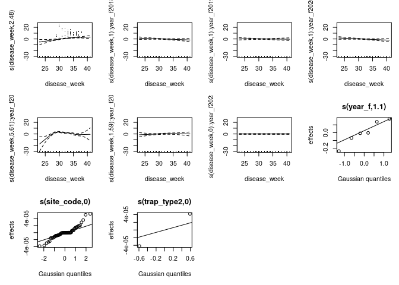<!-- -->

``` r
concurvity(gam_tarsalis, full = FALSE)
```

    ## $worst
    ##                                    para s(disease_week)
    ## para                       1.000000e+00    2.563833e-19
    ## s(disease_week)            2.563844e-19    1.000000e+00
    ## s(disease_week):year_f2018 3.055355e-02    5.687953e-01
    ## s(disease_week):year_f2019 1.210622e-02    6.044288e-01
    ## s(disease_week):year_f2020 1.891738e-01    2.632969e-01
    ## s(disease_week):year_f2021 1.597852e-01    2.472316e-01
    ## s(disease_week):year_f2022 1.378412e-01    1.725389e-01
    ## s(disease_week):year_f2023 1.774554e-01    2.085235e-01
    ## s(year_f)                  1.000000e+00    7.572168e-02
    ## s(site_code)               1.000000e+00    1.169357e-01
    ## s(trap_type2)              1.000000e+00    2.820188e-02
    ##                            s(disease_week):year_f2018
    ## para                                     3.055355e-02
    ## s(disease_week)                          5.687953e-01
    ## s(disease_week):year_f2018               1.000000e+00
    ## s(disease_week):year_f2019               3.599542e-27
    ## s(disease_week):year_f2020               2.979935e-02
    ## s(disease_week):year_f2021               1.704954e-25
    ## s(disease_week):year_f2022               2.501552e-02
    ## s(disease_week):year_f2023               2.083786e-25
    ## s(year_f)                                1.425832e-01
    ## s(site_code)                             1.823805e-01
    ## s(trap_type2)                            4.671061e-02
    ##                            s(disease_week):year_f2019
    ## para                                     1.210622e-02
    ## s(disease_week)                          6.044288e-01
    ## s(disease_week):year_f2018               7.057095e-27
    ## s(disease_week):year_f2019               1.000000e+00
    ## s(disease_week):year_f2020               6.052159e-02
    ## s(disease_week):year_f2021               1.485662e-25
    ## s(disease_week):year_f2022               1.663377e-02
    ## s(disease_week):year_f2023               2.901624e-25
    ## s(year_f)                                7.267790e-02
    ## s(site_code)                             2.428759e-01
    ## s(trap_type2)                            1.220453e-02
    ##                            s(disease_week):year_f2020
    ## para                                       0.15798138
    ## s(disease_week)                            0.30097325
    ## s(disease_week):year_f2018                 0.09705454
    ## s(disease_week):year_f2019                 0.05545535
    ## s(disease_week):year_f2020                 1.00000000
    ## s(disease_week):year_f2021                 0.08131465
    ## s(disease_week):year_f2022                 0.04261070
    ## s(disease_week):year_f2023                 0.02613599
    ## s(year_f)                                  1.07979425
    ## s(site_code)                               0.21333686
    ## s(trap_type2)                              0.15751729
    ##                            s(disease_week):year_f2021
    ## para                                     1.597852e-01
    ## s(disease_week)                          2.472316e-01
    ## s(disease_week):year_f2018               3.519801e-25
    ## s(disease_week):year_f2019               2.132610e-25
    ## s(disease_week):year_f2020               3.208109e-02
    ## s(disease_week):year_f2021               1.000000e+00
    ## s(disease_week):year_f2022               2.640971e-02
    ## s(disease_week):year_f2023               4.603725e-25
    ## s(year_f)                                9.976835e-01
    ## s(site_code)                             1.760945e-01
    ## s(trap_type2)                            1.606962e-01
    ##                            s(disease_week):year_f2022
    ## para                                       0.12577378
    ## s(disease_week)                            0.17274356
    ## s(disease_week):year_f2018                 0.03886645
    ## s(disease_week):year_f2019                 0.02334894
    ## s(disease_week):year_f2020                 0.03317944
    ## s(disease_week):year_f2021                 0.09526817
    ## s(disease_week):year_f2022                 1.00000000
    ## s(disease_week):year_f2023                 0.11627306
    ## s(year_f)                                  1.02736558
    ## s(site_code)                               0.18101751
    ## s(trap_type2)                              0.14551310
    ##                            s(disease_week):year_f2023  s(year_f) s(site_code)
    ## para                                     1.774554e-01 1.00000000    1.0000000
    ## s(disease_week)                          2.085235e-01 0.07572168    0.1169357
    ## s(disease_week):year_f2018               5.344449e-25 0.14258323    0.1823805
    ## s(disease_week):year_f2019               4.748942e-25 0.07267790    0.2428759
    ## s(disease_week):year_f2020               4.450431e-02 1.00000000    0.2148359
    ## s(disease_week):year_f2021               7.881440e-25 0.99768350    0.1760945
    ## s(disease_week):year_f2022               3.075449e-02 1.00000000    0.1609583
    ## s(disease_week):year_f2023               1.000000e+00 1.00000000    0.2082709
    ## s(year_f)                                1.000000e+00 1.00000000    1.0000000
    ## s(site_code)                             2.082709e-01 1.00000000    1.0000000
    ## s(trap_type2)                            1.786536e-01 1.00000000    1.0000000
    ##                            s(trap_type2)
    ## para                          1.00000000
    ## s(disease_week)               0.02820188
    ## s(disease_week):year_f2018    0.04671061
    ## s(disease_week):year_f2019    0.01220453
    ## s(disease_week):year_f2020    0.18925959
    ## s(disease_week):year_f2021    0.16069615
    ## s(disease_week):year_f2022    0.13977785
    ## s(disease_week):year_f2023    0.17865360
    ## s(year_f)                     1.00000000
    ## s(site_code)                  1.00000000
    ## s(trap_type2)                 1.00000000
    ## 
    ## $observed
    ##                                    para s(disease_week)
    ## para                       1.000000e+00    1.674505e-24
    ## s(disease_week)            2.563844e-19    1.000000e+00
    ## s(disease_week):year_f2018 3.055355e-02    2.766102e-01
    ## s(disease_week):year_f2019 1.210622e-02    2.065865e-01
    ## s(disease_week):year_f2020 1.891738e-01    1.108510e-01
    ## s(disease_week):year_f2021 1.597852e-01    1.680442e-01
    ## s(disease_week):year_f2022 1.378412e-01    9.102438e-02
    ## s(disease_week):year_f2023 1.774554e-01    1.480878e-01
    ## s(year_f)                  1.000000e+00    4.789940e-02
    ## s(site_code)               1.000000e+00    3.172277e-02
    ## s(trap_type2)              1.000000e+00    7.241880e-03
    ##                            s(disease_week):year_f2018
    ## para                                     8.008375e-04
    ## s(disease_week)                          3.349777e-01
    ## s(disease_week):year_f2018               1.000000e+00
    ## s(disease_week):year_f2019               7.486791e-28
    ## s(disease_week):year_f2020               6.024580e-05
    ## s(disease_week):year_f2021               4.290593e-26
    ## s(disease_week):year_f2022               2.097049e-03
    ## s(disease_week):year_f2023               1.185456e-26
    ## s(year_f)                                3.737242e-03
    ## s(site_code)                             6.880708e-02
    ## s(trap_type2)                            1.586678e-02
    ##                            s(disease_week):year_f2019
    ## para                                     1.110337e-04
    ## s(disease_week)                          2.504622e-01
    ## s(disease_week):year_f2018               1.501960e-28
    ## s(disease_week):year_f2019               1.000000e+00
    ## s(disease_week):year_f2020               3.630808e-02
    ## s(disease_week):year_f2021               5.084139e-26
    ## s(disease_week):year_f2022               1.423207e-03
    ## s(disease_week):year_f2023               5.283309e-26
    ## s(year_f)                                6.665741e-04
    ## s(site_code)                             1.574767e-02
    ## s(trap_type2)                            6.422610e-04
    ##                            s(disease_week):year_f2020
    ## para                                     2.997397e-02
    ## s(disease_week)                          1.824017e-01
    ## s(disease_week):year_f2018               2.291018e-29
    ## s(disease_week):year_f2019               2.243144e-28
    ## s(disease_week):year_f2020               1.000000e+00
    ## s(disease_week):year_f2021               7.573132e-26
    ## s(disease_week):year_f2022               2.243641e-03
    ## s(disease_week):year_f2023               1.100341e-26
    ## s(year_f)                                1.908112e-01
    ## s(site_code)                             4.218848e-02
    ## s(trap_type2)                            3.185638e-02
    ##                            s(disease_week):year_f2021
    ## para                                     1.802726e-03
    ## s(disease_week)                          2.344095e-01
    ## s(disease_week):year_f2018               9.390603e-28
    ## s(disease_week):year_f2019               3.285176e-28
    ## s(disease_week):year_f2020               4.267461e-03
    ## s(disease_week):year_f2021               1.000000e+00
    ## s(disease_week):year_f2022               2.837580e-03
    ## s(disease_week):year_f2023               1.152715e-25
    ## s(year_f)                                1.125605e-02
    ## s(site_code)                             8.069442e-03
    ## s(trap_type2)                            1.812875e-03
    ##                            s(disease_week):year_f2022
    ## para                                     2.381781e-03
    ## s(disease_week)                          1.376192e-01
    ## s(disease_week):year_f2018               5.429166e-28
    ## s(disease_week):year_f2019               1.868916e-28
    ## s(disease_week):year_f2020               1.298338e-03
    ## s(disease_week):year_f2021               4.273359e-27
    ## s(disease_week):year_f2022               1.000000e+00
    ## s(disease_week):year_f2023               2.603520e-25
    ## s(year_f)                                1.913969e-02
    ## s(site_code)                             1.443345e-02
    ## s(trap_type2)                            2.459818e-03
    ##                            s(disease_week):year_f2023    s(year_f) s(site_code)
    ## para                                     3.765636e-03 0.0001468923 1.951759e-05
    ## s(disease_week)                          1.925052e-01 0.0365920465 7.076696e-04
    ## s(disease_week):year_f2018               1.995092e-27 0.0079502531 8.578397e-04
    ## s(disease_week):year_f2019               7.983223e-28 0.0208666863 2.083284e-03
    ## s(disease_week):year_f2020               1.891466e-05 0.4859241932 2.901383e-03
    ## s(disease_week):year_f2021               1.604680e-26 0.1715082175 5.292929e-03
    ## s(disease_week):year_f2022               5.830422e-03 0.0012134118 8.364325e-04
    ## s(disease_week):year_f2023               1.000000e+00 0.0001004919 3.023633e-03
    ## s(year_f)                                2.122019e-02 1.0000000000 4.054506e-04
    ## s(site_code)                             1.533908e-02 0.0227014606 1.000000e+00
    ## s(trap_type2)                            4.260922e-03 0.0030073366 1.089216e-04
    ##                            s(trap_type2)
    ## para                         0.916977240
    ## s(disease_week)              0.002341398
    ## s(disease_week):year_f2018   0.025392532
    ## s(disease_week):year_f2019   0.012063908
    ## s(disease_week):year_f2020   0.172775780
    ## s(disease_week):year_f2021   0.153356691
    ## s(disease_week):year_f2022   0.135598758
    ## s(disease_week):year_f2023   0.170989787
    ## s(year_f)                    0.918155091
    ## s(site_code)                 0.952330792
    ## s(trap_type2)                1.000000000
    ## 
    ## $estimate
    ##                                    para s(disease_week)
    ## para                       1.000000e+00    1.723364e-21
    ## s(disease_week)            2.563844e-19    1.000000e+00
    ## s(disease_week):year_f2018 3.055355e-02    2.991517e-01
    ## s(disease_week):year_f2019 1.210622e-02    1.969277e-01
    ## s(disease_week):year_f2020 1.891738e-01    1.334332e-01
    ## s(disease_week):year_f2021 1.597852e-01    1.556119e-01
    ## s(disease_week):year_f2022 1.378412e-01    8.198136e-02
    ## s(disease_week):year_f2023 1.774554e-01    1.363153e-01
    ## s(year_f)                  1.000000e+00    4.602289e-02
    ## s(site_code)               1.000000e+00    3.448275e-02
    ## s(trap_type2)              1.000000e+00    7.203779e-03
    ##                            s(disease_week):year_f2018
    ## para                                     1.733385e-03
    ## s(disease_week)                          3.483018e-01
    ## s(disease_week):year_f2018               1.000000e+00
    ## s(disease_week):year_f2019               7.345675e-28
    ## s(disease_week):year_f2020               2.066106e-04
    ## s(disease_week):year_f2021               3.129601e-26
    ## s(disease_week):year_f2022               2.049644e-03
    ## s(disease_week):year_f2023               1.318650e-26
    ## s(year_f)                                8.089131e-03
    ## s(site_code)                             6.845576e-02
    ## s(trap_type2)                            1.349551e-02
    ##                            s(disease_week):year_f2019
    ## para                                     4.687568e-04
    ## s(disease_week)                          2.626622e-01
    ## s(disease_week):year_f2018               2.341062e-28
    ## s(disease_week):year_f2019               1.000000e+00
    ## s(disease_week):year_f2020               3.141675e-02
    ## s(disease_week):year_f2021               4.595900e-26
    ## s(disease_week):year_f2022               1.321507e-03
    ## s(disease_week):year_f2023               5.953125e-26
    ## s(year_f)                                2.814111e-03
    ## s(site_code)                             1.820852e-02
    ## s(trap_type2)                            1.043254e-03
    ##                            s(disease_week):year_f2020
    ## para                                     2.820241e-02
    ## s(disease_week)                          1.810870e-01
    ## s(disease_week):year_f2018               1.642748e-28
    ## s(disease_week):year_f2019               3.204332e-28
    ## s(disease_week):year_f2020               1.000000e+00
    ## s(disease_week):year_f2021               6.663614e-26
    ## s(disease_week):year_f2022               1.889544e-03
    ## s(disease_week):year_f2023               2.310053e-26
    ## s(year_f)                                1.795336e-01
    ## s(site_code)                             4.155480e-02
    ## s(trap_type2)                            2.967539e-02
    ##                            s(disease_week):year_f2021
    ## para                                     1.352157e-02
    ## s(disease_week)                          1.829331e-01
    ## s(disease_week):year_f2018               3.167357e-28
    ## s(disease_week):year_f2019               9.820725e-29
    ## s(disease_week):year_f2020               1.195755e-03
    ## s(disease_week):year_f2021               1.000000e+00
    ## s(disease_week):year_f2022               3.742798e-03
    ## s(disease_week):year_f2023               4.466180e-26
    ## s(year_f)                                8.442739e-02
    ## s(site_code)                             2.172653e-02
    ## s(trap_type2)                            1.359966e-02
    ##                            s(disease_week):year_f2022
    ## para                                     7.960772e-03
    ## s(disease_week)                          1.207570e-01
    ## s(disease_week):year_f2018               2.501003e-28
    ## s(disease_week):year_f2019               8.287131e-29
    ## s(disease_week):year_f2020               1.684379e-03
    ## s(disease_week):year_f2021               1.493740e-27
    ## s(disease_week):year_f2022               1.000000e+00
    ## s(disease_week):year_f2023               1.290800e-25
    ## s(year_f)                                6.397176e-02
    ## s(site_code)                             2.088412e-02
    ## s(trap_type2)                            8.085772e-03
    ##                            s(disease_week):year_f2023  s(year_f) s(site_code)
    ## para                                     9.470559e-04 0.17096772  0.027932459
    ## s(disease_week)                          1.744057e-01 0.02377797  0.001694847
    ## s(disease_week):year_f2018               3.290489e-28 0.03055355  0.003772244
    ## s(disease_week):year_f2019               1.288456e-28 0.01210622  0.002304145
    ## s(disease_week):year_f2020               3.370496e-03 0.16446109  0.008513625
    ## s(disease_week):year_f2021               3.538459e-27 0.15978525  0.006254785
    ## s(disease_week):year_f2022               1.125109e-02 0.12791467  0.006714647
    ## s(disease_week):year_f2023               1.000000e+00 0.17745536  0.006784171
    ## s(year_f)                                5.336869e-03 1.00000000  0.030053935
    ## s(site_code)                             1.517794e-02 0.19921527  1.000000000
    ## s(trap_type2)                            1.057183e-03 0.17373615  0.029687245
    ##                            s(trap_type2)
    ## para                         0.958488620
    ## s(disease_week)              0.001170699
    ## s(disease_week):year_f2018   0.027973041
    ## s(disease_week):year_f2019   0.012085066
    ## s(disease_week):year_f2020   0.180974775
    ## s(disease_week):year_f2021   0.156570969
    ## s(disease_week):year_f2022   0.136719959
    ## s(disease_week):year_f2023   0.174222572
    ## s(year_f)                    0.959077545
    ## s(site_code)                 0.976165396
    ## s(trap_type2)                1.000000000

``` r
par(mfrow = c(2, 2))
gam.check(gam_tarsalis2)
```

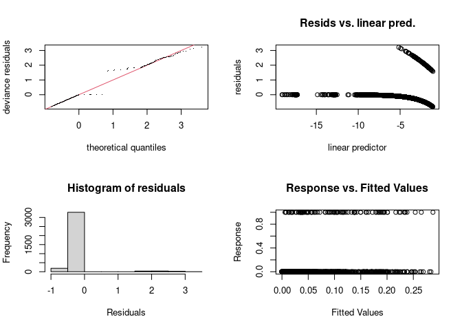<!-- -->

    ## 
    ## Method: REML   Optimizer: outer newton
    ## full convergence after 19 iterations.
    ## Gradient range [-5.003231e-05,1.304493e-05]
    ## (score 388.6786 & scale 1).
    ## eigenvalue range [-9.227289e-06,1.478483].
    ## Model rank =  162 / 163 
    ## 
    ## Basis dimension (k) checking results. Low p-value (k-index<1) may
    ## indicate that k is too low, especially if edf is close to k'.
    ## 
    ##                                  k'      edf k-index p-value    
    ## s(habitat_PC1)             3.00e+00 1.29e+00    0.32  <2e-16 ***
    ## s(disease_week)            7.00e+00 2.49e+00    0.76  <2e-16 ***
    ## s(disease_week):year_f2018 1.40e+01 1.00e+00    0.76  <2e-16 ***
    ## s(disease_week):year_f2019 1.40e+01 1.00e+00    0.76  <2e-16 ***
    ## s(disease_week):year_f2020 1.40e+01 1.00e+00    0.76  <2e-16 ***
    ## s(disease_week):year_f2021 1.40e+01 5.60e+00    0.76  <2e-16 ***
    ## s(disease_week):year_f2022 1.40e+01 5.70e-01    0.76  <2e-16 ***
    ## s(disease_week):year_f2023 1.40e+01 1.00e+00    0.76  <2e-16 ***
    ## s(year_f)                  6.00e+00 1.12e+00      NA      NA    
    ## s(site_code)               6.00e+01 5.30e-04      NA      NA    
    ## s(trap_type2)              2.00e+00 2.94e-05      NA      NA    
    ## ---
    ## Signif. codes:  0 '***' 0.001 '**' 0.01 '*' 0.05 '.' 0.1 ' ' 1

``` r
par(mfrow = c(1, 1))
plot(gam_tarsalis2, pages = 1, residuals = TRUE, shade = TRUE, seWithMean = TRUE)
```

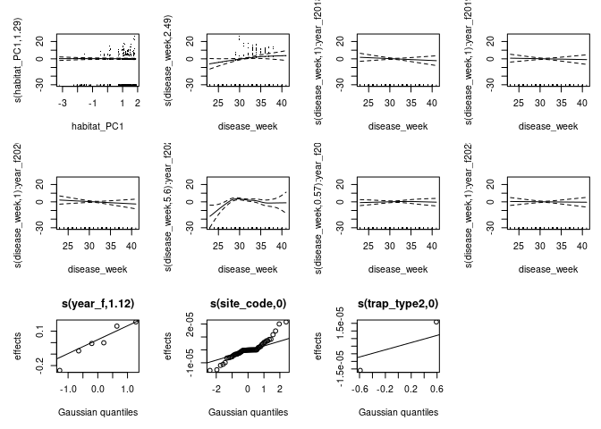<!-- -->

``` r
concurvity(gam_tarsalis2, full = FALSE)
```

    ## $worst
    ##                                    para s(habitat_PC1) s(disease_week)
    ## para                       1.000000e+00   1.401829e-28    2.563833e-19
    ## s(habitat_PC1)             1.839032e-28   1.000000e+00    1.728425e-02
    ## s(disease_week)            2.563816e-19   1.728425e-02    1.000000e+00
    ## s(disease_week):year_f2018 3.055355e-02   1.912949e-02    5.687953e-01
    ## s(disease_week):year_f2019 1.210622e-02   5.412188e-02    6.044288e-01
    ## s(disease_week):year_f2020 1.658913e-01   9.955477e-02    3.088020e-01
    ## s(disease_week):year_f2021 1.597852e-01   2.743738e-03    2.472316e-01
    ## s(disease_week):year_f2022 1.257526e-01   3.345940e-02    1.748430e-01
    ## s(disease_week):year_f2023 1.774554e-01   1.114884e-02    2.085235e-01
    ## s(year_f)                  1.000000e+00   5.063727e-03    7.572168e-02
    ## s(site_code)               1.000000e+00   1.000000e+00    1.169357e-01
    ## s(trap_type2)              1.000000e+00   2.384069e-01    2.820188e-02
    ##                            s(disease_week):year_f2018
    ## para                                     3.055355e-02
    ## s(habitat_PC1)                           1.912949e-02
    ## s(disease_week)                          5.687953e-01
    ## s(disease_week):year_f2018               1.000000e+00
    ## s(disease_week):year_f2019               6.541585e-27
    ## s(disease_week):year_f2020               1.389084e-01
    ## s(disease_week):year_f2021               2.996512e-25
    ## s(disease_week):year_f2022               2.114198e-02
    ## s(disease_week):year_f2023               2.756248e-25
    ## s(year_f)                                1.425832e-01
    ## s(site_code)                             1.823805e-01
    ## s(trap_type2)                            4.671061e-02
    ##                            s(disease_week):year_f2019
    ## para                                     1.210622e-02
    ## s(habitat_PC1)                           5.412188e-02
    ## s(disease_week)                          6.044288e-01
    ## s(disease_week):year_f2018               8.486829e-27
    ## s(disease_week):year_f2019               1.000000e+00
    ## s(disease_week):year_f2020               2.613247e-02
    ## s(disease_week):year_f2021               1.448691e-25
    ## s(disease_week):year_f2022               2.792461e-02
    ## s(disease_week):year_f2023               2.117813e-25
    ## s(year_f)                                7.267790e-02
    ## s(site_code)                             2.428759e-01
    ## s(trap_type2)                            1.220453e-02
    ##                            s(disease_week):year_f2020
    ## para                                       0.17812233
    ## s(habitat_PC1)                             0.01794771
    ## s(disease_week)                            0.34328793
    ## s(disease_week):year_f2018                 0.17238938
    ## s(disease_week):year_f2019                 0.03731300
    ## s(disease_week):year_f2020                 1.00000000
    ## s(disease_week):year_f2021                 0.07794532
    ## s(disease_week):year_f2022                 0.13733258
    ## s(disease_week):year_f2023                 0.09729985
    ## s(year_f)                                  1.00896877
    ## s(site_code)                               0.25324835
    ## s(trap_type2)                              0.18103023
    ##                            s(disease_week):year_f2021
    ## para                                     1.597852e-01
    ## s(habitat_PC1)                           2.743738e-03
    ## s(disease_week)                          2.472316e-01
    ## s(disease_week):year_f2018               3.100040e-25
    ## s(disease_week):year_f2019               3.951134e-25
    ## s(disease_week):year_f2020               3.318413e-02
    ## s(disease_week):year_f2021               1.000000e+00
    ## s(disease_week):year_f2022               7.594778e-03
    ## s(disease_week):year_f2023               1.575878e-25
    ## s(year_f)                                9.976835e-01
    ## s(site_code)                             1.760945e-01
    ## s(trap_type2)                            1.606962e-01
    ##                            s(disease_week):year_f2022
    ## para                                      0.159070605
    ## s(habitat_PC1)                            0.007725862
    ## s(disease_week)                           0.178594775
    ## s(disease_week):year_f2018                0.049264721
    ## s(disease_week):year_f2019                0.064218798
    ## s(disease_week):year_f2020                0.032256087
    ## s(disease_week):year_f2021                0.034193987
    ## s(disease_week):year_f2022                1.000000000
    ## s(disease_week):year_f2023                0.038377109
    ## s(year_f)                                 1.009099235
    ## s(site_code)                              0.146640129
    ## s(trap_type2)                             0.126143174
    ##                            s(disease_week):year_f2023   s(year_f) s(site_code)
    ## para                                     1.774554e-01 1.000000000    1.0000000
    ## s(habitat_PC1)                           1.114884e-02 0.005063727    1.0000000
    ## s(disease_week)                          2.085235e-01 0.075721684    0.1169357
    ## s(disease_week):year_f2018               4.682379e-25 0.142583234    0.1823805
    ## s(disease_week):year_f2019               6.503640e-25 0.072677899    0.2428759
    ## s(disease_week):year_f2020               4.355434e-02 1.000000000    0.2033250
    ## s(disease_week):year_f2021               4.456205e-25 0.997683500    0.1760945
    ## s(disease_week):year_f2022               3.229611e-02 1.000000000    0.1477486
    ## s(disease_week):year_f2023               1.000000e+00 1.000000000    0.2082709
    ## s(year_f)                                1.000000e+00 1.000000000    1.0000000
    ## s(site_code)                             2.082709e-01 1.000000000    1.0000000
    ## s(trap_type2)                            1.786536e-01 1.000000000    1.0000000
    ##                            s(trap_type2)
    ## para                          1.00000000
    ## s(habitat_PC1)                0.23840693
    ## s(disease_week)               0.02820188
    ## s(disease_week):year_f2018    0.04671061
    ## s(disease_week):year_f2019    0.01220453
    ## s(disease_week):year_f2020    0.16589688
    ## s(disease_week):year_f2021    0.16069615
    ## s(disease_week):year_f2022    0.12787995
    ## s(disease_week):year_f2023    0.17865360
    ## s(year_f)                     1.00000000
    ## s(site_code)                  1.00000000
    ## s(trap_type2)                 1.00000000
    ## 
    ## $observed
    ##                                    para s(habitat_PC1) s(disease_week)
    ## para                       1.000000e+00   2.479310e-30    1.451053e-24
    ## s(habitat_PC1)             1.839032e-28   1.000000e+00    3.673034e-03
    ## s(disease_week)            2.563816e-19   4.904582e-03    1.000000e+00
    ## s(disease_week):year_f2018 3.055355e-02   5.000797e-03    2.772047e-01
    ## s(disease_week):year_f2019 1.210622e-02   4.621087e-03    2.061044e-01
    ## s(disease_week):year_f2020 1.658913e-01   5.170573e-03    1.520062e-01
    ## s(disease_week):year_f2021 1.597852e-01   2.526286e-03    1.672340e-01
    ## s(disease_week):year_f2022 1.257526e-01   3.653324e-03    9.138660e-02
    ## s(disease_week):year_f2023 1.774554e-01   9.443379e-03    1.477499e-01
    ## s(year_f)                  1.000000e+00   4.156148e-03    4.793633e-02
    ## s(site_code)               1.000000e+00   1.000000e+00    3.188761e-02
    ## s(trap_type2)              1.000000e+00   4.451681e-02    7.359209e-03
    ##                            s(disease_week):year_f2018
    ## para                                     8.007847e-04
    ## s(habitat_PC1)                           2.828093e-03
    ## s(disease_week)                          3.349757e-01
    ## s(disease_week):year_f2018               1.000000e+00
    ## s(disease_week):year_f2019               6.710483e-29
    ## s(disease_week):year_f2020               3.335426e-02
    ## s(disease_week):year_f2021               1.456369e-25
    ## s(disease_week):year_f2022               9.513869e-05
    ## s(disease_week):year_f2023               4.889642e-26
    ## s(year_f)                                3.736995e-03
    ## s(site_code)                             6.880711e-02
    ## s(trap_type2)                            1.586676e-02
    ##                            s(disease_week):year_f2019
    ## para                                     1.098818e-04
    ## s(habitat_PC1)                           4.376086e-03
    ## s(disease_week)                          2.505975e-01
    ## s(disease_week):year_f2018               1.532270e-28
    ## s(disease_week):year_f2019               1.000000e+00
    ## s(disease_week):year_f2020               1.162440e-03
    ## s(disease_week):year_f2021               5.445494e-26
    ## s(disease_week):year_f2022               4.344290e-03
    ## s(disease_week):year_f2023               7.207235e-26
    ## s(year_f)                                6.596589e-04
    ## s(site_code)                             1.573013e-02
    ## s(trap_type2)                            6.409509e-04
    ##                            s(disease_week):year_f2020
    ## para                                     2.997428e-02
    ## s(habitat_PC1)                           1.997886e-03
    ## s(disease_week)                          1.824012e-01
    ## s(disease_week):year_f2018               4.538572e-28
    ## s(disease_week):year_f2019               2.113747e-29
    ## s(disease_week):year_f2020               1.000000e+00
    ## s(disease_week):year_f2021               4.101884e-26
    ## s(disease_week):year_f2022               1.038377e-04
    ## s(disease_week):year_f2023               4.409387e-26
    ## s(year_f)                                1.908132e-01
    ## s(site_code)                             4.218879e-02
    ## s(trap_type2)                            3.185670e-02
    ##                            s(disease_week):year_f2021
    ## para                                     1.391022e-03
    ## s(habitat_PC1)                           2.082011e-04
    ## s(disease_week)                          2.328626e-01
    ## s(disease_week):year_f2018               5.045905e-28
    ## s(disease_week):year_f2019               3.807305e-28
    ## s(disease_week):year_f2020               6.128775e-04
    ## s(disease_week):year_f2021               1.000000e+00
    ## s(disease_week):year_f2022               4.136414e-05
    ## s(disease_week):year_f2023               2.677274e-26
    ## s(year_f)                                8.685405e-03
    ## s(site_code)                             7.602600e-03
    ## s(trap_type2)                            1.398962e-03
    ##                            s(disease_week):year_f2022
    ## para                                     6.303375e-04
    ## s(habitat_PC1)                           1.930319e-03
    ## s(disease_week)                          1.395881e-01
    ## s(disease_week):year_f2018               1.908729e-29
    ## s(disease_week):year_f2019               2.528552e-29
    ## s(disease_week):year_f2020               1.869732e-02
    ## s(disease_week):year_f2021               9.247996e-27
    ## s(disease_week):year_f2022               1.000000e+00
    ## s(disease_week):year_f2023               1.150315e-25
    ## s(year_f)                                5.065313e-03
    ## s(site_code)                             1.205721e-02
    ## s(trap_type2)                            6.800698e-04
    ##                            s(disease_week):year_f2023    s(year_f) s(site_code)
    ## para                                     2.259549e-04 1.631229e-04 2.943591e-06
    ## s(habitat_PC1)                           6.988422e-04 3.482131e-03 1.104072e-03
    ## s(disease_week)                          1.824204e-01 3.653768e-02 7.970668e-04
    ## s(disease_week):year_f2018               1.658317e-28 8.344626e-03 8.905152e-04
    ## s(disease_week):year_f2019               2.034475e-29 2.063350e-02 2.027341e-03
    ## s(disease_week):year_f2020               1.163321e-02 4.841523e-01 3.138873e-03
    ## s(disease_week):year_f2021               1.700195e-26 1.726465e-01 5.262708e-03
    ## s(disease_week):year_f2022               1.961012e-03 9.793172e-04 1.870870e-03
    ## s(disease_week):year_f2023               1.000000e+00 2.563662e-05 3.045779e-03
    ## s(year_f)                                1.273306e-03 1.000000e+00 3.758594e-04
    ## s(site_code)                             1.480819e-02 2.269520e-02 1.000000e+00
    ## s(trap_type2)                            2.590629e-04 3.106242e-03 5.056889e-05
    ##                            s(trap_type2)
    ## para                         0.916977240
    ## s(habitat_PC1)               0.019793201
    ## s(disease_week)              0.002341398
    ## s(disease_week):year_f2018   0.025392532
    ## s(disease_week):year_f2019   0.012063908
    ## s(disease_week):year_f2020   0.154271204
    ## s(disease_week):year_f2021   0.153356691
    ## s(disease_week):year_f2022   0.124626993
    ## s(disease_week):year_f2023   0.170989787
    ## s(year_f)                    0.918155091
    ## s(site_code)                 0.952330792
    ## s(trap_type2)                1.000000000
    ## 
    ## $estimate
    ##                                    para s(habitat_PC1) s(disease_week)
    ## para                       1.000000e+00   4.716552e-30    1.723364e-21
    ## s(habitat_PC1)             1.839032e-28   1.000000e+00    4.478548e-03
    ## s(disease_week)            2.563816e-19   1.085880e-02    1.000000e+00
    ## s(disease_week):year_f2018 3.055355e-02   1.154971e-02    2.991517e-01
    ## s(disease_week):year_f2019 1.210622e-02   9.622702e-03    1.969277e-01
    ## s(disease_week):year_f2020 1.658913e-01   3.207368e-02    1.649389e-01
    ## s(disease_week):year_f2021 1.597852e-01   2.575043e-03    1.556119e-01
    ## s(disease_week):year_f2022 1.257526e-01   8.309177e-03    8.225564e-02
    ## s(disease_week):year_f2023 1.774554e-01   1.049641e-02    1.363153e-01
    ## s(year_f)                  1.000000e+00   4.568381e-03    4.602289e-02
    ## s(site_code)               1.000000e+00   1.000000e+00    3.448275e-02
    ## s(trap_type2)              1.000000e+00   1.499343e-01    7.203779e-03
    ##                            s(disease_week):year_f2018
    ## para                                     1.733385e-03
    ## s(habitat_PC1)                           2.484944e-03
    ## s(disease_week)                          3.483018e-01
    ## s(disease_week):year_f2018               1.000000e+00
    ## s(disease_week):year_f2019               7.674713e-29
    ## s(disease_week):year_f2020               2.644309e-02
    ## s(disease_week):year_f2021               1.348074e-25
    ## s(disease_week):year_f2022               6.739611e-04
    ## s(disease_week):year_f2023               4.197963e-26
    ## s(year_f)                                8.089131e-03
    ## s(site_code)                             6.845576e-02
    ## s(trap_type2)                            1.349551e-02
    ##                            s(disease_week):year_f2019
    ## para                                     4.687568e-04
    ## s(habitat_PC1)                           4.698865e-03
    ## s(disease_week)                          2.626622e-01
    ## s(disease_week):year_f2018               2.851460e-28
    ## s(disease_week):year_f2019               1.000000e+00
    ## s(disease_week):year_f2020               2.081958e-03
    ## s(disease_week):year_f2021               4.323575e-26
    ## s(disease_week):year_f2022               3.301875e-03
    ## s(disease_week):year_f2023               5.955537e-26
    ## s(year_f)                                2.814111e-03
    ## s(site_code)                             1.820852e-02
    ## s(trap_type2)                            1.043254e-03
    ##                            s(disease_week):year_f2020
    ## para                                     2.820241e-02
    ## s(habitat_PC1)                           1.857214e-03
    ## s(disease_week)                          1.810870e-01
    ## s(disease_week):year_f2018               5.677761e-28
    ## s(disease_week):year_f2019               3.315208e-29
    ## s(disease_week):year_f2020               1.000000e+00
    ## s(disease_week):year_f2021               4.992702e-26
    ## s(disease_week):year_f2022               1.423584e-04
    ## s(disease_week):year_f2023               4.316306e-26
    ## s(year_f)                                1.795336e-01
    ## s(site_code)                             4.155480e-02
    ## s(trap_type2)                            2.967539e-02
    ##                            s(disease_week):year_f2021
    ## para                                     1.352157e-02
    ## s(habitat_PC1)                           6.044881e-04
    ## s(disease_week)                          1.829331e-01
    ## s(disease_week):year_f2018               2.776647e-28
    ## s(disease_week):year_f2019               1.969935e-28
    ## s(disease_week):year_f2020               3.754156e-03
    ## s(disease_week):year_f2021               1.000000e+00
    ## s(disease_week):year_f2022               3.265294e-04
    ## s(disease_week):year_f2023               1.277322e-26
    ## s(year_f)                                8.442739e-02
    ## s(site_code)                             2.172653e-02
    ## s(trap_type2)                            1.359966e-02
    ##                            s(disease_week):year_f2022
    ## para                                     7.960772e-03
    ## s(habitat_PC1)                           2.021832e-03
    ## s(disease_week)                          1.207570e-01
    ## s(disease_week):year_f2018               1.703679e-28
    ## s(disease_week):year_f2019               1.284284e-29
    ## s(disease_week):year_f2020               8.969459e-03
    ## s(disease_week):year_f2021               5.205414e-27
    ## s(disease_week):year_f2022               1.000000e+00
    ## s(disease_week):year_f2023               1.577514e-25
    ## s(year_f)                                6.397176e-02
    ## s(site_code)                             2.088412e-02
    ## s(trap_type2)                            8.085772e-03
    ##                            s(disease_week):year_f2023   s(year_f) s(site_code)
    ## para                                     9.470559e-04 0.170967725  0.027932459
    ## s(habitat_PC1)                           8.853427e-04 0.001516334  0.053007804
    ## s(disease_week)                          1.744057e-01 0.023777971  0.001694847
    ## s(disease_week):year_f2018               1.910909e-28 0.030553550  0.003772244
    ## s(disease_week):year_f2019               2.280460e-29 0.012106224  0.002304145
    ## s(disease_week):year_f2020               1.007546e-02 0.160100449  0.009160675
    ## s(disease_week):year_f2021               1.498405e-26 0.159785248  0.006254785
    ## s(disease_week):year_f2022               3.015486e-03 0.125243158  0.006602514
    ## s(disease_week):year_f2023               1.000000e+00 0.177455357  0.006784171
    ## s(year_f)                                5.336869e-03 1.000000000  0.030053935
    ## s(site_code)                             1.517794e-02 0.199215273  1.000000000
    ## s(trap_type2)                            1.057183e-03 0.173736154  0.029687245
    ##                            s(trap_type2)
    ## para                         0.958488620
    ## s(habitat_PC1)               0.009896601
    ## s(disease_week)              0.001170699
    ## s(disease_week):year_f2018   0.027973041
    ## s(disease_week):year_f2019   0.012085066
    ## s(disease_week):year_f2020   0.160081247
    ## s(disease_week):year_f2021   0.156570969
    ## s(disease_week):year_f2022   0.125189791
    ## s(disease_week):year_f2023   0.174222572
    ## s(year_f)                    0.959077545
    ## s(site_code)                 0.976165396
    ## s(trap_type2)                1.000000000

Interpretation: habitat_PC1 and the smooth term for habitat_PC1 are NOT
statistically significant. The AIC improvement with including a smooth
term for habitat_PC1 is tiny (less than 1).

I think this means there is no evidence that habitat_PC1 matters for
tarsalis. In other words, probability of infection in tarsalis does not
vary across the urbanization gradient.

### Tar model 2v2

``` r
# Tar MODEL 2v2: WNV infection ~ urbanization + trap_type2 + GAM smooths

gam_tarsalis_trapfixed <- gam(
infected ~ habitat_PC1 + trap_type2 +
  s(disease_week, bs = "tp", k = 8) +
s(disease_week, by = year_f, bs = "fs", k = 15) +
s(year_f, bs = "re") +
s(site_code, bs = "re") +
offset(log(num_count)),
family = binomial(link = "cloglog"),
data = tarsalis_data,
method = "REML"
)
summary(gam_tarsalis_trapfixed)
```

    ## 
    ## Family: binomial 
    ## Link function: cloglog 
    ## 
    ## Formula:
    ## infected ~ habitat_PC1 + trap_type2 + s(disease_week, bs = "tp", 
    ##     k = 8) + s(disease_week, by = year_f, bs = "fs", k = 15) + 
    ##     s(year_f, bs = "re") + s(site_code, bs = "re") + offset(log(num_count))
    ## 
    ## Parametric coefficients:
    ##                   Estimate Std. Error z value Pr(>|z|)    
    ## (Intercept)     -9.087e+00  3.844e-01 -23.638   <2e-16 ***
    ## habitat_PC1     -1.434e-01  1.422e-01  -1.009    0.313    
    ## trap_type2GRVD+ -1.144e+02  7.698e+06   0.000    1.000    
    ## ---
    ## Signif. codes:  0 '***' 0.001 '**' 0.01 '*' 0.05 '.' 0.1 ' ' 1
    ## 
    ## Approximate significance of smooth terms:
    ##                                  edf  Ref.df Chi.sq  p-value    
    ## s(disease_week)            2.6931772  3.2958 25.670 3.29e-05 ***
    ## s(disease_week):year_f2018 1.0000063  1.0000  4.156   0.0415 *  
    ## s(disease_week):year_f2019 1.0000105  1.0000  0.669   0.4133    
    ## s(disease_week):year_f2020 1.9830886  2.4519  8.407   0.0270 *  
    ## s(disease_week):year_f2021 5.7717275  6.8999 78.654  < 2e-16 ***
    ## s(disease_week):year_f2022 0.1053153  0.1996  0.006   0.9372    
    ## s(disease_week):year_f2023 1.0000056  1.0000  0.615   0.4329    
    ## s(year_f)                  0.0009528  5.0000  0.001   0.5145    
    ## s(site_code)               0.0001319 53.0000  0.000   0.5427    
    ## ---
    ## Signif. codes:  0 '***' 0.001 '**' 0.01 '*' 0.05 '.' 0.1 ' ' 1
    ## 
    ## Rank: 159/160
    ## R-sq.(adj) =  0.0746   Deviance explained = 21.5%
    ## -REML = 370.71  Scale est. = 1         n = 3584

``` r
#allow smooth to vary across urbanization gradient (non-linear)
gam_tarsalis2_trapfixed <- gam(
  infected ~ trap_type2 +
    s(habitat_PC1, k = 4) +
    s(disease_week, bs = "tp", k = 8) +
    s(disease_week, by = year_f, bs = "fs", k = 15) +
    s(year_f, bs = "re") +
    s(site_code, bs = "re") +
    offset(log(num_count)),
  family = binomial(link = "cloglog"),
  data = tarsalis_data,
  method = "REML"
)
summary(gam_tarsalis2_trapfixed)
```

    ## 
    ## Family: binomial 
    ## Link function: cloglog 
    ## 
    ## Formula:
    ## infected ~ trap_type2 + s(habitat_PC1, k = 4) + s(disease_week, 
    ##     bs = "tp", k = 8) + s(disease_week, by = year_f, bs = "fs", 
    ##     k = 15) + s(year_f, bs = "re") + s(site_code, bs = "re") + 
    ##     offset(log(num_count))
    ## 
    ## Parametric coefficients:
    ##                   Estimate Std. Error z value Pr(>|z|)    
    ## (Intercept)     -9.230e+00  3.566e-01  -25.89   <2e-16 ***
    ## trap_type2GRVD+ -1.134e+02  7.698e+06    0.00        1    
    ## ---
    ## Signif. codes:  0 '***' 0.001 '**' 0.01 '*' 0.05 '.' 0.1 ' ' 1
    ## 
    ## Approximate significance of smooth terms:
    ##                                  edf  Ref.df Chi.sq  p-value    
    ## s(habitat_PC1)             1.0000436  1.0001  1.017   0.3132    
    ## s(disease_week)            2.6931783  3.2958 25.670 3.29e-05 ***
    ## s(disease_week):year_f2018 1.0000080  1.0000  4.156   0.0415 *  
    ## s(disease_week):year_f2019 1.0000133  1.0000  0.669   0.4134    
    ## s(disease_week):year_f2020 1.9830944  2.4519  8.407   0.0270 *  
    ## s(disease_week):year_f2021 5.7717317  6.8999 78.663  < 2e-16 ***
    ## s(disease_week):year_f2022 0.1053171  0.1996  0.006   0.9372    
    ## s(disease_week):year_f2023 1.0000060  1.0000  0.615   0.4328    
    ## s(year_f)                  0.0008171  5.0000  0.001   0.5145    
    ## s(site_code)               0.0001356 53.0000  0.000   0.5427    
    ## ---
    ## Signif. codes:  0 '***' 0.001 '**' 0.01 '*' 0.05 '.' 0.1 ' ' 1
    ## 
    ## Rank: 161/162
    ## R-sq.(adj) =  0.0746   Deviance explained = 21.5%
    ## -REML = 370.93  Scale est. = 1         n = 3584

``` r
AIC(gam_tarsalis, gam_tarsalis2, gam_tarsalis_trapfixed, gam_tarsalis2_trapfixed)
```

    ##                               df      AIC
    ## gam_tarsalis            18.53465 781.5625
    ## gam_tarsalis2           19.03913 782.0304
    ## gam_tarsalis_trapfixed  18.84940 779.8560
    ## gam_tarsalis2_trapfixed 18.84927 779.8558

``` r
plot(
  gam_tarsalis2_trapfixed,
  select = 1,
  shade = TRUE,
  residuals = TRUE,
  rug = TRUE
)
```

<!-- -->

``` r
# tarsalis diagnostics
par(mfrow = c(2, 2))
gam.check(gam_tarsalis_trapfixed)
```

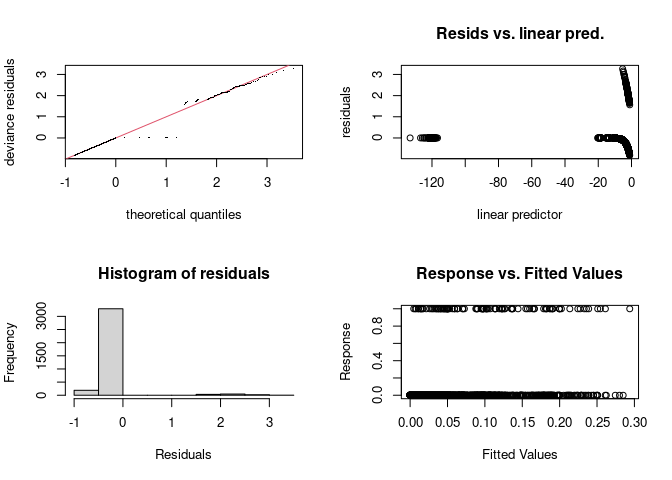<!-- -->

    ## 
    ## Method: REML   Optimizer: outer newton
    ## full convergence after 27 iterations.
    ## Gradient range [-0.00012685,4.364974e-06]
    ## (score 370.7143 & scale 1).
    ## Hessian positive definite, eigenvalue range [2.295228e-06,1.69383].
    ## Model rank =  159 / 160 
    ## 
    ## Basis dimension (k) checking results. Low p-value (k-index<1) may
    ## indicate that k is too low, especially if edf is close to k'.
    ## 
    ##                                  k'      edf k-index p-value    
    ## s(disease_week)            7.00e+00 2.69e+00    0.77  <2e-16 ***
    ## s(disease_week):year_f2018 1.40e+01 1.00e+00    0.77  <2e-16 ***
    ## s(disease_week):year_f2019 1.40e+01 1.00e+00    0.77  <2e-16 ***
    ## s(disease_week):year_f2020 1.40e+01 1.98e+00    0.77  <2e-16 ***
    ## s(disease_week):year_f2021 1.40e+01 5.77e+00    0.77  <2e-16 ***
    ## s(disease_week):year_f2022 1.40e+01 1.05e-01    0.77  <2e-16 ***
    ## s(disease_week):year_f2023 1.40e+01 1.00e+00    0.77  <2e-16 ***
    ## s(year_f)                  6.00e+00 9.53e-04      NA      NA    
    ## s(site_code)               6.00e+01 1.32e-04      NA      NA    
    ## ---
    ## Signif. codes:  0 '***' 0.001 '**' 0.01 '*' 0.05 '.' 0.1 ' ' 1

``` r
par(mfrow = c(1, 1))
plot(gam_tarsalis_trapfixed, pages = 1, residuals = TRUE, shade = TRUE, seWithMean = TRUE)
```

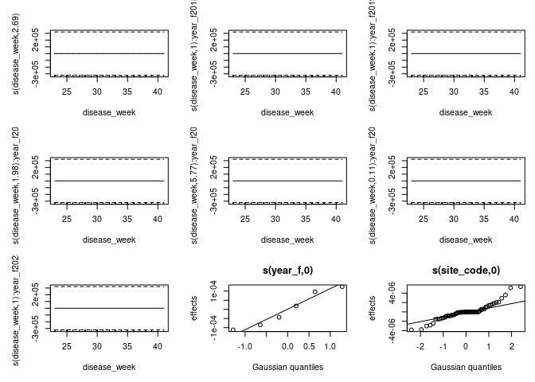<!-- -->

``` r
# Concurvity
concurvity(gam_tarsalis, full = FALSE)
```

    ## $worst
    ##                                    para s(disease_week)
    ## para                       1.000000e+00    2.563833e-19
    ## s(disease_week)            2.563844e-19    1.000000e+00
    ## s(disease_week):year_f2018 3.055355e-02    5.687953e-01
    ## s(disease_week):year_f2019 1.210622e-02    6.044288e-01
    ## s(disease_week):year_f2020 1.891738e-01    2.632969e-01
    ## s(disease_week):year_f2021 1.597852e-01    2.472316e-01
    ## s(disease_week):year_f2022 1.378412e-01    1.725389e-01
    ## s(disease_week):year_f2023 1.774554e-01    2.085235e-01
    ## s(year_f)                  1.000000e+00    7.572168e-02
    ## s(site_code)               1.000000e+00    1.169357e-01
    ## s(trap_type2)              1.000000e+00    2.820188e-02
    ##                            s(disease_week):year_f2018
    ## para                                     3.055355e-02
    ## s(disease_week)                          5.687953e-01
    ## s(disease_week):year_f2018               1.000000e+00
    ## s(disease_week):year_f2019               3.599542e-27
    ## s(disease_week):year_f2020               2.979935e-02
    ## s(disease_week):year_f2021               1.704954e-25
    ## s(disease_week):year_f2022               2.501552e-02
    ## s(disease_week):year_f2023               2.083786e-25
    ## s(year_f)                                1.425832e-01
    ## s(site_code)                             1.823805e-01
    ## s(trap_type2)                            4.671061e-02
    ##                            s(disease_week):year_f2019
    ## para                                     1.210622e-02
    ## s(disease_week)                          6.044288e-01
    ## s(disease_week):year_f2018               7.057095e-27
    ## s(disease_week):year_f2019               1.000000e+00
    ## s(disease_week):year_f2020               6.052159e-02
    ## s(disease_week):year_f2021               1.485662e-25
    ## s(disease_week):year_f2022               1.663377e-02
    ## s(disease_week):year_f2023               2.901624e-25
    ## s(year_f)                                7.267790e-02
    ## s(site_code)                             2.428759e-01
    ## s(trap_type2)                            1.220453e-02
    ##                            s(disease_week):year_f2020
    ## para                                       0.15798138
    ## s(disease_week)                            0.30097325
    ## s(disease_week):year_f2018                 0.09705454
    ## s(disease_week):year_f2019                 0.05545535
    ## s(disease_week):year_f2020                 1.00000000
    ## s(disease_week):year_f2021                 0.08131465
    ## s(disease_week):year_f2022                 0.04261070
    ## s(disease_week):year_f2023                 0.02613599
    ## s(year_f)                                  1.07979425
    ## s(site_code)                               0.21333686
    ## s(trap_type2)                              0.15751729
    ##                            s(disease_week):year_f2021
    ## para                                     1.597852e-01
    ## s(disease_week)                          2.472316e-01
    ## s(disease_week):year_f2018               3.519801e-25
    ## s(disease_week):year_f2019               2.132610e-25
    ## s(disease_week):year_f2020               3.208109e-02
    ## s(disease_week):year_f2021               1.000000e+00
    ## s(disease_week):year_f2022               2.640971e-02
    ## s(disease_week):year_f2023               4.603725e-25
    ## s(year_f)                                9.976835e-01
    ## s(site_code)                             1.760945e-01
    ## s(trap_type2)                            1.606962e-01
    ##                            s(disease_week):year_f2022
    ## para                                       0.12577378
    ## s(disease_week)                            0.17274356
    ## s(disease_week):year_f2018                 0.03886645
    ## s(disease_week):year_f2019                 0.02334894
    ## s(disease_week):year_f2020                 0.03317944
    ## s(disease_week):year_f2021                 0.09526817
    ## s(disease_week):year_f2022                 1.00000000
    ## s(disease_week):year_f2023                 0.11627306
    ## s(year_f)                                  1.02736558
    ## s(site_code)                               0.18101751
    ## s(trap_type2)                              0.14551310
    ##                            s(disease_week):year_f2023  s(year_f) s(site_code)
    ## para                                     1.774554e-01 1.00000000    1.0000000
    ## s(disease_week)                          2.085235e-01 0.07572168    0.1169357
    ## s(disease_week):year_f2018               5.344449e-25 0.14258323    0.1823805
    ## s(disease_week):year_f2019               4.748942e-25 0.07267790    0.2428759
    ## s(disease_week):year_f2020               4.450431e-02 1.00000000    0.2148359
    ## s(disease_week):year_f2021               7.881440e-25 0.99768350    0.1760945
    ## s(disease_week):year_f2022               3.075449e-02 1.00000000    0.1609583
    ## s(disease_week):year_f2023               1.000000e+00 1.00000000    0.2082709
    ## s(year_f)                                1.000000e+00 1.00000000    1.0000000
    ## s(site_code)                             2.082709e-01 1.00000000    1.0000000
    ## s(trap_type2)                            1.786536e-01 1.00000000    1.0000000
    ##                            s(trap_type2)
    ## para                          1.00000000
    ## s(disease_week)               0.02820188
    ## s(disease_week):year_f2018    0.04671061
    ## s(disease_week):year_f2019    0.01220453
    ## s(disease_week):year_f2020    0.18925959
    ## s(disease_week):year_f2021    0.16069615
    ## s(disease_week):year_f2022    0.13977785
    ## s(disease_week):year_f2023    0.17865360
    ## s(year_f)                     1.00000000
    ## s(site_code)                  1.00000000
    ## s(trap_type2)                 1.00000000
    ## 
    ## $observed
    ##                                    para s(disease_week)
    ## para                       1.000000e+00    1.674505e-24
    ## s(disease_week)            2.563844e-19    1.000000e+00
    ## s(disease_week):year_f2018 3.055355e-02    2.766102e-01
    ## s(disease_week):year_f2019 1.210622e-02    2.065865e-01
    ## s(disease_week):year_f2020 1.891738e-01    1.108510e-01
    ## s(disease_week):year_f2021 1.597852e-01    1.680442e-01
    ## s(disease_week):year_f2022 1.378412e-01    9.102438e-02
    ## s(disease_week):year_f2023 1.774554e-01    1.480878e-01
    ## s(year_f)                  1.000000e+00    4.789940e-02
    ## s(site_code)               1.000000e+00    3.172277e-02
    ## s(trap_type2)              1.000000e+00    7.241880e-03
    ##                            s(disease_week):year_f2018
    ## para                                     8.008375e-04
    ## s(disease_week)                          3.349777e-01
    ## s(disease_week):year_f2018               1.000000e+00
    ## s(disease_week):year_f2019               7.486791e-28
    ## s(disease_week):year_f2020               6.024580e-05
    ## s(disease_week):year_f2021               4.290593e-26
    ## s(disease_week):year_f2022               2.097049e-03
    ## s(disease_week):year_f2023               1.185456e-26
    ## s(year_f)                                3.737242e-03
    ## s(site_code)                             6.880708e-02
    ## s(trap_type2)                            1.586678e-02
    ##                            s(disease_week):year_f2019
    ## para                                     1.110337e-04
    ## s(disease_week)                          2.504622e-01
    ## s(disease_week):year_f2018               1.501960e-28
    ## s(disease_week):year_f2019               1.000000e+00
    ## s(disease_week):year_f2020               3.630808e-02
    ## s(disease_week):year_f2021               5.084139e-26
    ## s(disease_week):year_f2022               1.423207e-03
    ## s(disease_week):year_f2023               5.283309e-26
    ## s(year_f)                                6.665741e-04
    ## s(site_code)                             1.574767e-02
    ## s(trap_type2)                            6.422610e-04
    ##                            s(disease_week):year_f2020
    ## para                                     2.997397e-02
    ## s(disease_week)                          1.824017e-01
    ## s(disease_week):year_f2018               2.291018e-29
    ## s(disease_week):year_f2019               2.243144e-28
    ## s(disease_week):year_f2020               1.000000e+00
    ## s(disease_week):year_f2021               7.573132e-26
    ## s(disease_week):year_f2022               2.243641e-03
    ## s(disease_week):year_f2023               1.100341e-26
    ## s(year_f)                                1.908112e-01
    ## s(site_code)                             4.218848e-02
    ## s(trap_type2)                            3.185638e-02
    ##                            s(disease_week):year_f2021
    ## para                                     1.802726e-03
    ## s(disease_week)                          2.344095e-01
    ## s(disease_week):year_f2018               9.390603e-28
    ## s(disease_week):year_f2019               3.285176e-28
    ## s(disease_week):year_f2020               4.267461e-03
    ## s(disease_week):year_f2021               1.000000e+00
    ## s(disease_week):year_f2022               2.837580e-03
    ## s(disease_week):year_f2023               1.152715e-25
    ## s(year_f)                                1.125605e-02
    ## s(site_code)                             8.069442e-03
    ## s(trap_type2)                            1.812875e-03
    ##                            s(disease_week):year_f2022
    ## para                                     2.381781e-03
    ## s(disease_week)                          1.376192e-01
    ## s(disease_week):year_f2018               5.429166e-28
    ## s(disease_week):year_f2019               1.868916e-28
    ## s(disease_week):year_f2020               1.298338e-03
    ## s(disease_week):year_f2021               4.273359e-27
    ## s(disease_week):year_f2022               1.000000e+00
    ## s(disease_week):year_f2023               2.603520e-25
    ## s(year_f)                                1.913969e-02
    ## s(site_code)                             1.443345e-02
    ## s(trap_type2)                            2.459818e-03
    ##                            s(disease_week):year_f2023    s(year_f) s(site_code)
    ## para                                     3.765636e-03 0.0001468923 1.951759e-05
    ## s(disease_week)                          1.925052e-01 0.0365920465 7.076696e-04
    ## s(disease_week):year_f2018               1.995092e-27 0.0079502531 8.578397e-04
    ## s(disease_week):year_f2019               7.983223e-28 0.0208666863 2.083284e-03
    ## s(disease_week):year_f2020               1.891466e-05 0.4859241932 2.901383e-03
    ## s(disease_week):year_f2021               1.604680e-26 0.1715082175 5.292929e-03
    ## s(disease_week):year_f2022               5.830422e-03 0.0012134118 8.364325e-04
    ## s(disease_week):year_f2023               1.000000e+00 0.0001004919 3.023633e-03
    ## s(year_f)                                2.122019e-02 1.0000000000 4.054506e-04
    ## s(site_code)                             1.533908e-02 0.0227014606 1.000000e+00
    ## s(trap_type2)                            4.260922e-03 0.0030073366 1.089216e-04
    ##                            s(trap_type2)
    ## para                         0.916977240
    ## s(disease_week)              0.002341398
    ## s(disease_week):year_f2018   0.025392532
    ## s(disease_week):year_f2019   0.012063908
    ## s(disease_week):year_f2020   0.172775780
    ## s(disease_week):year_f2021   0.153356691
    ## s(disease_week):year_f2022   0.135598758
    ## s(disease_week):year_f2023   0.170989787
    ## s(year_f)                    0.918155091
    ## s(site_code)                 0.952330792
    ## s(trap_type2)                1.000000000
    ## 
    ## $estimate
    ##                                    para s(disease_week)
    ## para                       1.000000e+00    1.723364e-21
    ## s(disease_week)            2.563844e-19    1.000000e+00
    ## s(disease_week):year_f2018 3.055355e-02    2.991517e-01
    ## s(disease_week):year_f2019 1.210622e-02    1.969277e-01
    ## s(disease_week):year_f2020 1.891738e-01    1.334332e-01
    ## s(disease_week):year_f2021 1.597852e-01    1.556119e-01
    ## s(disease_week):year_f2022 1.378412e-01    8.198136e-02
    ## s(disease_week):year_f2023 1.774554e-01    1.363153e-01
    ## s(year_f)                  1.000000e+00    4.602289e-02
    ## s(site_code)               1.000000e+00    3.448275e-02
    ## s(trap_type2)              1.000000e+00    7.203779e-03
    ##                            s(disease_week):year_f2018
    ## para                                     1.733385e-03
    ## s(disease_week)                          3.483018e-01
    ## s(disease_week):year_f2018               1.000000e+00
    ## s(disease_week):year_f2019               7.345675e-28
    ## s(disease_week):year_f2020               2.066106e-04
    ## s(disease_week):year_f2021               3.129601e-26
    ## s(disease_week):year_f2022               2.049644e-03
    ## s(disease_week):year_f2023               1.318650e-26
    ## s(year_f)                                8.089131e-03
    ## s(site_code)                             6.845576e-02
    ## s(trap_type2)                            1.349551e-02
    ##                            s(disease_week):year_f2019
    ## para                                     4.687568e-04
    ## s(disease_week)                          2.626622e-01
    ## s(disease_week):year_f2018               2.341062e-28
    ## s(disease_week):year_f2019               1.000000e+00
    ## s(disease_week):year_f2020               3.141675e-02
    ## s(disease_week):year_f2021               4.595900e-26
    ## s(disease_week):year_f2022               1.321507e-03
    ## s(disease_week):year_f2023               5.953125e-26
    ## s(year_f)                                2.814111e-03
    ## s(site_code)                             1.820852e-02
    ## s(trap_type2)                            1.043254e-03
    ##                            s(disease_week):year_f2020
    ## para                                     2.820241e-02
    ## s(disease_week)                          1.810870e-01
    ## s(disease_week):year_f2018               1.642748e-28
    ## s(disease_week):year_f2019               3.204332e-28
    ## s(disease_week):year_f2020               1.000000e+00
    ## s(disease_week):year_f2021               6.663614e-26
    ## s(disease_week):year_f2022               1.889544e-03
    ## s(disease_week):year_f2023               2.310053e-26
    ## s(year_f)                                1.795336e-01
    ## s(site_code)                             4.155480e-02
    ## s(trap_type2)                            2.967539e-02
    ##                            s(disease_week):year_f2021
    ## para                                     1.352157e-02
    ## s(disease_week)                          1.829331e-01
    ## s(disease_week):year_f2018               3.167357e-28
    ## s(disease_week):year_f2019               9.820725e-29
    ## s(disease_week):year_f2020               1.195755e-03
    ## s(disease_week):year_f2021               1.000000e+00
    ## s(disease_week):year_f2022               3.742798e-03
    ## s(disease_week):year_f2023               4.466180e-26
    ## s(year_f)                                8.442739e-02
    ## s(site_code)                             2.172653e-02
    ## s(trap_type2)                            1.359966e-02
    ##                            s(disease_week):year_f2022
    ## para                                     7.960772e-03
    ## s(disease_week)                          1.207570e-01
    ## s(disease_week):year_f2018               2.501003e-28
    ## s(disease_week):year_f2019               8.287131e-29
    ## s(disease_week):year_f2020               1.684379e-03
    ## s(disease_week):year_f2021               1.493740e-27
    ## s(disease_week):year_f2022               1.000000e+00
    ## s(disease_week):year_f2023               1.290800e-25
    ## s(year_f)                                6.397176e-02
    ## s(site_code)                             2.088412e-02
    ## s(trap_type2)                            8.085772e-03
    ##                            s(disease_week):year_f2023  s(year_f) s(site_code)
    ## para                                     9.470559e-04 0.17096772  0.027932459
    ## s(disease_week)                          1.744057e-01 0.02377797  0.001694847
    ## s(disease_week):year_f2018               3.290489e-28 0.03055355  0.003772244
    ## s(disease_week):year_f2019               1.288456e-28 0.01210622  0.002304145
    ## s(disease_week):year_f2020               3.370496e-03 0.16446109  0.008513625
    ## s(disease_week):year_f2021               3.538459e-27 0.15978525  0.006254785
    ## s(disease_week):year_f2022               1.125109e-02 0.12791467  0.006714647
    ## s(disease_week):year_f2023               1.000000e+00 0.17745536  0.006784171
    ## s(year_f)                                5.336869e-03 1.00000000  0.030053935
    ## s(site_code)                             1.517794e-02 0.19921527  1.000000000
    ## s(trap_type2)                            1.057183e-03 0.17373615  0.029687245
    ##                            s(trap_type2)
    ## para                         0.958488620
    ## s(disease_week)              0.001170699
    ## s(disease_week):year_f2018   0.027973041
    ## s(disease_week):year_f2019   0.012085066
    ## s(disease_week):year_f2020   0.180974775
    ## s(disease_week):year_f2021   0.156570969
    ## s(disease_week):year_f2022   0.136719959
    ## s(disease_week):year_f2023   0.174222572
    ## s(year_f)                    0.959077545
    ## s(site_code)                 0.976165396
    ## s(trap_type2)                1.000000000

``` r
# tarsalis diagnostics
par(mfrow = c(2, 2))
gam.check(gam_tarsalis2_trapfixed)
```

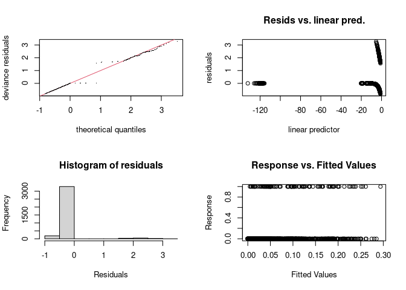<!-- -->

    ## 
    ## Method: REML   Optimizer: outer newton
    ## full convergence after 27 iterations.
    ## Gradient range [-0.0001087737,3.614612e-06]
    ## (score 370.9317 & scale 1).
    ## Hessian positive definite, eigenvalue range [9.247991e-07,1.693859].
    ## Model rank =  161 / 162 
    ## 
    ## Basis dimension (k) checking results. Low p-value (k-index<1) may
    ## indicate that k is too low, especially if edf is close to k'.
    ## 
    ##                                  k'      edf k-index p-value    
    ## s(habitat_PC1)             3.00e+00 1.00e+00    0.32  <2e-16 ***
    ## s(disease_week)            7.00e+00 2.69e+00    0.77  <2e-16 ***
    ## s(disease_week):year_f2018 1.40e+01 1.00e+00    0.77  <2e-16 ***
    ## s(disease_week):year_f2019 1.40e+01 1.00e+00    0.77  <2e-16 ***
    ## s(disease_week):year_f2020 1.40e+01 1.98e+00    0.77  <2e-16 ***
    ## s(disease_week):year_f2021 1.40e+01 5.77e+00    0.77  <2e-16 ***
    ## s(disease_week):year_f2022 1.40e+01 1.05e-01    0.77  <2e-16 ***
    ## s(disease_week):year_f2023 1.40e+01 1.00e+00    0.77  <2e-16 ***
    ## s(year_f)                  6.00e+00 8.17e-04      NA      NA    
    ## s(site_code)               6.00e+01 1.36e-04      NA      NA    
    ## ---
    ## Signif. codes:  0 '***' 0.001 '**' 0.01 '*' 0.05 '.' 0.1 ' ' 1

``` r
par(mfrow = c(1, 1))
plot(gam_tarsalis2_trapfixed, pages = 1, residuals = TRUE, shade = TRUE, seWithMean = TRUE)
```

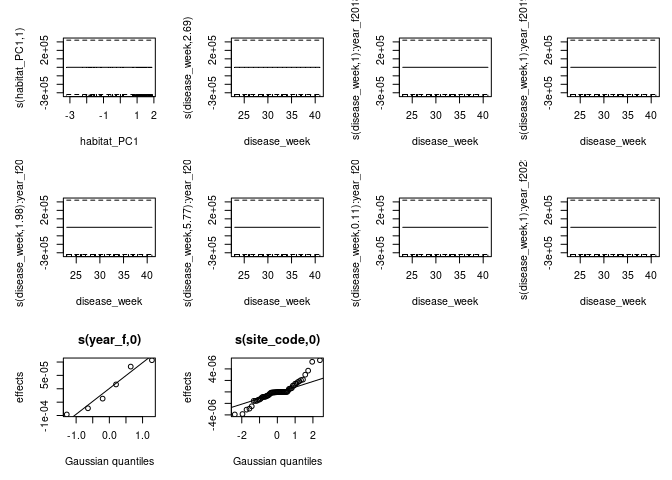<!-- -->

``` r
# Concurvity
concurvity(gam_tarsalis2_trapfixed, full = FALSE)
```

    ## $worst
    ##                                    para s(habitat_PC1) s(disease_week)
    ## para                       1.000000e+00   1.401829e-28    2.563833e-19
    ## s(habitat_PC1)             1.530656e-28   1.000000e+00    1.728425e-02
    ## s(disease_week)            2.563815e-19   1.728425e-02    1.000000e+00
    ## s(disease_week):year_f2018 3.055355e-02   1.912949e-02    5.687953e-01
    ## s(disease_week):year_f2019 1.210622e-02   5.412188e-02    6.044288e-01
    ## s(disease_week):year_f2020 1.663363e-01   1.005741e-01    3.007220e-01
    ## s(disease_week):year_f2021 1.597852e-01   2.743738e-03    2.472316e-01
    ## s(disease_week):year_f2022 1.257248e-01   4.155640e-02    2.026139e-01
    ## s(disease_week):year_f2023 1.774554e-01   1.114884e-02    2.085235e-01
    ## s(year_f)                  1.000000e+00   5.063727e-03    7.572168e-02
    ## s(site_code)               1.000000e+00   1.000000e+00    1.169357e-01
    ##                            s(disease_week):year_f2018
    ## para                                     3.055355e-02
    ## s(habitat_PC1)                           1.912949e-02
    ## s(disease_week)                          5.687953e-01
    ## s(disease_week):year_f2018               1.000000e+00
    ## s(disease_week):year_f2019               2.457157e-27
    ## s(disease_week):year_f2020               1.461159e-01
    ## s(disease_week):year_f2021               5.272935e-25
    ## s(disease_week):year_f2022               3.984536e-02
    ## s(disease_week):year_f2023               5.573755e-25
    ## s(year_f)                                1.425832e-01
    ## s(site_code)                             1.823805e-01
    ##                            s(disease_week):year_f2019
    ## para                                     1.210622e-02
    ## s(habitat_PC1)                           5.412188e-02
    ## s(disease_week)                          6.044288e-01
    ## s(disease_week):year_f2018               3.815052e-27
    ## s(disease_week):year_f2019               1.000000e+00
    ## s(disease_week):year_f2020               9.376229e-02
    ## s(disease_week):year_f2021               1.496542e-25
    ## s(disease_week):year_f2022               5.708638e-02
    ## s(disease_week):year_f2023               1.072592e-25
    ## s(year_f)                                7.267790e-02
    ## s(site_code)                             2.428759e-01
    ##                            s(disease_week):year_f2020
    ## para                                       0.16107523
    ## s(habitat_PC1)                             0.05137306
    ## s(disease_week)                            0.35016053
    ## s(disease_week):year_f2018                 0.14441265
    ## s(disease_week):year_f2019                 0.10560339
    ## s(disease_week):year_f2020                 1.00000000
    ## s(disease_week):year_f2021                 0.01493317
    ## s(disease_week):year_f2022                 0.05286530
    ## s(disease_week):year_f2023                 0.04030138
    ## s(year_f)                                  1.00027053
    ## s(site_code)                               0.27164975
    ##                            s(disease_week):year_f2021
    ## para                                     1.597852e-01
    ## s(habitat_PC1)                           2.743738e-03
    ## s(disease_week)                          2.472316e-01
    ## s(disease_week):year_f2018               4.889800e-25
    ## s(disease_week):year_f2019               2.173750e-25
    ## s(disease_week):year_f2020               1.220691e-02
    ## s(disease_week):year_f2021               1.000000e+00
    ## s(disease_week):year_f2022               5.794230e-02
    ## s(disease_week):year_f2023               6.870933e-25
    ## s(year_f)                                9.976835e-01
    ## s(site_code)                             1.760945e-01
    ##                            s(disease_week):year_f2022
    ## para                                       0.13166741
    ## s(habitat_PC1)                             0.01084717
    ## s(disease_week)                            0.17344685
    ## s(disease_week):year_f2018                 0.05436149
    ## s(disease_week):year_f2019                 0.05398769
    ## s(disease_week):year_f2020                 0.05938332
    ## s(disease_week):year_f2021                 0.05590522
    ## s(disease_week):year_f2022                 1.00000000
    ## s(disease_week):year_f2023                 0.03274515
    ## s(year_f)                                  1.00912104
    ## s(site_code)                               0.14620518
    ##                            s(disease_week):year_f2023   s(year_f) s(site_code)
    ## para                                     1.774554e-01 1.000000000    1.0000000
    ## s(habitat_PC1)                           1.114884e-02 0.005063727    1.0000000
    ## s(disease_week)                          2.085235e-01 0.075721684    0.1169357
    ## s(disease_week):year_f2018               1.041672e-24 0.142583234    0.1823805
    ## s(disease_week):year_f2019               1.917622e-25 0.072677899    0.2428759
    ## s(disease_week):year_f2020               1.326695e-02 1.000000000    0.2971258
    ## s(disease_week):year_f2021               5.874476e-25 0.997683500    0.1760945
    ## s(disease_week):year_f2022               1.487715e-02 1.000000000    0.1505525
    ## s(disease_week):year_f2023               1.000000e+00 1.000000000    0.2082709
    ## s(year_f)                                1.000000e+00 1.000000000    1.0000000
    ## s(site_code)                             2.082709e-01 1.000000000    1.0000000
    ## 
    ## $observed
    ##                                    para s(habitat_PC1) s(disease_week)
    ## para                       1.000000e+00   1.603273e-32    1.852797e-24
    ## s(habitat_PC1)             1.530656e-28   1.000000e+00    3.428714e-03
    ## s(disease_week)            2.563815e-19   9.744204e-03    1.000000e+00
    ## s(disease_week):year_f2018 3.055355e-02   1.027576e-02    2.755900e-01
    ## s(disease_week):year_f2019 1.210622e-02   8.655413e-03    2.074295e-01
    ## s(disease_week):year_f2020 1.663363e-01   6.369780e-02    1.566181e-01
    ## s(disease_week):year_f2021 1.597852e-01   2.620553e-03    1.694555e-01
    ## s(disease_week):year_f2022 1.257248e-01   2.215996e-02    9.948682e-02
    ## s(disease_week):year_f2023 1.774554e-01   1.092985e-02    1.486728e-01
    ## s(year_f)                  1.000000e+00   4.695733e-03    4.782064e-02
    ## s(site_code)               1.000000e+00   1.000000e+00    3.142664e-02
    ##                            s(disease_week):year_f2018
    ## para                                     8.007637e-04
    ## s(habitat_PC1)                           2.828080e-03
    ## s(disease_week)                          3.349750e-01
    ## s(disease_week):year_f2018               1.000000e+00
    ## s(disease_week):year_f2019               1.026173e-30
    ## s(disease_week):year_f2020               5.736226e-02
    ## s(disease_week):year_f2021               3.929452e-25
    ## s(disease_week):year_f2022               2.557035e-04
    ## s(disease_week):year_f2023               4.310654e-26
    ## s(year_f)                                3.736897e-03
    ## s(site_code)                             6.880712e-02
    ##                            s(disease_week):year_f2019
    ## para                                     1.096812e-04
    ## s(habitat_PC1)                           4.374805e-03
    ## s(disease_week)                          2.506211e-01
    ## s(disease_week):year_f2018               1.349848e-28
    ## s(disease_week):year_f2019               1.000000e+00
    ## s(disease_week):year_f2020               6.303556e-02
    ## s(disease_week):year_f2021               4.700960e-26
    ## s(disease_week):year_f2022               7.911628e-04
    ## s(disease_week):year_f2023               3.119520e-27
    ## s(year_f)                                6.584549e-04
    ## s(site_code)                             1.572706e-02
    ##                            s(disease_week):year_f2020
    ## para                                     5.061300e-02
    ## s(habitat_PC1)                           2.162211e-03
    ## s(disease_week)                          1.553661e-01
    ## s(disease_week):year_f2018               3.234387e-28
    ## s(disease_week):year_f2019               2.982528e-29
    ## s(disease_week):year_f2020               1.000000e+00
    ## s(disease_week):year_f2021               8.686323e-27
    ## s(disease_week):year_f2022               4.752836e-03
    ## s(disease_week):year_f2023               4.217253e-26
    ## s(year_f)                                3.221972e-01
    ## s(site_code)                             6.371772e-02
    ##                            s(disease_week):year_f2021
    ## para                                     1.230556e-03
    ## s(habitat_PC1)                           2.107422e-04
    ## s(disease_week)                          2.329402e-01
    ## s(disease_week):year_f2018               1.047387e-27
    ## s(disease_week):year_f2019               9.353574e-28
    ## s(disease_week):year_f2020               4.744693e-04
    ## s(disease_week):year_f2021               1.000000e+00
    ## s(disease_week):year_f2022               1.859549e-02
    ## s(disease_week):year_f2023               4.642927e-28
    ## s(year_f)                                7.683474e-03
    ## s(site_code)                             7.274562e-03
    ##                            s(disease_week):year_f2022
    ## para                                     1.414465e-04
    ## s(habitat_PC1)                           1.712204e-03
    ## s(disease_week)                          1.406990e-01
    ## s(disease_week):year_f2018               3.574439e-28
    ## s(disease_week):year_f2019               7.654699e-28
    ## s(disease_week):year_f2020               1.294556e-05
    ## s(disease_week):year_f2021               3.544705e-26
    ## s(disease_week):year_f2022               1.000000e+00
    ## s(disease_week):year_f2023               2.244360e-26
    ## s(year_f)                                1.136646e-03
    ## s(site_code)                             1.122974e-02
    ##                            s(disease_week):year_f2023   s(year_f) s(site_code)
    ## para                                     2.259097e-04 0.002985084 6.831610e-07
    ## s(habitat_PC1)                           6.988854e-04 0.003229509 2.852889e-03
    ## s(disease_week)                          1.824214e-01 0.025181139 7.705904e-04
    ## s(disease_week):year_f2018               1.523516e-28 0.027727306 8.877192e-04
    ## s(disease_week):year_f2019               1.937249e-28 0.023558533 2.057574e-03
    ## s(disease_week):year_f2020               1.427283e-04 0.250161528 3.024925e-03
    ## s(disease_week):year_f2021               3.129810e-25 0.187105740 5.225507e-03
    ## s(disease_week):year_f2022               5.548631e-03 0.006015816 1.011130e-03
    ## s(disease_week):year_f2023               1.000000e+00 0.041120046 3.028695e-03
    ## s(year_f)                                1.273051e-03 1.000000000 3.745167e-04
    ## s(site_code)                             1.480801e-02 0.031250041 1.000000e+00
    ## 
    ## $estimate
    ##                                    para s(habitat_PC1) s(disease_week)
    ## para                       1.000000e+00   4.716552e-30    1.723364e-21
    ## s(habitat_PC1)             1.530656e-28   1.000000e+00    4.478548e-03
    ## s(disease_week)            2.563815e-19   1.085880e-02    1.000000e+00
    ## s(disease_week):year_f2018 3.055355e-02   1.154971e-02    2.991517e-01
    ## s(disease_week):year_f2019 1.210622e-02   9.622702e-03    1.969277e-01
    ## s(disease_week):year_f2020 1.663363e-01   7.143245e-02    1.842663e-01
    ## s(disease_week):year_f2021 1.597852e-01   2.575043e-03    1.556119e-01
    ## s(disease_week):year_f2022 1.257248e-01   2.550813e-02    9.097462e-02
    ## s(disease_week):year_f2023 1.774554e-01   1.049641e-02    1.363153e-01
    ## s(year_f)                  1.000000e+00   4.568381e-03    4.602289e-02
    ## s(site_code)               1.000000e+00   1.000000e+00    3.448275e-02
    ##                            s(disease_week):year_f2018
    ## para                                     1.733385e-03
    ## s(habitat_PC1)                           2.484944e-03
    ## s(disease_week)                          3.483018e-01
    ## s(disease_week):year_f2018               1.000000e+00
    ## s(disease_week):year_f2019               3.445946e-29
    ## s(disease_week):year_f2020               4.433881e-02
    ## s(disease_week):year_f2021               3.059594e-25
    ## s(disease_week):year_f2022               3.363075e-03
    ## s(disease_week):year_f2023               6.783061e-26
    ## s(year_f)                                8.089131e-03
    ## s(site_code)                             6.845576e-02
    ##                            s(disease_week):year_f2019
    ## para                                     4.687568e-04
    ## s(habitat_PC1)                           4.698865e-03
    ## s(disease_week)                          2.626622e-01
    ## s(disease_week):year_f2018               2.289217e-28
    ## s(disease_week):year_f2019               1.000000e+00
    ## s(disease_week):year_f2020               5.094292e-02
    ## s(disease_week):year_f2021               3.484880e-26
    ## s(disease_week):year_f2022               4.584032e-03
    ## s(disease_week):year_f2023               6.353004e-27
    ## s(year_f)                                2.814111e-03
    ## s(site_code)                             1.820852e-02
    ##                            s(disease_week):year_f2020
    ## para                                     2.820241e-02
    ## s(habitat_PC1)                           1.857214e-03
    ## s(disease_week)                          1.810870e-01
    ## s(disease_week):year_f2018               7.130334e-28
    ## s(disease_week):year_f2019               4.176951e-28
    ## s(disease_week):year_f2020               1.000000e+00
    ## s(disease_week):year_f2021               2.813325e-26
    ## s(disease_week):year_f2022               2.142553e-03
    ## s(disease_week):year_f2023               2.822262e-26
    ## s(year_f)                                1.795336e-01
    ## s(site_code)                             4.155480e-02
    ##                            s(disease_week):year_f2021
    ## para                                     1.352157e-02
    ## s(habitat_PC1)                           6.044881e-04
    ## s(disease_week)                          1.829331e-01
    ## s(disease_week):year_f2018               4.879725e-28
    ## s(disease_week):year_f2019               5.747653e-28
    ## s(disease_week):year_f2020               1.431959e-04
    ## s(disease_week):year_f2021               1.000000e+00
    ## s(disease_week):year_f2022               2.442147e-02
    ## s(disease_week):year_f2023               5.600358e-27
    ## s(year_f)                                8.442739e-02
    ## s(site_code)                             2.172653e-02
    ##                            s(disease_week):year_f2022
    ## para                                     7.960772e-03
    ## s(habitat_PC1)                           2.021832e-03
    ## s(disease_week)                          1.207570e-01
    ## s(disease_week):year_f2018               1.726002e-28
    ## s(disease_week):year_f2019               2.384353e-28
    ## s(disease_week):year_f2020               2.386277e-04
    ## s(disease_week):year_f2021               1.269569e-25
    ## s(disease_week):year_f2022               1.000000e+00
    ## s(disease_week):year_f2023               3.199861e-26
    ## s(year_f)                                6.397176e-02
    ## s(site_code)                             2.088412e-02
    ##                            s(disease_week):year_f2023   s(year_f) s(site_code)
    ## para                                     9.470559e-04 0.170967725  0.027932459
    ## s(habitat_PC1)                           8.853427e-04 0.001516334  0.053007804
    ## s(disease_week)                          1.744057e-01 0.023777971  0.001694847
    ## s(disease_week):year_f2018               2.013534e-28 0.030553550  0.003772244
    ## s(disease_week):year_f2019               2.845639e-28 0.012106224  0.002304145
    ## s(disease_week):year_f2020               1.355263e-04 0.160148443  0.008314045
    ## s(disease_week):year_f2021               2.708671e-25 0.159785248  0.006254785
    ## s(disease_week):year_f2022               4.885264e-03 0.125161778  0.006397943
    ## s(disease_week):year_f2023               1.000000e+00 0.177455357  0.006784171
    ## s(year_f)                                5.336869e-03 1.000000000  0.030053935
    ## s(site_code)                             1.517794e-02 0.199215273  1.000000000

Interpretation:

Formula: infected ~ habitat_PC1 + s(disease_week, bs = “tp”, k = 8) +
s(disease_week, by = year_f, bs = “fs”, k = 15) + s(year_f, bs = “re”) +
s(site_code, bs = “re”) + s(trap_type2, bs = “re”) +
offset(log(num_count))  
Estimate Std. Error z value Pr(\>\|z\|)  
(Intercept) -9.0764 0.3880 -23.392 \<2e-16 \*\*\*  
habitat_PC1 -0.1224 0.1405 -0.871 0.384  
edf Ref.df Chi.sq p-value  
s(disease_week) 2.484e+00 3.070e+00 24.425 2.66e-05 \*\*\*

Formula:  
infected ~ habitat_PC1 + trap_type2 + s(disease_week, bs = “tp”,  
k = 8) + s(disease_week, by = year_f, bs = “fs”, k = 15) +  
s(year_f, bs = “re”) + s(site_code, bs = “re”) +
offset(log(num_count))  
Estimate Std. Error z value Pr(\>\|z\|)  
(Intercept) -9.087e+00 3.844e-01 -23.638 \<2e-16 \*\*\* habitat_PC1
-1.434e-01 1.422e-01 -1.009 0.313  
trap_type2GRVD+ -1.144e+02 7.698e+06 0.000 1.000

                              df      AIC  

gam_tarsalis 18.53465 781.5625  
gam_tarsalis2 19.03913 782.0304  
gam_tarsalis_trapfixed 18.84940 779.8560

Trap_type is not significant in any of the analysis. Neither is
habitat_PC1. Disease week is significant in the simplest model,
gam_tarsalis.

### Tar Moran’s I for Cx. tarsalis residuals

``` r
tarsalis_resids <- tarsalis_data %>%
  mutate(resid = residuals(gam_tarsalis, type = "deviance")) %>%
  group_by(site_code) %>%
  summarise(
    mean_resid = mean(resid, na.rm = TRUE),
    latitude = first(latitude),
    longitude = first(longitude),
    .groups = "drop"
  ) %>%
  filter(!is.na(mean_resid), !is.na(latitude), !is.na(longitude))

coords_tarsalis <- cbind(tarsalis_resids$longitude, tarsalis_resids$latitude)

lw5_tarsalis <- coords_tarsalis %>%
  knearneigh(k = 5) %>%
  knn2nb() %>%
  nb2listw(style = "W")

moran.test(tarsalis_resids$mean_resid, lw5_tarsalis)
```

    ## 
    ##  Moran I test under randomisation
    ## 
    ## data:  tarsalis_resids$mean_resid  
    ## weights: lw5_tarsalis    
    ## 
    ## Moran I statistic standard deviate = 0.64943, p-value = 0.258
    ## alternative hypothesis: greater
    ## sample estimates:
    ## Moran I statistic       Expectation          Variance 
    ##       0.029219755      -0.016949153       0.005053949

**Interpretation:** No evidence of spatial autocorrelation in tarsalis.

## Plot raw by urbanization:

``` r
wnv_site <- wnv %>%
  group_by(site_code, mosq_species) %>%
  summarise(
    pct_infected = mean(infected, na.rm = TRUE) * 100,
    n_pools = n(),
    habitat_PC1 = first(habitat_PC1),
    .groups = "drop"
  ) %>%
  filter(!is.na(habitat_PC1)) %>%
  mutate(
    mosq_species = recode(
      mosq_species,
      "Cx_pipiens_sl" = "Cx. pipiens s.l.",
      "Cx_tarsalis" = "Cx. tarsalis"
    )
  )

ggplot(wnv_site, aes(x = habitat_PC1, y = pct_infected)) +
  geom_point(aes(size = n_pools), alpha = 0.6, color = "steelblue") +
  geom_smooth(method = "lm", se = TRUE, color = "firebrick", linewidth = 1) +
  facet_wrap(~ mosq_species, scales = "free_y") +
  scale_x_reverse() +
  scale_size_continuous(name = "Pools tested", range = c(2, 8)) +
  labs(
    title = "Urbanization Gradient vs WNV Infection Rate",
    x = "PC1 — Urbanization gradient",
    y = "% infected pools per site"
  ) +
  theme_classic(base_size = 13)
```

    ## `geom_smooth()` using formula = 'y ~ x'

<!-- -->

``` r
cols <- c(
  "Cx. pipiens s.l." = "#1bc8ea",
  "Cx. tarsalis" = "#FF2DA0"
)

wnv_site <- wnv %>%
  group_by(site_code, mosq_species) %>%
  summarise(
    pct_infected = mean(infected, na.rm = TRUE) * 100,
    n_pools = n(),
    habitat_PC1 = first(habitat_PC1),
    .groups = "drop"
  ) %>%
  filter(!is.na(habitat_PC1)) %>%
  mutate(
    mosq_species = recode(
      mosq_species,
      "Cx_pipiens_sl" = "Cx. pipiens s.l.",
      "Cx_tarsalis" = "Cx. tarsalis"
    )
  )

ggplot(
  wnv_site,
  aes(
    x = habitat_PC1,
    y = pct_infected,
    color = mosq_species
  )
) +
  geom_point(
    aes(size = n_pools),
    alpha = 0.7
  ) +
  geom_smooth(
    method = "lm",
    se = TRUE,
    linewidth = 1
  ) +
  scale_color_manual(values = cols, name = "Species") +
  scale_x_reverse() +
  scale_size_continuous(
    name = "Pools tested",
    range = c(2, 8)
  ) +
  labs(
    title = NULL,
    x = "PC1 — Urbanization gradient",
    y = "% infected pools per site"
  ) +
  theme_classic(base_size = 13) +
  theme(
    plot.title = element_text(face = "bold", hjust = 0.5)
  )
```

    ## `geom_smooth()` using formula = 'y ~ x'

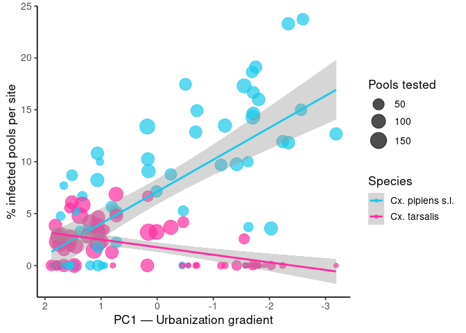<!-- -->

## Plot predicted

For Cx. pipiens:  
- habitat_PC1 is significant  
- trap_type2 is significant  
- allowing habitat_PC1 to be smooth provides a slight improvement  
- the smooth is only mildly nonlinear (edf ≈ 1.9)

For Cx. tarsalis:  
- habitat_PC1 is not significant  
- trap_type2 is not significant  
- there is no evidence for a nonlinear habitat effect - the fitted
relationship is essentially flat

So, I think it’s best to fit and plot both species using the same model
structure that I landed on for pipiens.

infected ~ habitat_PC1 + trap_type2 +  
s(disease_week, bs = “tp”, k = 8) +  
s(disease_week, by = year_f, bs = “fs”, k = 15) +  
s(year_f, bs = “re”) +  
s(site_code, bs = “re”) +  
offset(log(num_count))

gam_pipiens_trapfixed  
gam_tarsalis_trapfixed

\###Urbanization gradient

``` r
pc1_seq <- seq(
  min(wnv$habitat_PC1, na.rm = TRUE),
  max(wnv$habitat_PC1, na.rm = TRUE),
  length.out = 200
)

pred_pip <- expand.grid(
  habitat_PC1 = pc1_seq,
  trap_type2 = levels(pipiens_data$trap_type2)
)

pred_tar <- expand.grid(
  habitat_PC1 = pc1_seq,
  trap_type2 = levels(tarsalis_data$trap_type2)
)

pred_pip$disease_week <- median(pipiens_data$disease_week)
pred_pip$year_f <- levels(pipiens_data$year_f)[1]
pred_pip$site_code <- levels(pipiens_data$site_code)[1]
pred_pip$num_count <- 1

pred_tar$disease_week <- median(tarsalis_data$disease_week)
pred_tar$year_f <- levels(tarsalis_data$year_f)[1]
pred_tar$site_code <- levels(tarsalis_data$site_code)[1]
pred_tar$num_count <- 1


pip_pred <- predict(
  gam_pipiens_trapfixed,
  newdata = pred_pip,
  type = "link",
  se.fit = TRUE,
  exclude = c("s(site_code)", "s(year_f)")
)

pred_pip <- pred_pip %>%
  mutate(
    fit = 1 - exp(-exp(pip_pred$fit)),
    lower = 1 - exp(-exp(pip_pred$fit - 1.96 * pip_pred$se.fit)),
    upper = 1 - exp(-exp(pip_pred$fit + 1.96 * pip_pred$se.fit)),
    species = "Cx. pipiens s.l."
  )

tar_pred <- predict(
  gam_tarsalis_trapfixed,
  newdata = pred_tar,
  type = "link",
  se.fit = TRUE,
  exclude = c("s(site_code)", "s(year_f)")
)

pred_tar <- pred_tar %>%
  mutate(
    fit = 1 - exp(-exp(tar_pred$fit)),
    lower = 1 - exp(-exp(tar_pred$fit - 1.96 * tar_pred$se.fit)),
    upper = 1 - exp(-exp(tar_pred$fit + 1.96 * tar_pred$se.fit)),
    species = "Cx. tarsalis"
  )

pred_wnv <- bind_rows(pred_pip, pred_tar)
cols <- c(
  "Cx. pipiens s.l." = "#1bc8ea",
  "Cx. tarsalis" = "#FF2DA0"
)

ggplot( pred_wnv, aes( x = habitat_PC1, y = fit * 100, color = species, fill = species, linetype = trap_type2 ) ) + 
  geom_ribbon( aes( ymin = lower * 100, ymax = upper * 100, group = interaction(species, trap_type2) ), alpha = 0.15, color = NA ) + 
  geom_line(linewidth = 1.2) + 
  scale_x_reverse() + 
  scale_color_manual(values = cols) + 
  scale_fill_manual(values = cols) + 
  labs( 
    x = "PC1 — Urbanization gradient", 
    y = "Predicted WNV positivity (%)", 
    color = "Species", 
    fill = "Species", 
    linetype = "Trap type" 
  ) + 
  theme_classic(base_size = 13) +
  # 1. Zoom into the y-axis without clipping data points outside the window
  coord_cartesian(ylim = c(0, 1.2)) +
  # 2. Place the legend on right
  theme(
    legend.position = "right",
    legend.background = element_rect(fill = "transparent")
  )
```

<!-- --> \### Disease week

``` r
# Predicted WNV positivity through time

cols <- c(
  "Cx. pipiens s.l." = "#1bc8ea",
  "Cx. tarsalis" = "#FF2DA0"
)

pc1_values <- wnv %>%
  filter(!is.na(habitat_PC1)) %>%
  summarise(
    Urban = quantile(habitat_PC1, 0.1, na.rm = TRUE),
    Peri = median(habitat_PC1, na.rm = TRUE),
    Rural = quantile(habitat_PC1, 0.9, na.rm = TRUE)
  ) %>%
  tidyr::pivot_longer(
    everything(),
    names_to = "habitat_level",
    values_to = "habitat_PC1"
  )

week_seq <- seq(
  min(wnv$disease_week, na.rm = TRUE),
  max(wnv$disease_week, na.rm = TRUE),
  by = 1
)

pred_pip <- expand.grid(
  disease_week = week_seq,
  trap_type2 = levels(pipiens_data$trap_type2),
  year_f = "2021",
  site_code = levels(pipiens_data$site_code)[1],
  num_count = median(pipiens_data$num_count, na.rm = TRUE)
) %>%
  left_join(pc1_values, by = character())
```

    ## Warning: Using `by = character()` to perform a cross join was deprecated in dplyr 1.1.0.
    ## ℹ Please use `cross_join()` instead.
    ## This warning is displayed once every 8 hours.
    ## Call `lifecycle::last_lifecycle_warnings()` to see where this warning was
    ## generated.

``` r
pred_tar <- expand.grid(
  disease_week = week_seq,
  trap_type2 = levels(tarsalis_data$trap_type2),
  year_f = "2021",
  site_code = levels(tarsalis_data$site_code)[1],
  num_count = median(tarsalis_data$num_count, na.rm = TRUE)
) %>%
  left_join(pc1_values, by = character())

pip_pred <- predict(
  gam_pipiens_trapfixed,
  newdata = pred_pip,
  type = "link",
  se.fit = TRUE,
  exclude = c("s(site_code)", "s(year_f)")
)

tar_pred <- predict(
  gam_tarsalis_trapfixed,
  newdata = pred_tar,
  type = "link",
  se.fit = TRUE,
  exclude = c("s(site_code)", "s(year_f)")
)

pred_pip <- pred_pip %>%
  mutate(
    fit = 1 - exp(-exp(pip_pred$fit)),
    lower = 1 - exp(-exp(pip_pred$fit - 1.96 * pip_pred$se.fit)),
    upper = 1 - exp(-exp(pip_pred$fit + 1.96 * pip_pred$se.fit)),
    species = "Cx. pipiens s.l."
  )

pred_tar <- pred_tar %>%
  mutate(
    fit = 1 - exp(-exp(tar_pred$fit)),
    lower = 1 - exp(-exp(tar_pred$fit - 1.96 * tar_pred$se.fit)),
    upper = 1 - exp(-exp(tar_pred$fit + 1.96 * tar_pred$se.fit)),
    species = "Cx. tarsalis"
  )

pred_wnv_week <- bind_rows(pred_pip, pred_tar) %>%
  mutate(
    habitat_level = factor(habitat_level, levels = c("Rural", "Peri","Urban" ))
  )
ggplot(
  pred_wnv_week,
  aes(
    x = disease_week,
    y = fit * 100,
    color = species,
    fill = species,
    linetype = trap_type2
  )
) +
  geom_ribbon(
    aes(
      ymin = lower * 100,
      ymax = upper * 100,
      group = interaction(species, trap_type2, habitat_level)
    ),
    alpha = 0.12,
    color = NA
  ) +
  geom_line(
    aes(group = interaction(species, trap_type2, habitat_level)),
    linewidth = 1.1
  ) +
  facet_grid(species ~ habitat_level, scales = "free_y") +
  scale_color_manual(values = cols, name = "Species") +
  scale_fill_manual(values = cols, guide = "none") +
  scale_y_continuous(limits = c(0, 75)) +
  labs(
    x = "Disease week",
    y = "Predicted WNV positivity (%)",
    linetype = "Trap type"
  ) +
  theme_classic(base_size = 13) +
  theme(
    strip.background = element_blank(),
    strip.text.y = element_blank(),
    strip.text.x = element_text(),
    legend.position = "right"
  )
```

    ## Warning in max(ids, na.rm = TRUE): no non-missing arguments to max; returning
    ## -Inf

    ## Warning in max(ids, na.rm = TRUE): no non-missing arguments to max; returning
    ## -Inf
    ## Warning in max(ids, na.rm = TRUE): no non-missing arguments to max; returning
    ## -Inf

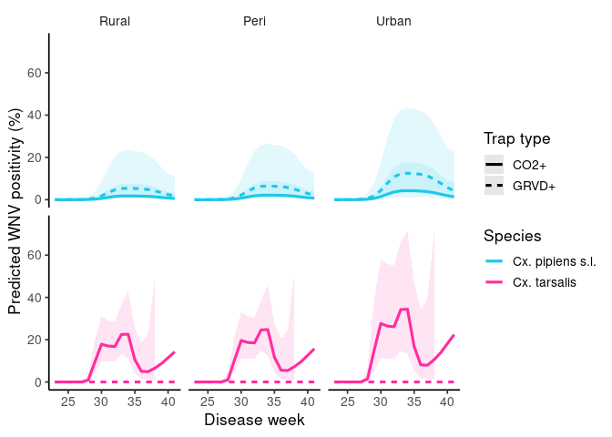<!-- --> \# RQ3: Bloodmeal and WNV
probability
