GAM **Cx. pipiens** and **Cx. tarsalis**: SLC 2025 field season
================
Norah Saarman
2026-10-01

- [Prepare Data](#prepare-data)
  - [Combined data](#combined-data)
- [Single model GAM with combined by species (random effect = site
  name)](#single-model-gam-with-combined-by-species-random-effect--site-name)
  - [Fit single GAM](#fit-single-gam)
  - [Check Fit and Plot Smooths](#check-fit-and-plot-smooths)
- [Trap_type: Urban only, with paired trap
  types:](#trap_type-urban-only-with-paired-trap-types)
  - [Cx. pipiens abundance by trap type
    Urban](#cx-pipiens-abundance-by-trap-type-urban)
  - [Cx. tarsalis abundance by trap type
    Urban](#cx-tarsalis-abundance-by-trap-type-urban)
  - [Old Figure 3 - Paired Traps](#old-figure-3---paired-traps)
    - [Save old Figure 3](#save-old-figure-3)
  - [Interpretation](#interpretation)
- [Species-Specific GAM](#species-specific-gam)
  - [Cx. pipiens GAM](#cx-pipiens-gam)
    - [Check smooths: pipiens](#check-smooths-pipiens)
    - [Map residuals: pipiens](#map-residuals-pipiens)
    - [Weekly residuals: pipiens](#weekly-residuals-pipiens)
    - [DHARMa: pip](#dharma-pip)
  - [Cx. tarsalis GAM](#cx-tarsalis-gam)
    - [Check smooths: tarsalis](#check-smooths-tarsalis)
    - [Map residuals: tarsalis](#map-residuals-tarsalis)
    - [Weekly residuals: tarsalis](#weekly-residuals-tarsalis)
    - [DHARMa: tarsalis](#dharma-tarsalis)
- [Plot pip vs. tar from separate
  models](#plot-pip-vs-tar-from-separate-models)
  - [Figure 4 - Effect sizes from species-specific
    GAMs](#figure-4---effect-sizes-from-species-specific-gams)
  - [Figure 3 and 5 - Seasonal Smooth from all
    models](#figure-3-and-5---seasonal-smooth-from-all-models)
    - [Original visualization with colors indicating mosquito
      species](#original-visualization-with-colors-indicating-mosquito-species)
    - [Save Old Figure 5](#save-old-figure-5)
  - [Figure 3 Combo: 3 and 5](#figure-3-combo-3-and-5)
    - [Save Combo Figure](#save-combo-figure)
  - [Figure S1 - Seasonal abundance expanded (free
    y-axes)](#figure-s1---seasonal-abundance-expanded-free-y-axes)
    - [Save Figure S1 - expanded Fig 3+5 right hand
      panels](#save-figure-s1---expanded-fig-35-right-hand-panels)
  - [Figure 5 - Abundance by habitat at peak weeks and across full
    season](#figure-5---abundance-by-habitat-at-peak-weeks-and-across-full-season)
    - [Rel Abundance at week 29 (mid season, peak
      pipiens)](#rel-abundance-at-week-29-mid-season-peak-pipiens)
- [Final verification of final
  models](#final-verification-of-final-models)

**Research Topic:** testing whether habitat and seasonal partitioning
between Culex pipiens s.l. and Culex tarsalis shapes West Nile Virus
(WNV) dynamics across urban–rural gradients.

**Core hypothesis:** early/mid-season amplification dominated by pipiens
in urban areas, later spillover involving tarsalis moving into
urban/peri-urban areas.

**Approach:** Preliminary results visualized via mapping, with species
identity and abundance as primary response variables. Model mosquito
abundance and proportions using GLMM with GAM smoothing:

count ~ season\*urbanization + trap_type + (1\|site/date), family =
poisson(link = “log”):

- Response variable = mosquito abundance  
- Predictors = season\*urbanization  
- The trap type could be important, so we will add that as a fixed
  effect (covariate)… is this correct? We do think that the response
  variable of count of mosquitoes depends on trap type, since tarsalis
  seems to be more attracted to CO2 than pipiens, and we want to
  quantify that effect. Note that poisson model does not give a fixed
  offset (due to the log link)… The structure of this model means that
  it will estimate an effect that scales with the total number of
  mosquitos caught, which is exactly what we want.  
- The data are grouped into sites and are also linked through time, so
  we’ll add those as random effects. I think the sites should be coded
  as factors, **but I’m not sure what format to use for the date. I
  think it should be disease week so that week 18 is treated closer to
  19 than 20, etc., but I’m not totally confident in this.**
- The family = poisson (link = “log”)… why again?

**For simple model:** count ~ disease_week\*urbanization +
(1\|site/date), family = poisson(link = “log”)

Load libraries

``` r
library(tidyverse) # for data wrangling
```

    ## ── Attaching core tidyverse packages ──────────────────────── tidyverse 2.0.0 ──
    ## ✔ dplyr     1.1.4     ✔ readr     2.1.5
    ## ✔ forcats   1.0.0     ✔ stringr   1.5.1
    ## ✔ ggplot2   3.5.2     ✔ tibble    3.2.1
    ## ✔ lubridate 1.9.3     ✔ tidyr     1.3.1
    ## ✔ purrr     1.0.2     
    ## ── Conflicts ────────────────────────────────────────── tidyverse_conflicts() ──
    ## ✖ dplyr::filter() masks stats::filter()
    ## ✖ dplyr::lag()    masks stats::lag()
    ## ℹ Use the conflicted package (<http://conflicted.r-lib.org/>) to force all conflicts to become errors

``` r
library(glmmTMB)   # for model fitting
library(DHARMa)    # for residual plots
```

    ## This is DHARMa 0.4.7. For overview type '?DHARMa'. For recent changes, type news(package = 'DHARMa')

``` r
library(mgcViz)    # for residual plots
```

    ## Loading required package: mgcv
    ## Loading required package: nlme
    ## 
    ## Attaching package: 'nlme'
    ## 
    ## The following object is masked from 'package:dplyr':
    ## 
    ##     collapse
    ## 
    ## This is mgcv 1.9-4. For overview type '?mgcv'.
    ## Loading required package: qgam
    ## Registered S3 method overwritten by 'mgcViz':
    ##   method from   
    ##   +.gg   ggplot2
    ## 
    ## Attaching package: 'mgcViz'
    ## 
    ## The following objects are masked from 'package:stats':
    ## 
    ##     qqline, qqnorm, qqplot

``` r
library(emmeans)   # for estimating marginal effects
```

    ## Welcome to emmeans.
    ## Caution: You lose important information if you filter this package's results.
    ## See '? untidy'

``` r
library(multcomp)  # for statistical comparisons on fitted models
```

    ## Loading required package: mvtnorm
    ## Loading required package: survival
    ## Loading required package: TH.data
    ## Loading required package: MASS
    ## 
    ## Attaching package: 'MASS'
    ## 
    ## The following object is masked from 'package:dplyr':
    ## 
    ##     select
    ## 
    ## 
    ## Attaching package: 'TH.data'
    ## 
    ## The following object is masked from 'package:MASS':
    ## 
    ##     geyser

``` r
library(dplyr)     # for mutating dataframe to change labels in dataset
library(mgcv)      # fits GAM
library(broom)
library(ggplot2)
```

# Prepare Data

## Combined data

``` r
## tarsalis datasets from SLCMAD:
tarsalis <- read.csv("../data/tarsalis_2025.csv")
## pipiens datasets from SLCMAD:
pipiens <- read.csv("../data/pipiens_2025.csv")

## combine and correct known site classification
combined <- bind_rows(tarsalis, pipiens) %>%
  dplyr::mutate(
    urban_cat = trimws(tolower(urban_cat)),

    # CORRECTION: Runway was miscoded as peri; correct category is rural
    urban_cat = dplyr::if_else(
      site_name == "Runway",
      "rural",
      urban_cat
    ),

    species = factor(
      species,
      levels = c("Culex pipiens", "Culex tarsalis")
    ),

    urbanization = factor(
      urban_cat,
      levels = c("rural", "peri", "urban")
    ),

    season = factor(
      season,
      levels = c("early", "mid", "late")
    ),

    trap_type = factor(trap_type),
    site_name = factor(site_name),
    disease_week = as.numeric(disease_week)
  )

#check
table(combined$species)
```

    ## 
    ##  Culex pipiens Culex tarsalis 
    ##           1394           1774

``` r
table(combined$season, combined$species)
```

    ##        
    ##         Culex pipiens Culex tarsalis
    ##   early           193            336
    ##   mid             653            751
    ##   late            548            687

``` r
combined <- combined %>%
  mutate(
    species = factor(species),
    urbanization = factor(urbanization),
    trap_type = factor(trap_type),
    site_name = factor(site_name),
    disease_week = as.numeric(disease_week)
  )
```

In the GLMM, (1 \| site_name/collection_date), which handles clustering
of repeated observations taken at the same site on the same date with: -
a random intercept for site_name  
- and a random intercept for each site_name:collection_date combination

GAM equivalent, in mgcv, the closest analogue is to create an
interaction ID and include it as another random-effect smooth.

First create the grouping variable:

``` r
combined <- combined %>%
  mutate(
    site_date = interaction(site_name, collection_date, drop = TRUE)
  )
```

Check if the grouping variable occurs often:

``` r
length(unique(combined$site_date))
```

    ## [1] 1906

``` r
nrow(combined)
```

    ## [1] 3168

``` r
table(table(combined$site_date))
```

    ## 
    ##   1   2   3   4   5 
    ## 851 909  88  55   3

Yes, more than half of the observations are impacted… but many of them
are different trap-types. This is a decision to make, to include or not
to include? Site_date adds shared noise from shared environment within a
sampling event. Since we really care more about ecological patterns over
time, and are already including trap-type, is it really needed? Does it
change the result?

Let’s start with a simple comparison of including ONLY site_name.

**NOTE:** I’m also worried that we might need to use the \* trap_type to
fully capture species-specific trap effects.

# Single model GAM with combined by species (random effect = site name)

## Fit single GAM

``` r
# Model 1: Single spline
# Models a universal pattern in time and allows the magnitude to vary across traps.
gam_offset <- gam(
  count ~ species * trap_type +
    s(disease_week, k = 15) + 
    s(site_name, bs = "re"),
  data = combined,
  family = nb(link = "log"),
  method = "REML"
)

# Model 2: factor spline (bs = "fs")
# Fits variable patterns for each group pooled toward a universal pattern, and you don't include a "by =" argument
# The second models a universal pattern plus trap-specific deviations from that pattern.
gam_variable_shape <- gam(
  count ~ species * trap_type +
    s(disease_week, k = 15) + 
    s(disease_week, species, bs = "fs", k = 15) + 
    s(site_name, bs = "re"),
  data = combined,
  family = nb(link = "log"),
  method = "REML"
)
```

    ## Warning in gam.side(sm, X, tol = .Machine$double.eps^0.5): model has repeated
    ## 1-d smooths of same variable.

``` r
# Model 3: Independent splines that are not pooled then you use the by = argument to specify the grouping and don't need to include the "bs =" part.
gam_by <- gam(
  count ~ species * trap_type +
    s(disease_week, by = species, k = 15) + # splines not pooled
    s(site_name, bs = "re"),
  data = combined,
  family = nb(link = "log"),
  method = "REML"
)

AIC(
  gam_offset,
  gam_variable_shape,
  gam_by
)
```

    ##                          df      AIC
    ## gam_offset         74.29987 34737.07
    ## gam_variable_shape 87.39220 34630.01
    ## gam_by             85.08598 34616.49

``` r
# Model 3 with independent splines wins
```

``` r
# Now what k value?

# Fit GAM model with site_name only
gam_by_k10 <- gam(
  count ~ species *  trap_type +
    s(disease_week, by = species, k = 10, m = 2) +
    s(site_name, bs = "re"),
  data = combined,
  family = nb(link="log"),
  method = "REML"
)

# Fit GAM model with site_name only
gam_by_k15 <- gam(
  count ~ species * trap_type +
    s(disease_week, by = species, k = 15, m = 2) +
    s(site_name, bs = "re"),
  data = combined,
  family = nb(link="log"),
  method = "REML"
)

AIC(gam_by_k10, gam_by_k15)
```

    ##                  df      AIC
    ## gam_by_k10 78.69013 34662.16
    ## gam_by_k15 85.08598 34616.49

## Check Fit and Plot Smooths

``` r
#Summary of GAM fit
summary(gam_by_k15)
```

    ## 
    ## Family: Negative Binomial(0.876) 
    ## Link function: log 
    ## 
    ## Formula:
    ## count ~ species * trap_type + s(disease_week, by = species, k = 15, 
    ##     m = 2) + s(site_name, bs = "re")
    ## 
    ## Parametric coefficients:
    ##                                     Estimate Std. Error z value Pr(>|z|)    
    ## (Intercept)                          3.55522    0.13361  26.609  < 2e-16 ***
    ## speciesCulex tarsalis                1.59646    0.04444  35.927  < 2e-16 ***
    ## trap_typeGRVD                       -0.35373    0.10657  -3.319 0.000903 ***
    ## speciesCulex tarsalis:trap_typeGRVD -3.12260    0.17778 -17.564  < 2e-16 ***
    ## ---
    ## Signif. codes:  0 '***' 0.001 '**' 0.01 '*' 0.05 '.' 0.1 ' ' 1
    ## 
    ## Approximate significance of smooth terms:
    ##                                          edf Ref.df Chi.sq p-value    
    ## s(disease_week):speciesCulex pipiens   9.677  11.42   1242  <2e-16 ***
    ## s(disease_week):speciesCulex tarsalis 13.125  13.85   3143  <2e-16 ***
    ## s(site_name)                          56.162  58.00   1796  <2e-16 ***
    ## ---
    ## Signif. codes:  0 '***' 0.001 '**' 0.01 '*' 0.05 '.' 0.1 ' ' 1
    ## 
    ## R-sq.(adj) =  0.508   Deviance explained = 69.5%
    ## -REML =  17420  Scale est. = 1         n = 3116

``` r
#Check if smooths are hitting their basis limits
gam.check(gam_by_k15)
```

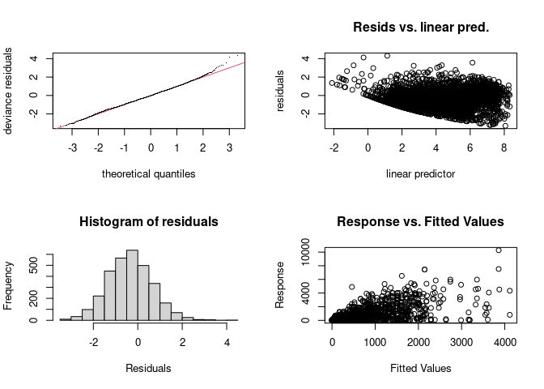<!-- -->

    ## 
    ## Method: REML   Optimizer: outer newton
    ## full convergence after 5 iterations.
    ## Gradient range [-2.14149e-06,0.0006387896]
    ## (score 17420.13 & scale 1).
    ## Hessian positive definite, eigenvalue range [3.451577,1808.794].
    ## Model rank =  91 / 91 
    ## 
    ## Basis dimension (k) checking results. Low p-value (k-index<1) may
    ## indicate that k is too low, especially if edf is close to k'.
    ## 
    ##                                          k'   edf k-index p-value    
    ## s(disease_week):speciesCulex pipiens  14.00  9.68     0.8  <2e-16 ***
    ## s(disease_week):speciesCulex tarsalis 14.00 13.13     0.8  <2e-16 ***
    ## s(site_name)                          59.00 56.16      NA      NA    
    ## ---
    ## Signif. codes:  0 '***' 0.001 '**' 0.01 '*' 0.05 '.' 0.1 ' ' 1

K 15 is slightly better

Considering that the best AIC is when we use “by” and have totally
independent fits, I think its best to move forward with species-specific
gams.

# Trap_type: Urban only, with paired trap types:

“Within Urban sites, does trap type affect abundance? fit the model on
Urban observations only”

Analyze only sites with both trap types present to avoid confounding
trap effects with site/urbanization effects.

``` r
# Identify sites with BOTH trap types

paired_sites <- combined %>%
  group_by(site_name) %>%
  summarize(
    n_traps = n_distinct(trap_type),
    .groups = "drop"
  ) %>%
  filter(n_traps == 2) %>%
  pull(site_name)

paired_sites
```

    ## [1] Downington Ave     Fire Station 13    Fire Station 2     Fire Station 4    
    ## [5] Fire Station 5     Fire Station 6     Fire Station 8     Hogle Zoo         
    ## [9] Nibley Golf Course
    ## 59 Levels: 1700 E Church 300 E Church 700 S 200 W ... Wingpointe

## Cx. pipiens abundance by trap type Urban

``` r
# Pull out Cx. pipiens
pipiens <- combined[combined$species == "Culex pipiens", ]
head(pipiens$site_name)
```

    ## [1] 1700 E Church 1700 E Church 1700 E Church 1700 E Church 1700 E Church
    ## [6] 1700 E Church
    ## 59 Levels: 1700 E Church 300 E Church 700 S 200 W ... Wingpointe

``` r
# Restrict to urban sites with paired trap types
urban_pip <- pipiens %>%
  filter(
    urbanization == "urban",
    site_name %in% paired_sites
  )

table(urban_pip$trap_type)
```

    ## 
    ##  CO2 GRVD 
    ##  148  155

``` r
length(unique(urban_pip$site_name))
```

    ## [1] 9

``` r
# Compare alternative approaches for modeling seasonal patterns by trap type

# Model 1: Single spline
# Same seasonal pattern for both trap types; trap type affects overall abundance.
urban_pip_gam_offset <- gam(
  count ~ trap_type + 
    s(disease_week, k = 15) + 
    s(site_name, bs = "re"),
  data = urban_pip,
  family = nb(link = "log"),
  method = "REML"
)

# Model 2: Common spline + factor-smooth interaction
# Common seasonal pattern plus trap-specific deviations from that pattern.
urban_pip_gam_variable_shape <- gam(
  count ~ trap_type + 
    s(disease_week, k = 15) + 
    s(disease_week, trap_type, bs = "fs", k = 15) + 
    s(site_name, bs = "re"),
  data = urban_pip,
  family = nb(link = "log"),
  method = "REML"
)
```

    ## Warning in gam.side(sm, X, tol = .Machine$double.eps^0.5): model has repeated
    ## 1-d smooths of same variable.

``` r
# Model 3: Separate seasonal smooths by trap type
# Each trap type has its own seasonal pattern.
urban_pip_gam_by <- gam(
  count ~ trap_type +
    s(disease_week, by = trap_type, k = 15) +
    s(site_name, bs = "re"),
  data = urban_pip,
  family = nb(link = "log"),
  method = "REML"
)

# Compare candidate models
AIC(
  urban_pip_gam_offset,
  urban_pip_gam_variable_shape,
  urban_pip_gam_by
)
```

    ##                                    df      AIC
    ## urban_pip_gam_offset         16.08256 2283.583
    ## urban_pip_gam_variable_shape 16.09055 2283.597
    ## urban_pip_gam_by             19.47183 2290.855

``` r
# FINAL MODEL USED IN MANUSCRIPT
urban_pip_gam <- urban_pip_gam_by

summary(urban_pip_gam)
```

    ## 
    ## Family: Negative Binomial(1.354) 
    ## Link function: log 
    ## 
    ## Formula:
    ## count ~ trap_type + s(disease_week, by = trap_type, k = 15) + 
    ##     s(site_name, bs = "re")
    ## 
    ## Parametric coefficients:
    ##               Estimate Std. Error z value Pr(>|z|)    
    ## (Intercept)     3.1161     0.1694  18.396  < 2e-16 ***
    ## trap_typeGRVD  -0.7166     0.1061  -6.754 1.43e-11 ***
    ## ---
    ## Signif. codes:  0 '***' 0.001 '**' 0.01 '*' 0.05 '.' 0.1 ' ' 1
    ## 
    ## Approximate significance of smooth terms:
    ##                                 edf Ref.df Chi.sq p-value    
    ## s(disease_week):trap_typeCO2  4.434  5.534  85.34  <2e-16 ***
    ## s(disease_week):trap_typeGRVD 3.911  4.889  46.98  <2e-16 ***
    ## s(site_name)                  7.143  8.000  69.91  <2e-16 ***
    ## ---
    ## Signif. codes:  0 '***' 0.001 '**' 0.01 '*' 0.05 '.' 0.1 ' ' 1
    ## 
    ## R-sq.(adj) =   0.31   Deviance explained = 47.5%
    ## -REML = 1155.2  Scale est. = 1         n = 298

For Cx. pipiens, I think Model 1 with offset spline is best, but not too
different from Model 2, so since it overlaps with Cx. tar’s best, should
we go with that?

## Cx. tarsalis abundance by trap type Urban

``` r
# Pull out Cx. tarsalis
tarsalis <- combined[combined$species == "Culex tarsalis", ]
head(tarsalis$site_name)
```

    ## [1] 1700 E Church 1700 E Church 1700 E Church 1700 E Church 1700 E Church
    ## [6] 1700 E Church
    ## 59 Levels: 1700 E Church 300 E Church 700 S 200 W ... Wingpointe

``` r
# Restrict to urban sites with paired trap types
urban_tar <- tarsalis %>%
  filter(
    urbanization == "urban",
    site_name %in% paired_sites
  )

table(urban_tar$trap_type)
```

    ## 
    ##  CO2 GRVD 
    ##  153   51

``` r
length(unique(urban_tar$site_name))
```

    ## [1] 9

``` r
# Compare alternative approaches for modeling seasonal patterns by trap type

# Model 1: Single spline
# Same seasonal pattern for both trap types; trap type affects overall abundance.
urban_tar_gam_offset <- gam(
  count ~ trap_type + 
    s(disease_week, k = 15) + 
    s(site_name, bs = "re"),
  data = urban_tar,
  family = nb(link = "log"),
  method = "REML"
)

# Model 2: Common spline + factor-smooth interaction
# Common seasonal pattern plus trap-specific deviations from that pattern.
urban_tar_gam_variable_shape <- gam(
  count ~ trap_type + 
    s(disease_week, k = 15) + 
    s(disease_week, trap_type, bs = "fs", k = 15) + 
    s(site_name, bs = "re"),
  data = urban_tar,
  family = nb(link = "log"),
  method = "REML"
)
```

    ## Warning in gam.side(sm, X, tol = .Machine$double.eps^0.5): model has repeated
    ## 1-d smooths of same variable.

``` r
# Model 3: Separate seasonal smooths by trap type
# Each trap type has its own seasonal pattern.
urban_tar_gam_by <- gam(
  count ~ trap_type +
    s(disease_week, by = trap_type, k = 15) +
    s(site_name, bs = "re"),
  data = urban_tar,
  family = nb(link = "log"),
  method = "REML"
)

# Compare candidate models
AIC(
  urban_tar_gam_offset,
  urban_tar_gam_variable_shape,
  urban_tar_gam_by
)
```

    ##                                    df      AIC
    ## urban_tar_gam_offset         18.16545 1425.254
    ## urban_tar_gam_variable_shape 20.61239 1418.779
    ## urban_tar_gam_by             24.18511 1398.840

``` r
# FINAL MODEL USED IN MANUSCRIPT
urban_tar_gam <- urban_tar_gam_by

summary(urban_tar_gam)
```

    ## 
    ## Family: Negative Binomial(1.42) 
    ## Link function: log 
    ## 
    ## Formula:
    ## count ~ trap_type + s(disease_week, by = trap_type, k = 15) + 
    ##     s(site_name, bs = "re")
    ## 
    ## Parametric coefficients:
    ##               Estimate Std. Error z value Pr(>|z|)    
    ## (Intercept)     2.9995     0.2235   13.42   <2e-16 ***
    ## trap_typeGRVD  -2.6312     0.2301  -11.43   <2e-16 ***
    ## ---
    ## Signif. codes:  0 '***' 0.001 '**' 0.01 '*' 0.05 '.' 0.1 ' ' 1
    ## 
    ## Approximate significance of smooth terms:
    ##                                  edf Ref.df  Chi.sq p-value    
    ## s(disease_week):trap_typeCO2  10.527 12.263 116.951  <2e-16 ***
    ## s(disease_week):trap_typeGRVD  1.001  1.002   0.029   0.868    
    ## s(site_name)                   7.225  8.000  63.843  <2e-16 ***
    ## ---
    ## Signif. codes:  0 '***' 0.001 '**' 0.01 '*' 0.05 '.' 0.1 ' ' 1
    ## 
    ## R-sq.(adj) =  0.416   Deviance explained = 67.7%
    ## -REML = 713.35  Scale est. = 1         n = 185

For Cx. tarsalis, Model 3 with independent splines similar to Model 2.

## Old Figure 3 - Paired Traps

``` r
# Figure 3 using the paired urban models already fit above

cols <- c(
  "Culex pipiens"  = "#1bc8ea",
  "Culex tarsalis" = "#FF2DA0"
)

# Generate predictions using factor levels from data actually used by each model
predict_fig3 <- function(model, species_label) {

  dat <- model$model

  newdata <- expand.grid(
    disease_week = seq(
      min(dat$disease_week, na.rm = TRUE),
      max(dat$disease_week, na.rm = TRUE),
      by = 1
    ),
    trap_type = levels(dat$trap_type),
    site_name = levels(dat$site_name)[1]
  )

  newdata$trap_type <- factor(
    newdata$trap_type,
    levels = levels(dat$trap_type)
  )

  newdata$site_name <- factor(
    newdata$site_name,
    levels = levels(dat$site_name)
  )

  pred <- predict(
    model,
    newdata = newdata,
    type = "link",
    se.fit = TRUE,
    exclude = "s(site_name)"
  )

  newdata %>%
    dplyr::mutate(
      species = species_label,
      fit   = exp(pred$fit),
      lower = exp(pred$fit - 1.96 * pred$se.fit),
      upper = exp(pred$fit + 1.96 * pred$se.fit)
    )
}

pred_fig3 <- dplyr::bind_rows(
  predict_fig3(urban_pip_gam, "Culex pipiens"),
  predict_fig3(urban_tar_gam, "Culex tarsalis")
)


# Make one panel for each species
# Trap-type colors
trap_cols <- c(
  "CO2"  = "#2C7FB8",  # blue
  "GRVD" = "#B8860B"   # dark mustard yellow
)

plot_fig3_panel <- function(species_name, show_legend = TRUE) {

  dat <- pred_fig3 %>%
    dplyr::filter(species == species_name)

  # Rescale GRVD only for plotting so it has its own right-hand axis
  scale_factor <-
    max(dat$upper[dat$trap_type == "CO2"], na.rm = TRUE) /
    max(dat$upper[dat$trap_type == "GRVD"], na.rm = TRUE)

  dat <- dat %>%
    dplyr::mutate(
      fit_plot   = ifelse(trap_type == "GRVD", fit * scale_factor, fit),
      lower_plot = ifelse(trap_type == "GRVD", lower * scale_factor, lower),
      upper_plot = ifelse(trap_type == "GRVD", upper * scale_factor, upper)
    )

  ggplot(
    dat,
    aes(
      x = disease_week,
      y = fit_plot,
      color = trap_type,
      fill = trap_type,
      linetype = trap_type
    )
  ) +
    geom_ribbon(
      aes(
        ymin = lower_plot,
        ymax = upper_plot,
        group = trap_type
      ),
      alpha = 0.15,
      color = NA
    ) +
    geom_line(
      aes(group = trap_type),
      linewidth = 0.7
    ) +
    scale_color_manual(
      values = trap_cols,
      name = "Trap type"
    ) +
    scale_fill_manual(
      values = trap_cols,
      guide = "none"
    ) +
    scale_linetype_manual(
      values = c(
        "CO2"  = "solid",
        "GRVD" = "dashed"
      ),
      name = "Trap type"
    ) +
    scale_y_continuous(
      name = "Predicted: CO2",
      sec.axis = sec_axis(
        ~ . / scale_factor,
        name = "Predicted: GRVD"
      )
    ) +
    labs(
      x = "Disease week",
      title = species_name
    ) +
    guides(
      color = guide_legend(
        override.aes = list(linewidth = 0.8)
      ),
      linetype = guide_legend(
        override.aes = list(linewidth = 0.8)
      )
    ) +
    theme_classic() +
    theme(
      legend.position = if (show_legend) "right" else "none",
      plot.title = element_text(
        face = "italic",
        hjust = 0.5
      )
    )
}


plot_pip_fig3 <- plot_fig3_panel(
  "Culex pipiens",
  show_legend = TRUE
)

plot_tar_fig3 <- plot_fig3_panel(
  "Culex tarsalis",
  show_legend = FALSE
)

fig3_2axes <- patchwork::wrap_plots(
  plot_pip_fig3,
  plot_tar_fig3,
  ncol = 1
) +
  patchwork::plot_annotation(
    title = "Urban predicted count by trap type"
  ) &
  theme(
    plot.title = element_text(hjust = 0.5)
  )

fig3_2axes
```

    ## Warning: Duplicated `override.aes` is ignored.
    ## Duplicated `override.aes` is ignored.

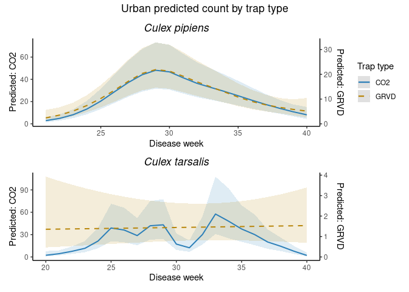<!-- -->

``` r
cols <- c(
  "Culex pipiens"  = "#1bc8ea",
  "Culex tarsalis" = "#FF2DA0"
)

fig3_species_rows <- ggplot(
  pred_fig3,
  aes(
    x = disease_week,
    y = fit,
    color = species,
    fill = species,
    linetype = trap_type
  )
) +
  geom_ribbon(
    aes(
      ymin = lower,
      ymax = upper,
      group = interaction(species, trap_type)
    ),
    alpha = 0.18,
    color = NA
  ) +
  geom_line(
    aes(group = interaction(species, trap_type)),
    linewidth = 0.8
  ) +
  facet_wrap(
    ~ species,
    ncol = 1,
    scales = "free_y"
  ) +
  scale_color_manual(values = cols) +
  scale_fill_manual(values = cols) +
  scale_linetype_manual(
    values = c(
      "CO2"  = "solid",
      "GRVD" = "dashed"
    )
  ) +
  labs(
    x = "Disease week",
    y = "Predicted count",
    color = "Species",
    linetype = "Trap type",
    title = "Urban predicted (paired traps only)"
  ) +
  guides(fill = "none") +
  theme_classic() +
  theme(
    plot.title = element_text(hjust = 0.5),
    strip.text = element_blank(),
    strip.background = element_blank()
  )

fig3_species_rows
```

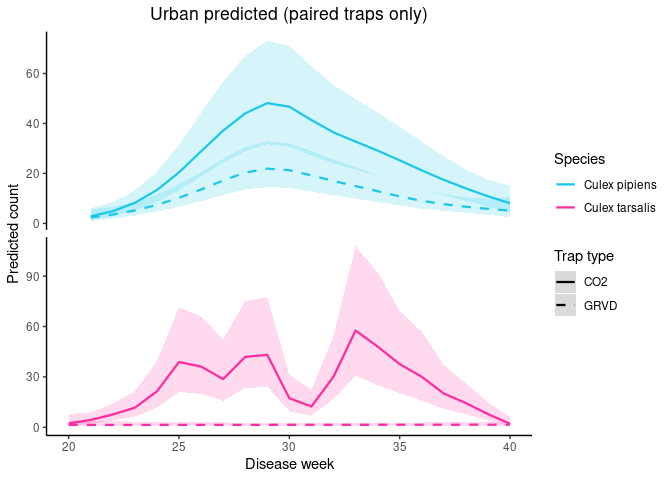<!-- -->

``` r
# Figure 3: one panel for each trap type

plot_fig3_trap_panel <- function(trap_name, show_legend = TRUE) {

  dat <- pred_fig3 %>%
    dplyr::filter(trap_type == trap_name)

  ggplot(
    dat,
    aes(
      x = disease_week,
      y = fit,
      color = species,
      fill = species,
      linetype = trap_type
    )
  ) +
    geom_ribbon(
      aes(
        ymin = lower,
        ymax = upper,
        group = species
      ),
      alpha = 0.15,
      color = NA
    ) +
    geom_line(
      aes(group = species),
      linewidth = 0.7
    ) +
    scale_color_manual(
      values = cols,
      name = "Species"
    ) +
    scale_fill_manual(
      values = cols,
      guide = "none"
    ) +
    scale_linetype_manual(
      values = c(
        "CO2"  = "solid",
        "GRVD" = "dashed"
      ),
      name = "Trap type"
    ) +
    scale_y_continuous(
  name = paste0("Predicted: ", trap_name)
) +
labs(
  x = "Disease week"
) +
guides(
  color = guide_legend(
    override.aes = list(linewidth = 0.8)
  ),
  linetype = guide_legend(
    override.aes = list(linewidth = 0.8)
  )
) +
theme_classic() +
theme(
  legend.position = if (show_legend) "right" else "none"
)
}


plot_co2_fig3 <- plot_fig3_trap_panel(
  "CO2",
  show_legend = TRUE
)

plot_grvd_fig3 <- plot_fig3_trap_panel(
  "GRVD",
  show_legend = FALSE
)

fig3_trap_rows <- patchwork::wrap_plots(
  plot_co2_fig3,
  plot_grvd_fig3,
  ncol = 1
) +
  patchwork::plot_annotation(
    title = "Urban predicted count by trap type"
  ) &
  theme(
    plot.title = element_text(hjust = 0.5),
    strip.text = element_blank(),
    strip.background = element_blank()
  )

fig3_trap_rows
```

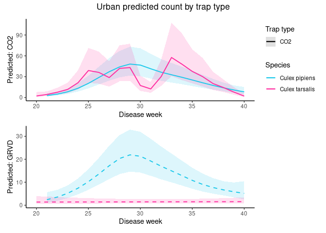<!-- -->

``` r
# ------------------------------------------------------------
# Figure 3 - Paired urban sites, trap-type comparison
# ------------------------------------------------------------

urban_col <- "#D55E00"

fig3 <- ggplot(
  pred_fig3,
  aes(
    x = disease_week,
    y = fit,
    linetype = trap_type,
    group = trap_type
  )
) +
  geom_ribbon(
    aes(
      ymin = lower,
      ymax = upper,
      group = trap_type
    ),
    fill = urban_col,
    alpha = 0.13,
    color = NA
  ) +
  geom_line(
    color = urban_col,
    linewidth = 0.9
  ) +
  facet_wrap(
    ~ species,
    ncol = 1,
    scales = "free_y",
    labeller = as_labeller(
      c(
        "Culex pipiens" = "Cx. pipiens",
        "Culex tarsalis" = "Cx. tarsalis"
      )
    )
  ) +
  scale_linetype_manual(
    values = c(
      "CO2"  = "solid",
      "GRVD" = "dashed"
    ),
    labels = c(
      "CO2"  = expression(CO[2]),
      "GRVD" = "Gravid"
    ),
    name = "Trap type"
  ) +
  labs(
    x = "Disease week",
    y = "Predicted abundance (from paired-traps only)"
  ) +
  theme_classic() +
  theme(
    strip.background = element_blank(),
    strip.text = element_text(
      face = "italic",
      size = 11
    ),
    legend.position = "right",
    legend.title = element_text(size = 10),
    legend.text = element_text(size = 9)
  )

fig3
```

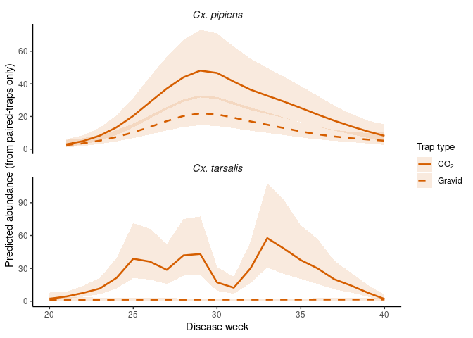<!-- -->

### Save old Figure 3

``` r
ggsave(
  "../figures/Fig3_seasonal_abund_paired-traps_urban.pdf",
  fig3_trap_rows,
  width = 6.5,
  height = 3
)
```

## Interpretation

**Cx. pipiens:**

- Estimated GRVD effect was -0.72 in the paired urban-only model

- GRVD traps caught approximately half of the abundance caught in CO2
  traps

  - exp(-0.72) = 0.49

- The shape of the seasonal smooth was very very similar among trap
  types, so I think using the same smooth for both trap types (trap type
  = fixed effect), works well for Cx. pipiens.

**Cx. tarsalis:**

- Estimated GRVD effect was -2.6898 in paired urban-only model.

- GRVD traps caught approximately 7% of the abundance caught in CO2
  traps.

  - exp(-2.6898) = 0.0678 (6.78%)

- It also looks like for tarsalis, the GRVD trap counts being low enough
  to potentially not reliable capture the full seasonal smooth, so we
  should try to visualize with CO2 traps wherever possible.

# Species-Specific GAM

separate models for each species, count by urbanization + trap_type
(random effect = site name)

## Cx. pipiens GAM

``` r
# pull out pipiens
pipiens <- combined %>%
  filter(species == "Culex pipiens") %>%
  droplevels()


# Prelim: factor spline (bs = "fs")
# Fits variable patterns for each group pooled toward a universal pattern, and you don't include a "by =" argument
# The second models a universal pattern plus trap-specific deviations from that pattern.
pip_gam_prelim <- gam(
  count ~ urbanization + trap_type + 
    # s(disease_week, k = 15) +   ## Remove in final?
    s(disease_week, urbanization, bs = "fs", k = 15, m = 3) + 
    s(site_name, bs = "re"),
  data = pipiens,
  family = nb(link = "log"),
  method = "REML"
)

# Model 2: FINAL
# Using by = group fits a separate seasonal smooth for each group, with smoothing parameters shared across groups.
# Using group as the second argument with bs = "fs" fits an overall/group factor-smooth structure with partial pooling among groups.
pip_gam <- gam(
  count ~ urbanization + trap_type +
    s(disease_week, by = urbanization, bs = "fs", k = 10, m = 3) +
    s(site_name, bs = "re"),
  family = nb(),
  data = pipiens,
  method = "REML"
)

summary(pip_gam)
```

    ## 
    ## Family: Negative Binomial(1.08) 
    ## Link function: log 
    ## 
    ## Formula:
    ## count ~ urbanization + trap_type + s(disease_week, by = urbanization, 
    ##     bs = "fs", k = 10, m = 3) + s(site_name, bs = "re")
    ## 
    ## Parametric coefficients:
    ##                   Estimate Std. Error z value Pr(>|z|)    
    ## (Intercept)         3.8747     0.1451  26.707  < 2e-16 ***
    ## urbanizationperi    0.3224     0.2383   1.353 0.176036    
    ## urbanizationurban  -0.8019     0.2121  -3.781 0.000156 ***
    ## trap_typeGRVD      -0.6723     0.1121  -5.996 2.02e-09 ***
    ## ---
    ## Signif. codes:  0 '***' 0.001 '**' 0.01 '*' 0.05 '.' 0.1 ' ' 1
    ## 
    ## Approximate significance of smooth terms:
    ##                                      edf Ref.df Chi.sq p-value    
    ## s(disease_week):urbanizationrural  7.612  8.355  411.5  <2e-16 ***
    ## s(disease_week):urbanizationperi   7.460  8.234  683.2  <2e-16 ***
    ## s(disease_week):urbanizationurban  6.074  6.893  282.4  <2e-16 ***
    ## s(site_name)                      49.748 56.000  535.7  <2e-16 ***
    ## ---
    ## Signif. codes:  0 '***' 0.001 '**' 0.01 '*' 0.05 '.' 0.1 ' ' 1
    ## 
    ## R-sq.(adj) =  0.473   Deviance explained = 67.8%
    ## -REML = 6257.5  Scale est. = 1         n = 1383

``` r
gam.check(pip_gam)
```

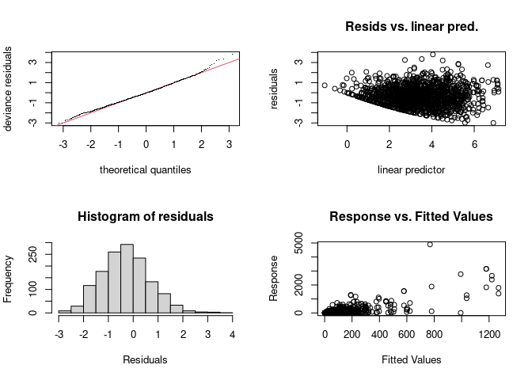<!-- -->

    ## 
    ## Method: REML   Optimizer: outer newton
    ## full convergence after 8 iterations.
    ## Gradient range [-0.001902891,0.002448359]
    ## (score 6257.532 & scale 1).
    ## Hessian positive definite, eigenvalue range [0.6448692,715.9969].
    ## Model rank =  90 / 90 
    ## 
    ## Basis dimension (k) checking results. Low p-value (k-index<1) may
    ## indicate that k is too low, especially if edf is close to k'.
    ## 
    ##                                      k'   edf k-index p-value
    ## s(disease_week):urbanizationrural  9.00  7.61    0.92    0.68
    ## s(disease_week):urbanizationperi   9.00  7.46    0.92    0.63
    ## s(disease_week):urbanizationurban  9.00  6.07    0.92    0.64
    ## s(site_name)                      59.00 49.75      NA      NA

### Check smooths: pipiens

``` r
#Summary of GAM fit
summary(pip_gam)
```

    ## 
    ## Family: Negative Binomial(1.08) 
    ## Link function: log 
    ## 
    ## Formula:
    ## count ~ urbanization + trap_type + s(disease_week, by = urbanization, 
    ##     bs = "fs", k = 10, m = 3) + s(site_name, bs = "re")
    ## 
    ## Parametric coefficients:
    ##                   Estimate Std. Error z value Pr(>|z|)    
    ## (Intercept)         3.8747     0.1451  26.707  < 2e-16 ***
    ## urbanizationperi    0.3224     0.2383   1.353 0.176036    
    ## urbanizationurban  -0.8019     0.2121  -3.781 0.000156 ***
    ## trap_typeGRVD      -0.6723     0.1121  -5.996 2.02e-09 ***
    ## ---
    ## Signif. codes:  0 '***' 0.001 '**' 0.01 '*' 0.05 '.' 0.1 ' ' 1
    ## 
    ## Approximate significance of smooth terms:
    ##                                      edf Ref.df Chi.sq p-value    
    ## s(disease_week):urbanizationrural  7.612  8.355  411.5  <2e-16 ***
    ## s(disease_week):urbanizationperi   7.460  8.234  683.2  <2e-16 ***
    ## s(disease_week):urbanizationurban  6.074  6.893  282.4  <2e-16 ***
    ## s(site_name)                      49.748 56.000  535.7  <2e-16 ***
    ## ---
    ## Signif. codes:  0 '***' 0.001 '**' 0.01 '*' 0.05 '.' 0.1 ' ' 1
    ## 
    ## R-sq.(adj) =  0.473   Deviance explained = 67.8%
    ## -REML = 6257.5  Scale est. = 1         n = 1383

``` r
#AIC for 
cat("GAM model pip AIC: ", AIC(pip_gam), "\n")
```

    ## GAM model pip AIC:  12391.55

``` r
#Check if smooths are hitting their basis limits
gam.check(pip_gam)
```

<!-- -->

    ## 
    ## Method: REML   Optimizer: outer newton
    ## full convergence after 8 iterations.
    ## Gradient range [-0.001902891,0.002448359]
    ## (score 6257.532 & scale 1).
    ## Hessian positive definite, eigenvalue range [0.6448692,715.9969].
    ## Model rank =  90 / 90 
    ## 
    ## Basis dimension (k) checking results. Low p-value (k-index<1) may
    ## indicate that k is too low, especially if edf is close to k'.
    ## 
    ##                                      k'   edf k-index p-value
    ## s(disease_week):urbanizationrural  9.00  7.61    0.92    0.61
    ## s(disease_week):urbanizationperi   9.00  7.46    0.92    0.62
    ## s(disease_week):urbanizationurban  9.00  6.07    0.92    0.59
    ## s(site_name)                      59.00 49.75      NA      NA

``` r
# plot the smooths for pip
plot(pip_gam, select = 1, shade = TRUE, main = "GAM Smooth for pip x rural")
```

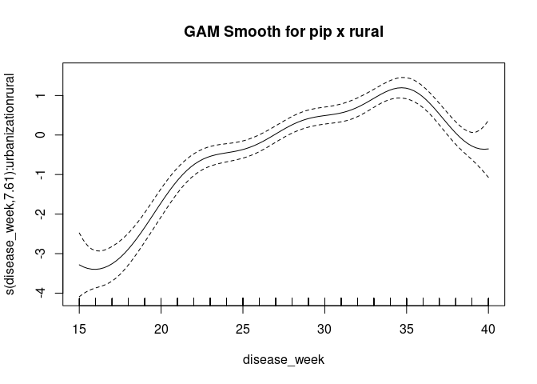<!-- -->

``` r
plot(pip_gam, select = 2, shade = TRUE, main = "GAM Smooth for pip x peri")
```

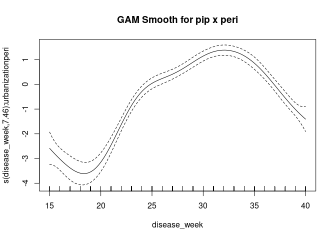<!-- -->

``` r
plot(pip_gam, select = 3, shade = TRUE, main = "GAM Smooth for pip x urban")
```

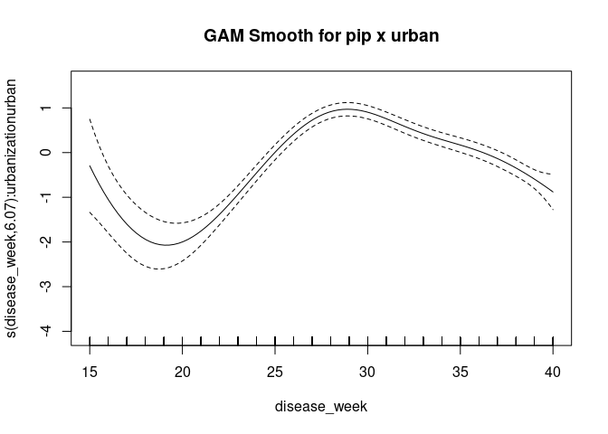<!-- -->

### Map residuals: pipiens

``` r
# Make a list of coordinates
site_coords_pip <- pipiens %>%
  dplyr::select(site_name, latitude, longitude) %>%
  distinct()

# Extract data actually used in the model
# Add coordinates and residuals
pipiens_data_res <- model.frame(pip_gam) %>%
  mutate(resid = residuals(pip_gam, type = "pearson")) %>%
  left_join(site_coords_pip, by = "site_name")

# Transform to make it easier to see spatial patterns
pipiens_data_res$resid_log <- log10(pipiens_data_res$resid + 2)

# plot by lat/long
ggplot(pipiens_data_res, aes(x = longitude, y = latitude, color = resid_log)) +
  geom_point(size = 3) +
  coord_fixed() +
  scale_color_viridis_c() +
  theme_minimal()
```

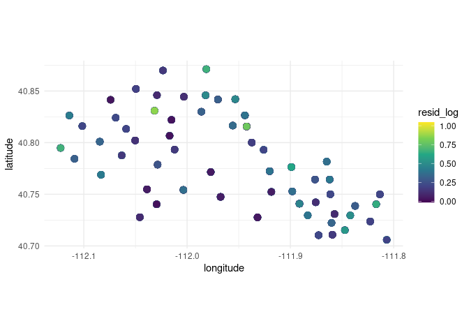<!-- -->

### Weekly residuals: pipiens

``` r
# Plot residuals by disease week

ggplot(pipiens_data_res,
       aes(x = disease_week, y = resid)) +
  geom_point(alpha = 0.5) +
  geom_smooth(se = FALSE, color = "blue") +
  theme_bw()
```

    ## `geom_smooth()` using method = 'gam' and formula = 'y ~ s(x, bs = "cs")'

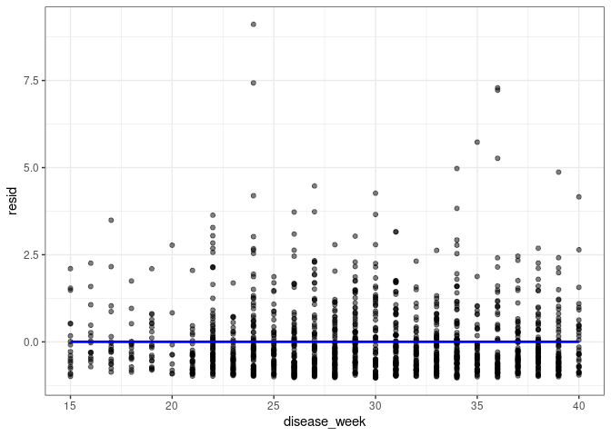<!-- -->

``` r
#residual distributions for each week separately
ggplot(pipiens_data_res,
       aes(x = factor(disease_week), y = resid)) +
  geom_boxplot() +
  theme_bw() +
  labs(
    x = "Disease Week",
    y = "Pearson Residuals",
    title = "Residual Distribution by Week - pipiens"
  )
```

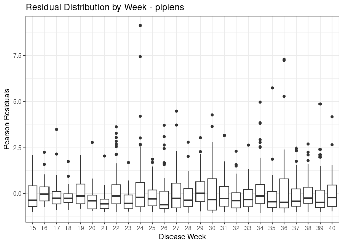<!-- -->

### DHARMa: pip

``` r
# pipiens
sim_pip <- simulateResiduals(pip_gam, n = 1000)
plot(sim_pip)
```

    ## Warning in newton(lsp = lsp, X = G$X, y = G$y, Eb = G$Eb, UrS = G$UrS, L = G$L,
    ## : Fitting terminated with step failure - check results carefully

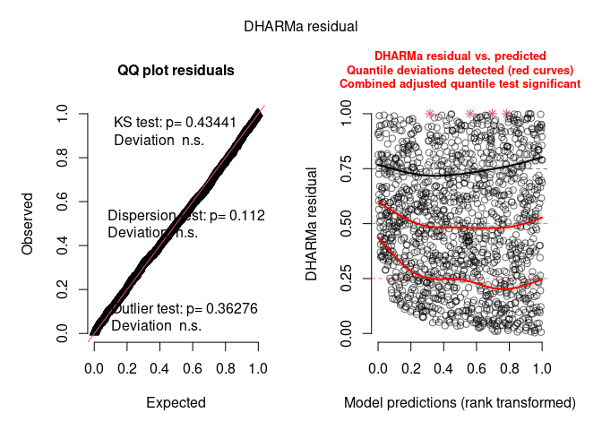<!-- -->

``` r
testDispersion(sim_pip)
```

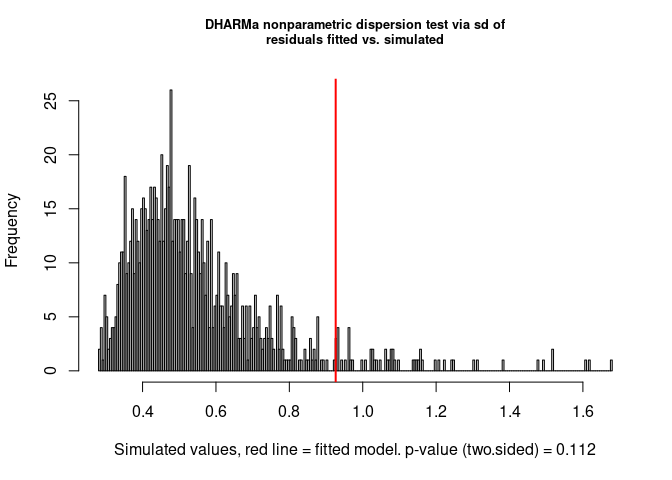<!-- -->

    ## 
    ##  DHARMa nonparametric dispersion test via sd of residuals fitted vs.
    ##  simulated
    ## 
    ## data:  simulationOutput
    ## dispersion = 1.6979, p-value = 0.112
    ## alternative hypothesis: two.sided

``` r
# Aggregate DHARMa residuals by site for pipiens
sim_pip_site <- recalculateResiduals(
  sim_pip,
  group = pipiens$site_name
)

site_coords_pip <- pipiens %>%
  dplyr::select(site_name, latitude, longitude) %>%
  distinct() %>%
  arrange(site_name)

testSpatialAutocorrelation(
  sim_pip_site,
  x = site_coords_pip$longitude,
  y = site_coords_pip$latitude
)
```

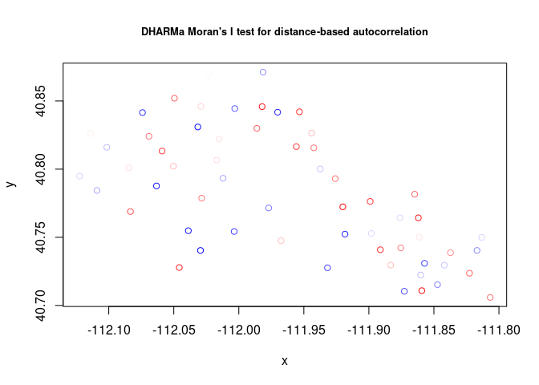<!-- -->

    ## 
    ##  DHARMa Moran's I test for distance-based autocorrelation
    ## 
    ## data:  sim_pip_site
    ## observed = -0.030551, expected = -0.017241, sd = 0.021944, p-value =
    ## 0.5442
    ## alternative hypothesis: Distance-based autocorrelation

## Cx. tarsalis GAM

``` r
# pull out tarsalis
tarsalis <- combined %>%
  filter(species == "Culex tarsalis") %>%
  droplevels() 

# Prelim: factor spline (bs = "fs")
# Fits variable patterns for each group pooled toward a universal pattern, and you don't include a "by =" argument
# The second models a universal pattern plus trap-specific deviations from that pattern.
tar_gam_prelim <- gam(
  count ~ urbanization + trap_type + 
    # s(disease_week, k = 15) +   ## Remove in final?
    s(disease_week, urbanization, bs = "fs", k = 15, m = 3) + 
    s(site_name, bs = "re"),
  data = tarsalis,
  family = nb(link = "log"),
  method = "REML"
)

# Model 2: FINAL
# Using by = group fits a separate seasonal smooth for each group, with smoothing parameters shared across groups.
# Using group as the second argument with bs = "fs" fits an overall/group factor-smooth structure with partial pooling among groups.
tar_gam <- gam(
  count ~ urbanization + trap_type +
    s(disease_week, by = urbanization, bs = "fs", k = 20, m = 3) +
    s(site_name, bs = "re"),
  family = nb(),
  data = tarsalis,
  method = "REML"
)

summary(tar_gam)
```

    ## 
    ## Family: Negative Binomial(1.072) 
    ## Link function: log 
    ## 
    ## Formula:
    ## count ~ urbanization + trap_type + s(disease_week, by = urbanization, 
    ##     bs = "fs", k = 20, m = 3) + s(site_name, bs = "re")
    ## 
    ## Parametric coefficients:
    ##                   Estimate Std. Error z value Pr(>|z|)    
    ## (Intercept)         5.8856     0.1278  46.055   <2e-16 ***
    ## urbanizationperi   -0.4673     0.2149  -2.174   0.0297 *  
    ## urbanizationurban  -2.7170     0.2102 -12.924   <2e-16 ***
    ## trap_typeGRVD      -2.6942     0.2007 -13.423   <2e-16 ***
    ## ---
    ## Signif. codes:  0 '***' 0.001 '**' 0.01 '*' 0.05 '.' 0.1 ' ' 1
    ## 
    ## Approximate significance of smooth terms:
    ##                                      edf Ref.df Chi.sq p-value    
    ## s(disease_week):urbanizationrural 18.172  18.86 2914.6  <2e-16 ***
    ## s(disease_week):urbanizationperi  13.214  15.05 1132.1  <2e-16 ***
    ## s(disease_week):urbanizationurban  6.802   7.86  148.2  <2e-16 ***
    ## s(site_name)                      43.667  53.00  553.1  <2e-16 ***
    ## ---
    ## Signif. codes:  0 '***' 0.001 '**' 0.01 '*' 0.05 '.' 0.1 ' ' 1
    ## 
    ## R-sq.(adj) =  0.546   Deviance explained = 72.4%
    ## -REML =  10865  Scale est. = 1         n = 1733

``` r
gam.check(tar_gam)
```

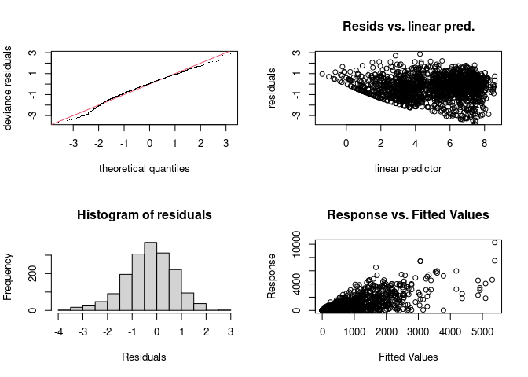<!-- -->

    ## 
    ## Method: REML   Optimizer: outer newton
    ## full convergence after 6 iterations.
    ## Gradient range [-0.0008739513,0.007485638]
    ## (score 10865.43 & scale 1).
    ## Hessian positive definite, eigenvalue range [1.036974,957.634].
    ## Model rank =  117 / 117 
    ## 
    ## Basis dimension (k) checking results. Low p-value (k-index<1) may
    ## indicate that k is too low, especially if edf is close to k'.
    ## 
    ##                                     k'  edf k-index p-value
    ## s(disease_week):urbanizationrural 19.0 18.2     0.9    0.19
    ## s(disease_week):urbanizationperi  19.0 13.2     0.9    0.17
    ## s(disease_week):urbanizationurban 19.0  6.8     0.9    0.14
    ## s(site_name)                      56.0 43.7      NA      NA

### Check smooths: tarsalis

``` r
#Summary of GAM fit
summary(tar_gam)
```

    ## 
    ## Family: Negative Binomial(1.072) 
    ## Link function: log 
    ## 
    ## Formula:
    ## count ~ urbanization + trap_type + s(disease_week, by = urbanization, 
    ##     bs = "fs", k = 20, m = 3) + s(site_name, bs = "re")
    ## 
    ## Parametric coefficients:
    ##                   Estimate Std. Error z value Pr(>|z|)    
    ## (Intercept)         5.8856     0.1278  46.055   <2e-16 ***
    ## urbanizationperi   -0.4673     0.2149  -2.174   0.0297 *  
    ## urbanizationurban  -2.7170     0.2102 -12.924   <2e-16 ***
    ## trap_typeGRVD      -2.6942     0.2007 -13.423   <2e-16 ***
    ## ---
    ## Signif. codes:  0 '***' 0.001 '**' 0.01 '*' 0.05 '.' 0.1 ' ' 1
    ## 
    ## Approximate significance of smooth terms:
    ##                                      edf Ref.df Chi.sq p-value    
    ## s(disease_week):urbanizationrural 18.172  18.86 2914.6  <2e-16 ***
    ## s(disease_week):urbanizationperi  13.214  15.05 1132.1  <2e-16 ***
    ## s(disease_week):urbanizationurban  6.802   7.86  148.2  <2e-16 ***
    ## s(site_name)                      43.667  53.00  553.1  <2e-16 ***
    ## ---
    ## Signif. codes:  0 '***' 0.001 '**' 0.01 '*' 0.05 '.' 0.1 ' ' 1
    ## 
    ## R-sq.(adj) =  0.546   Deviance explained = 72.4%
    ## -REML =  10865  Scale est. = 1         n = 1733

``` r
#AIC for 
cat("GAM model tar AIC: ", AIC(tar_gam), "\n")
```

    ## GAM model tar AIC:  21521.94

``` r
#Check if smooths are hitting their basis limits
gam.check(tar_gam)
```

<!-- -->

    ## 
    ## Method: REML   Optimizer: outer newton
    ## full convergence after 6 iterations.
    ## Gradient range [-0.0008739513,0.007485638]
    ## (score 10865.43 & scale 1).
    ## Hessian positive definite, eigenvalue range [1.036974,957.634].
    ## Model rank =  117 / 117 
    ## 
    ## Basis dimension (k) checking results. Low p-value (k-index<1) may
    ## indicate that k is too low, especially if edf is close to k'.
    ## 
    ##                                     k'  edf k-index p-value
    ## s(disease_week):urbanizationrural 19.0 18.2     0.9    0.21
    ## s(disease_week):urbanizationperi  19.0 13.2     0.9    0.23
    ## s(disease_week):urbanizationurban 19.0  6.8     0.9    0.18
    ## s(site_name)                      56.0 43.7      NA      NA

``` r
# plot the smooths for tar
plot(tar_gam, select = 1, shade = TRUE, main = "GAM Smooth for tar x rural")
```

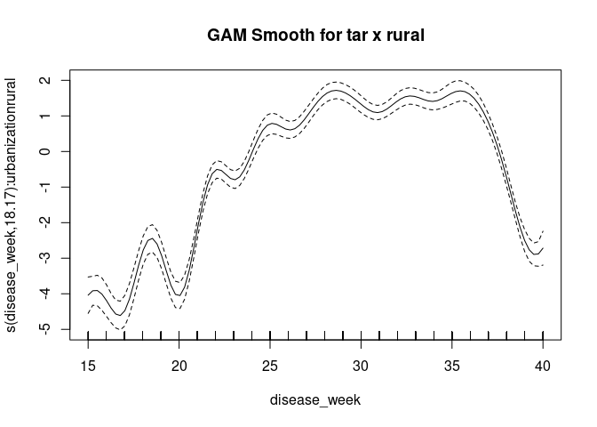<!-- -->

``` r
plot(tar_gam, select = 2, shade = TRUE, main = "GAM Smooth for tar x peri")
```

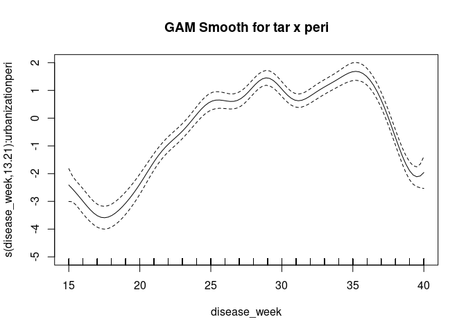<!-- -->

``` r
plot(tar_gam, select = 3, shade = TRUE, main = "GAM Smooth for tar x urban")
```

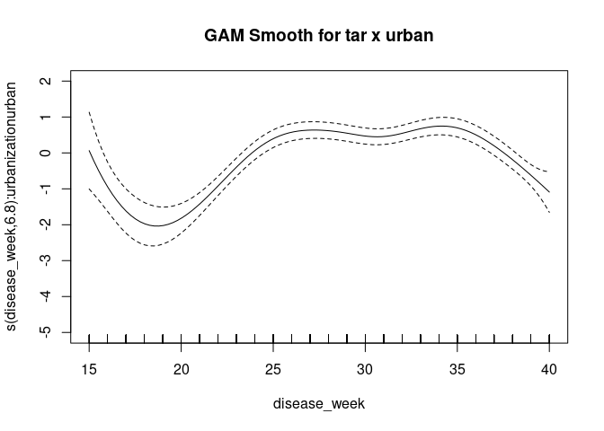<!-- -->

### Map residuals: tarsalis

``` r
# Make a list of coordinates
site_coords_tar <- tarsalis %>%
  dplyr::select(site_name, latitude, longitude) %>%
  distinct()

# Extract data actually used in the model
# Add coordinates and residuals
tarsalis_data_res <- model.frame(tar_gam) %>%
  mutate(resid = residuals(tar_gam, type = "pearson")) %>%
  left_join(site_coords_tar, by = "site_name")

# Transform to make it easier to see spatial patterns
tarsalis_data_res$resid_log <- log10(tarsalis_data_res$resid + 2)

# plot by lat/long
ggplot(tarsalis_data_res, aes(x = longitude, y = latitude, color = resid_log)) +
  geom_point(size = 3) +
  coord_fixed() +
  scale_color_viridis_c() +
  theme_minimal()
```

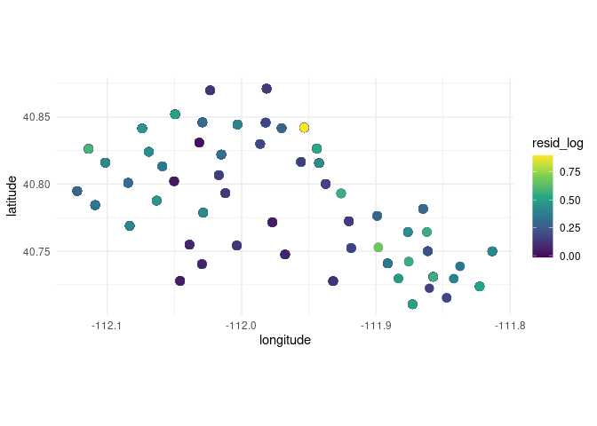<!-- -->

### Weekly residuals: tarsalis

``` r
# Plot residuals by disease week

ggplot(tarsalis_data_res,
       aes(x = disease_week, y = resid)) +
  geom_point(alpha = 0.5) +
  geom_smooth(se = FALSE, color = "blue") +
  theme_bw()
```

    ## `geom_smooth()` using method = 'gam' and formula = 'y ~ s(x, bs = "cs")'

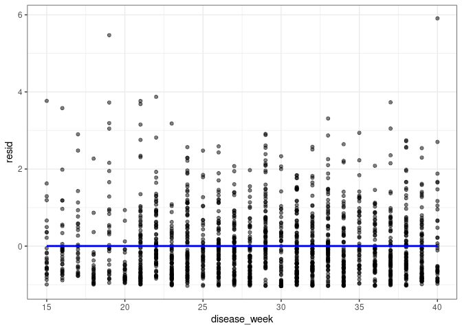<!-- -->

``` r
#residual distributions for each week separately
ggplot(tarsalis_data_res,
       aes(x = factor(disease_week), y = resid)) +
  geom_boxplot() +
  theme_bw() +
  labs(
    x = "Disease Week",
    y = "Pearson Residuals",
    title = "Residual Distribution by Week - tarsalis"
  )
```

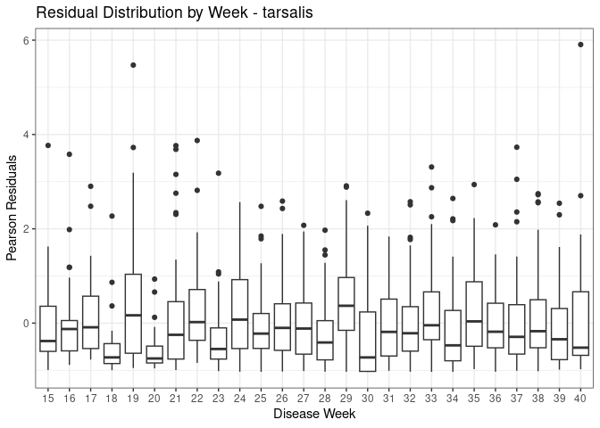<!-- -->

### DHARMa: tarsalis

``` r
# tarsalis
sim_tar <- simulateResiduals(tar_gam, n = 1000)
plot(sim_tar)
```

    ## Warning in newton(lsp = lsp, X = G$X, y = G$y, Eb = G$Eb, UrS = G$UrS, L = G$L,
    ## : Fitting terminated with step failure - check results carefully
    ## Warning in newton(lsp = lsp, X = G$X, y = G$y, Eb = G$Eb, UrS = G$UrS, L = G$L,
    ## : Fitting terminated with step failure - check results carefully

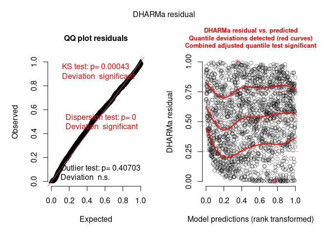<!-- -->

``` r
testDispersion(sim_tar)
```

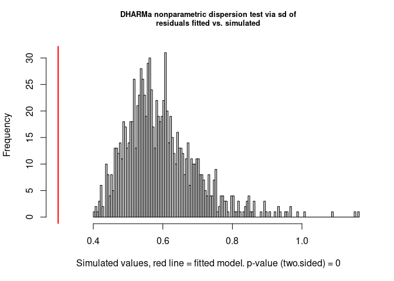<!-- -->

    ## 
    ##  DHARMa nonparametric dispersion test via sd of residuals fitted vs.
    ##  simulated
    ## 
    ## data:  simulationOutput
    ## dispersion = 0.50211, p-value < 2.2e-16
    ## alternative hypothesis: two.sided

``` r
# Aggregate DHARMa residuals by site for tarsalis
sim_tar_site <- recalculateResiduals(
  sim_tar,
  group = tarsalis$site_name
)

site_coords_tar <- tarsalis %>%
  dplyr::select(site_name, latitude, longitude) %>%
  distinct() %>%
  arrange(site_name)

testSpatialAutocorrelation(
  sim_tar_site,
  x = site_coords_tar$longitude,
  y = site_coords_tar$latitude
)
```

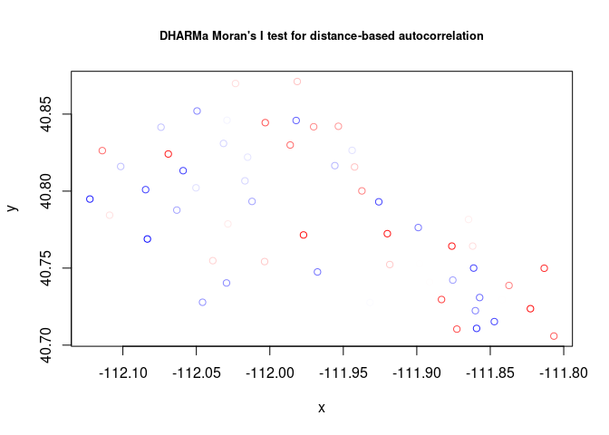<!-- -->

    ## 
    ##  DHARMa Moran's I test for distance-based autocorrelation
    ## 
    ## data:  sim_tar_site
    ## observed = -0.012753, expected = -0.017544, sd = 0.021851, p-value =
    ## 0.8265
    ## alternative hypothesis: Distance-based autocorrelation

``` r
# check whether very large counts are dominating the fit:
ggplot(tarsalis, aes(x = count)) +
  geom_histogram(bins = 50) +
  scale_x_log10() +
  theme_bw()
```

    ## Warning: Removed 41 rows containing non-finite outside the scale range
    ## (`stat_bin()`).

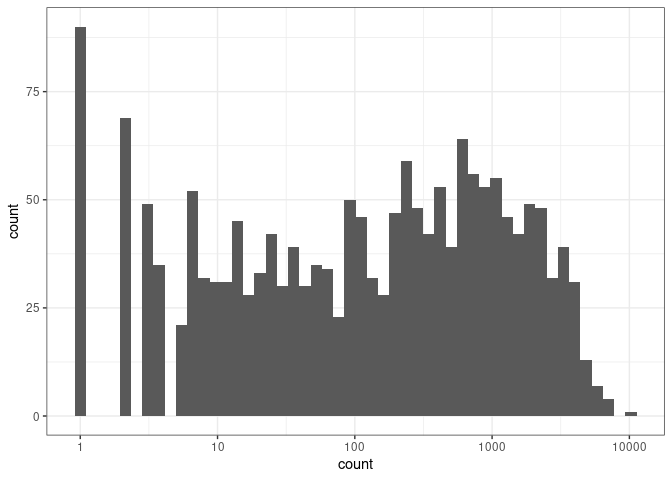<!-- -->

``` r
# Is underdispersion trap-specific?
tarsalis_data_res <- model.frame(tar_gam) %>%
  mutate(
    resid = residuals(tar_gam, type = "pearson"),
    fitted = fitted(tar_gam)
  )

ggplot(tarsalis_data_res, aes(x = trap_type, y = resid)) +
  geom_boxplot() +
  theme_bw()
```

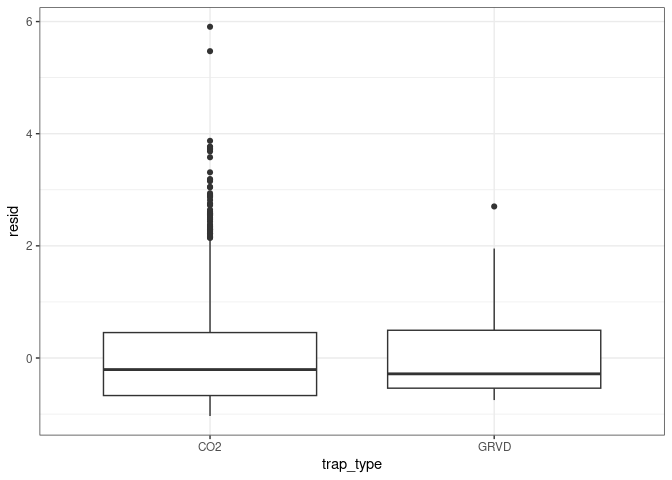<!-- -->

``` r
ggplot(tarsalis_data_res, aes(x = urbanization, y = resid)) +
  geom_boxplot() +
  theme_bw()
```

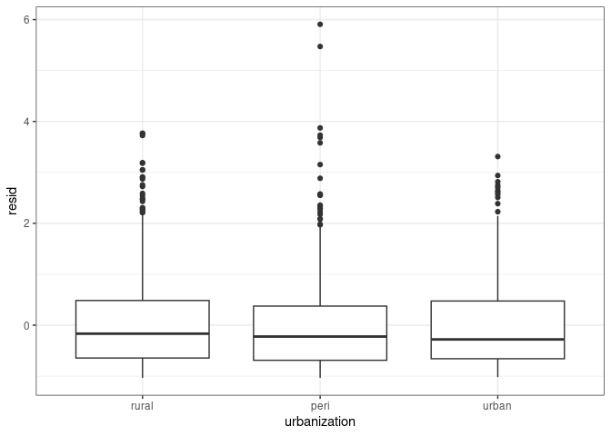<!-- -->

``` r
tarsalis_data_res <- model.frame(tar_gam) %>%
  mutate(
    fitted = fitted(tar_gam)
  )
```

Something strange is happening with tarsalis model, with failed
dispersion test when we use.DHARMa nonparametric dispersion test via sd
of residuals fitted vs. simulated:  
- smooth: m=3, k=25  
- data: simulationOutput  
- dispersion = 0.48346, p-value \< 2.2e-16  
- alternative hypothesis: two.sided

Is this DHARMa is reacting to strong structured signal repeated
measures, high explanatory power?

# Plot pip vs. tar from separate models

## Figure 4 - Effect sizes from species-specific GAMs

``` r
# ------------------------------------------------------------
# 1. Extract desired contrasts from each fitted model
# ------------------------------------------------------------

get_fig4_contrasts <- function(model, species_label) {

  b <- coef(model)
  V <- vcov(model)

  peri_term  <- "urbanizationperi"
  urban_term <- "urbanizationurban"
  trap_term  <- "trap_typeGRVD"

  # Rural vs Urban
  est_rural_urban <- -b[urban_term]
  se_rural_urban  <- sqrt(V[urban_term, urban_term])

  # Peri-urban vs Urban
  est_peri_urban <- b[peri_term] - b[urban_term]
  se_peri_urban  <- sqrt(
    V[peri_term, peri_term] +
      V[urban_term, urban_term] -
      2 * V[peri_term, urban_term]
  )

  # CO2 vs Gravid
  # Model coefficient is GRVD relative to CO2, so flip sign
  est_co2_grvd <- -b[trap_term]
  se_co2_grvd  <- sqrt(V[trap_term, trap_term])

  data.frame(
    species = species_label,
    comparison = c(
      "Rural vs urban",
      "Peri-urban vs urban",
      "CO2 vs gravid"
    ),
    color_group = c(
      "rural",
      "peri",
      "trap"
    ),
    estimate = c(
      est_rural_urban,
      est_peri_urban,
      est_co2_grvd
    ),
    std.error = c(
      se_rural_urban,
      se_peri_urban,
      se_co2_grvd
    )
  ) %>%
    dplyr::mutate(
      effect = exp(estimate),
      lower  = exp(estimate - 1.96 * std.error),
      upper  = exp(estimate + 1.96 * std.error)
    )
}

# ------------------------------------------------------------
# 2. Combine species
# ------------------------------------------------------------

coef_df_sep <- dplyr::bind_rows(
  get_fig4_contrasts(pip_gam, "Culex pipiens"),
  get_fig4_contrasts(tar_gam, "Culex tarsalis")
) %>%
  dplyr::mutate(
    comparison = factor(
      comparison,
      levels = c(
        "CO2 vs gravid",
        "Peri-urban vs urban",
        "Rural vs urban"
      )
    ),
    species = factor(
      species,
      levels = c("Culex pipiens", "Culex tarsalis")
    )
  )

# ------------------------------------------------------------
# 3. Colors consistent with Figure 1
# ------------------------------------------------------------

fig4_cols <- c(
  "rural" = "#009E73",
  "peri"  = "#E69F00",
  "trap"  = "#666666"
)

# ------------------------------------------------------------
# 4. Plot
# ------------------------------------------------------------

fig4 <- ggplot(
  coef_df_sep,
  aes(
    x = effect,
    y = comparison,
    color = color_group
  )
) +
  geom_vline(
    xintercept = 1,
    linetype = "dashed",
    color = "grey50",
    linewidth = 0.5
  ) +
  geom_errorbarh(
    aes(xmin = lower, xmax = upper),
    height = 0.15,
    linewidth = 0.8
  ) +
  geom_point(size = 3.5) +
  facet_wrap(
  ~ species,
  ncol = 1,
  axes = "all_x",
  axis.labels = "all_x",
  labeller = as_labeller(
    c(
      "Culex pipiens"  = "Cx. pipiens",
      "Culex tarsalis" = "Cx. tarsalis"
    )
  )
) +
  scale_color_manual(
    values = fig4_cols,
    guide = "none"
  ) +
  scale_x_log10() +
  labs(
    x = "Multiplicative effect on predicted abundance",
    y = NULL
  ) +
theme_classic() +
theme(
  strip.background = element_blank(),
  strip.text = element_text(
    face = "italic",
    size = 11
  ),
  axis.title.y = element_blank()
)

fig4
```

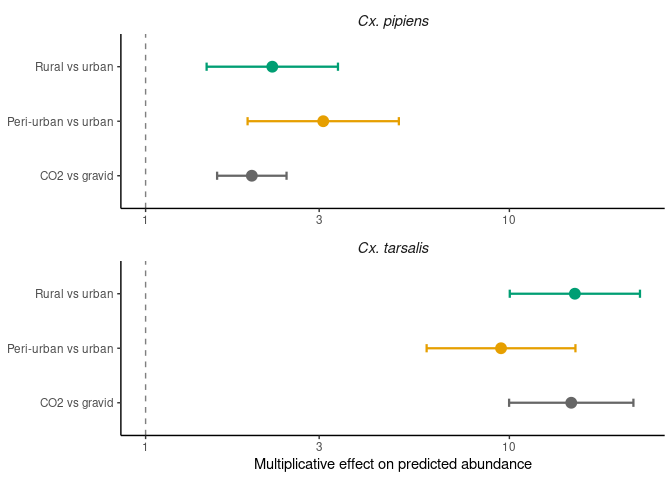<!-- --> \### Save
Figure 4

``` r
ggsave(
  "../figures/Fig4_effect_size_final_GAMs.pdf",
  fig4,
  width = 6.5,
  height = 3
)
```

## Figure 3 and 5 - Seasonal Smooth from all models

### Original visualization with colors indicating mosquito species

``` r
cols <- c(
  "Culex pipiens"  = "#1bc8ea",
  "Culex tarsalis" = "#FF2DA0"
)

predict_species_gam <- function(model, newdata, species_label) {
  
  newdata$urbanization <- factor(newdata$urbanization, levels = levels(combined$urbanization))
  newdata$trap_type <- factor(newdata$trap_type, levels = levels(combined$trap_type))
  newdata$site_name <- factor(newdata$site_name, levels = levels(combined$site_name))
  
  pred <- predict(
    model,
    newdata = newdata,
    type = "link",
    se.fit = TRUE,
    exclude = "s(site_name)"
  )
  
  newdata %>%
    mutate(
      species = species_label,
      fit_link = pred$fit,
      se_link = pred$se.fit,
      fit = exp(fit_link),
      lower = exp(fit_link - 1.96 * se_link),
      upper = exp(fit_link + 1.96 * se_link)
    )
}
# ----------------------
# 1. Seasonal effects across habitats
# ----------------------

# CO2 + Urban
newdata_season <- expand.grid(
  disease_week = seq(min(combined$disease_week), max(combined$disease_week), by = 1),
  urbanization = "urban",
  trap_type = "CO2",
  site_name = levels(combined$site_name)[1]
)

pred_season <- bind_rows(
  predict_species_gam(pip_gam, newdata_season, "Culex pipiens"),
  predict_species_gam(tar_gam, newdata_season, "Culex tarsalis")
)

fig_urb_co2 <- ggplot(pred_season, aes(x = disease_week, y = fit, color = species, fill = species)) +
  geom_ribbon(aes(ymin = lower, ymax = upper), alpha = 0.2, color = NA) +
  geom_line(linewidth = 1.2) +
  scale_color_manual(values = cols) +
  scale_fill_manual(values = cols) +
  labs(
    x = "Disease week",
    y = "Predicted abundance (CO2 traps)",
    color = "Species",
    fill = "Species",
    title = "Predicted seasonal abundance: Urban"
  ) +
  theme_minimal()

fig_urb_co2 
```

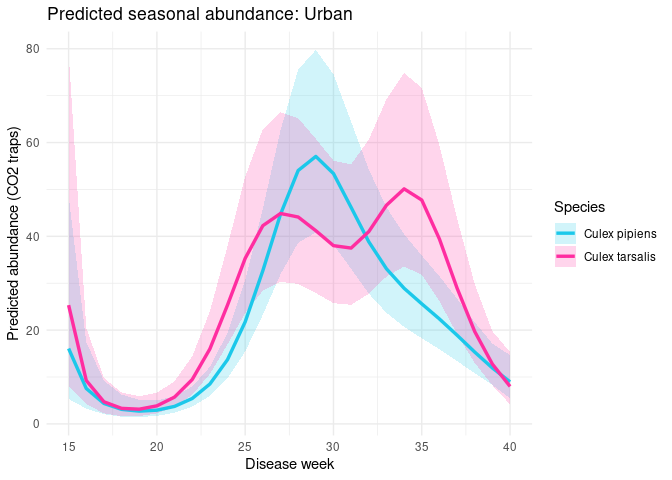<!-- -->

``` r
# CO2 + Rural
newdata_season <- expand.grid(
  disease_week = seq(min(combined$disease_week), max(combined$disease_week), by = 1),
  urbanization = "rural",
  trap_type = "CO2",
  site_name = levels(combined$site_name)[1]
)

pred_season <- bind_rows(
  predict_species_gam(pip_gam, newdata_season, "Culex pipiens"),
  predict_species_gam(tar_gam, newdata_season, "Culex tarsalis")
)

fig_rural_co2 <- ggplot(pred_season, aes(x = disease_week, y = fit, color = species, fill = species)) +
  geom_ribbon(aes(ymin = lower, ymax = upper), alpha = 0.2, color = NA) +
  geom_line(linewidth = 1.2) +
  scale_color_manual(values = cols) +
  scale_fill_manual(values = cols) +
  labs(
    x = "Disease week",
    y = "Predicted abundance (CO2 traps)",
    color = "Species",
    fill = "Species",
    title = "Predicted seasonal abundance: Rural"
  ) +
  theme_minimal()
fig_rural_co2 
```

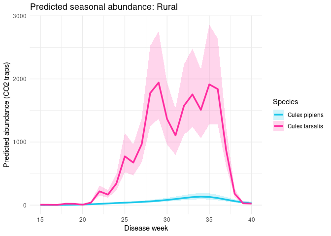<!-- -->

``` r
# ----------------------
# 2. Predicted abundance by urbanization: CO2 traps
# ----------------------
newdat_site_CO2 <- expand.grid(
  disease_week = seq(min(combined$disease_week), max(combined$disease_week), by = 1),
  urbanization = levels(combined$urbanization),
  trap_type = "CO2",
  site_name = levels(combined$site_name)[1]
)

pred_site_CO2 <- bind_rows(
  predict_species_gam(pip_gam, newdat_site_CO2, "Culex pipiens"),
  predict_species_gam(tar_gam, newdat_site_CO2, "Culex tarsalis")
)

fig5 <- ggplot(pred_site_CO2, aes(x = disease_week, y = fit, color = species, group = species)) +
  geom_line(linewidth = 1.2) +
  geom_ribbon(aes(ymin = lower, ymax = upper, fill = species), alpha = 0.25, color = NA) +
  geom_vline(xintercept = 33, linetype = "dashed", color = "black", linewidth = 0.5) +
  annotate("text", x = 33, y = Inf, label = "1st WNV cases",
           vjust = 1, hjust = -0.07, size = 3) +
  facet_wrap(~ urbanization, scales = "free_y", ncol = 1) +
  scale_color_manual(values = cols) +
  scale_fill_manual(values = cols) +
  labs(
    title = "Predicted abundance from species-specific GAMs (CO2 traps)",
    x = "Disease week",
    y = "Predicted abundance",
    color = "Species",
    fill = "Species"
  ) +
  theme_classic() +
  theme(
    plot.title = element_text(hjust = 0.5),
    strip.background = element_blank(),
    strip.text = element_text(size = 12)
  )
fig5
```

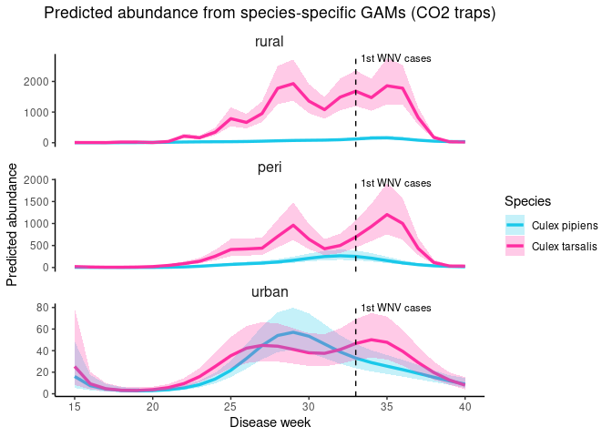<!-- -->

``` r
newdat_site_CO2 <- expand.grid(
  disease_week = seq(min(combined$disease_week), max(combined$disease_week), by = 1),
  urbanization = levels(combined$urbanization),
  trap_type = "CO2",
  site_name = levels(combined$site_name)[1]
)

pred_site_CO2 <- bind_rows(
  predict_species_gam(pip_gam, newdat_site_CO2, "Culex pipiens"),
  predict_species_gam(tar_gam, newdat_site_CO2, "Culex tarsalis")
) %>%
  dplyr::mutate(
    species = factor(
      species,
      levels = c("Culex pipiens", "Culex tarsalis")
    ),
    urbanization = factor(
      urbanization,
      levels = c("rural", "peri", "urban")
    )
  )

urban_cols <- c(
  "rural" = "#009E73",
  "peri"  = "#E69F00",
  "urban" = "#D55E00"
)

fig5 <- ggplot(
  pred_site_CO2,
  aes(
    x = disease_week,
    y = fit,
    color = urbanization,
    fill = urbanization,
    group = urbanization
  )
) +
  geom_ribbon(
    aes(
      ymin = lower,
      ymax = upper
    ),
    alpha = 0.16,
    color = NA
  ) +
  geom_line(linewidth = 1) +
  geom_vline(
    xintercept = 33,
    linetype = "dashed",
    color = "black",
    linewidth = 0.5
  ) +
  annotate(
    "text",
    x = 33,
    y = Inf,
    label = "1st WNV cases",
    vjust = 1.2,
    hjust = -0.05,
    size = 3
  ) +
  facet_wrap(
    ~ species,
    ncol = 1,
    scales = "free_y",
    axes = "all_x",
    axis.labels = "all_x",
    labeller = as_labeller(
      c(
        "Culex pipiens"  = "Cx. pipiens",
        "Culex tarsalis" = "Cx. tarsalis"
      )
    )
  ) +
  scale_color_manual(
    values = urban_cols,
    labels = c(
      "rural" = "Rural",
      "peri"  = "Peri-urban",
      "urban" = "Urban"
    ),
    name = "Urbanization"
  ) +
  scale_fill_manual(
    values = urban_cols,
    labels = c(
      "rural" = "Rural",
      "peri"  = "Peri-urban",
      "urban" = "Urban"
    ),
    name = "Urbanization"
  ) +
  labs(
    x = "Disease week",
    y = "Predicted abundance (CO2 traps)"
  ) +
  theme_classic() +
theme(
  strip.background = element_blank(),
  strip.text = element_text(
    face = "italic",
    size = 11
  ),
  legend.position = "right"
)

fig5
```

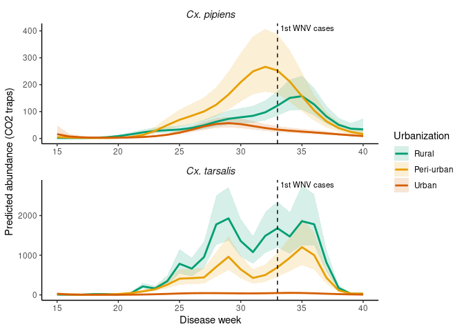<!-- -->

### Save Old Figure 5

``` r
ggsave(
  "../figures/Fig5_seasonal_abund_CO2traps.pdf",
  fig5,
  width = 6.5,
  height = 4
)
```

## Figure 3 Combo: 3 and 5

``` r
# ------------------------------------------------------------
# Combined seasonal abundance figure
# Left: urban paired sites (CO2 vs gravid)
# Right: all habitats (CO2 only)
# ------------------------------------------------------------

library(patchwork)
```

    ## 
    ## Attaching package: 'patchwork'

    ## The following object is masked from 'package:MASS':
    ## 
    ##     area

``` r
urban_cols <- c(
  "rural" = "#009E73",
  "peri"  = "#E69F00",
  "urban" = "#D55E00"
)

urban_col <- urban_cols["urban"]

# Shared y-axis max for the two urban paired-site panels
urban_paired_ymax <- max(pred_fig3$upper, na.rm = TRUE)

# ------------------------------------------------------------
# Function: all habitats, CO2 only
# ------------------------------------------------------------

plot_all_habitats <- function(species_name, show_x = TRUE) {

  dat <- pred_site_CO2 %>%
    dplyr::filter(species == species_name)

  ggplot(
    dat,
    aes(
      x = disease_week,
      y = fit,
      color = urbanization,
      fill = urbanization,
      group = urbanization
    )
  ) +
    geom_ribbon(
      aes(ymin = lower, ymax = upper),
      alpha = 0.16,
      color = NA
    ) +
    geom_line(linewidth = 1) +
    geom_vline(
      xintercept = 33,
      linetype = "dashed",
      color = "black",
      linewidth = 0.5
    ) +
    scale_color_manual(
      values = urban_cols,
      labels = c(
        "rural" = "Rural",
        "peri"  = "Peri-urban",
        "urban" = "Urban"
      ),
      name = "Urbanization"
    ) +
    scale_fill_manual(
      values = urban_cols,
      labels = c(
        "rural" = "Rural",
        "peri"  = "Peri-urban",
        "urban" = "Urban"
      ),
      name = "Urbanization"
    ) +
    labs(
      x = if (show_x) "Disease week" else NULL,
      y = "Predicted abundance"
    ) +
    theme_bw() +
    theme(
      panel.grid = element_blank(),
      panel.border = element_rect(
        color = "black",
        fill = NA,
        linewidth = 0.8
      ),
      legend.position = "right"
    )
}

# ------------------------------------------------------------
# Function: urban paired sites, both trap types
# ------------------------------------------------------------

plot_urban_paired <- function(species_name, show_x = TRUE) {

  dat <- pred_fig3 %>%
    dplyr::filter(species == species_name)

  ggplot(
    dat,
    aes(
      x = disease_week,
      y = fit,
      linetype = trap_type,
      group = trap_type
    )
  ) +
    geom_ribbon(
  data = dat %>% dplyr::filter(trap_type == "CO2"),
  aes(
    ymin = lower,
    ymax = upper
  ),
  fill = urban_col,
  alpha = 0.16,
  color = NA
) +
geom_ribbon(
  data = dat %>% dplyr::filter(trap_type == "GRVD"),
  aes(
    ymin = lower,
    ymax = upper
  ),
  fill = urban_col,
  alpha = 0.33,
  color = NA
) +
    geom_line(
      color = urban_col,
      linewidth = 1
    ) +
    geom_vline(
      xintercept = 33,
      linetype = "dashed",
      color = "black",
      linewidth = 0.5
    ) +
    scale_linetype_manual(
      values = c(
        "CO2"  = "solid",
        "GRVD" = "dashed"
      ),
      labels = c(
        "CO2"  = expression(CO[2]),
        "GRVD" = "Gravid"
      ),
      name = "Trap type"
    ) +
    scale_y_continuous(
      limits = c(0, urban_paired_ymax)
    ) +
    labs(
      x = if (show_x) "Disease week" else NULL,
      y = "Predicted abundance"
    ) +
    theme_bw() +
    theme(
      panel.grid = element_blank(),
      panel.border = element_rect(
        color = "black",
        fill = NA,
        linewidth = 0.8
      ),
      legend.position = "right"
    )
}

# ------------------------------------------------------------
# Build four panels
# ------------------------------------------------------------

pip_paired <- plot_urban_paired(
  "Culex pipiens",
  show_x = FALSE
) +
  ggtitle("Urban paired sites") +
  labs(subtitle = "Cx. pipiens") +
  theme(
    plot.title = element_text(hjust = 0.5, size = 11),
    plot.subtitle = element_text(
      face = "italic",
      hjust = 0.5,
      size = 11
    )
  )

pip_all <- plot_all_habitats(
  "Culex pipiens",
  show_x = FALSE
) +
  ggtitle("All habitats (CO2 estimates)") +
  labs(subtitle = "Cx. pipiens") +
  theme(
    plot.title = element_text(hjust = 0.5, size = 11),
    plot.subtitle = element_text(
      face = "italic",
      hjust = 0.5,
      size = 11
    )
  )

tar_paired <- plot_urban_paired(
  "Culex tarsalis",
  show_x = TRUE
) +
  labs(subtitle = "Cx. tarsalis") +
  theme(
    plot.subtitle = element_text(
      face = "italic",
      hjust = 0.5,
      size = 11
    )
  )

tar_all <- plot_all_habitats(
  "Culex tarsalis",
  show_x = TRUE
) +
  labs(subtitle = "Cx. tarsalis") +
  theme(
    plot.subtitle = element_text(
      face = "italic",
      hjust = 0.5,
      size = 11
    )
  )

# ------------------------------------------------------------
# Combine panels
# ------------------------------------------------------------

fig_combined <- (
  pip_paired | pip_all
) / (
  tar_paired | tar_all
) +
  patchwork::plot_layout(
    widths = c(1, 1.35),
    guides = "collect"
  ) &
  theme(
    legend.position = "right"
  )

fig_combined
```

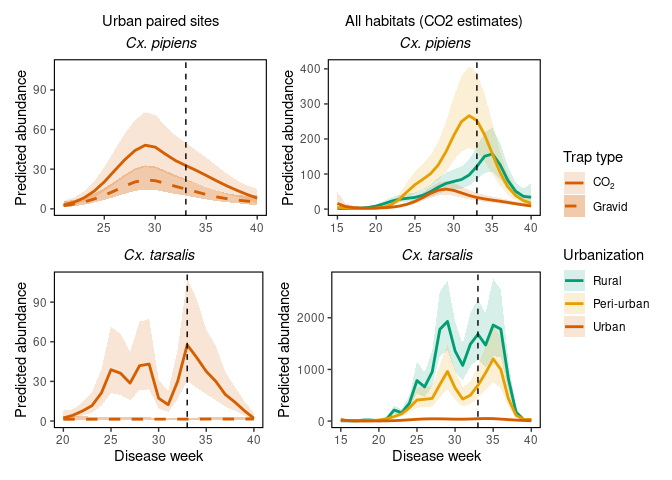<!-- -->

### Save Combo Figure

``` r
ggsave(
  "../figures/Fig3_seasonal_paired_CO2.pdf",
  fig_combined,
  width = 6.5,
  height = 4
)
```

## Figure S1 - Seasonal abundance expanded (free y-axes)

``` r
# ------------------------------------------------------------
# Figure 5
# CO2-only seasonal abundance
# Separate panel for each species x habitat combination
# Columns: Rural | Peri-urban | Urban
# Rows: Cx. pipiens | Cx. tarsalis
# Each panel has its own y-axis scale
# ------------------------------------------------------------

library(patchwork)

newdat_site_CO2 <- expand.grid(
  disease_week = seq(min(combined$disease_week), max(combined$disease_week), by = 1),
  urbanization = levels(combined$urbanization),
  trap_type = "CO2",
  site_name = levels(combined$site_name)[1]
)

pred_site_CO2 <- bind_rows(
  predict_species_gam(pip_gam, newdat_site_CO2, "Culex pipiens"),
  predict_species_gam(tar_gam, newdat_site_CO2, "Culex tarsalis")
) %>%
  dplyr::mutate(
    species = factor(
      species,
      levels = c("Culex pipiens", "Culex tarsalis")
    ),
    urbanization = factor(
      urbanization,
      levels = c("rural", "peri", "urban")
    )
  )

urban_cols <- c(
  "rural" = "#009E73",
  "peri"  = "#E69F00",
  "urban" = "#D55E00"
)

habitat_labs <- c(
  "rural" = "Rural",
  "peri"  = "Peri-urban",
  "urban" = "Urban"
)

species_labs <- c(
  "Culex pipiens"  = "Cx. pipiens",
  "Culex tarsalis" = "Cx. tarsalis"
)

# ------------------------------------------------------------
# Function to build one panel
# ------------------------------------------------------------

plot_habitat_panel <- function(species_name, habitat_name,
                               show_x = TRUE, show_y = TRUE, show_title = FALSE) {

  dat <- pred_site_CO2 %>%
    dplyr::filter(
      species == species_name,
      urbanization == habitat_name
    )

  ggplot(
    dat,
    aes(
      x = disease_week,
      y = fit
    )
  ) +
    geom_ribbon(
      aes(
        ymin = lower,
        ymax = upper
      ),
      fill = urban_cols[habitat_name],
      alpha = 0.16,
      color = NA
    ) +
    geom_line(
      color = urban_cols[habitat_name],
      linewidth = 1.1
    ) +
    geom_vline(
      xintercept = 33,
      linetype = "dashed",
      color = "black",
      linewidth = 0.5
    ) +
    labs(
      x = if (show_x) "Disease week" else NULL,
      y = if (show_y) "Predicted abundance" else NULL,
      title = if (show_title) habitat_labs[habitat_name] else NULL,
      subtitle = species_labs[species_name]
    ) +
    theme_bw() +
    theme(
      panel.grid = element_blank(),
      panel.border = element_rect(
        color = "black",
        fill = NA,
        linewidth = 0.8
      ),
      plot.title = element_text(
        hjust = 0.5,
        size = 11
      ),
      plot.subtitle = element_text(
        face = "italic",
        hjust = 0.5,
        size = 11
      ),
      axis.title.x = element_text(size = 10),
      axis.title.y = element_text(size = 10)
    )
}

# ------------------------------------------------------------
# Build the six panels
# ------------------------------------------------------------

pip_rural <- plot_habitat_panel(
  "Culex pipiens", "rural",
  show_x = FALSE, show_y = TRUE, show_title = TRUE
)

pip_peri <- plot_habitat_panel(
  "Culex pipiens", "peri",
  show_x = FALSE, show_y = FALSE, show_title = TRUE
)

pip_urban <- plot_habitat_panel(
  "Culex pipiens", "urban",
  show_x = FALSE, show_y = FALSE, show_title = TRUE
)

tar_rural <- plot_habitat_panel(
  "Culex tarsalis", "rural",
  show_x = TRUE, show_y = TRUE, show_title = FALSE
)

tar_peri <- plot_habitat_panel(
  "Culex tarsalis", "peri",
  show_x = TRUE, show_y = FALSE, show_title = FALSE
)

tar_urban <- plot_habitat_panel(
  "Culex tarsalis", "urban",
  show_x = TRUE, show_y = FALSE, show_title = FALSE
)

# ------------------------------------------------------------
# Combine
# ------------------------------------------------------------

fig5_exp <- (
  pip_rural | pip_peri | pip_urban
) / (
  tar_rural | tar_peri | tar_urban
)

fig5_exp
```

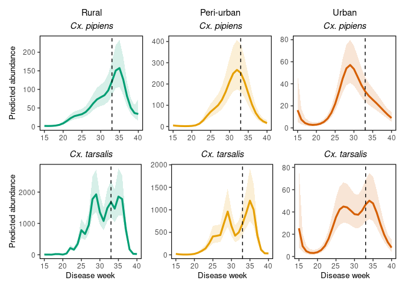<!-- -->

### Save Figure S1 - expanded Fig 3+5 right hand panels

``` r
ggsave(
  "../figures/FigS1_seasonal_abund_CO2traps.pdf",
  fig5_exp,
  width = 6.5,
  height = 4
)
```

## Figure 5 - Abundance by habitat at peak weeks and across full season

Predicted abundance at weeks 29 and 34 (global peak weeks for Cx.
pipiens and Cx. tarsalis, respectively) and averaged across the full
season.

``` r
# ------------------------------------------------------------
# 1. Predictions at weeks 29 and 34
# ------------------------------------------------------------

newdata_peak <- expand.grid(
  urbanization = levels(combined$urbanization),
  disease_week = c(29, 34),
  trap_type = "CO2",
  site_name = levels(combined$site_name)[1]
)

pred_peak <- bind_rows(
  predict_species_gam(pip_gam, newdata_peak, "Culex pipiens"),
  predict_species_gam(tar_gam, newdata_peak, "Culex tarsalis")
) %>%
  mutate(
    panel = case_when(
      disease_week == 29 ~ "Week 29",
      disease_week == 34 ~ "Week 34"
    )
  )


# ------------------------------------------------------------
# 2. Full-season average with simulation-based 95% CI
# ------------------------------------------------------------

newdata_season <- expand.grid(
  urbanization = levels(combined$urbanization),
  disease_week = seq(
    min(combined$disease_week, na.rm = TRUE),
    max(combined$disease_week, na.rm = TRUE),
    by = 1
  ),
  trap_type = "CO2",
  site_name = levels(combined$site_name)[1]
)


season_mean_ci <- function(model, newdata, species_name, nsim = 5000) {

  # Prediction matrix, excluding site-specific random effect
  X <- predict(
    model,
    newdata = newdata,
    type = "lpmatrix",
    exclude = "s(site_name)"
  )

  # Simulate coefficient estimates
  beta_sim <- MASS::mvrnorm(
    n = nsim,
    mu = coef(model),
    Sigma = vcov(model)
  )

  # Predicted abundance for every week in every simulation
  eta_sim <- X %*% t(beta_sim)
  fit_sim <- exp(eta_sim)

  # Point estimates from fitted model
  eta <- as.vector(X %*% coef(model))
  newdata$fit <- exp(eta)

  # Add row IDs so simulations can be grouped correctly
  newdata$row_id <- seq_len(nrow(newdata))

  results <- lapply(levels(newdata$urbanization), function(habitat) {

    rows <- which(newdata$urbanization == habitat)

    # Average across disease weeks within each simulation
    sim_means <- colMeans(fit_sim[rows, , drop = FALSE])

    data.frame(
      species = species_name,
      urbanization = habitat,
      fit = mean(newdata$fit[rows]),
      lower = quantile(sim_means, 0.025),
      upper = quantile(sim_means, 0.975),
      panel = "Full-season Mean"
    )
  })

  bind_rows(results)
}


pred_season <- bind_rows(
  season_mean_ci(
    pip_gam,
    newdata_season,
    "Culex pipiens"
  ),
  season_mean_ci(
    tar_gam,
    newdata_season,
    "Culex tarsalis"
  )
)


# ------------------------------------------------------------
# 3. Combine all three panels
# ------------------------------------------------------------

pred_abund <- bind_rows(
  pred_peak,
  pred_season
) %>%
  mutate(
    species = factor(
      species,
      levels = c("Culex pipiens", "Culex tarsalis")
    ),
    urbanization = factor(
      urbanization,
      levels = c("rural", "peri", "urban")
    ),
    panel = factor(
      panel,
      levels = c(
        "Week 29",
        "Week 34",
        "Full-season Mean"
      )
    )
  )
```

Figure 6 by urbanization color:

``` r
# ------------------------------------------------------------
# Settings
# ------------------------------------------------------------

selected_weeks <- c(19, 24, 29, 34, 39)

species_levels <- c(
  "Culex pipiens",
  "Culex tarsalis"
)

habitat_levels <- c(
  "rural",
  "peri",
  "urban"
)

panel_levels <- c(
  "Full-season mean",
  paste("Week", selected_weeks)
)

urban_cols <- c(
  "rural" = "#009E73",
  "peri"  = "#E69F00",
  "urban" = "#D55E00"
)


# ------------------------------------------------------------
# 1. Predictions at selected weeks
# ------------------------------------------------------------

newdata_weeks <- expand.grid(
  urbanization = habitat_levels,
  disease_week = selected_weeks,
  trap_type = "CO2",
  site_name = levels(combined$site_name)[1]
)

pred_weeks <- dplyr::bind_rows(
  predict_species_gam(
    pip_gam,
    newdata_weeks,
    "Culex pipiens"
  ),
  predict_species_gam(
    tar_gam,
    newdata_weeks,
    "Culex tarsalis"
  )
) %>%
  dplyr::mutate(
    panel = paste("Week", disease_week)
  )


# ------------------------------------------------------------
# 2. Full-season mean with simulation-based 95% CI
# ------------------------------------------------------------

newdata_season <- expand.grid(
  urbanization = habitat_levels,
  disease_week = seq(
    min(combined$disease_week, na.rm = TRUE),
    max(combined$disease_week, na.rm = TRUE),
    by = 1
  ),
  trap_type = "CO2",
  site_name = levels(combined$site_name)[1]
)

season_mean_ci <- function(model, newdata, species_name, nsim = 5000) {

  # Prediction matrix excluding site-specific random effect
  X <- predict(
    model,
    newdata = newdata,
    type = "lpmatrix",
    exclude = "s(site_name)"
  )

  # Simulate model coefficients
  beta_sim <- MASS::mvrnorm(
    n = nsim,
    mu = coef(model),
    Sigma = vcov(model)
  )

  # Predicted abundance for each week and simulation
  fit_sim <- exp(X %*% t(beta_sim))

  # Point estimates
  newdata$fit <- exp(
    as.vector(X %*% coef(model))
  )

  results <- lapply(habitat_levels, function(habitat) {

    rows <- which(newdata$urbanization == habitat)

    sim_means <- colMeans(
      fit_sim[rows, , drop = FALSE]
    )

    data.frame(
      species = species_name,
      urbanization = habitat,
      fit = mean(newdata$fit[rows]),
      lower = quantile(sim_means, 0.025),
      upper = quantile(sim_means, 0.975),
      panel = "Full-season mean"
    )
  })

  dplyr::bind_rows(results)
}

pred_season <- dplyr::bind_rows(
  season_mean_ci(
    pip_gam,
    newdata_season,
    "Culex pipiens"
  ),
  season_mean_ci(
    tar_gam,
    newdata_season,
    "Culex tarsalis"
  )
)


# ------------------------------------------------------------
# 3. Combine predictions and set display order
# ------------------------------------------------------------

pred_abund <- dplyr::bind_rows(
  pred_season,
  pred_weeks
) %>%
  dplyr::mutate(
    species = factor(
      species,
      levels = species_levels
    ),
    urbanization = factor(
      urbanization,
      levels = habitat_levels
    ),
    panel = factor(
      panel,
      levels = panel_levels
    )
  )


# ------------------------------------------------------------
# 4. Plot
# ------------------------------------------------------------

pd <- position_dodge(width = 0.35)

fig6 <- ggplot(
  pred_abund,
  aes(
    x = urbanization,
    y = fit,
    color = urbanization,
    group = species
  )
) +
  geom_errorbar(
    aes(
      ymin = lower,
      ymax = upper
    ),
    width = 0.08,
    linewidth = 0.8,
    position = pd
  ) +
  geom_point(
    aes(fill = species),
    shape = 21,
    size = 4,
    stroke = 1.2,
    position = pd
  ) +
  facet_wrap(
    ~ panel,
    ncol = 3,
    scales = "free_y",
    axes = "all_x",
    axis.labels = "all_x"
  ) +
  scale_color_manual(
    values = urban_cols,
    guide = "none"
  ) +
  scale_fill_manual(
    values = c(
      "Culex pipiens" = "black",
      "Culex tarsalis" = "white"
    ),
    labels = c(
      "Culex pipiens" =
        expression(italic("Cx. pipiens")),
      "Culex tarsalis" =
        expression(italic("Cx. tarsalis"))
    ),
    name = "Species"
  ) +
  scale_x_discrete(
    labels = c(
      "rural" = "Rural",
      "peri"  = "Peri",
      "urban" = "Urban"
    )
  ) +
  scale_y_log10() +
  labs(
    x = "Habitat",
    y = expression(
      "Predicted abundance (" * CO[2] * " traps)"
    )
  ) +
  theme_bw() +
  theme(
    panel.grid = element_blank(),
    panel.border = element_rect(
      color = "black",
      fill = NA,
      linewidth = 0.8
    ),
    strip.background = element_rect(
      fill = "white",
      color = "black",
      linewidth = 0.8
    ),
    strip.text = element_text(size = 11),
    legend.position = "right",
    axis.text.x = element_text(
      angle = 0,
      hjust = 0.5
    )
  )

fig6
```

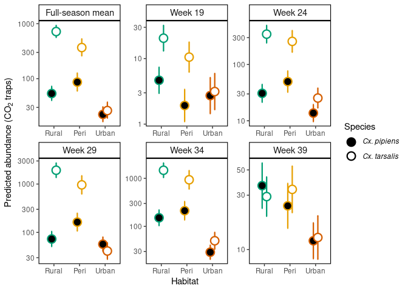<!-- --> \### Save
Figure 5 (used to be Figure 6)

``` r
ggsave(
  "../figures/Fig5_abundance_across_habitats_CO2.pdf",
  fig6,
  width = 6.5,
  height = 3
)
```

### Rel Abundance at week 29 (mid season, peak pipiens)

``` r
#THIS esmtimates relative abundance at week 29

newdata_rel <- expand.grid(
  urbanization = levels(combined$urbanization),
  disease_week = 29,
  trap_type = "CO2",
  site_name = levels(combined$site_name)[1]
)

pred_rel <- bind_rows(
  predict_species_gam(pip_gam, newdata_rel, "Culex pipiens"),
  predict_species_gam(tar_gam, newdata_rel, "Culex tarsalis")
) %>%
  mutate(
    species = factor(species, levels = c("Culex pipiens", "Culex tarsalis")),
    urbanization = factor(urbanization, levels = c("rural", "peri", "urban"))
  ) %>%
  group_by(urbanization) %>%
  mutate(
    prop = fit / sum(fit),
    prop_lower = lower / sum(upper),
    prop_upper = upper / sum(lower),
    prop_lower = pmax(0, prop_lower),
    prop_upper = pmin(1, prop_upper)
  ) %>%
  ungroup()

figS2 <- ggplot(pred_rel, aes(x = urbanization, y = prop, color = species, group = species)) +
  geom_point(size = 4) +
  geom_line(linewidth = 1) +
  geom_errorbar(
    aes(ymin = prop_lower, ymax = prop_upper),
    width = 0.1
  ) +
  scale_color_manual(values = cols) +
  scale_y_continuous(limits = c(0, 1)) +
  labs(
    x = "Urbanization",
    y = "Relative abundance",
    color = NULL,
    title = "Pred. relative abundance (CO2 traps, Week 29)") +
  theme_classic() +
  theme(
    legend.position = "right",
    plot.title = element_text(hjust = 0.5)
  )
figS2
```

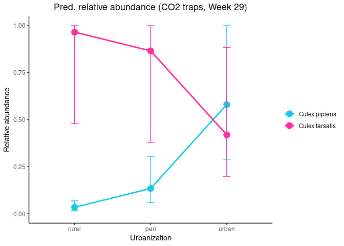<!-- -->

# Final verification of final models

``` r
# ============================================================
# VERIFY FINAL GAMs AGAINST VALUES REPORTED IN MANUSCRIPT
# ============================================================

summary(pip_gam)
```

    ## 
    ## Family: Negative Binomial(1.08) 
    ## Link function: log 
    ## 
    ## Formula:
    ## count ~ urbanization + trap_type + s(disease_week, by = urbanization, 
    ##     bs = "fs", k = 10, m = 3) + s(site_name, bs = "re")
    ## 
    ## Parametric coefficients:
    ##                   Estimate Std. Error z value Pr(>|z|)    
    ## (Intercept)         3.8747     0.1451  26.707  < 2e-16 ***
    ## urbanizationperi    0.3224     0.2383   1.353 0.176036    
    ## urbanizationurban  -0.8019     0.2121  -3.781 0.000156 ***
    ## trap_typeGRVD      -0.6723     0.1121  -5.996 2.02e-09 ***
    ## ---
    ## Signif. codes:  0 '***' 0.001 '**' 0.01 '*' 0.05 '.' 0.1 ' ' 1
    ## 
    ## Approximate significance of smooth terms:
    ##                                      edf Ref.df Chi.sq p-value    
    ## s(disease_week):urbanizationrural  7.612  8.355  411.5  <2e-16 ***
    ## s(disease_week):urbanizationperi   7.460  8.234  683.2  <2e-16 ***
    ## s(disease_week):urbanizationurban  6.074  6.893  282.4  <2e-16 ***
    ## s(site_name)                      49.748 56.000  535.7  <2e-16 ***
    ## ---
    ## Signif. codes:  0 '***' 0.001 '**' 0.01 '*' 0.05 '.' 0.1 ' ' 1
    ## 
    ## R-sq.(adj) =  0.473   Deviance explained = 67.8%
    ## -REML = 6257.5  Scale est. = 1         n = 1383

``` r
summary(tar_gam)
```

    ## 
    ## Family: Negative Binomial(1.072) 
    ## Link function: log 
    ## 
    ## Formula:
    ## count ~ urbanization + trap_type + s(disease_week, by = urbanization, 
    ##     bs = "fs", k = 20, m = 3) + s(site_name, bs = "re")
    ## 
    ## Parametric coefficients:
    ##                   Estimate Std. Error z value Pr(>|z|)    
    ## (Intercept)         5.8856     0.1278  46.055   <2e-16 ***
    ## urbanizationperi   -0.4673     0.2149  -2.174   0.0297 *  
    ## urbanizationurban  -2.7170     0.2102 -12.924   <2e-16 ***
    ## trap_typeGRVD      -2.6942     0.2007 -13.423   <2e-16 ***
    ## ---
    ## Signif. codes:  0 '***' 0.001 '**' 0.01 '*' 0.05 '.' 0.1 ' ' 1
    ## 
    ## Approximate significance of smooth terms:
    ##                                      edf Ref.df Chi.sq p-value    
    ## s(disease_week):urbanizationrural 18.172  18.86 2914.6  <2e-16 ***
    ## s(disease_week):urbanizationperi  13.214  15.05 1132.1  <2e-16 ***
    ## s(disease_week):urbanizationurban  6.802   7.86  148.2  <2e-16 ***
    ## s(site_name)                      43.667  53.00  553.1  <2e-16 ***
    ## ---
    ## Signif. codes:  0 '***' 0.001 '**' 0.01 '*' 0.05 '.' 0.1 ' ' 1
    ## 
    ## R-sq.(adj) =  0.546   Deviance explained = 72.4%
    ## -REML =  10865  Scale est. = 1         n = 1733

``` r
# Sample sizes
nobs(pip_gam)
```

    ## [1] 1383

``` r
nobs(tar_gam)
```

    ## [1] 1733

``` r
# Exact parametric coefficients
coef(summary(pip_gam))$p.table
```

    ## NULL

``` r
coef(summary(tar_gam))$p.table
```

    ## NULL

``` r
# Smooth terms / EDF
summary(pip_gam)$s.table
```

    ##                                         edf    Ref.df   Chi.sq p-value
    ## s(disease_week):urbanizationrural  7.611717  8.354632 411.5100       0
    ## s(disease_week):urbanizationperi   7.459632  8.234070 683.1793       0
    ## s(disease_week):urbanizationurban  6.073954  6.892878 282.4112       0
    ## s(site_name)                      49.747982 56.000000 535.7196       0

``` r
summary(tar_gam)$s.table
```

    ##                                         edf    Ref.df    Chi.sq p-value
    ## s(disease_week):urbanizationrural 18.172168 18.864377 2914.6018       0
    ## s(disease_week):urbanizationperi  13.214142 15.049392 1132.1078       0
    ## s(disease_week):urbanizationurban  6.802311  7.859782  148.1813       0
    ## s(site_name)                      43.667145 53.000000  553.1120       0

``` r
# Overall model fit
c(
  pip_deviance_explained = summary(pip_gam)$dev.expl,
  pip_adj_r2 = summary(pip_gam)$r.sq,
  pip_n = nobs(pip_gam)
)
```

    ## pip_deviance_explained             pip_adj_r2                  pip_n 
    ##              0.6782448              0.4725079           1383.0000000

``` r
c(
  tar_deviance_explained = summary(tar_gam)$dev.expl,
  tar_adj_r2 = summary(tar_gam)$r.sq,
  tar_n = nobs(tar_gam)
)
```

    ## tar_deviance_explained             tar_adj_r2                  tar_n 
    ##              0.7240415              0.5455636           1733.0000000
